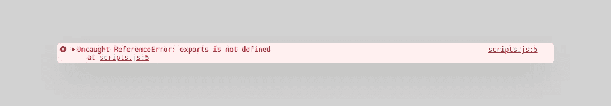
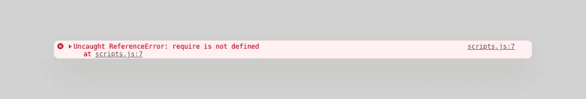
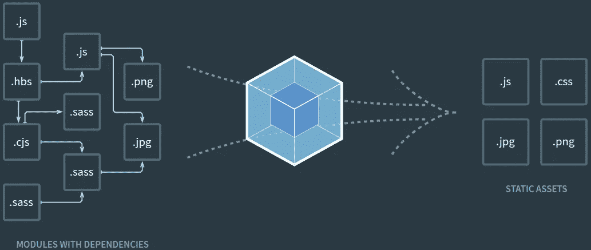
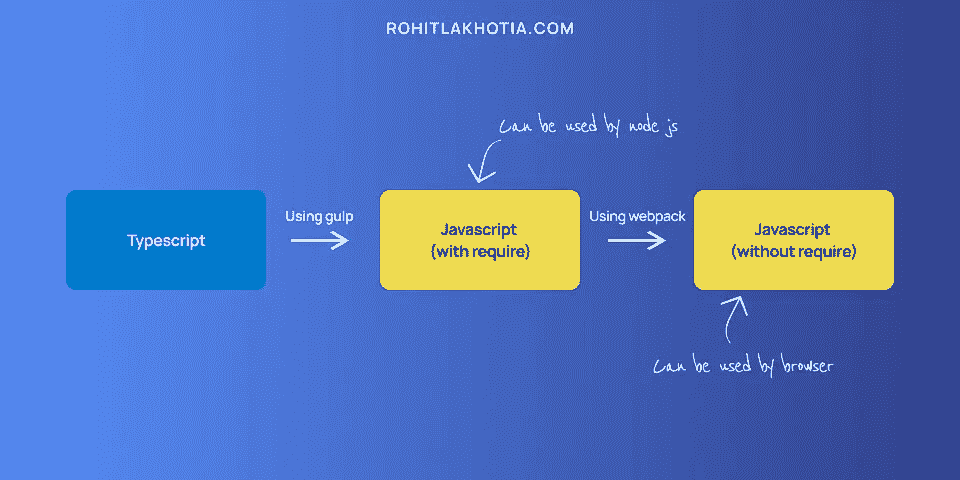
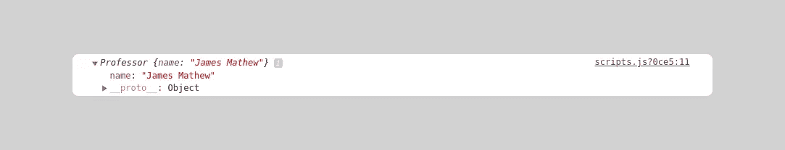
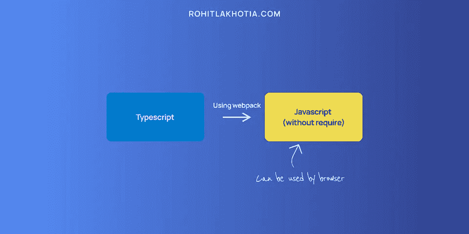

# 使用 Gulp 和 Webpack 安装 Node.js、EJS 和 TypeScript

> 原文：<https://javascript.plainenglish.io/setup-node-js-ejs-with-typescript-using-gulp-and-webpack-135aeb93165?source=collection_archive---------9----------------------->


这篇文章假设你想在 Node.js 中使用 TypeScript 作为后端和前端(使用 EJS 模板),但是正在努力建立一个系统来将 TypeScript 代码转换成浏览器可以理解的后端和前端的 JavaScript。

源代码可以在 GitHub [这里](https://github.com/RohitLakh/node-ejs-with-typescript-starter-project)获得。

# 基本设置

要继续开机自检，您需要在系统中安装节点和 npm

让我们创建一个节点项目

# 使用 TypeScript 设置 Node.js

为了在 Node.js 中使用 TypeScript，我们需要安装一些 dev 依赖项来帮助我们使用 nodemon 运行 TypeScript。

```
npm i -D typescript ts-node @types/node
```

`@types`为包安装类型别名。

现在让我们安装 nodemon

```
npm i -g nodemon
```

让我们安装 express

```
npm i express
```

我们还需要 express 的类型别名。所以让我们也安装它

```
npm i -D @types/express
```

现在让我们启动一个`tsconfig.json`

现在，安装基本的依赖项已经完成，让我们定义目录结构。

```
├── node_modules/
├── dist/
├── src/
│   ├── config/
│   │   └── debug.ts
│   ├── public/
│   │   ├── assets
│   │   └── ts/
│   └── views/
├── app.ts
├── package-lock.json
├── package.json
└── tsconfig.json
```

我们要写的任何代码都将在`src`目录中，而构建将在`dist`目录中。

前端的打字稿会在`public`文件夹内的`ts`文件夹中。

所有的`ejs`模板文件将进入`views`目录。

# 配置您的 tsconfig.json

因为我们将对 node 使用 TypeScript，所以我们需要在`tsconfig.json`文件中做一些修改。

这足够让我们工作了。如果你想了解 tsconfig 中的更多选项，请查阅 [tsconfig 文档](https://www.typescriptlang.org/tsconfig)

所以最终的`tsconfig.json`看起来会像这样

```
{
  "compilerOptions": {
    "target": "es5",
    "module": "commonjs",
    "outDir": "./dist",
    "rootDir": "./src",
    "strict": true,
    "noImplicitAny": true,
    "moduleResolution": "node",
    "esModuleInterop": true,
    "skipLibCheck": true,
    "forceConsistentCasingInFileNames": true
  }
}
```

现在让我们编写启动和运行服务器的代码。

```
import express, { Application } from "express";
import http from "http";
import debug from "./config/debug";

const app: Application = express();
const server: http.Server = http.createServer(app);

// Setting the port
const port = debug.PORT;

// Starting the server
server.listen(port, () => {
    console.log(`SERVER RUNNING ON ${port}`);
});
```

现在运行服务器

```
nodemon src/app.ts
```

你应该看看

```
SERVER RUNNING ON 3000
```

这一切都很好，nodemon 正在处理一切，但是现在如果您注意到没有生成`dist`目录。让我们使用 gulp 生成`dist`目录和 nodemon 来观察变化。两者都有助于我们自动化整个过程

让我们安装 gulp、gulp-typescript 和 del

```
npm i -D gulp gulp-typescript del
```

现在在项目的根目录下创建一个`gulpfile.js`文件

`gulpfile.js`

```
var gulp = require("gulp");
var ts = require("gulp-typescript");
var tsProject = ts.createProject("tsconfig.json");
var del = require("del");

// Task which would transpile typescript to javascript
gulp.task("typescript", function () {
    return tsProject.src().pipe(tsProject()).js.pipe(gulp.dest("dist"));
});

// Task which would delete the old dist directory if present
gulp.task("build-clean", function () {
    return del(["./dist"]);
});

// Task which would just create a copy of the current views directory in dist directory
gulp.task("views", function () {
    return gulp.src("./src/views/**/*.ejs").pipe(gulp.dest("./dist/views"));
});

// Task which would just create a copy of the current static assets directory in dist directory
gulp.task("assets", function () {
    return gulp.src("./src/public/assets/**/*").pipe(gulp.dest("./dist/public/assets"));
});

// The default task which runs at start of the gulpfile.js
gulp.task("default", gulp.series("build-clean","typescript", "views", "assets"), () => {
    console.log("Done");
});
```

现在通过以下方式运行该文件

在默认任务完成检查您的目录之后，您会看到生成了一个`dist`目录。它应该有`config`、`public/ts,`、`public/asset`、`views`目录和`app.js`

现在使用以下命令运行服务器

```
node dist/app.js
```

你应该看看

```
SERVER RUNNING ON 3000
```

为了使监听文件变化的服务器自动化，构建并重新运行服务器，我们需要安装另一个包。

```
npm i -D npm-run-all
```

现在，我们需要创建一些脚本，以便让服务器监视更改，并使用新的更改重新运行服务器。

在 package.json 中，将这段代码添加到脚本对象中

```
{
    "start:gulp": "npm-run-all gulp start",
    "gulp": "gulp",
    "start": "node ./dist/app.js",
    "dev": "nodemon --watch src -e ts,ejs --exec npm run start:gulp"
}
```

基本上，这是检查更改，如果发现，然后重新运行 gulp 命令，该命令转换类型脚本代码，然后使用 start 运行服务器。

你应该再次看到

```
SERVER RUNNING ON 3000
```

**所以现在我们有了使用 Gulp 运行 Node.js 的 TypeScript。**

# 设置 EJS 模板

为了在 Node.js 中使用 EJS 模板，我们需要安装一些 npm 包。让我们安装它们

```
npm i express-ejs-layouts ejs
```

现在安装后，我们需要`express`知道我们想使用 EJS 作为`view engine`并添加视图的根路径，这样 express 就知道它们在哪里。

将这些添加到`app.ts`

```
import expressLayouts from 'express-ejs-layouts';

// EJS setup
app.use(expressLayouts);

// Setting the root path for views directory
app.set('views', path.join(__dirname, 'views'));

// Setting the view engine
app.set('view engine', 'ejs');
```

现在让我们添加一些 EJS 模板

在`views`下创建一个新文件，命名为`layout.ejs`

```
<!doctype html>
<html lang="en">
  <head>
    <meta charset="utf-8">
    <meta name="viewport" content="width=device-width, initial-scale=1">
    <title>Node Typescript</title>
  </head>
  <body>
    <div><%- body %></div>
  </body>
</html>
```

现在保存它并添加另一个文件，在与`layout.ejs`相同的目录下命名为`index.ejs`

```
<h1>Hello world</h1>

<!-- This is the script that we would be creating later -->
<script src="./js/scripts.js"></script>
```

并保存`index.ejs`文件。现在，由于模板已经准备好了，我们需要一个路径来呈现这个页面。所以让我们来创造它

在您的`app.ts`文件中添加

```
import { Request, Response } from "express";

/* Home route */
app.get("/", (req: Request, res: Response) => {
	res.render("index")
});
```

现在运行服务器并转到`http//:localhost:3000`。你应该看看


现在我们已经完成了`ejs`视图设置，是时候给`ejs`模板添加一些脚本了。

# 在 express 中提供静态内容

在添加一些脚本之前，我们需要让 express 知道我们的静态内容在哪里，这样它就可以服务于它。将此添加到`app.ts`文件中。

```
const publicDirectoryPath = path.join(__dirname, "./public");
app.use(express.static(publicDirectoryPath));
```

现在我们已经建立了一个公共目录，让我们继续在 EJS 中使用 TypeScript。

让我们在`public/ts`目录下创建 3 个文件，命名为`scripts.ts`、`student.ts`、`professor.ts`

`professor.ts`

```
export default class Professor {
    name: string;
    constructor(name: string){
        this.name = name
    }
}
```

`student.ts`

```
import Professor from "./professor";

export default class Student {
  name: string;
  favProfessor: Professor;
  constructor(name: string, professor: Professor) {
    this.name = name;
    this.favProfessor = professor;
  }

  getFavProfessor = () => {
     return this.favProfessor
  }

}
```

`script.ts`

```
import Professor from "./professor";
import Student from "./student";

const professor: Professor = new Professor("James Mathew")

const student: Student = new Student("Rohit Lakhotia", professor)

console.log(student.getFavProfessor())
```

所以在这里，文件`professor.ts`包含了`professor`类，而`student.ts`文件包含了`student`类，其中的方法`getFavProfessor`得到了学生最喜欢的教授。

而`scripts.ts`文件导入这两个文件，并输出学生最喜欢的教授基本上试图导入和导出真实项目中会发生的类/函数。

现在，由于`script.ts`文件是起点，我们需要将它导入之前创建的 EJS 模板中。

> ***浏览器看不懂 TypeScript。****S****o 我们需要将打字稿转换成 JavaScript，以便浏览器能够理解。***

使用以下命令运行服务器

```
npm run dev
```

现在，如果您看到`dist/ts`目录，并检查`scripts.js`文件，您可以看到转换后的 JavaScript 文件。现在让我们试着运行它。

但在此之前，我们需要做一些改变。在`index.ejs`中，只需改变`scripts.js`位置，从`ts`目录中取出脚本。所以它会像这样。

```
<script src="./ts/scripts.js"></script>
```

现在使用以下命令运行服务器

```
npm run dev
```

服务器应该立即启动，然后转到`http://localhost:3000`并在浏览器中打开控制台，如果您看到**导出未定义**。



只需在`index.ejs`中的脚本标签前添加此内容

```
<script>var exports = {}</script>
```

现在试着运行它。它将显示一个新的错误，即“要求未定义”。



这是因为如果你看到**trans file JavaScript 文件，你会看到** `**require**` **函数在那里，而浏览器不能理解那个**

这是因为当**传输代码时，它是根据可以处理所需功能的节点来传输的。**

那现在怎么办？

您可以在这个[库](https://github.com/RohitLakh/node-ejs-with-typescript-starter-project)的`master`分支中找到到目前为止的源代码

# 拯救网络包

因此，webpack 是一个 JavaScript 捆绑器，基本上，它将您的资产转换为单个/多个捆绑包，因此您可以将捆绑包发送给最终用户，基本上减少了 HTTP 调用的数量。



我们有两种方法来实现这一点

1.  **将生成的 JavaScript 捆绑成一个包**
2.  **将打字稿直接捆绑成一捆**

这两个过程会给出相同的输出，但是它们在构建时间上有所不同。

但在此之前，我们需要安装`webpack`和`webpack-cli`

```
npm i -D webpack webpack-cli
```

这之后在根目录下创建一个新的`webpack.config.js`文件

# 将生成的 JavaScript 捆绑成一个包

因此，这里我们将从`dist/public/ts`文件夹中已经创建的文件生成包。



在`webpack.config.js`文件中添加这段代码

```
// The base directory that we want to use
const baseDirectory = "dist";

module.exports = {
  // The current mode, defaults to production
  mode: "development",

  // The entry points ("location to store": "location to find")
  entry: {
    "public/js/scripts": [`./${baseDirectory}/public/ts/scripts`],
    // "other output points" : ["other entry point"] 
  },

  // Used for generating source maps (used for debugging)
  devtool: "eval-source-map",

  // The location where bundle are stored
  output: {
    filename: "[name].js",
  },
};
```

保存文件，现在我们需要运行 webpack 命令来将 JavaScript 捆绑成一个包，但是这应该是自动的。

所以现在在`package.json`文件中，添加一个新的脚本

```
"webpack": "webpack"
```

我们需要在运行完 gulp 脚本之后运行它，所以在 gulp 命令之后，我们需要添加 webpack。因此，最终的脚本对象看起来像这样:

```
{
    "start:gulp": "npm-run-all gulp webpack start",
    "webpack": "webpack",
    "gulp": "gulp",
    "start": "node ./dist/app.js",
    "dev": "nodemon --watch src -e ts,ejs --exec npm run start:gulp"
}
```

现在，在运行`npm run dev`之前，只需转到`src/views`目录中的`index.ejs`，并使`scripts`从 js 目录加载。

然后跑

```
npm run dev
```

现在，在服务器成功运行后，转到`http://localhost:3000`并检查控制台，您应该会看到`Professor`对象被控制。



恭喜它现在开始工作了。基本上，您可以在使用 webpack 的浏览器中使用 TypeScript。

## 优势:

*   与使用 webpack 将前端类型脚本直接转换为 JavaScript 相比，构建时间更短

## 缺点:

*   当您需要在浏览器控制台中调试某些东西时(因为我们生成了源映射)，您会被定向到 JavaScript(带有`require`函数的那个)，它已经从 TypeScript 转换过来，有时是不可读的，但它工作得很好。

你可以在[库](https://github.com/RohitLakh/node-ejs-with-typescript-starter-project)的`webpack-setup-through-javascript`分支上找到源代码。

# 将类型脚本直接捆绑成一个包



所以在这里，我们将使用 webpack 模块直接将类型脚本转换成 JavaScript，而不是捆绑通过 gulp 命令生成的 JavaScript。

为此，我们需要安装`ts-loader`，它是 webpack 的一个类型脚本加载器。

```
npm i -D ts-loader
```

现在在`webpack.config.js`文件中添加他的代码

```
// The base directory that we want to use
const baseDirectory = "src";

module.exports = {
  // The current mode, defaults to production
  mode: "development",

  // The entry points ("location to store": "location to find")
  entry: {
    "public/js/scripts": [`./${baseDirectory}/public/ts/scripts`],
     // "other output points" : ["other entry point"] 
  },
  // Using the ts-loader module
  module: {
    rules: [
      {
        test: /\.tsx?$/,
        use: "ts-loader",
        exclude: /node_modules/,
      },
    ],
  },
  resolve: {
    extensions: [".tsx", ".ts", ".js"],
  },
  // Used for generating source maps (used for debugging)
  devtool: "eval-source-map",

  // The location where bundle are stored
  output: {
    filename: "[name].js",
  },
};
```

此处需要注意的事项:

1.  现在的`baseDirectory`是`src`
2.  添加了一个模块和解析对象。

所以现在如果我们运行它，它会工作，但是现在`public/ts`目录被传输了两次，一次是用 gulp 任务“typescript ”,另一次是用 webpack。

因此，为了改变这种情况，让我们转到 gulpfile.js，在这里的 TypeScript 任务中，我们需要排除`public/ts`目录，因为这将由 webpack 完成。

```
tsProject.config['exclude'] = ["./src/public/ts/**/*"]
```

因此，TypeScript 任务将如下所示。

```
gulp.task("typescript", function () {
    tsProject.config['exclude'] = ["./src/public/ts/**/*"]
    return tsProject.src().pipe(tsProject()).js.pipe(gulp.dest("dist"));
});
```

现在，如果你通过`npm run dev`运行服务器，你可以访问浏览器控制台并看到`Professor`对象


恭喜你，你刚刚在前端使用了 TypeScript。

## 优势:

*   在浏览器控制台中调试代码时，您会被定向到 TypeScript 文件(考虑到您已经在 tsconfig.json 文件中启用了`sourceMap: true`),而不是 transpiled JavaScript 文件。这样，您就可以确切地知道导致问题的行。

## 缺点:

*   与前一种方法相比，构建时间稍长。

你可以在[库](https://github.com/RohitLakh/node-ejs-with-typescript-starter-project)的分支`webpack-setup-through-typescript`上找到源代码。

你能做的就是当你找到需要的情况时，在两者之间转换。

如果你需要任何帮助，请在下面的评论区告诉我

*最初发表于*[*https://rohitlakhotia.com*](https://rohitlakhotia.com/blog/nodejs-ejs-typescript-using-gulp-webpack/)