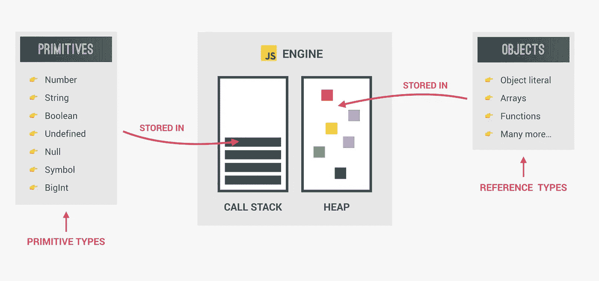
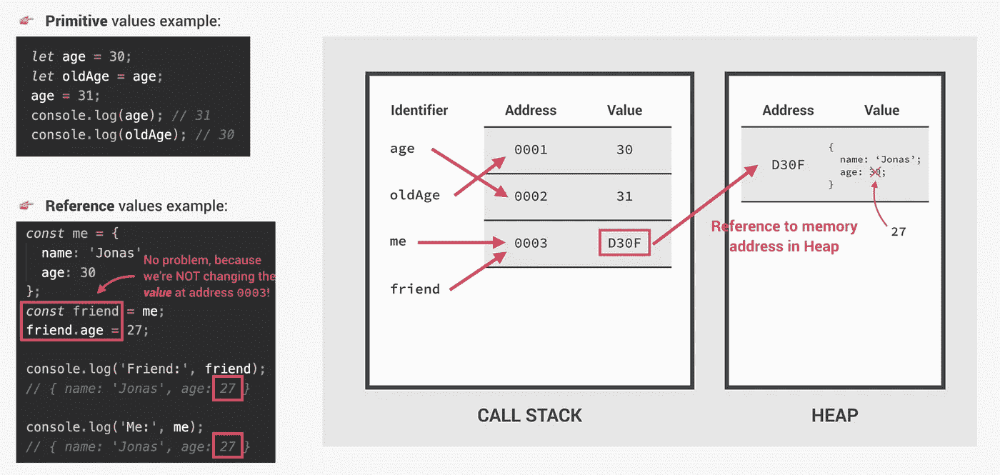
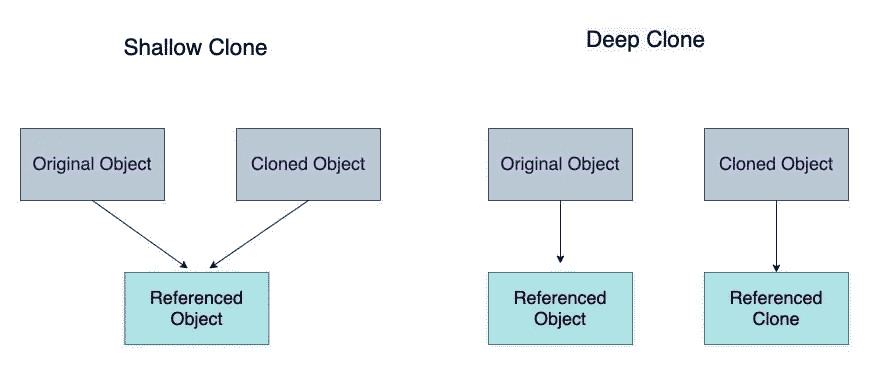

# 深入探究 JavaScript 中的浅层复制和深层复制

> 原文：<https://javascript.plainenglish.io/shallow-copy-and-deep-copy-in-javascript-a0a04104ab5c?source=collection_archive---------1----------------------->

JavaScript 中的数据类型可以分为两大类——***原始数据类型*** 和 ***引用数据类型。***



**原始数据类型:**赋给原始数据类型变量的值是**紧耦合**。这意味着，每当您创建原始数据类型变量的副本时，该值都会被复制到新变量所指向的新内存位置。当你制作副本时，它将是一个**真实副本。**

**引用数据类型:**然而，对于引用数据类型，它存储存储对象的内存位置的地址。复制引用数据类型有两种，分别是**浅复制**和**深复制**。



# **浅抄**

浅拷贝简单地**指向原始集合结构(对象或数组)的引用地址**，它保存新变量中的值，即只拷贝集合结构，不拷贝元素。

当字段值是引用类型时，它只是复制引用地址，不会创建新对象。被引用的对象因此被*共享。*

```
*let originalObject= {name: "apple", type: "fruit"};
let clonedObject= originalObject;**clonedObject.name = ‘orange’;****Output****:
clonedObject= {name: “orange”, type: “fruit”}
originalObject= {name: “orange”, type: “fruit”}*
```

浅层复制很简单，通常也很便宜，因为它们通常可以通过简单地复制引用地址来实现。类似地，这可以在数组中观察到。

```
*let originalArr = [1,2,3];
let clonedArr = originalArr;
clonedArr.push(4);****Output***:
*clonedArr = [1,2,3,4]
originalArr= [1,2,3,4]*
```

但是，没有引用复制对象也有变通方法。

1。 **Spread 运算符** ( `…`)是对数组或对象进行浅层复制的一种便捷方式——当没有嵌套时，它工作得非常好。

这对于创建不会因旧引用而出现意外行为的新数组实例非常有用。因此，扩展运算符对于在反应状态下添加到数组非常有用。

```
***Example 1***:
*let originalObject = {name: “apple”};* let clonedObject = {...originalObject}; *clonedObject.name = ‘orange’;****Output****:
clonedObject= {name: “orange”}
originalObject= {name: “apple”}****Example 2****:
let originalObject = {name: “apple”, price: {chennai: 120}};* let clonedObject = {...originalObject};*clonedObject.name =”orange”; // will not reflect in originalObject
clonedObject.price.chennai = “100”; //will reflect in originalObject also****Output****:
clonedObject = {name: “orange”, price: {chennai: 100}}
originalObject = {name: “apple”, price: {chennai: 100}}*
```

2。 **Object.assign()** 方法将源对象的可枚举属性复制到目标对象。此外，只有当对象/数组包含基本类型值时，才能使用这种方法。

```
***Example 1***:
*let originalObject = {name: “apple”};
let clonedObject = Object.assign({}, originalObject);
clonedObject.name = ‘orange’;****Output****:
clonedObject= {name: “orange”}
originalObject= {name: “apple”}****Example 2****:
let originalObject = {name: “apple”, price: {chennai: 120}};
let clonedObject = Object.assign({}, originalObject);**clonedObject.name =”orange”; // will not reflect in originalObject
clonedObject.price.chennai = “100”; //will reflect in originalObject also****Output****:
clonedObject = {name: “orange”, price: {chennai: 100}}
originalObject = {name: “apple”, price: {chennai: 100}}*
```

3。 **Slice()** —特别是对于数组，使用内置的`.slice()`方法与 spread 操作符的工作原理相同—创建一个级别的浅层副本:

```
***Example 1***:
let originalArr = [1,2,3,4,5]
let clonedArr = originalArr.slice();
clonedArr.push(6);***Output****:* originalArr *=* [1, 2, 3, 4, 5]clonedArr *=* [1, 2, 3, 4, 5, 6]
```

4。 **Array.from()** —另一种复制 JavaScript 数组的方法是使用`Array.from()`，这也将进行浅层复制。

```
***Example 1***:
let originalArr = [1,2,3,4,5]
let clonedArr = Array.from(originalArr);
clonedArr.push(6);***Output****:* originalArr *=* [1, 2, 3, 4, 5]clonedArr *=* [1, 2, 3, 4, 5, 6]
```

这些方法将**复制到第一级**。如果对象包含任何嵌套对象或数组，那么内部复制的引用类型值将引用其内存地址，即浅复制将意外工作，因为嵌套对象实际上没有被克隆。为了克服这一点，我们需要迭代和复制，直到最后一级，但这种方法是昂贵的，不推荐。对于深度嵌套的对象，需要一个深度副本。

# **深度复制**

它只是创建一个**副本**，将*源对象*的所有属性复制到*目标对象中。*换句话说，基元类型和引用类型属性都将被分配给**新的内存位置**。

这样，如果*源对象*变得不存在，那么*目标对象*仍然存在于内存中。



正确的说法应该是**克隆**，这里你知道它们完全相同，但又不同(即作为两个不同的实体存储在内存空间中)。

它用于将 JavaScript 对象复制到一个新的变量，而不是通过引用。

严格相等运算符(`===`)表明嵌套引用对于浅拷贝是相同的，而对于深拷贝是不同的。

```
const nestedArr = [["1"] ,["2"] ,["3"]];
const nestedCopyWithSpread = [...nestedArr];console.log(nestedArr[0] === nestedCopyWithSpread[0]); 
// true -- Shallow copy (same reference)const nestedCopyWithJSON = JSON.parse(JSON.stringify(nestedArr));console.log(nestedArr[0] === nestedCopyWithJSON[0]);
// false -- Deep copy (different references)
```

有许多制作深层副本(或深层克隆)的方法:

1。**—**如果不在对象中使用`Date`、函数、`undefined`、`Infinity`、【NaN】、正则表达式、映射、集合、Blobs、文件列表、ImageDatas、稀疏数组、类型化数组或其他复杂类型，深度克隆对象的一个非常简单的一行程序是:****

```
****var clonedObject = JSON.parse(JSON.stringify(originalObject));****Example**:*let originalObject = {name: “apple”, price: {chennai: 120}};
let clonedObject =* JSON.parse(JSON.stringify(originalObject));*clonedObject.name =”orange”;
clonedObject.price.chennai = “100”;***Output***:
clonedObject = {name: “orange”, price: {chennai: 100}}
originalObject = {name: “apple”, price: {chennai: 120}}***
```

****2。**Lodash—**It**是一个 JavaScript 库，它提供了多个实用函数，Lodash 库最常用的函数之一是 **cloneDeep()** 方法。这个方法有助于对象的深度克隆，还可以克隆不可序列化的属性，这是 JSON.stringify()方法的一个限制。******

```
**import _ from "lodash" // Import the entire lodash library//import { clone, cloneDeep } from "lodash" // Alternatively: Import just the clone methods from lodashconst nestedArr = [["1"] ,["2"] ,["3"]];const shallowCopyWithLodashClone = _.clone(nestedArr)
console.log(nestedArr[0] === shallowCopyWithLodashClone[0]);
// true -- Shallow copy (same reference)const deepCopyWithLodashCloneDeep = _.cloneDeep(nestedArray)
console.log(nestedArr[0] === deepCopyWithLodashCloneDeep[0]);
// false -- Deep copy (different reference)**
```

****3。 **Ramda —** 函数式编程库 Ramda 包含了`R.clone()`方法，可以对对象或数组进行深度复制。****

```
**import R from "ramda" // Import the entire ramda library// import { clone } from "ramda" // Alternatively: Import just the clone methods from ramdaconst nestedArr = [["1"] ,["2"] ,["3"]];const deepCopyWithRamdaClone = R.clone(nestedArray)
console.log(nestedArr[0] === deepCopyWithRamdaClone[0]);
// false -- Deep copy (different reference)**
```

****4。 **自定义函数—** 编写一个递归 JavaScript 函数来制作嵌套对象或数组的深层副本是相当容易的。****

****5。 **rdfc —** 为了获得最佳性能，库`rfdc`(真正快速的深度克隆)进行深度复制的速度将比 lodash 的`_.cloneDeep.`快大约 400%,使用`rfdc`非常简单，就像其他库一样:****

```
**const clone = require('rfdc')() // Returns the deep copy function
clone({a: 37, b: {c: 3700}}) // {a: 37, b: {c: 3700}}**
```

*   ****`rdfc`克隆所有 JSON 类型:`Object, Array, Number, String, null`****
*   ****附加支持:`Date`(复制)、`undefined`(复制)、`Function`(引用)、`AsyncFunction`(引用)、`GeneratorFunction`(引用)、`arguments`(复制到普通对象)****
*   ****所有其他类型的输出值与`JSON.parse(JSON.stringify(o))`的输出相匹配。****
*   ****`rfdc`库支持所有类型，也支持带有可选标志的循环引用，这会降低大约 25%的性能。****
*   ****循环引用会破坏其他讨论过的深度复制算法。如果你正在处理一个大型复杂的对象，比如从 3MB 的 JSON 文件中加载的对象(大小为 15MB ),这样的库会很有用。****

# ****复制算法的性能****

****在各种复制算法中，浅层复制是最快的，其次是使用自定义函数或`rfdc.`从最好到最差排序的深层复制 *:-*****

1.  ****重新分配"`=`"(仅字符串数组、数字数组)****
2.  ****切片(仅字符串数组、数字数组)****
3.  ****自定义函数:for 循环或递归复制/ `rfdc`****
4.  ****`JSON.parse`(仅字符串数组、数字数组、对象数组)****
5.  ****洛达什的`_.cloneDeep`****

# ****结论****

*   ****事实上，在 JavaScript 中避免深度复制是很容易的——如果你不能将对象和数组嵌套在一起的话。因为在这种情况下——没有嵌套，对象和数组只包含原始值——使用 spread 操作符(`…`)、`.slice()`和`.assign()`进行浅层复制都很有效。****
*   ****但是，在现实世界中，对象内部有数组，反之亦然，那么就需要使用深度拷贝。我推荐`rfdc`给深度克隆。****

****(注意，有些人也可能建议使用`JSON.stringify()`后接`JSON.parse()`，但这不是制作深层副本的可靠方式。)****