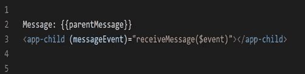

# 在角度组件之间共享数据

> 原文：<https://javascript.plainenglish.io/sharing-data-b-w-angular-components-efdc858fd970?source=collection_archive---------1----------------------->

Angular 非常适合构建单页 web 应用程序、具有引人注目的动画的移动应用程序、离线工作的渐进式 web 应用程序、企业应用程序、电子商务应用程序等等。

在角度应用中，我们可能有许多功能/特性丰富的元件。在开发应用程序时，我们可能会遇到需要将数据从一个组件传递到另一个组件的情况。我们可以通过数据共享的概念，使用 Angular 提供的一些内置特性来实现这一点。

在任何项目中，数据共享都是一个需要理解的基本概念。这是一个常见的东西，将广泛应用于大多数项目。

我发现以下方法最常用于数据共享。

***1。通过输入*共享数据**

***2。通过 Output()和 EventEmitter* 共享数据**

***3。通过 ViewChild* 共享数据**

***4。通过服务共享数据***

让我们深入了解这些方法，并了解如何实现它们。

## **通过输入共享数据**

这种方法是共享数据的最常见和最简单的方法。它使用 ***输入*** 装饰器来允许数据通过模板传递。

**父组件**

**parent.component.html**

**child.component.ts**

。从角度/核心导入**输入**

这里我们用输入装饰器添加了消息属性。

**child.component.html**

## 通过 Output()和 EventEmitter 共享数据

共享数据的下一个方法是从子节点向父节点发送数据。当您希望共享由按钮点击、表单输入和其他用户事件触发的数据更改时，可以使用这种方法。

**child.component.ts**

。从 angular/core 导入**输出，EventEmitter** 。

**child.component.html**

在父类中，我们创建一个函数来接收消息，并将其设置为等于事件中的消息变量。

**父组件**

messageEvent 侦听发出的事件。父组件可以订阅子组件输出的事件，然后每当该事件发生时运行接收消息功能。

【parent.component.html 

## 通过 ViewChild 共享数据

*ViewChild* 是配置视图查询的属性装饰器。变更检测器在视图 DOM 中寻找匹配选择器的第一个元素或指令。如果视图 DOM 发生了变化，并且有一个新的子元素与选择器相匹配，那么属性将被更新。

通过使用 ViewChild，我们可以将一个组件注入到另一个组件中，让父组件可以访问它的属性和函数。

**child.component.html**

**parent.component.ts**

**parent.component.html**

## 不相关的组件:与服务共享数据

当在没有直接连接的组件之间传递数据时，可以通过使用服务来共享数据。当我们必须保持数据同步时，我们可以使用 rjs***行为主题***

在服务中，我们创建了一个*行为主体*，它将保存消息的当前值。我们定义了一个 currentMessage 变量，它将这个数据流处理为可观察的。我们必须创建一个接下来调用*行为主体*的函数来改变它的值。父组件、子组件和同级组件都以相同的方式使用它。

**data.service.ts**

我们可以在构造函数中注入 DataService，然后订阅 currentMessage 可观察到的值，并将其值设置为等于消息变量。现在，我们可以在这些组件中的任何一个中创建一个函数，其中消息的值被改变。当这个函数被执行时，新数据会自动将消息发送到我们订阅消息的组件。

**组件-a.component.ts**

**Component-a.component.html**

**Component-b . Component . ts**

**Component-b.component.html**

点击新建消息按钮，消息将被订阅*行为主题*并自动在*组件 a 中更改/更新。*

# 结论

有很多种方式在“角度”中的组件之间传递数据。在这个博客中，我介绍了角分量之间数据共享的重要性以及实现这一点的不同方法。正如您所看到的，这种方法在项目中很容易遵循和实施。**快乐编码！**

*更多内容参见* [*浅显易懂*](http://plainenglish.io/)