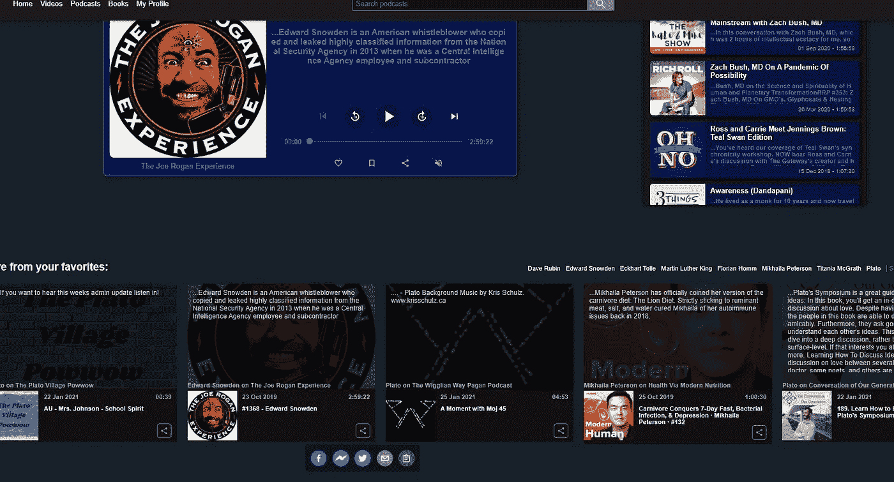
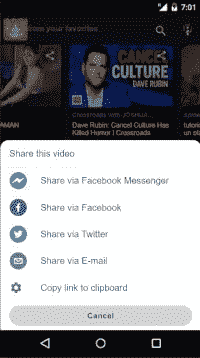

# 用 React & Node.js 动态呈现 Twitter/脸书社交卡片和图片

> 原文：<https://javascript.plainenglish.io/sharing-links-to-twitter-and-facebook-and-dynamically-rendering-cards-and-images-with-react-node-d509e92abcf2?source=collection_archive---------1----------------------->

我正在开发一个新的技术平台([metacules.com](https://metacules.com))，希望通过各种第三方开放 API 将用户与有趣的播客、视频&书籍内容联系起来。

创造吸引力、传播消息并让用户(和我们自己)分享他们喜欢的播客有趣视频的策略之一是将它们分享到 Twitter &脸书等社交媒体平台。

最初(也很天真地)我认为这就像使用一个共享库一样简单，比如“ [react-share](https://www.npmjs.com/package/react-share) ，这对于获得一些现成的功能来分享*到*各种社交媒体平台是很棒的。

但我开始时没有意识到的是，f.e. Twitter 生成预览图像、共享链接的标题和描述的方式是通过提供的 url 跟踪链接回到您的网站，并检查网页标题的*元标签。*



Sharing functionality on the desktop version of the [https://metacules.com](https://metacules.com) website

这里的问题是，我的 React 应用程序是一个具有静态元标签值的单页面应用程序(SPA)。因此，我如何动态地为 Twitterbot 创建元标签，Twitter bot 从我的网站上抓取数据，并为其提供正确的图像-url 等。？

一个很棒的教程帮助了我们，这是[这个](https://code.tutsplus.com/tutorials/adding-social-sharing-in-a-nodejs-single-page-application--cms-25530)，它基本上帮助我发现我可以通过创建一个链接来解决这个问题，这个链接会将 Twitterbot 或 facebook crawler 定向到一个后端 url，而不是 Twitter/FB 上的用户在点击链接时被重定向到的实际前端 url。

由于用户代理不同于用户点击链接或 Twitterbot 抓取 url，我们可以在前端将用户重定向到实际的正确页面，并提供一个简单的动态创建的 html 页面，带有一些 bot 的标题，以便 Twitter & FB 可以显示正确的图像和信息。



Sharing on the mobile web app

那么在代码中…我实际上是怎么做的呢？

我决定在后端创建一个 **/deeplink** 端点，我可以使用查询参数对其执行 GET 请求，以便在书籍、视频或播客的链接之间进行定位。
我链接到视频的 url 看起来像[back end _ BASE _ _ URL][/deep link？而当用户点击 Twitter 上的链接时，网站上实际视频的链接将被导航到:](https://wake-up-web.herokuapp.com/deeplink?v=anoPzTREwY)[https://metacules.com？v=anoPzTREwYs](https://metacules.com/video/anoPzTREwYs)

下面是 Node.js 代码:

```
export default *(*app*)* => *{* let router = express.Router*()*;
    const nonSPArouter = express.Router*()*;

    router.get*(*"/", get*)*;
    nonSPArouter.get*(*'/', serveDynamicHtmlWithSocialMediaMetaTags*)*;

    // User-agent middleware to check if it a social platform crawler to check for the header-tags for social media posts
    app.use*(*"/deeplink", function *(*req, res, next*) {* const ua = req.headers*[*'user-agent'*]*;
        ***console***.log*(*"User agent = " + ua*)*;

        if *(*/^*(*facebookexternalhit*)*|*(*Twitterbot*)*|          *(*Pinterest*)*/gi.test*(*ua*)) {* ***console***.log*(*ua, ' is a bot'*)*;
            nonSPArouter*(*req, res, next*)*;
        *}* else *{* router*(*req,res, next*)*;
        *}
    })*;
*}*;
```

当对 **/deeplink** 发出 GET 请求时，我们将从头部获取*用户代理*，并查看它是否是来自 FB、Twitter、Pinterest 等的爬虫。

例如，Twitter 将通过在请求头中发送“Twitterbot/1.0”作为用户代理来标识自己，而当用户在浏览器中单击链接时生成的用户代理标识符可能类似于“Mozilla/5.0 (Windows NT 10.0...等等。”。

如果我们确定这是一个实际的用户点击链接，我们创建实际的网站的 url 重定向到，看起来像这样:

```
export const get = *(*req, res*)* => *{
    *   if *(*req.query !== *{}) {* const videoId = req.query?.v;
        const podcastId = req.query?.p;
        const bookId = req.query?.b;
        const redirectUrl = getRedirectUrl*(*videoId, podcastId, bookId*)*;
        ***console***.log*(*"User clicked on social media post. Redirecting to " + redirectUrl*)*;
        res.redirect*(*redirectUrl*)
    }* else *{* ***console***.log*(*"Error. No valid query params available. Redirecting to base url."*)*;
        res.redirect*(*BASE_URL*)
    }
}*;function getRedirectUrl*(*videoId, podcastId, bookId*) {* let path = videoId ? `video/$*{*videoId*}*` : podcastId ?     `podcast/$*{*podcastId*}*` : `book/$*{*bookId*}*`;
    return BASE_URL + path;
*}*
```

但最有趣的部分当然是，如果它是一个社交媒体网站的爬虫，我们该怎么办？
嗯……在确定了我们想要创建链接的播客、视频或书籍的 id 后，我们从数据库中获取视频(f.e .)，获取图像 url、标题和描述，并将其存储在我们的 *metaTagValues* 对象中。

```
export const serveDynamicHtmlWithSocialMediaMetaTags = *(*req, res*)*=>*{* const videoId = req.query.v;
    const podcastId = req.query.p;
    const bookId = req.query.b;

    if *(*!videoId && !podcastId && !bookId*) {* res.status*(*400*)*.send*({*message: "Bad request: request is missing podcast, book or video Id."*})*;
        return;
    *}* // initial state metaTagValues. Will be updated when video/podcast is retrieved from DB
    // twitterCardType: , which will be one of “summary”, “summary_large_image”, “app”, or “player”.
    // imageUrl / title / description will be overwritten, unless there is an error
    // and then these default tags values will be used
    let metaTagValues = *{* url: getRedirectUrl*(*videoId, podcastId*)*,
        domain: BASE_URL,
        imageUrl: "https://metacules.com/shiva-orange50x50.png",
        title: "Metacules - the antidote to censorship",
        description: "Connecting you to the world",
        twitterCardType: "summary_large_image",
        twitterHandle: "@metacules"
    *}*;

    function sendResponse*() {* // Renders the dynamic html using bot.jade as the template
        // Create meta tags for Twitter and Open Graph protocols
        **res.render*(*'bot',** *{* url: metaTagValues.url,
            domain: metaTagValues.domain,
            title: metaTagValues.title,
            descriptionText: metaTagValues.description,
            imageUrl: metaTagValues.imageUrl,
            twitterCardType: metaTagValues.twitterCardType,
            twitterHandle: metaTagValues.twitterHandle,
        *})*;
    *}* if *(*videoId*) {* Video.findOne*({*videoId: videoId*})* .then*(*result => *{* ***console***.log*(*"Found video in DB: " + result*)*;
                metaTagValues.imageUrl = result.thumbnailUrl;
                metaTagValues.title = result.title;
                metaTagValues.description = result.description;
            *})* .catch*(*error => *{* ***...***
            *})* .finally*(()* => sendResponse*())* ***[For brevity sake only showing part of the function here]***
```

然后，我们使用找到的值将它们粘贴到一个简单的动态生成的 html 页面中，该页面是通过 jade 创建的( *npm i jade* )。杰德已经改名为帕格，如果你想得到最新版本，不要像我一样，但检查出:[https://www.npmjs.com/package/pug](https://www.npmjs.com/package/pug)

无论如何……当我们将响应发送回 twitter 的爬虫时，你会看到在 sendResponse()函数中的 **res.render *(* 'bot '，{…})** 引用了' *bot'* 。

Bot 指的是我们创建的 bot.jade 文件。这是一个模板文件，用于动态生成返回给 crawler 的简单 html 页面，看起来像:

```
doctype html
html
    head
        title= title
        meta(property="og:url"  name="twitter:url" content= ***url***)
        meta(property="og:title" name="twitter:title" content= title)
        meta(property="og:description" name="twitter:description" content= descriptionText)
        meta(property="og:image" content= imageUrl)
        meta(property="og:type" content="article")
        meta(name="twitter:card" content= twitterCardType)
        meta(name="twitter:site" content= twitterHandle)
        meta(name="twitter:creator" content= twitterHandle)
        meta(name="twitter:image" content= imageUrl)
        meta(name="twitter:domain" content= domain)
    body
        h1= title
        img(src= imgUrl alt= title)
        p= descriptionText
```

res.render()函数的第二个参数用所需的值替换模板中的键，从而用所需的 header meta 标记动态地呈现 html 页面。

当然，所有的 twitter 名称空间标签都是针对 twitter 的，你可以在这里找到关于哪些属性可用的更多信息:[https://developer . Twitter . com/en/docs/Twitter-for-websites/cards/overview/markup](https://developer.twitter.com/en/docs/twitter-for-websites/cards/overview/markup)

协议元数据被脸书、Pinterest 等使用。所以有了这个 templte 文件，你不仅可以分享 Twitter 的链接…

剩下唯一要提的就是 Node 怎么知道**‘bot’**指的是那个 **bot.jade** 文件。

安装 jade (npm i jade)后，确保在视图文件夹中使用上面的模板创建 bot.jade 文件，该文件夹以根作为其父文件夹。
并确保在调用 app.listen()之前将*视图引擎*设置为 *jade* :

```
app.set*(*'view engine', 'jade'*)*;
app.listen*(*PORT, *()* => *{* ***console***.log*(*`Server is running on port $*{*PORT*}*.`*)*;
  *})*;
```

现在你有了 Twitter/FB 等的后端设置。能够为你的链接获得正确的图片、标题和描述。

现在唯一剩下的事情是，如果将你的前端代码与类似于 [react-share](https://www.npmjs.com/package/react-share) 的东西连接起来，并且如果你正在使用一个[抽屉](https://material-ui.com/components/drawers/)(见上面的截图)从 Material UI 中举例列出一些共享目的地，你的用于打开一个共享到 Twitter 的对话框的代码可能看起来很简单:

```
*<*TwitterShareButton title=*{*msg*}* url=*{***[deeplink_to_your_backend]***}>
    <*ListItemIcon*> <*TwitterIcon round*/></*ListItemIcon*>
    <*ListItemText primary=*{*`Share via Twitter`*}/>
</*TwitterShareButton*>*
```

A link shared on Twitter

我希望这也能对你有所帮助，加快你的开发时间。我知道，对我们来说，找到正确的信息并实现这一功能是相当困难的，因为信息非常少，我们必须自己拼凑完整的解决方案。

如果您有任何额外的东西要添加、改进，或者如果您想给我们的项目送去一些爱或支持，您可以给我们买一杯咖啡或帮助筹集我们创建元规则的资金——通过

*   【https://www.buymeacoffee.com/l5LnQfk 
*   [https://fundrazr.com/f1ldl3](https://fundrazr.com/f1ldl3)

如果你觉得有必要加入我们的努力，帮助开放互联网，促进言论自由，并创造一个审查的解药，请随时联系我们并发送一个下午。

*里克·范·维尔岑是 metacules 的创始人，高级(Android)移动开发者，目前使用 React/Node.js 开发 metacules 平台。
你可以在社交媒体上关注我们:*

*-推特:*[https://twitter.com/VelzenRik](https://twitter.com/VelzenRik)
-*推特*:[https://twitter.com/metacules](https://twitter.com/metacules)
-*脸书*:[https://www.facebook.com/Metaculescom-100856938688500](https://www.facebook.com/Metaculescom-100856938688500)


Screenshot from the [metacules.com](https://metacules.com) landing page

链接:

*   https://metacules.com 创造审查的解药
*   [https://fundrazr.com/f1ldl3](https://fundrazr.com/f1ldl3)
*   [https://www.npmjs.com/package/react-share](https://www.npmjs.com/package/react-share)
*   [https://www.npmjs.com/package/pug](https://www.npmjs.com/package/pug)
*   [https://www.npmjs.com/package/jade](https://www.npmjs.com/package/jade)
*   https://material-ui.com/components/drawers/
*   [https://code . tuts plus . com/tutorials/adding-social-sharing-in-a-nodejs-single-page-application-CMS-25530](https://code.tutsplus.com/tutorials/adding-social-sharing-in-a-nodejs-single-page-application--cms-25530)
*   [https://developer . Twitter . com/en/docs/Twitter-for-websites/cards/overview/about s-cards](https://developer.twitter.com/en/docs/twitter-for-websites/cards/overview/abouts-cards)