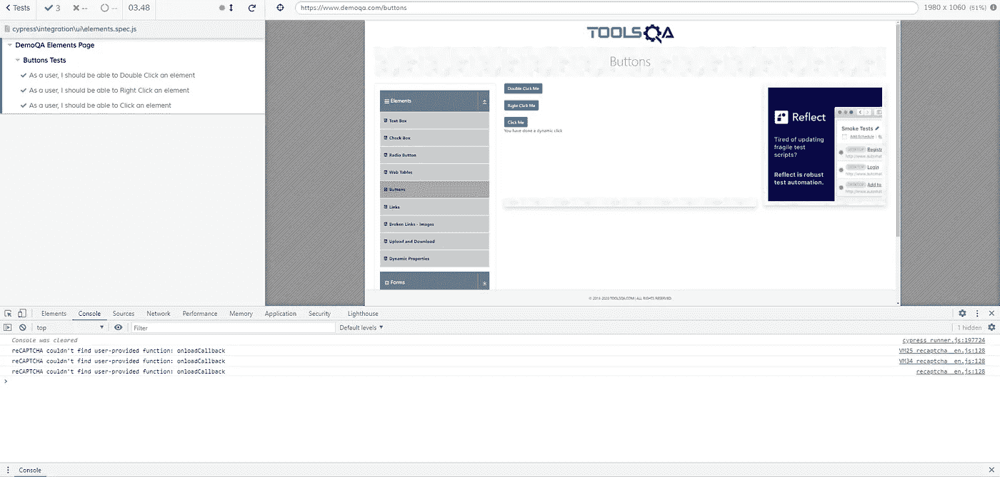
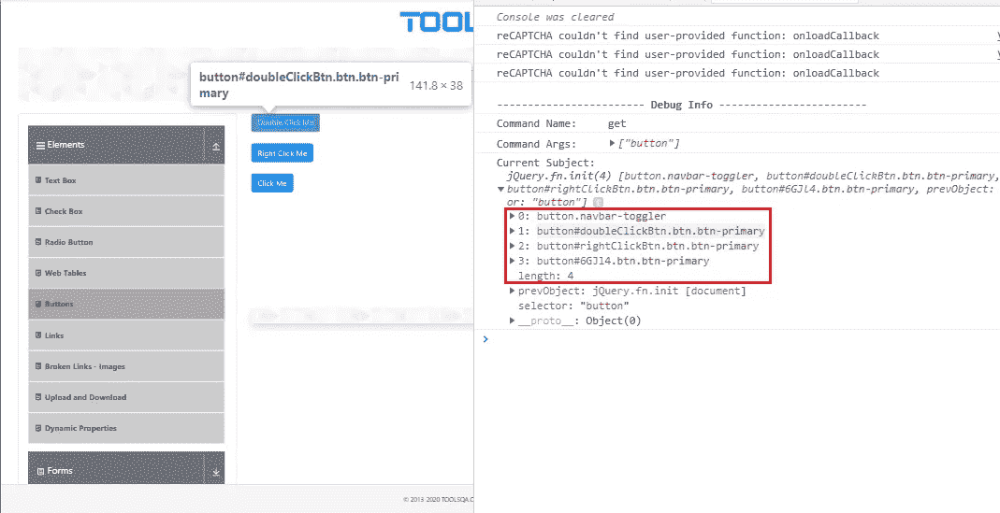
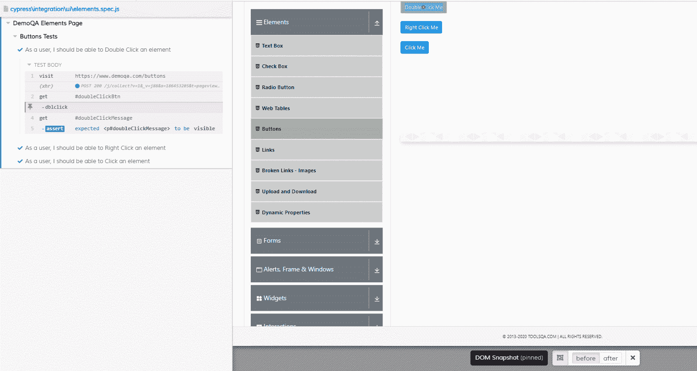
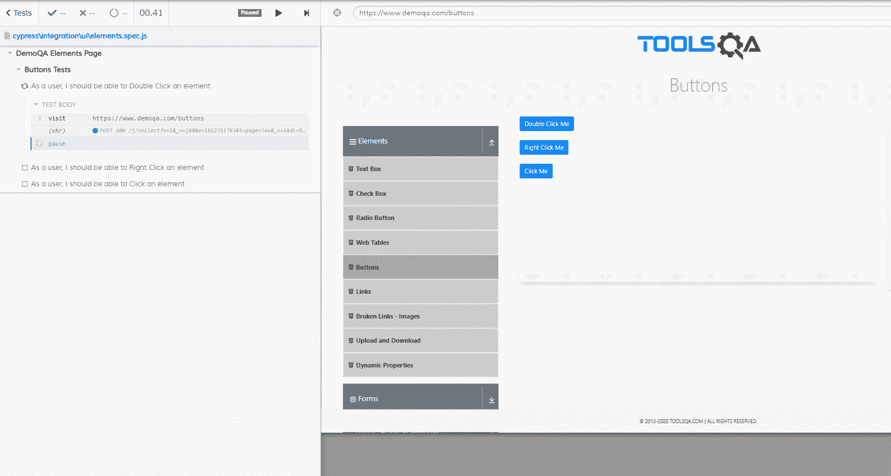

# 通过在 Cypress 中调试来提高您的测试技能

> 原文：<https://javascript.plainenglish.io/sharpen-your-testing-skills-by-debugging-in-cypress-597de915ffab?source=collection_archive---------13----------------------->

## 了解如何有效地调试 Cypress 测试代码。

It’s easier than this, trust me. (Photo by [Clem Onojeghuo](https://unsplash.com/@clemono?utm_source=medium&utm_medium=referral) on [Unsplash](https://unsplash.com?utm_source=medium&utm_medium=referral))

调试——我们都经历过。一连几个小时盯着一行行的代码，想知道为什么有些东西会以这种方式出现。调试自动化代码可能是一个令人沮丧和精疲力尽的经历。无论工具集是什么，深入代码行以确定自动化在哪里出了问题都是一个挑战。

我个人犯了一个错误，然后立即再次运行我的代码。出于某种原因，我仍然认为第二次我的代码会顺利通过。似乎 50%的失败率是一件值得自信的事情——事实并非如此。

幸运的是，Cypress 自带的方法和特性极大地提高了工程师快速有效地调试自动化代码的能力。

本教程假设您熟悉 Cypress 和测试自动化。我们将使用 [DemoQA 元素](https://www.demoqa.com/elements)页面作为我们测试和调试活动的基础。

# 设置调试器

为了正确地使用 Cypress 进行调试，您必须配置浏览器窗口以使用开发人员工具打开。这可以通过将下面的代码添加到插件目录中的`index.js`模块来实现。

Automatically open DevTools for Chrome, Electron, and Firefox.

*注意:在没有插件* `*index.js*` *模块的情况下启动浏览器实例(或者没有手动打开控制台)将不允许进行调试。*

您可以通过打开 Cypress GUI 并在 headful 模式下运行测试来验证代码是否有效。浏览器窗口现在应该会打开，并突出显示开发人员工具。

Cypress window with a console session open. (Screenshot by Jonathan Thompson)

# 调试方法

Cypress 允许两种独立的调试方法:

1.  JavaScript `debugger`语句
2.  `cy.debug()`柏树的方法

我个人发现赛普拉斯`cy.debug()`方法对测试工程师更有用，所以我将把重点放在它的用法而不是`debugger`语句上。这在很大程度上是因为当调用 debug 方法时，Cypress 会捕获元素标准。

例如，您正在构建一个测试，用于选择[演示按钮](https://www.demoqa.com/buttons)页面上的动态点击按钮。动态点击按钮是页面上显示的第三个按钮，位于双击和右键按钮下方。编写一个简单的调用来获取一个按钮并单击它会失败，因为页面上有多个按钮元素。

找到要选择的按钮的一种快速简单的方法是在获得页面上的所有按钮后立即使用 debug 方法。

An example usage of cy.debug().

运行上述代码将在浏览器窗口中返回以下内容:

The result of cy.debug() on the Buttons page. (Screenshot by Jonathan Thompson)

如您所见，页面上有四个按钮，动态点击按钮占据了第三个索引。在控制台中打开索引会显示选择器的信息，从 childNodes 和 innerText 到 onClick 数据。对于这个特别的问题，我们将关注 innerText 条目，因为按钮有一个我们可以使用的独特的文本节点。

在这种情况下，对文本“点击我”使用`cy.contains()`方法是行不通的，因为屏幕上有三个带有“点击我”的按钮。相反，我们将求助于使用 regex 模式，并将其与使用 debug 方法时找到的 innerText 数据的确切内容进行匹配。

Selection of a button based on exact innerText.

我们的测试将顺利通过，因为我们在屏幕上选择了正确的按钮。

这看起来像是一个基本的例子。目的是展示使用`cy.debug()`方法寻找元素标准的实践，这有助于为测试消耗构建选择器。

# 过去和现在

吸引我采用 Cypress 1 . 0 . 0 版的一个原始特性是页面操作前后的 DOM 截图。在 Cypress 之前，工程师通过图像截图依靠两种模式进行调试:

1.  在测试代码中手动输入屏幕截图调用
2.  失败呼叫后的屏幕截图

第一个问题是，它要求工程师明确知道在哪里输入截屏调用。在极端的情况下，工程师会在每个动作前后添加截图。然后，每次自动化运行都会用截图填充一个目录，以便在没有上下文的情况下进行筛选，这进一步模糊了工程师准确解决自动化问题的能力。

失败时的屏幕截图只对确定操作失败时的应用程序状态有用。查看失败前的应用程序状态没有任何帮助。

Cypress 通过在页面上执行操作前后提供 DOM 截图来解决这些问题。下面是[演示按钮](https://www.demoqa.com/buttons)页面上的一个交互。当用户双击特定按钮时，按钮行下面的容器中会显示一条消息。

Before and after screenshots. (Gif by Jonathan Thompson)

gif 显示了 Cypress 测试运行程序，在屏幕底部有“before”和“after”按钮。“之前”按钮显示操作之前的应用程序状态，而“之后”按钮显示结果。切换“after”按钮显示带有消息文本的屏幕截图，声明在正确的按钮上发生了双击，从而确认在页面上发生了双击。

虽然此信息仅在 headful 模式下运行时可用，但它允许工程师查看应用程序内已采取的操作以及应用程序之前的状态。通过提供何时添加`cy.debug()`方法的基础，这在调试过程中被证明是非常有用的。

# 用视频捕捉它

默认情况下，在 headless 模式下，Cypress 会为每个已经完成的测试捕获视频文件——不管它是通过还是失败。这些视频可以在显示测试中的整体工作流程的同时，提供测试期间应用程序状态的一瞥。工程师可以使用这些视频快速发现应用程序状态中的错误，同时考虑正在发生的操作，以便标记需要输入调试语句的位置。

作为一名测试工程师，您应该在每次失败后查看视频，以确定从哪里开始故障排除。虽然它们不是交互式的，但它们确实提供了足够的背景。

# 暂停以获得效果

许多编程语言都有一个读取-求值-打印循环(REPL ),允许工程师在执行过程中进入代码。从这里，工程师可以写出步骤，并实时观察命令的结果。我非常熟悉这种模式，因为我的自动化经验中有很大一部分是用 Python 和 Ruby，这两种编程语言都有 REPLs 的特性。

每种语言都允许我编写自动化代码，打开一个满满的窗口，然后分别使用 Ruby 的`binding.pry`和 Python 的`breakpoint`进入其中。一旦进入，我就可以在 REPL 中写出下一步测试的代码，并观察我的交互结果。这个过程允许我看到动作的执行，以及我应该寻找什么样的问题，比如需要等待的缓慢加载的元素。

不幸的是，JavaScript 没有 REPL。然而，Cypress 的创造者确实为我们提供了另一种选择:方法`cy.pause()`。

使用 pause 方法可以停止自动化代码，并提供两个附加功能:

1.  播放按钮
2.  下一步按钮

play 按钮将简单地正常运行测试。“下一步”按钮对于解决自动化代码问题至关重要。

下面是按钮的运行情况:

Step-by-step interactions using cy.pause(). (Gif by Jonathan Thompson)

使用 next 按钮，我们可以查看测试中每一步代码的操作和结果。这是非常强大的，因为它允许工程师查看视频或截图范围之外的结果。工程师直接控制的不是静态资产，而是 Cypress。这对于解决页面加载、挑剔的选择器或其他各种问题来说是完美的。

每当我发现自己在用 Cypress 进行故障诊断时，不管问题有多大，我个人都会使用这种模式。在编写或维护自动化代码时，不能不使用`cy.pause()`方法。

# 摘要

调试测试自动化不一定是痛苦的经历。通过使用 Cypress 的 debug 方法，您可以发现在测试自动化代码中使用的应用程序元素。查看 DOM 截图和视频可以让您构建输入调试语句的上下文。最后，`cy.pause()`方法是一个强大的工具，它允许工程师在测试代码运行时进入测试代码，并手动执行测试步骤。

这些工具中的每一个都将极大地增强您对自动化代码进行故障诊断和调试的能力。

# 资源

1.  “调试。”2021 年 3 月 5 日，【docs.cypress.io/guides/guides/debugging.html】[。](http://docs.cypress.io/guides/guides/debugging.html)
2.  柏树-木卫一。"建议:添加命令行标志，用于在运行期间打开开发工具." *GitHub* ，[github.com/cypress-io/cypress/issues/2024](http://github.com/cypress-io/cypress/issues/2024)。

**Jonathan Thompson** 是 Pendo.io 的高级质量工程师，专攻测试自动化。他目前和妻子以及一只名叫温斯顿的金毛猩猩住在北卡罗来纳州的罗利。你可以在 [LinkedIn](https://www.linkedin.com/in/jonathanmnthompson/) 上联系他，或者在 [Twitter](https://twitter.com/jacks_elsewhere) 或 [Github](http://github.com/ThompsonJonM) 上关注他。