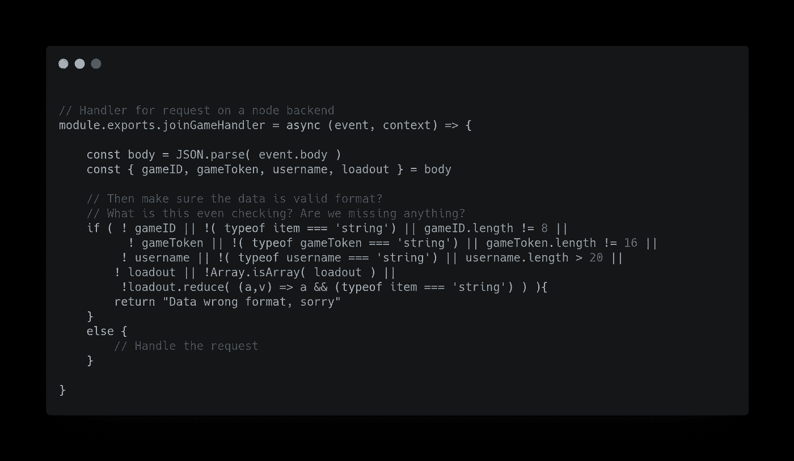
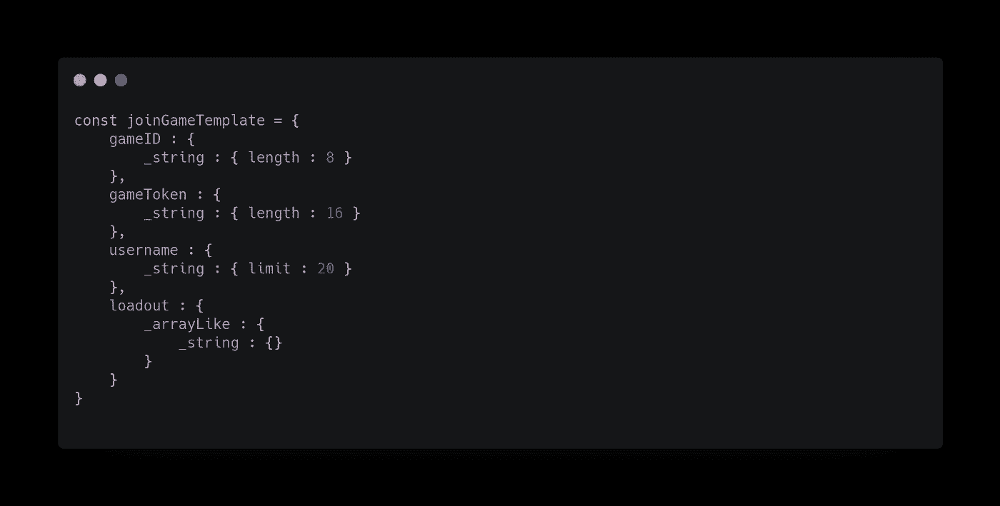
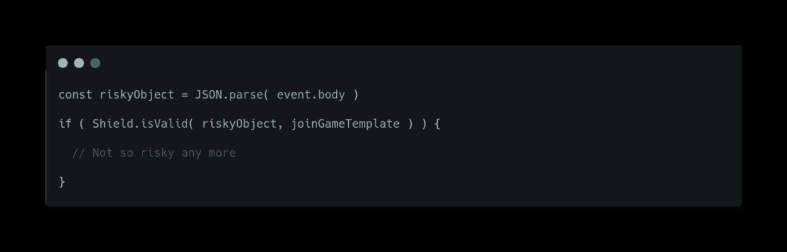
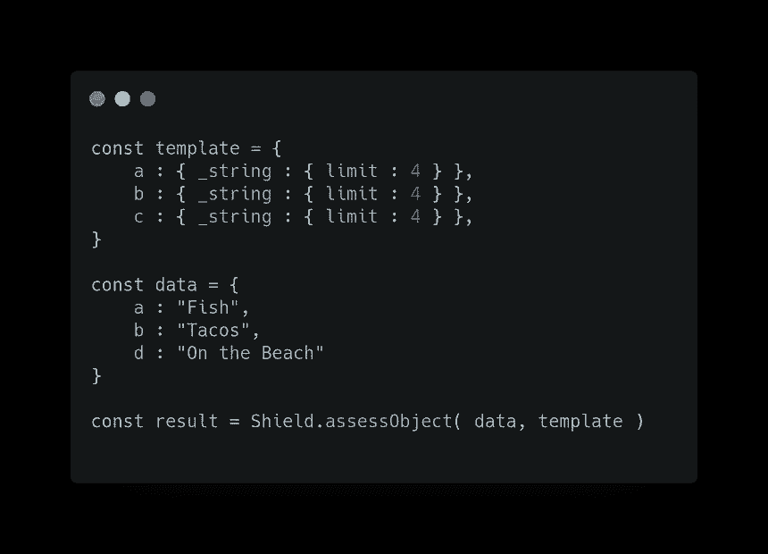
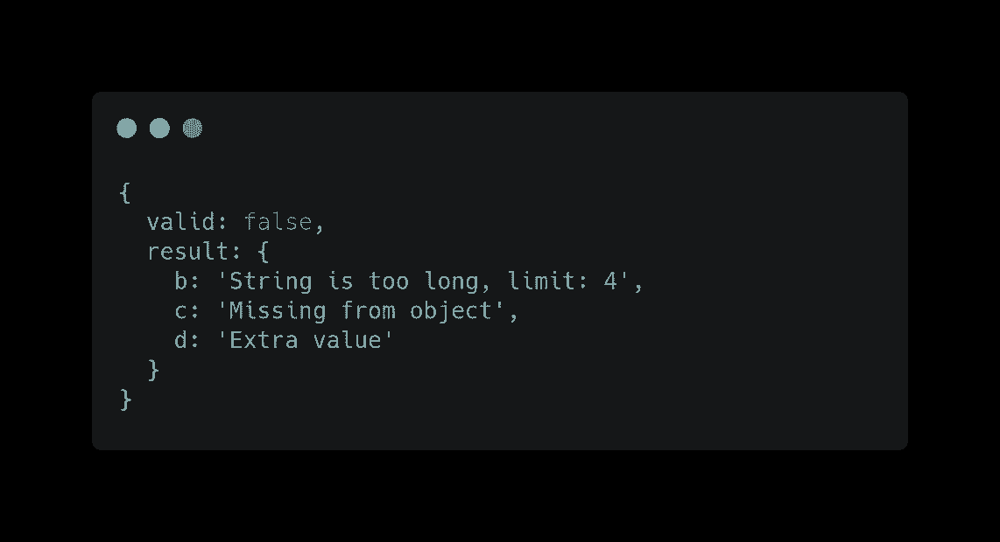
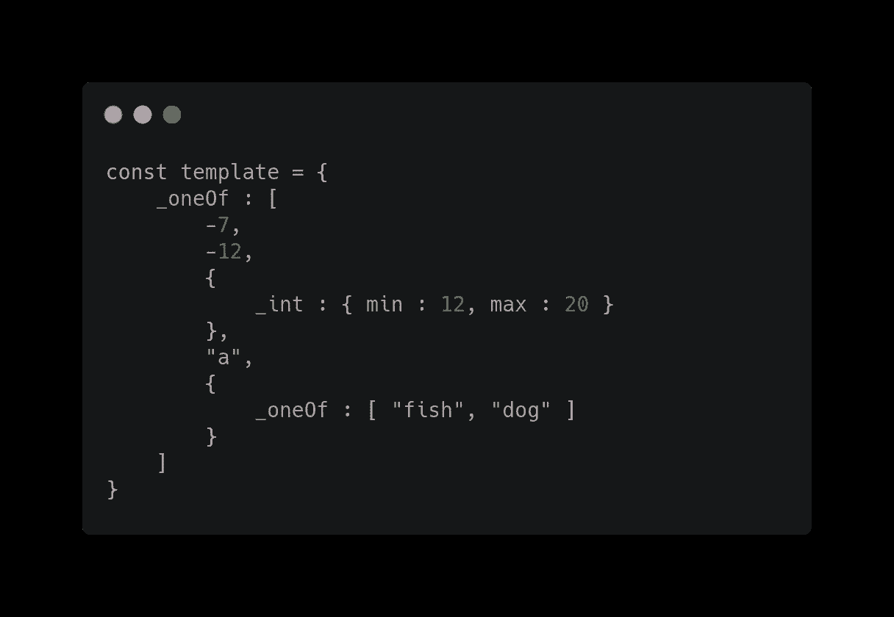
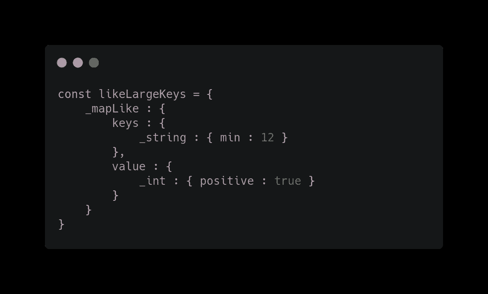
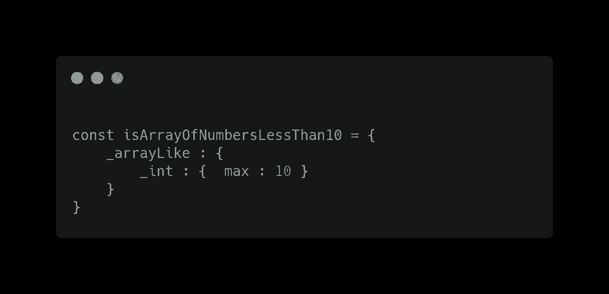

# Shield 简介:解决服务器端类型检查问题的节点包

> 原文：<https://javascript.plainenglish.io/shield-javascript-and-the-solution-to-server-side-type-checking-5e27e9f9fa72?source=collection_archive---------26----------------------->

Photo by [Erik Mclean](https://unsplash.com/@introspectivedsgn?utm_source=medium&utm_medium=referral) on [Unsplash](https://unsplash.com?utm_source=medium&utm_medium=referral)

## 解决服务器端类型检查难题的节点模块。

我发现自己最近用 JavaScript 写了很多后端代码，总是遇到同样的问题。类型检查。

当作为开发人员编码特性时，TypeScript 是很棒的！但是客户数据呢？在大多数情况下，数据作为字符串化的 JSON blobs 发送到节点后端。验证这些数据的格式是否正确可能是一项全职工作。以下面我试图为 lambda 解析器编写的一些代码为例。看看你是否能理解它。

可怕吧？我们遗漏了很多案例，我们甚至不知道我们目前在检查什么。然后，经典问题，需求变了。现在怎么办？您需要对其进行排序，并根据新值进行编辑。当然，这不是不可能的，但这是讨厌的工作。

此外，一个应用程序从来都不是一个处理程序，类型分布在十几个位置，每个位置的组织性都不如前一个。这都是假设所有的类型检查都在每个处理程序的同一个地方完成，通常是分散在后端，因为每个部分在继续之前只检查它需要的内容。

回车:模板-盾牌。好吧，也许这个名字不是最好的，但它是一个快速节点模块，我写它就是为了解决这个问题。让我们看看如何使用它来解决这种混乱，清理代码，并建立一个更好的开发环境！

# 什么是盾？

使用 Shield，你定义一个变量作为一个“模板”,它将保护你不受任何不严格遵循其结构的对象的影响！模板根据输入数据递归解析，并给出详细的读数，显示匹配失败发生在哪里！

下面的对象是一个模板，它和上面的条件做同样的检查！然而，它更干净、更紧凑、可读性更好！

100x better!

然后，使用模板就像将它传递给 shield 进行检查一样简单。Shield 将递归解析模板，使其与对象匹配。如果一切都完全匹配，则允许该对象通过！

简单地在 lambda 解析器的顶部定义一个模板，然后抛出和接收不匹配的请求，这已经大大提高了我的无服务器代码的可读性！对于任何处理原始 JSON 字符串或其他类型的危险数据的基于节点的请求处理程序来说，几行代码可以带来巨大的风格改进！

De-riskify in simple steps

此外，对于不正确的值，Shield 将提供匹配失败的描述。向用户展示这一点可能不太有用，但是可以使调试数据问题不那么令人头痛！

The template and data (left) product a detailed read out (right) when sent through Shield

在上面的例子中，

*   “a”是正确的，因此不在结果中。
*   “b”太长，收到一条错误消息
*   模板上应该有“c ”,但给定的数据中却没有
*   “d”在数据上，但对模板没有期望。

为了让 Shield 将其标记为有效，这三个问题都需要解决。

# 语法示例

模板对象被定义在一个特定的结构中，这样 Shield 就可以正确地解析它们。

## 直接匹配

如果键是普通值，那么 Shield 将尝试寻找具有相同值的匹配键。如果一个对象使用直接匹配，所有的键都直接映射到模板。

## 类型检查

像`_string`和`_int`这样的关键字允许你指定一个属性或者对象是一个特定的类型。此外，您可以对这些数据类型的长度、大小和其他值设置限制。

## 数组检查之一

在许多情况下，您可能有一个要从中选择的选项列表。关键字`_oneOf`允许你指定一个元素列表，给定的对象必须至少匹配其中的一个。它们可以是直接匹配或模板，或者是直接匹配和模板的混合。

## 检查数组的每个元素

用`_arrayLike` Shield 将验证该项目是一个数组，并且每个元素都匹配所提供的子模板。这与`_oneOf`相结合，允许从任何尺寸的输入缩放到任何尺寸的模板。

## 条件对象键

使用`_mapLike`您还可以检查对象的关键点是否满足特定条件，如果对象关键点需要看起来像自定义和动态的

## 自定义模板

最后，还有一个 provider helper `registerHandler`，它允许为您的检查需求创建更多的定制处理程序。

# 示例模板

虽然这样格式化很奇怪，但上面的模板接受-7，-12，从 12 到 20，“a”，“fish”或“dog”作为有效值。其他的都会被屏蔽。

同样，尽管这种用法有问题，但上面的模板确保它接收的对象的键至少有 12 个字符，值为正整数。

最后，这个模板确保它接收一个值数组，每个值都是一个最大值为 10 的整数。

# 更多资源

想用这个？看看吧！

 [## 模板屏蔽

### 针对那些讨厌的客户端的轻量级服务器端类型检查

www.npmjs.com](https://www.npmjs.com/package/template-shield)  [## 埃里克-罗伯逊/铅字盾牌

### 此时您不能执行该操作。您已使用另一个标签页或窗口登录。您已在另一个选项卡中注销，或者…

github.com](https://github.com/eric-robertson/type-shield) 

名字有点不固定哈哈。如果有用的话，请鼓掌支持我！

*更多内容请看*[***plain English . io***](http://plainenglish.io/)