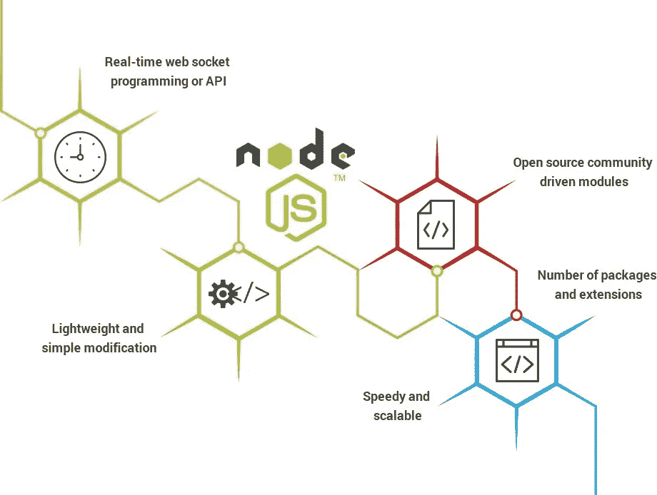
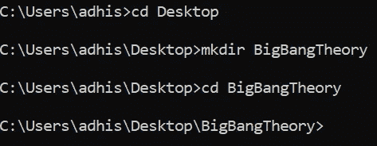
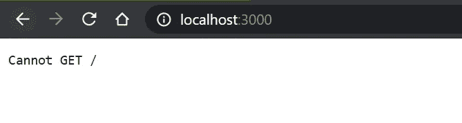
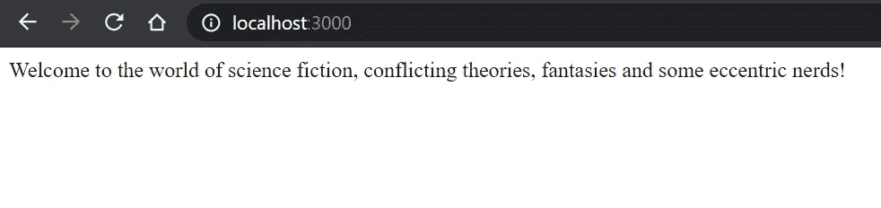
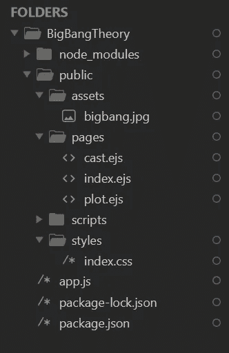
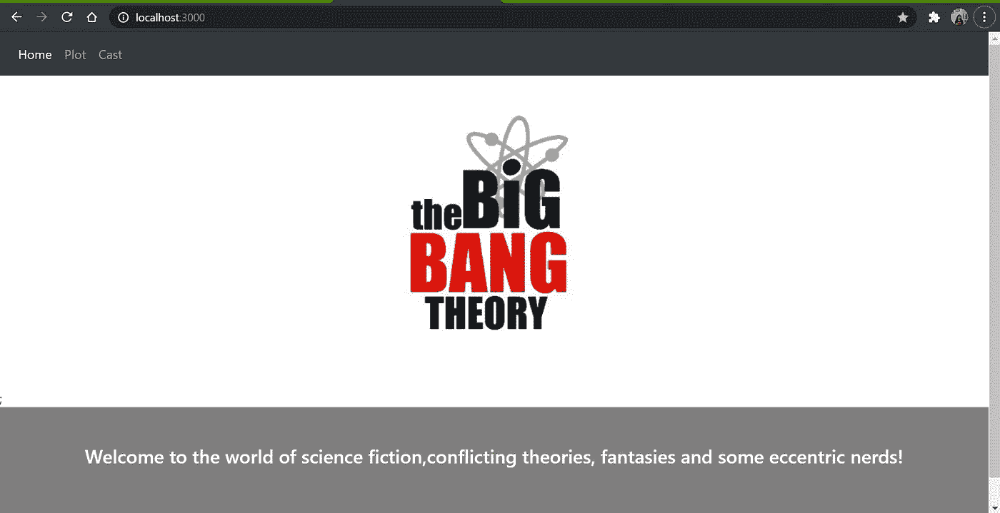
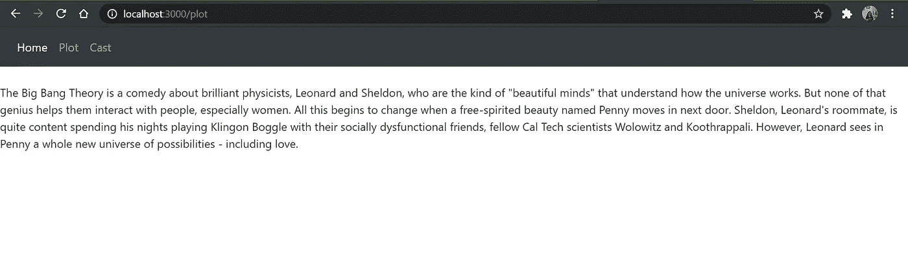
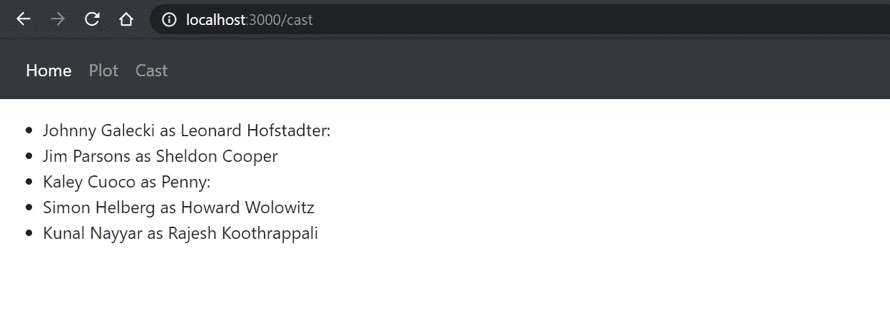

# 如何从头开始创建 Node.js 和 Express App

> 原文：<https://javascript.plainenglish.io/shoot-your-node-and-express-app-from-scratch-72e4b6816819?source=collection_archive---------6----------------------->

你是否厌倦了那些静态的网页，一直渴望让它们与用户互动？你是不是和我一样是 JavaScript 的忠实粉丝却不知道如何入门后端开发？嗯，你来对地方了。让我们从头开始构建 Node.js 和 Express 应用程序！



***确保你的设备上已经安装了 Node.js 和 npm。***

为您的操作系统下载最新版本的 [Node.js](https://nodejs.org/en/) 。npm 可执行文件随 Node.js 一起安装，所以您不必担心。如果您不确定您的系统是否预装了 Node.js，只需进入您的终端并点击:

```
**node -v**
```

如果终端显示某个版本，如 v13.x、v14.x 或 v15.x，那么您就可以开始了。

下一步是为我们的应用程序创建一个工作目录。走向你的终端，进入你想要的目录。使用`mkdir`命令创建一个新文件夹。

假设我想让我的 express 应用程序在我的*“桌面”*文件夹中显示“*BigBangTheory”*。那么我的命令序列应该是这样的



在主目录下创建一个名为 *app.js* 的新文件。您可以使用命令提示符来完成此操作

```
**touch app.js**
```

确保您位于终端中应用程序的根目录下，并运行

```
**npm init**
```

这个命令将询问您一些问题，以便在您的项目路径中生成一个描述项目所有依赖项的 **package.json** 文件。在开发过程中添加更多依赖项时，该文件将被更新。对于所有的语句序列，继续按 enter 键，但是要确保将 *app.js* 作为 Node.js 应用程序的入口点。

```
package name: (bigbangtheory)
version: (1.0.0)
description: This is my first node and express app
**entry point: (app.js)**
test command:
git repository:
keywords:
author:
license: (ISC)
```

现在我们将继续安装一些依赖项到我们的 **package.json** 文件，通过运行:

```
**npm install express body-parser nodemon ejs**
```

随着我们深入研究，我们将了解为什么要安装这些依赖项。

在****app . js**文件中，我们会在我们的文件中要求并合并各种依赖关系。**

```
**// **app.js**const express=require("express"); 
const app= express();        //binds the express module to 'app'
app.listen(3000, function(){
        console.log("SERVER STARTED ON localhost:3000");     
})**
```

**`**app. listen()**` 函数用于绑定和监听指定主机和端口上的连接(这里端口是 3000)。回调函数记录一个输出，表明应用程序已经设置好，服务器正在运行。现在，在您的终端中运行`nodemon app.js`，并在您的服务器中运行***localhost:3000***。**

> **Nodemon 是一个帮助开发 Node.js 应用程序的工具，当检测到目录中的文件更改时，它会自动重启 node 应用程序。或者，`node app.js`也会启动服务器，但是它不会检测目录中的动态变化。因此，nodemon 是首选。**

**嘣！它会抛出一个错误。**

****

**Error**

**这是因为我们的浏览器无法从服务器获得任何响应。让我们试着发送纯文本。**

```
**//**app.js**const express=require("express"); 
const app= express();app.get("/", function(req,res){
  res.send("Welcome to the world of science fiction, conflicting theories, fantasies and some eccentric nerds!")
});app.listen(3000, function(){
        console.log("SERVER STARTED ON localhost:3000");     
})**
```

**`**res.send()**`函数主要发送 HTTP 响应。当我们的服务器启动时，它向 *home route "/"* 发送一个 get 请求，这触发了一个回调函数，并向我们的浏览器发送一个 HTTP 响应。**

**刷新浏览器，您可以看到类似这样的内容**

****

**localhost:3000**

**万岁！我们使用 Node 和 Express 成功地创建了一个基本的 web 应用程序。让我们再增加一些路线，使它变得有点吸引力。**

**我们现在将发送一些静态文件到我们的服务器。在主目录中创建一个名为 **public** 的新文件夹，并在其中创建三个子文件夹，即 **pages** 、 **styles** 和 **scripts** 。我们所有的静态页面都将存放在 *public/pages* 目录下，它们对应的 CSS 和脚本分别存放在 *public/styles* 和 *public/scripts* 中。所有资产(图像和标识)将存储在*公共/资产*文件夹中。让我们添加一些文件，如下所示:**

****

**Final File Structure**

**现在让我们添加一些内容和样式到带有导航的主页。在这里，我又创建了两个导航，并在我的 **app.js** 文件中路由它们。**

```
****//app.js**const express=require("express"); 
const ejs=require("ejs");
const bodyParser=require("body-parser");const app= express();//setting the view engine as EJS. 
app.set('view engine', 'ejs');//roots the views directory to public
app.set('views', 'public');//tells express that the public folder is the static folder
app.use(express.static("public"));//home route**app.get("/", function(req,res){
  res.render("./pages/index");
});**// routing plot.ejs file
// this simply means calling *localhost:3000/plot* will render this page in our app**app.get("/plot", function(req,res){
  res.render("./pages/plot");
});**// routing cast.ejs file 
//this simply means calling *localhost:3000/cast* will render this page in our app**app.get("/cast", function(req,res){
  res.render("./pages/cast");
});**app.listen(3000, function(){
        console.log("SERVER STARTED ON localhost:3000");     
})**
```

**现在给 index.ejs、plot.ejs 和 cast.ejs 添加一些内容和样式，嘣！我们的 Node.js 和 Express app 长这样！**

****

**localhost:3000**

****

**[http://localhost:3000/plot](http://localhost:3000/plot)**

****

**[http://localhost:3000/cast](http://localhost:3000/cast)**

**我希望我现在已经让你更容易开始了。为了便于理解，我尽量使解释简单。在学习 Node.js 的过程中，我确保提出了在我(也许也是你)脑海中浮现的常见疑问。**

**如果您需要帮助，请查看完整的代码！**

 **[## 大爆炸理论

### AdhisikhaPatnai 的 Node.js repl

replit.com](https://replit.com/@AdhisikhaPatnai/BigBangTheory)** 

***更多内容请看*[*plain English . io*](http://plainenglish.io/)**