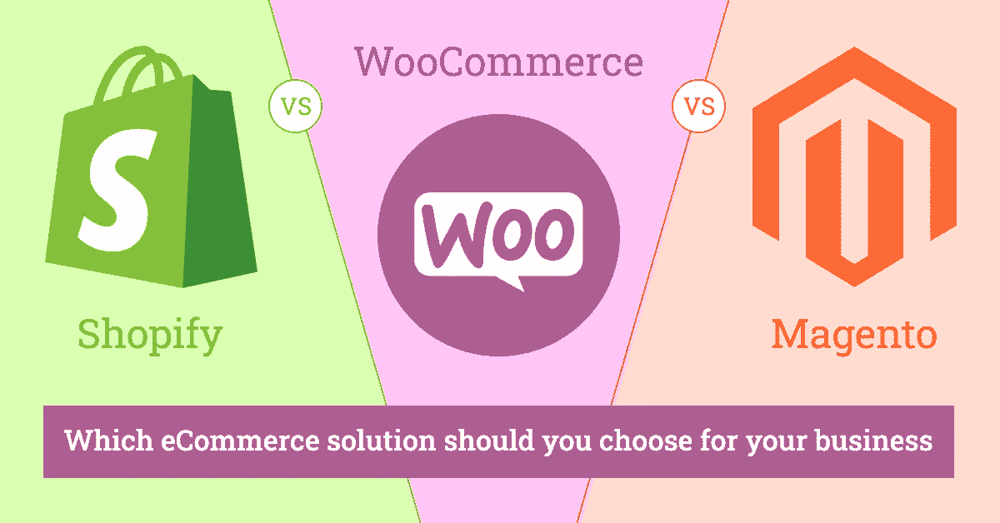

# shopify vs woo commerce vs Magento——你应该为你的企业选择哪种电子商务解决方案？

> 原文：<https://javascript.plainenglish.io/shopify-vs-woocommerce-vs-magento-which-ecommerce-solution-should-you-choose-for-your-business-d744a828a71b?source=collection_archive---------16----------------------->

## 彻底解决 Shopify Vs Magento Vs Woocommerce 的争论！

知道哪种电子商务软件最适合你的业务并不容易。您不能只选择一个并期望立即成功-您需要找到具有您需要的功能，并在行业中享有良好声誉的解决方案。

市场上三个最好的电子商务平台是 Shopify、WooCommerce 和 Magento。每一种都有自己的优点和缺点，因此根据您的业务需求，您可能会发现这三种中的一种比其他的更适合。如果你正在寻找最好的 [**网站设计和开发服务**](https://www.suntecindia.com/web-development-services.html) ，那么你需要继续阅读这篇博客。

# 购物化

如果你想快速上手，首先考虑易用性，那么 Shopify 就是你要走的路，你可以阅读 [**选择 Shopify 作为你的电子商务商店**](https://www.suntecindia.com/blog/why-choose-shopify-for-your-ecommerce-store-development/) 的几大理由。它的设置非常快速简单，管理您的内容也很快。当你在 Shopify 注册一个帐户时，你可以访问一系列主题模板，这些模板会给你的在线商店带来你想要的外观。

如果简单是重要的，那么 Shopify 可能是正确的选择——但与 WooCommerce 和 Magento 相比，它有一些局限性。你需要做的是 [**雇佣 Shopify 开发者**](https://www.suntecindia.com/hire-shopify-developers.html) 然后你就万事俱备了。例如，使用 Shopify，你只能选择几种支付方式。除了从应用目录中购买应用之外，没有任何运输模块，客户数据管理也是有限的——例如，如果客户订购了太多产品，就没有办法删除他们。将您的开发外包给 Shopify 开发公司将帮助您克服这些限制，因为他们可以找到替代解决方案。

# 网络商务

如果你不想担心有限的客户数据管理或可用的支付选项，那么 WooCommerce 可能是一条出路。这款开源软件是免费的，具有广泛的功能——你可以为新客户添加优惠券，通过将一些产品标记为特色产品来推广其他产品，并在线跟踪你的库存。

就局限性而言，唯一的一个问题是 WooCommerce 没有托管购物车——如果你的业务需要高级功能，你可能需要从开发者那里找到一个扩展。

# Magento

最后，还有**Magento——阅读 [**选择 Magento 作为你的电子商务在线商店**](https://www.suntecindia.com/blog/top-reasons-to-choose-magento-for-ecommerce-website-development/) 的几大理由。这款开源软件为希望建立专业在线商店的企业提供了一系列高级功能。事实上，它是开源的，这意味着它有先进的模块可用，如果需要，你可以轻松地扩展软件——例如，通过安装一个运输应用程序。**

**与 Shopify 和 WooCommerce 相比，Magento 有一个缺点:它的学习曲线。在某些情况下，管理界面可能会令人困惑，因此没有全职人员专门从事网页设计的企业可能会发现 Magento 很难管理。最好的选择是 [**雇佣 Magento 开发者**](https://www.suntecindia.com/hire-magento-developers.html) 来帮你。**

**如果你仍然不确定哪个平台最适合你的在线商店，那么也许值得进一步阅读这篇文章——它将指导你了解每个选项的利弊，帮助你为你的企业做出正确的选择。**

> **现在让我们深入了解每一个细节**

# **网络商务**

> ****开始时间:2011 年****
> 
> ****母公司:** WooThemes**
> 
> ****用户**—1100 万(约)**

## ****有什么好吃的？****

**有一大群专业人士渴望提供帮助。一个庞大的教学材料和文件图书馆是可以访问的。WordPress 集成占所有 CMS 网站的一半，因此很容易与它无缝集成。有许多免费和付费的主题可供选择，以及数百个插件和扩展，让店主增强他们的在线商店的能力。插件本身完全免费使用！**

## ****有哪些不招人喜欢的地方(如果还不错的话)？****

**额外的插件和扩展可能会变得昂贵。你的网站必须已经安装了 WordPress 才能使用 WooCommerce。对于非技术人员来说，安装和配置 WooCommerce 可能很困难。不包含一些复杂的功能，这些功能是更强大的电子商务平台的标准配置。**

# **购物化**

> ****自 2006 年以来一直存在****
> 
> **创始人:托拜厄斯·吕特克和斯科特·莱克**
> 
> ****用户** — 20 万(近似值)**

## ****有什么好吃的？****

**一个强大的端到端电子商务平台。只需很少的技术技能，您就可以快速启动并运行它。每周 7 天、每天 24 小时通过电话、电子邮件或在线聊天提供支持。有 100 多种免费和付费模板可以帮助你美化商店的外观和感觉。手机友好和搜索引擎友好。如果你使用 Shopify 支付，没有交易成本。14 天的试用期是免费的。**

## **有哪些不招人喜欢的地方(如果还不错的话)？**

**不是开源的，这可能会导致更慢的错误修复和功能更新迭代。它不是免费使用的。每月费用从 29 美元到 299 美元不等。使用第三方支付网关可能会产生额外费用。**

# **Magento**

> ****自 2008 年以来一直存在****
> 
> ****母公司:** Varien，Inc**
> 
> ****用户** — 25 万(近似值)**

## ****有什么好吃的？****

**适合几乎所有电子商务企业需求的产品组合和价位。一些通过 Magento 建立的顶级电子商务网站拥有良好的声誉。Magento 的许多选项使其具有高度的可扩展性:从小处着手，发展成为一个巨大的成功故事。有大量的文档、支持论坛、培训和认证工具可供使用。免费演示是可用的。**

## ****有哪些不招人喜欢的地方(如果还不错的话)？****

**为了充分利用 Magento 社区，您需要相当的开发和编程能力。只有大型电子商务企业才能负担得起企业版。企业平台每年的成本超过 20，000 美元。全有或全无政策适用于平台支持。Magento 社区的用户只能访问社区论坛和用户群，除非付费，否则不能访问专家支持人员。**

# **shopify vs woo commerce vs Magento——比较分析**

# **1.表演**

## **购物化**

**Shopify 的网站性能和速度都很优秀。其最突出的特点之一是提高网站速度。但是，它缺乏可扩展性。如果你想拓展业务，这可能是你的一个问题。如果你想要无缝扩展，你必须使用 Shopify Plus，这将大大提高价格。**

**Shopify 在移动电子商务方面做得不太好。也就是说，Shopify 有很多让人喜欢的地方。如果你是电子商务新手，不想一开始就处理复杂的平台架构，这可能是你的理想工具。从 Shopify 开发服务开始是你迈向电子商务的第一步。**

****WooCommerce****

**如果你已经有了一个主机提供商，可以按照你需要的速度来扩展你的 WordPress 网站，WooCommerce 可以帮助你获得你想要的任何项目规模的性能。虽然 WooCommerce 允许可扩展性，但不熟悉编码的用户可能会发现很难为了满足他们的需求而扩展他们的网站。WooCommerce 可以免费使用，但是实现必要的扩展会非常昂贵。**

## **Magento**

**Magento 的灵活性和可伸缩性使其非常适合大型电子商务平台。它非常强大，可以轻松处理各种各样的商品以及大量的网站流量。Magento 还具有不可思议的可扩展性，允许你根据网站流量即时扩展或削减服务器所需的资源。它也是可定制的，有大量可用的扩展列表。**

**Magento 的缺点是，它需要严肃的编程专业知识来实现初始设置，并且可能比其他电子商务平台慢。为了充分利用 Magento，最好是为你的电子商务网站雇佣专门的 Magento 开发者。**

# **定论**

> **如果你对编码和开发一无所知，那么 Shopify 和 WooCommerce 可以成为答案。Magento 更面向专家和大公司。**

# **2.分析学**

****购物化****

**Shopify 拥有自己的分析引擎以及与谷歌分析连接的能力。它有助于电子商务店主确定他们的公司表现如何，以及如何提高它。Shopify 的商店分析和报告可让您了解商店当前的情况，了解访客，检查在线商店的表现，并分析您的交易。**

## **网络商务**

**WooCommerce 上的 Google Analytics 有一些局限性。它帮助你管理你的 WooCommerce 商店。该套件增加了九个新的报告，以及更复杂的过滤和分段功能，将所有数据导出到 CSV 的能力，以及一个可定制的仪表板来跟踪您网站的所有重要指标。如果你将某些插件集成到 WooCommerce 中，你可以获得更好的分析报告。**

## **Magento**

**Magento 有自己的分析平台，既灵活又可定制。它可以与谷歌分析集成，但有自己的分析平台来收集数据。除了基本的，你可以计算出复杂的东西，如平均订单价值，客户终身价值，保留率等。该分析平台允许您分析您的电子商务业务的表现，并找出如何优化它。**

# **定论**

> **如果你想要简单，那么 Shopify 适合你。如果你想成为最擅长分析的人，Magento 就是答案。WooCommerce 基本上和 Shopify 一样，只是集成了 WordPress。**

# **3.安全性**

## **购物化**

**尽管 Shopify 和其他顶级电子商务平台一样安全，但它也不能免受攻击。据广大商家反映，是最值得信赖的电商平台。Shopify 符合 1 级 PCI DSS 标准，符合所有六类 PCI 要求。它维护一个安全的网络、一个漏洞管理程序，并定期监视测试网络。**

## **网络商务**

**为了保证商家数据和其他重要信息的安全，WooCommerce 提供了强大的安全措施。因为它可以集成到 WordPress 中，所以你可以添加一个安全插件，比如 Sucuri 或者 Wordfence，来改进安全措施。**

## **Magento**

**作为第一个优先考虑数据保护的电子商务平台，Magento 一直处于领先地位，提供足够的安全措施。Magento 提供的一些顶级功能包括增强的密码管理、改进的对点击劫持漏洞的防范以及更灵活的文件系统所有权。**

# **定论**

> **这可以说是一个平局，因为所有的电子商务平台似乎都采取了非常严格的安全措施。因此，无论您选择什么，您都将获得适用于所有平台的顶级安全特性。然而，由于 Magento 更面向大公司，它在这方面确实有一点优势。**

# **4.定价**

## **购物化**

**Shopify 上一个基本网站的费用从每月 29 美元开始，最高可达每月 299 美元，这取决于你选择的层级。每个价格级别都有域名、SSL 证书和虚拟主机。**

## **网络商务**

**插件是免费的。然而，要运营你的 WooCommerce 商店，你需要为域名、SSL 证书或网站托管付费。一个域名的年费大约是 9.99 美元，一个 SSL 证书通常是免费的，一个托管服务的费用大约是每月 8 美元(共享托管)。**

## **Magento**

**免费，因为它是开源的。然而，对于年销售额低于 100 万美元的店主来说，企业版起价为 2 万美元(变化很大)。随着企业预计总销售收入的增加，这一成本也会增加。因此，你赚的钱越多，你需要付出的就越多。**

# **定论**

> **Woocommerce 在这里是一个明显的赢家，因为如果你没有很多钱，你可以很容易地开始使用它。此外，由于它被集成到 WordPress 中，你可以更容易地找到教程并选择合适的插件来开始。**

# **你为什么应该雇佣电子商务开发人员？**

**许多正在寻找 [**电子商务网站开发服务**](https://www.suntecindia.com/ecommerce-website-development-services.html) 的店主都会问这个问题。答案很简单；如果你想发展你的业务，投资于你在网上提供的更好的服务和产品。这意味着拥有一个强大的网站，可以提供所有关于你的企业、产品或服务的重要信息。拥有这个网站也意味着你能够为你的客户提供更好的整体服务。**

## **1.你有更好的机会让你的网上生意成功**

**我们生活在科技时代，人们正在寻找能够帮助他们有效管理时间的解决方案。我们都希望一次做更多的事情，因此拥有一个为我们的客户提供“一键社交分享”或“一键登录”等功能的电子商务平台肯定会改善我们客户的整体体验，并且他们可能会更经常地回到网站。**

## **2.随着时间的推移，你的商业网站将会发展壮大**

**有一个电子商务开发人员在你的网站上工作意味着你可以期待你的业务在几年或更短的时间内平稳运行。就像你的企业运行的软件一样，如果你希望你的企业运行良好，你应该投资购买功能强大的软件。这是因为拥有一个提供最新技术的最新网站只会帮助你的企业在未来几年成功运营。**

## **3.现在有比以前更多的产品和服务**

**互联网打开了一个充满机遇的世界，这就是为什么越来越多的人开始在网上创业。这意味着你有很多竞争对手，他们也为你的企业提供类似的产品或服务。你能从人群中脱颖而出的唯一方法是领先他们一步，这包括拥有一个更新的网站，提供比以前更好的功能。**

## **4.更多的顾客会接触到你的产品或服务**

**就像以前一样，每个人都能够购买你提供的相同产品。这使得为他们提供更好的服务变得更加重要，因为他们需要一个平台来提供他们做出决策所需的所有信息。考虑到这一点，消费者更有可能选择网上商店而不是线下商店。**

## **5.你将更容易接触到你的客户**

**客户正在寻找更好的服务，一年 365 天，一周 7 天，一天 24 小时。这意味着你需要有一个电子商务平台，不断维护和更新的最新技术，使您的企业脱颖而出。记住这一点，你可以期待你的业务随着时间的推移越来越多。**

# **最后的话**

**当谈到在三者之间进行选择时，我们可以说没有明确的赢家，因为每一个都有自己的优点。Shopify 开发服务 非常适合小型企业，Magento 非常适合大型企业，而 WooCommerce 则非常适合中小型企业。选择最终归结为你和你的目标是什么。如果你刚刚开始，你可能会考虑 Shopify，然后最终转向其他选项。**

**因此，如果你有任何想法，你想实现与技术和特性和功能的正确结合，那么你可以 [**联系我们**](https://www.suntecindia.com/contactus.htm) 或在下面提出疑问。**

***更多内容看* [***说白了. io***](http://plainenglish.io/) ***。*** *报名参加我们的**[***免费每周简讯这里***](http://newsletter.plainenglish.io/) ***。******