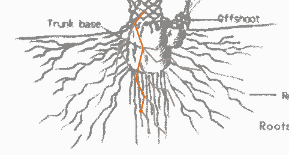

# React 上下文应该这么贵吗？

> 原文：<https://javascript.plainenglish.io/should-a-context-provider-be-that-expensive-7cafa3727507?source=collection_archive---------3----------------------->


Photo by [Ferenc Almasi](https://unsplash.com/@flowforfrank?utm_source=medium&utm_medium=referral) on [Unsplash](https://unsplash.com?utm_source=medium&utm_medium=referral)

React context 提供了一种方法，这样我们就可以在纤程树中共享一个值。在给定名称上下文的情况下，它将这个值存储在一个单独的存储中，而不是与纤程一起存储。

```
const Context = React.createContext(0)
```

现在上下文给了我们一种不同的组件，叫做`ContextProvider`。就像`FunctionComponent`、`ClassComponent`、`MemoComponent`、`ContextProvider`都有自己的更新机制。

当我们到达一个`FunctionComponent`时，它渲染并协调它的子节点，然后继续第一个子节点，继续由一个分派(或调度)引起的渲染工作。



对于一个典型的分派，比如在`useState`的情况下，当渲染开始时，它会遍历根的顶部，找到状态发生变化的源纤程，结束一条由红线指示的路径。

而一个`ContextProvider`做的还不止这些。

## 联合更新

假设有三个消费者，在没有上下文的情况下，我们将不得不进行多次分派，将每个消费者纤维视为源纤维。


这正是上下文提供者所要填充的，但是它做得更被动一些。假设提供程序安装在更高的级别，用黑色圆圈表示。当更新开始时，它会执行搜索。

搜索是递归地查找所有的消费者，这样就不会遗漏提供者下面的任何消费者。对于每个匹配的消费者，它被标记为要呈现(不久之后)。标记过程几乎与单个派遣作业中的过程一样，但是是为每个消费者完成的。

这就是为什么我们说更新一个上下文值是昂贵的。

看一个例子，其中两个消费者 Child 和 Child2 位于一个提供者之下。


当提供商发生变化时(例如由于 Branch2)，提供者下面的所有子元素都呈现，而不仅仅是消费者。

## 过度渲染

那么 React 在这里如何发挥聪明呢？有一些，但不多。该应用程序以及分支机构(例如。支路 1，未示出)。但是如果我们不小心(通常我们不小心)，提供者更新可能会导致类似于挂载中发生的情况的强制重新呈现。

比方说，我们能为孩子和孩子做的不多。但是我们想看看是否可以避免提供者和 Child2 之间的渲染。这是我们可以添加一个`React.memo`到标题的地方，它是 Child2 的祖先，是提供者的子元素。


在单个分派的情况下，从根到源光纤之间的光纤被拉出，如深灰色所示。你仍然可以看到这个应用程序的颜色。

然而，在联合更新的情况下，React 未能挽救从提供者到 Child2 的路径。这是因为一旦提供者获得更新，根据设计，它必须协调和呈现所有子节点。一旦开始，火车就不能停下来，除非有另一个机制。有关更多信息，请参见文章【React 如何基于更改进行渲染。

在我们的例子中，`React.memo`使用了一个技巧来回收丢失的优化。因此，我们可以认为根有一个内置的`React.memo`，所以它自然会被保释出来，但对于提供者来说，这并不是自动烘焙的。

## 摘要

总而言之，上下文为我们提供了共享变量和为所有消费者触发联合更新的方法。如果提供者和孩子之间的路径没有优化，代价可能会很高，因为 React 不会在幕后为您处理这一点。

## 附录

如果这一切都有意义，我们应该能够将`ContextProvider`和`memo`结合在一起，以确保所有的孩子都能自动获得救助。

```
function Branch2() {
  const [count, setCount] = useState(0)
  const onClick = () => { setCount(c => c + 1) }
  return (
    <AContext.Provider value={count}>
        <div onClick={onClick}>{count}</div>
        <AMemo />
    </AContext.Provider>
  )
}
```

我们用一个`AMemo`包装所有的儿童消费者，它使用了我们根据本文的想法构建的自定义组件，【useMemo 可以用来跳过儿童渲染吗？

```
const AMemo = memoChild(() => {
  return (
    <>
      <Child />
      <Title />
    </>
  )
})
```

现在，我们有了与单个调度案例中的根到源光纤相同的行为。


上图不就是上下文提供者的默认行为吗？有了这种行为，我们还会认为上下文提供者很昂贵吗？

*更多内容请看*[***plain English . io***](http://plainenglish.io/)