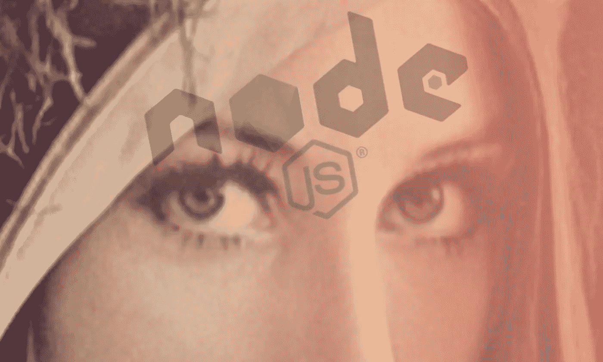
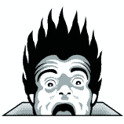
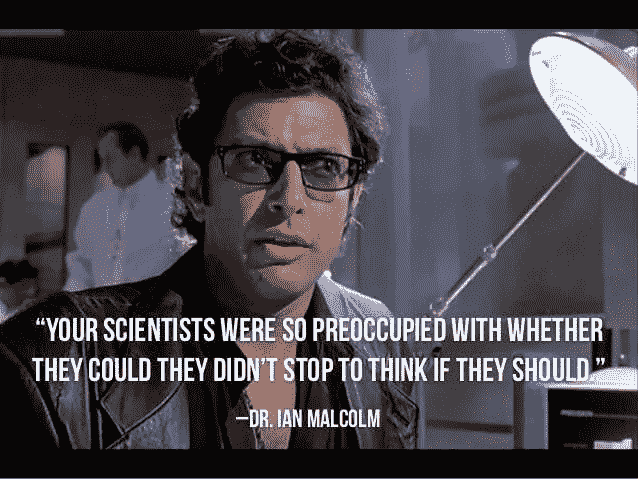

# 我应该使用 Node.js 来处理我的图像吗？

> 原文：<https://javascript.plainenglish.io/should-i-use-node-js-to-process-my-images-3f5c5f208ad5?source=collection_archive---------16----------------------->

Node.js 中处理图像的选项数量惊人。



Photo Illustration by David Fekke using Adobe PhotoShop

*最初发布于*[*https://fek . io*](https://fek.io/blog/should-i-use-node-js-to-process-my-images/)*。*

我最喜欢的定律之一是阿特伍德定律。**阿特伍德定律**陈述:任何*可以*用 JavaScript 编写的应用，*最终会*用 JavaScript 编写。我对可以用 JavaScript 编写的应用程序感到震惊。



如果你不熟悉杰夫·阿特伍德，他写了一个很受欢迎的博客[编码恐怖](https://codinghorror.com)。



当你问自己是否应该使用 Node.js 来处理图像时，这个问题绝对符合阿特伍德定律。

# 图像处理

我在 90 年代的第一份编程工作是编写一个 AppleScript，它可以利用 Adobe PhotoShop 为我当时工作的公司试图建立的高分辨率图书馆创建图像。众所周知，当时 Adobe 没有 Photoshop 内置的脚本功能。我找到了一个 Photoshop 插件，它可以让我编写代码，命令 Photoshop 自动处理我们的图像需求。

现在有各种各样的工具供我们处理图像，这些工具都可以编写脚本。但是 Node.js 呢？原来 Node.js 中有很多图像处理工具，可以通过 [NPM](https://npmjs.com) 获得。

有许多可能需要图像处理的用例。这里有几个这样的用例；

*   转换成不同的文件格式
*   调整图像大小
*   裁剪图像
*   制作合成图像
*   进行颜色校正
*   创建模糊和效果

几年前，我开发了一个名为 jimp-appicon 的工具，用于为 iOS/iPadOS 和 Android 应用程序创建图标。苹果和谷歌都需要这些正方形图像的许多不同尺寸，以便为不同屏幕尺寸的所有不同设备创建图标。

# 吉姆普

[Jimp](https://github.com/oliver-moran/jimp) ，一款以流行的 GIMP 图像处理应用命名的工具，是一款完全用 JavaScript 编写的图像处理工具。它没有任何外部依赖性，可以在任何处理器架构上运行。

Jimp 还有一个易于理解的 API，它带有一个 promise 库，允许 Node.js 开发人员在一个图像上运行多个操作。在下面的例子中，我们将采用 Lenna 图像，并将其调整为 256 像素见方，使其灰度化，并将我们的结果保存为 JPEG。下面是原图:


现在我们将运行下面的脚本来创建新的灰度 JPEG 图像。

生成的图像将类似于下图:


# 锋利的

几年前，当我第一次使用《盖茨比》时，我偶然发现了这个清晰的 T2 图像模块。盖茨比在他们的图像插件中使用了夏普图像模块。这非常快，因为它主要是作为 Node.js 的本机模块用 C++代码编写的，并且与 Node.js 的其他本机图像模块不同，它可以在大多数处理器架构上编译和运行。所以如果你运行在大型 x86_64 服务器上，或者运行在 ARM 处理器上的 Raspberry Pi 上。

# PhotoShop 和 Adobe Generator 核心

PhotoShop 可能是我一直以来最喜欢的应用程序。我用 PhotoShop 已经 30 年了。Adobe 在 2013 年创造了一种使用 Node.js 向 PhotoShop 添加插件的方法，它被称为 [Adobe Generator-core](https://github.com/adobe-photoshop/generator-core) 。如果您想在 PhotoShop 中使用特定的功能，现在可以编写 Node.js 代码，将插件选项添加到 PhotoShop 中并执行该脚本。下面是一个生成器插件的示例，它可以使用名为“路径 1”的路径，在 PhotoShop 中创建一个新图层，只包含该路径中选定的内容:

虽然可以同时使用 PhotoShop 和 Node.js 非常好，但将 Node.js 和 PhotoShop 放在同一台服务器上是不现实的。加上 PhotoShop 只在 Windows 和 MacOS 上运行。

# 用 Sharp-AppIcon 制作 AppIcon

我决定用 Sharp 写一个新的 AppIcon maker，因为它性能很好。它可以在大约一秒钟内为你的 iOS/iPadOS 和 Android 应用程序创建所有你需要的图标。以下是如何安装和使用 [Sharp-AppIcon](https://www.npmjs.com/package/sharp-appicon) 的方法。确保您的计算机上安装了 Node.js。然后，您可以使用以下命令全局 NPM 安装 [sharp-appicon](https://www.npmjs.com/package/sharp-appicon) :

```
$ sudo npm install sharp-appicon -g
```

一旦它完成了这个模块的安装，您就可以在命令行中使用`appicon`命令来执行它。你只需要导航到你的源图标的位置。它应该是一个尺寸为 1536 像素乘 1536 像素的图像。假设你的图标叫做‘myapp icon . png’。您可以通过运行以下命令来创建 appicons:

```
$ appicon MyAppIcon.png
```

这将创建一个名为“icons”的目录，其中包含 iOS/iPadOS 和 Android 应用程序所需的所有图标。观看下面的视频，了解如何使用该工具。

# 结论

使用 Node.js 创建缩略图、创建简单操作以及将图像裁剪和保存为不同格式是非常实用的。您不必使用这些模块，您也可以选择使用与 [GraphicsMagic](http://www.graphicsmagick.org/index.html) 和 [ImageMagic](https://imagemagick.org/script/index.php) 一起工作的模块。

*更多内容尽在*[*plain English . io*](http://plainenglish.io/)