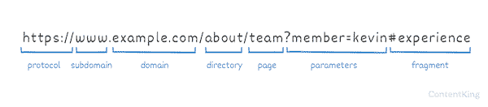
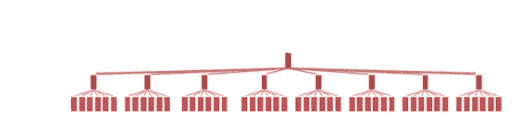
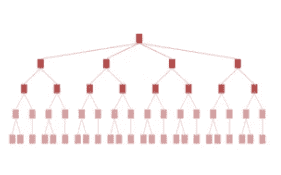

# 你应该选择一个平面或树的网址结构

> 原文：<https://javascript.plainenglish.io/should-you-choose-a-flat-or-tree-url-structure-ebceb1f1830c?source=collection_archive---------15----------------------->

## 通过研究每种方法的优点和局限性，最佳实践变得显而易见

Photo by [Luke Richardson](https://unsplash.com/@lukealrich?utm_source=medium&utm_medium=referral) on [Unsplash](https://unsplash.com?utm_source=medium&utm_medium=referral)

作为一名 web 开发人员，你可能需要参与关于 URL 结构的对话。

理想情况下，URL 结构对于用户和爬虫来说非常有用，并且非常容易维护。让这成为现实是完全可能的，然而，在计划阶段，一些战略思考是绝对需要的。

所以，问题来了——你应该用树形结构还是平面结构来构建你的网站？筑巢还是不筑巢？这就是今天的问题。

# URL 的剖析

Image by [Content King](https://www.contentkingapp.com/academy/urls/#best-practices)

在我们讨论如何组织 URL 之前，让我们快速回顾一下 URL 的组成部分:

*   协议:`https://`
*   子域:`www`
*   域名:`example.com`
*   目录:`about`
*   页面:`team`
*   参数:`?member=kevin`
*   片段:`#experience`

最佳实践包括保持目录名称简短，以允许 URL 尽可能短。根据 [Ryte Wiki](https://en.ryte.com/wiki/URL_Length#:~:text=A%20URL%20should%20not%20exceed,Through%20Rate%20of%20the%20snippet.) :

> 如果您希望 URL 完整地出现在搜索结果中，而不是被截断，它应该最多包含 74 个字符。较短的 URL 有助于提高片段的点击率。

一个好的网址:

*   简短而中肯
*   没有单词重复
*   对用户和爬虫都是直观的
*   不包括任何停用词(and、or、the 等。)

这里有一个很好的目录用法的例子:[https://www.example.com/men/socks/tommy-hilfiger/](https://www.example.com/men/socks/tommy-hilfiger/)

下面举个不好用法的例子:[https://www . example . com/men-fashion/socks-for-men/tommy-hilfiger-men/](https://www.example.com/men-fashion/socks-for-men/tommy-hilfiger-men/)

现在，让我们看看网站布局有哪些选项。

# 平面结构网站布局

平面结构是指网站的所有页面都清晰可见。其次是简单的小网站。网站导航很简单，页面也很容易找到。

平面网站的设计是这样的，你的用户和搜索引擎只需要在你的主页上点击几下就可以浏览你的网站。

flat website structure

## 赞成的意见

*   离开主页最多点击 3 次，用户和搜索引擎都可以很容易地发现页面
*   类别/支柱页面的利用
*   按类别组织的 URL 结构

## 骗局

*   需要使用大型菜单
*   巨型菜单是大型导航面板，通常从全局导航条下拉或飞出。虽然它们并不适合每一个网站，但是如果做得好的话，巨型菜单可以为用户创造一个很好的导航体验。巨型菜单的主要好处是它们便于同时显示许多选项。巨型菜单可以使用图标和图片，以及印刷层次，使扫描更容易。
*   会导致爬行问题。谷歌的约翰·穆勒说:

> 总的来说，我会小心避免出现正常的网站导航不起作用的情况。因此，我们应该能够通过页面上的链接从一个 URL 爬行到另一个 URL

*   缺乏组织性有时也使得用户导航更加困难。[来自谷歌的约翰·穆勒说:](https://www.youtube.com/watch?v=fCMwhn8cZD4&t=2361s)

> 如果这不可能，那么我们就失去了很多上下文。因此，如果我们只是通过你的网站地图文件看到这些网址，那么我们真的不知道这些网址是如何相互关联的，这让我们很难理解这些内容在你网站的上下文中有多相关

# 树形结构网站布局

在树形结构的网站中，主页是网站结构的根。它提供了网站的基本信息和从属页面的链接。

从属页面又链接到站点内的其他页面或其他站点。网站内的每个从属页面至少应该包含四个指向以下内容的“导航”链接

*   层次结构中当前页面级别的上一页，
*   层次结构中当前页面级别的下一个页面，
*   当前页面的父页面
*   该网站的主页。

下图提供了一个*树形结构*网站布局的图形示例。

tree structure website layout

# 赞成的意见

*   网站上信息的良好组织
*   深层等级秩序
*   允许您专门为某些主题创建页面
*   对大网站更有利，而小网站可以在扁平化的结构上生存。
*   它提供了更多清晰简洁地命名页面的机会。
*   网站管理员通过内容管理系统更容易维护。

# 骗局

*   需要额外的功能，以帮助用户更好地导航到较低层次的导航流(如搜索栏；或者使用页脚来保存更细粒度的导航链接)。
*   强调面包屑的重要性
*   就用户体验而言，它对用户的要求很高
*   导航树需要从根到叶的多次交互
*   节点通常很小，在树导航中需要很高的鼠标点击精度。移动设备加剧了这一问题。
*   你越深入一棵树，就越难看到你从哪里来，因为叶子会模糊分类的大背景。

# 7 个关于 URL 体系结构的最佳实践

## 1.保持主页最多点击 3 次

三点击规则是一个非官方的网站设计规则，涉及网站导航。它建议用户只需点击三次鼠标就可以在网站上找到任何信息。

[研究](https://www.crazyegg.com/blog/why-users-leave-a-website/)表明，简单的结构和设计让用户在网站上停留的时间更长。避免对 URL 架构缺陷的失望对于提高你的网站的点击率至关重要。

## 2.实施金字塔结构

在金字塔结构中，顶部是主页，中间是支柱页面，所有其他页面构成了基础。毕竟，这就是谷歌的大人物所说的“T4”在爬虫理解每一页的上下文方面最有效。

## 3.创建一个大型菜单来增强财政部和富博的 UX

[巨型菜单](https://www.nngroup.com/articles/mega-menus-work-well/)是[可扩展菜单](https://www.nngroup.com/articles/expandable-menus/)，许多选项以二维下拉布局显示。

它们是一个很好的设计选择，既可以容纳大量选项，也可以一目了然地显示较低级别的网站页面。

这与销售漏斗有什么关系？

销售漏斗包括三组用户——漏斗顶部(豆腐)、漏斗中部(MoFu)和漏斗底部(富博)。在顶部，用户正在寻找信息内容，因为他们处于客户旅程的感知和信息寻找阶段。在中间，他们正在寻找一个解决方案，以解决一个已经认识到的问题或明确定义的需求。在底部，他们是高度合格的，并准备进行购买，搜索与高度的意图。

使用巨型菜单时，您可以帮助 MoFu 和富博用户更快地导航到他们想要的内容。

## 4.为辅助站点导航创建支柱页面

支柱页面绝对令人惊叹。它们可以成为目录、博客帖子和销售页面的疯狂混合物。

[支柱页面是建立主题聚类的基础](https://blog.hubspot.com/marketing/what-is-a-pillar-page)。

因此，为什么它在很大程度上取决于网站和业务的性质，支柱页面应该是什么样子。作为一般的经验法则，支柱页面在一页上涵盖了主题的所有方面。深入的见解在连接的页面中呈现，链接回支柱页面。

## 5.简短、内容丰富的 URL

URL 应该简短，但要充满上下文。保持扁平的架构会妨碍用户在站点结构中寻找关系，或者发现新的站点部分。

研究您所在行业中站点的最佳实践可以帮助您选择最佳的目录命名。这种方法将实现 MoFu 和富博用户的平滑用户过渡和导航。特别是如果他们是第一次访问你的网站，但是对竞争对手的网站很熟悉。

## 6.参数和片段的使用

[URL 参数、GET 变量和散列片段](https://scalar.usc.edu/works/guide2/query-scope)可用于增强用户直接导航到页面上的部分。

这会创建片段 URL。任何包含#字符的 URL 都是片段 URL。这有助于在从另一个页面创建超链接时指定页面上的目标位置。

## 7.面包屑导航的使用

一个[面包屑](https://en.wikipedia.org/wiki/Breadcrumb_navigation)是一个图形控制元素，在用户界面和网页上用作导航辅助。

它帮助网站的访问者跟踪并保持对他们在网站上的位置的了解。

# 结论

虽然树形网站结构有它的好处，但是维护起来要困难得多。平面结构虽然在网站维护方面更好，但可能会导致可抓取性问题，这可能会阻止搜索引擎发现网站并让用户喜欢。

中间地带是金字塔结构的实现，其中 URL、目录和导航元素的设计方式支持充分的上下文和内容暴露

*更多内容尽在*[***plain English . io***](http://plainenglish.io)