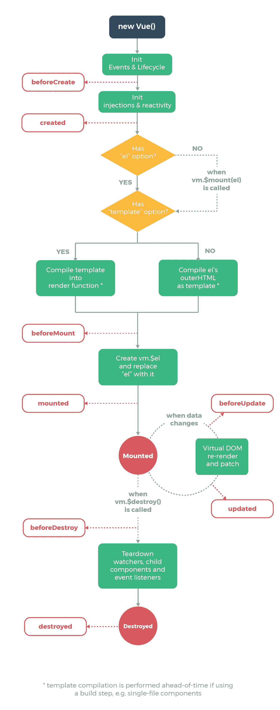

# 在 Nuxt.js 中显示一个加载微调器

> 原文：<https://javascript.plainenglish.io/show-a-loading-spinner-in-nuxt-js-7a5ad0537ebf?source=collection_archive---------2----------------------->

好的，你在你的 Nuxt 应用程序中创建了一个奇妙的动画，它应该在加载后立即开始播放并操作主页的一些打开内容。然而，你的页面内容，在动画开始播放之前应该是隐藏的，现在已经显示出来了。然后它们就消失了，只是在你编程的时候才重新出现。天哪！😱太奇怪了！发生什么事了？

嗯，你可能应该显示一个微调屏幕，只要主页加载，它就会一直持续，这样你的 JavaScript 就可以有足够的时间来呈现你的精彩介绍场景。让我告诉你如何在一个 Nuxt 应用中做到这一点。

# 利用 Vue 生命周期挂钩

Vue 生命周期挂钩是在 Vue 对象生命周期的某个阶段执行的保留方法。从初始化开始到被销毁，对象经历了不同的生命阶段。下面是一个指示挂钩顺序的常用图表:



如上图所示，Vue 有多达 8 个生命周期挂钩，即:

*   创建前
*   创造
*   安装前
*   安装好的
*   更新前
*   更新
*   销毁前
*   破坏

因此，我们可以使用其中一个来简单地解决我们的问题。如果你能猜出，他们中的哪一个能帮助我们实现目标？是啊，你猜对了！`beforeCreate()`😎

> 如果你想了解更多关于 Vue 生命周期挂钩的知识，请查阅👉 [vue 文档](https://vuejs.org/v2/guide/instance.html#Instance-Lifecycle-Hooks)。

实现逻辑很简单:

创建一个组件，并随意命名。在我的例子中，我将它命名为***load spinner . vue***。该组件应该包含 div 元素和 css 代码，用于设置微调器的样式，如下面的代码片段所示。你可以在这里找到其他样品[。](https://csshint.com/css-spinners/)

```
<template>
  <div class="splash-screen">
    <div class="spinner-wrapper">
      <div class="spinner"></div>
    </div>
  </div>
</template>

<style scoped>
.splash-screen {
   background: #f2f0ee;
    width: 100vw;
    height: 100vh;
  position: fixed;
  z-index: 50;    
}

.spinner-wrapper {
  position: absolute;
  left: 50%;
  top: 50%;

  transform: translate(-50%, -50%);
}
.spinner {
  width: 80px;
  height: 80px;
  margin: 100px auto;
  background-color: #e45447;

  border-radius: 100%;
  -webkit-animation: sk-scaleout 1s infinite ease-in-out;
  animation: sk-scaleout 1s infinite ease-in-out;
}

@-webkit-keyframes sk-scaleout {
  0% {
    -webkit-transform: scale(0);
  }
  100% {
    -webkit-transform: scale(1);
    opacity: 0;
  }
}

@keyframes sk-scaleout {
  0% {
    -webkit-transform: scale(0);
    transform: scale(0);
  }
  100% {
    -webkit-transform: scale(1);
    transform: scale(1);
    opacity: 0;
  }
}
</style>
```

打开您的 **/layouts/default.vue** 文件，并将下面的代码片段粘贴到`<script>`标记中。

```
<script>
export default {
  beforeCreate() {
    this.showHideSpinner = true;
  },
  mounted() {
    this.showHideSpinner = false;
  },
  data() {
    return {
      showHideSpinner: true
    };
  }
};
</script>
```

在`data()`方法中，我们初始化一个名为`showHideSpinner`的变量，并将其值设置为`true`。然后，在`beforeCreate()`方法中，我们将`this.showHideSpinner`设置为真。这意味着微调器最初将是可见的，并继续显示，直到调用`mounted()`挂钩，此时`this.showHideSpinner`的值变为`false`，微调器消失。

现在我们已经准备好了脚本，让我们插入组件并传入`v-if="showHideSpinner"`。将以下代码粘贴为容器 div 的第一个子级。

**/布局/默认. vue**

```
<template>
  <div>
    <LoadSpinner v-if="showHideSpinner" />

    //...

    <Nuxt />
  </div>
</template>
```

现在你知道了！享受你剩下的一天。✌

# 结论

需要注意的重要一点是，vue 生命周期挂钩是一个非常强大的工具，我们可以用它来以一种更简单、更容易的方式解决问题。闪屏(可以这么说)是你可以用 Vue 生命周期钩子做的许多不可思议的事情之一。