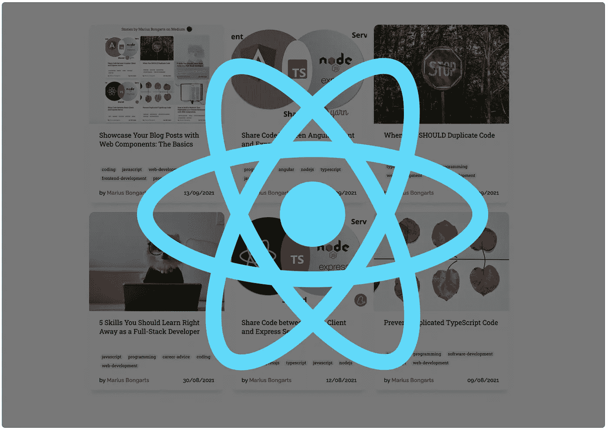
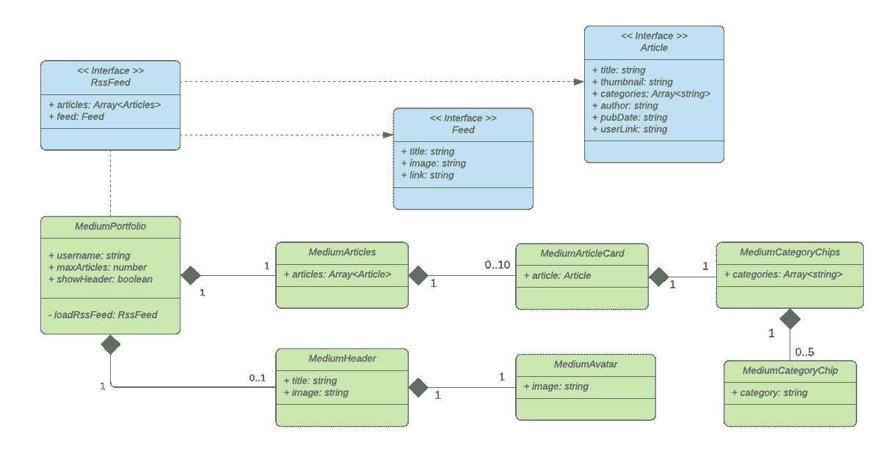
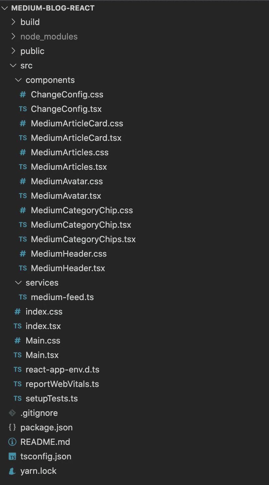
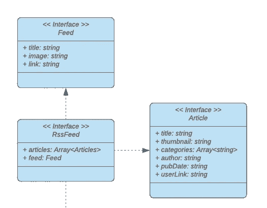
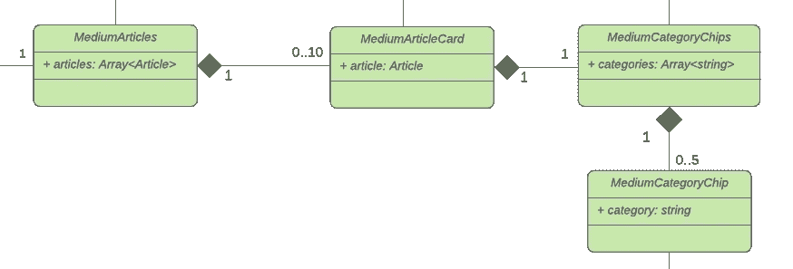
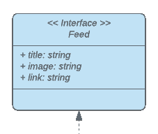

# 用 React 展示你的媒体文章

> 原文：<https://javascript.plainenglish.io/showcase-your-medium-articles-with-react-20a2a4151091?source=collection_archive---------8----------------------->

## 让我们构建一个 React 应用程序，显示任何媒体用户的媒体文章



在本文中，我们将构建一个 React 应用程序，以漂亮的卡片视图展示任何用户的中型文章。看看[的演示](https://mariusbongarts.github.io/medium-portfolio-react/)。如果你想直接看源代码，你会在 [Github](https://github.com/MariusBongarts/medium-portfolio-react) 上找到。

# 体系结构

在我们继续实现中型产品组合的第一个组件之前，我们将更仔细地看看我们的应用程序的**架构**。这个统一建模语言(UML)图定义了我们的应用程序的各个部分。它包含三个接口(蓝色)和七个**反应组件**(绿色)。



Project structure

我们的**入口点**是`Main.tsx`文件中的 *MediumPortfolio* 组件，它获取我们的数据并将其传递给 *MediumArticles* 和 *MediumHeader* 组件。

*MediumArticles* 组件负责通过为每篇文章呈现多达 10 个 *MediumArticleCard* 组件来显示我们的文章。

此外， *MediumCategoryChips* 和 *MediumCategoryChip* 组件以芯片的形式显示多达 5 个类别。此外，我们将在文章上方显示一个带有*媒体变量*的*媒体标题*。

请注意，我为每个组件都创建了一个文件。当然，您可以将这些组件放入一个单独的文件中，但是我喜欢以封装的方式组织我的项目，以保持一个概览。

此外，我们为每个组件创建了一个 CSS 文件。我们也可以使用样式组件。在这种情况下，我决定使用单独的 CSS 文件，因为我们的风格主要是静态的。

那么现在，事不宜迟，让我们深入代码来构建我们的中型投资组合。

# 创建 React 应用

让我们用 Typescript 创建一个 React 应用程序:

```
npx create-react-app my-app — template typescript# oryarn create react-app my-app — template typescript
```

我们现在可以开始构建我们的第一个组件了。

# 入口组件

看看我们的`MediumPortfolio`组件，这是我们应用程序的**入口点**。

Entry component

这里发生了很多事情。让我们一步一步来看。

## 获取数据



我们使用`connectedCallback`通过从`[https://](https://https://medium.com/feed/@mariusbongarts11)medium.com/feed/@mariusbongarts`获取来加载我们的 *RssFeed* 。

这个 URL 以 XML 格式返回任何用户的最近十篇文章。此外，我们使用 [rss2json](https://rss2json.com/) API 获取 json 格式的数据。我们的结果对象包含我们的文章和一个 feed 对象，它为我们提供作者的信息，我们将在我们的标题中显示这些信息。为了有一个到媒体用户的链接，我们将映射我们的*文章*也有一个`userLink`。

Fetching our data

## 属性

为了让我们的产品组合为每个媒体用户服务，我们通过向应用程序传递属性来定制我们的应用程序。在我们的应用程序中，我们允许开发人员定义这三个属性:

*   `username`:从中加载文章的中等用户名
*   `maxArticles`:设置显示文章数量的选项
*   `hideHeader`:隐藏表头组件选项

为了让用户可以定制这些属性，我们还创建了一个 *ChangeConfig* 组件，该组件需要一个包含`username`和`maxArticles`的配置对象。该组件不是体系结构的一部分，因为它不属于应用程序，更多地用于演示目的。组件本身只显示两个简单的输入字段和一个提交按钮:

# 展示文章



有四个组件负责呈现我们的实际文章。*中物品*、*中物品卡*、*中物品卡*和*中物品卡*类。我们的每个组件都需要一些数据，这些数据需要由父元素传递。

让我们来分析一下 *MediumArticles* 组件:

Rendering of the articles

该组件看起来简洁明了。我们接收一组文章，并为每个文章呈现一个`MediumArticleCard`:

Medium article card

# 显示类别筹码

媒体上的每篇文章最多可以有五个标签，它们将在我们的`article`对象中表示为一个`categories`字符串数组。

在我们的`MediumArticleCard`组件中，您可以看到，我们将`categories`传递给我们的`MediumCategoryChips`元素，该元素为数组中的每个字符串呈现一个`MediumCategoryChip`:

Rendering of category chips

Category chip

# 显示标题

我们还想显示一个标题，显示作者的标题和头像。这两个信息都可以从`Feed`界面读取。



为了使我们的应用程序更加灵活，我们允许通过将`hideHeader`属性传递给条目组件来隐藏标题。只要是事实，我们就会隐藏标题。在我们的`main.tsx`文件中，我们可以有条件地呈现我们的`MediumHeader`:

Conditional rendering of the header

现在，我们只需要将所需的属性传递给我们的`MediumHeader`组件，如下所示:

Header component

为了显示用户头像，我们还定义了`MediumAvatar`组件:

我希望你能遵循这些步骤。我总是很乐意回答问题，也乐于接受批评。请随时联系我😊

也可以看看 [Github 库](https://github.com/MariusBongarts/medium-portfolio-react)或者[演示](https://mariusbongarts.github.io/medium-portfolio-react/)。

如果您对 **Web 组件感兴趣，**我创建了一个类似的系列文章，介绍如何使用 Web 组件构建这个应用程序。看一看:

[](/showcase-your-medium-articles-with-web-components-part-1-basics-d2c6618e9482) [## 用 Web 组件构建自己的博客组合:基础

### 第 1 部分—定制元素、阴影 DOM 和 HTML 模板

javascript.plainenglish.io](/showcase-your-medium-articles-with-web-components-part-1-basics-d2c6618e9482) 

如果你对 Web 组件不感兴趣，你一定要去看看。在这篇文章中，我将告诉你为什么:

[](/will-web-components-replace-frontend-frameworks-535891d779ba) [## Web 组件会取代前端框架吗？

### 它们是为解决不同的问题而构建的。

javascript.plainenglish.io](/will-web-components-replace-frontend-frameworks-535891d779ba) 

***关注我不要错过下一篇文章*** 🙏

[**这里是无限制访问介质上每一个内容的链接**](https://medium.com/@mariusbongarts/membership) 。如果你用这个链接注册，我会赚一小笔钱，不需要你额外付费。

[](https://medium.com/@mariusbongarts/membership) [## 通过我的推荐链接加入 Medium-Marius bong arts

### 作为一个媒体会员，你的会员费的一部分会给你阅读的作家，你可以完全接触到每一个故事…

medium.com](https://medium.com/@mariusbongarts/membership) 

# 关于作者

Marius Bongarts 是埃森哲互动公司的软件工程分析师。他还创建了 [Web Highlights 扩展](https://chrome.google.com/webstore/detail/web-highlights-+-bookmark/hldjnlbobkdkghfidgoecgmklcemanhm)，允许用户在标签和目录的帮助下组织文本亮点和书签。

通过**[**LinkedIn**](https://www.linkedin.com/in/marius-bongarts-6b3638171/)**与我联系。****

**[](/when-you-should-duplicate-code-b0d747bc1c67) [## 何时应该复制代码

### 复制比错误的抽象要便宜得多

javascript.plainenglish.io](/when-you-should-duplicate-code-b0d747bc1c67) [](/5-skills-you-dont-get-around-to-learn-as-a-fullstack-developer-409f13c394c7) [## 作为全栈开发人员，你应该马上学会的 5 项技能

### 现在就学习吧，你会后悔错过的

javascript.plainenglish.io](/5-skills-you-dont-get-around-to-learn-as-a-fullstack-developer-409f13c394c7) [](/share-code-between-react-client-and-express-server-5dc0977faa76) [## 在 React 客户端和 Express 服务器之间共享代码

### 用 yarn 工作空间建立一个 mono 存储库

javascript.plainenglish.io](/share-code-between-react-client-and-express-server-5dc0977faa76) 

*更多内容看*[***plain English . io***](http://plainenglish.io/)**