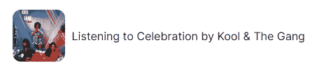
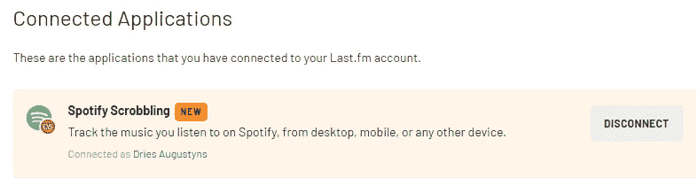
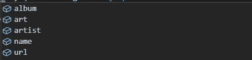

# 使用 use-last-fm React 挂钩显示您的 Spotify 状态

> 原文：<https://javascript.plainenglish.io/showing-your-spotify-status-using-use-last-fm-react-hook-20ce6ba576e2?source=collection_archive---------16----------------------->

好吧！如果你曾经在我听音乐的时候访问过[我的个人网站](https://driaug.com/)，你可能会看到这条弹出的小消息。给你一些我正在听的音乐的实时信息。



今天，我将指导您完成这个设置，这样您就可以将自己的投资组合网站提升到另一个水平！所以，拿起你最喜欢的代码编辑器，让我们开始吧！


Picture by C D-X ([https://unsplash.com/@cdx2](https://unsplash.com/@cdx2))

# 我们需要什么

*   React 项目
*   last.fm API 令牌
*   [使用-最后-调频](https://github.com/alii/use-last-fm/)

## 创建 React 项目

第一步很简单，转到一个现有的 React 项目或者用下面的命令创建一个新的项目！

```
 npx create-react-app last-fm
```

当您在这里时，也安装我们需要的依赖项。我们将使用[阿利斯泰尔·史密斯的“最后使用”挂钩](https://github.com/alii/use-last-fm/)。

```
npm i --save use-last-fm// ORyarn add use-last-fm
```

## 获取 last.fm 令牌

首先，去 [last.fm](https://www.last.fm/) 创建一个账户，如果你还没有的话。
打开账户后，转到“设置”中的“应用程序”标签，打开 Spotify Scrobbling。



现在我们需要做的就是获得您的个人 API 密钥！为此，您需要创建一个新的 API 应用程序。你可以在这里做这个[。](https://www.last.fm/api/authentication)

如果你没有被自动重定向，你可以去[你的 api 账户](https://www.last.fm/api/accounts)，在那里你会找到你的应用程序。继续复制 API 密钥，因为我们将需要它！

# 是时候做出反应了

在你创建了你的 API 账户之后，你就可以开始编写一些很酷的 React 组件了！

如果您已经有了一个想要实现它的 React 项目，那么继续创建一个新的组件。如果你只是来试试的话。进入`App.js`，移除里面的所有东西，并添加以下项目！

首先我们需要导入 use-last-fm。

```
import { useLastFM } from "use-last-fm"
```

现在你需要调用组件内部的钩子。

确保将挂钩的参数更改为您自己的 last.fm 用户名和生成的 API 密钥！

use-last-fm 有一个非常方便的属性叫做`status`，它会根据你的 Spotify 状态而改变。我们使用这个状态属性来显示一条消息或我们正在播放的实际歌曲。

如你所见，我们不需要太多。一个简单的三元运算符就可以完成这项工作！
在这个基本示例中，我们只显示了歌曲名称和艺术家，但是 use-last-fm 给了我们更多的信息！



使用`song`的这 5 个属性，你可以创建非常酷的组件！
您甚至可以制作精美的动画或复活节彩蛋，可能性无穷无尽！

以下是我想到的一些很酷的主意！

*   如果当前歌曲来自您最喜爱的艺术家，则显示一条可爱的消息
*   根据相册封面，更改页面的主要颜色

## 寻找一些有创意的例子？

在这里你可以找到一些很好的利用 use-last-fm 的网站列表！

*   [Dries augustyns](https://driaug.com/)
*   [阿利斯泰尔·史密斯](https://alistair.cloud/)
*   特万·穆德

祝你有创意的一天！💗

*更多内容请看*[***plain English . io***](http://plainenglish.io)