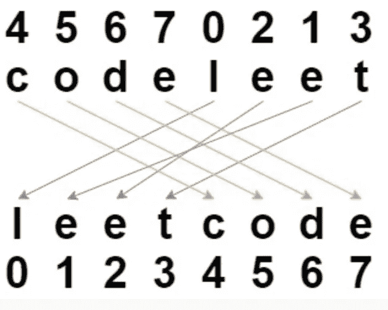
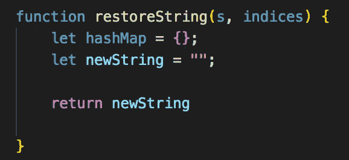
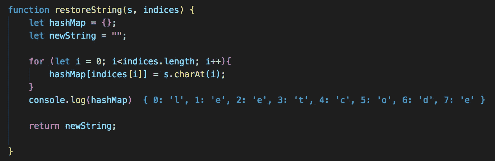
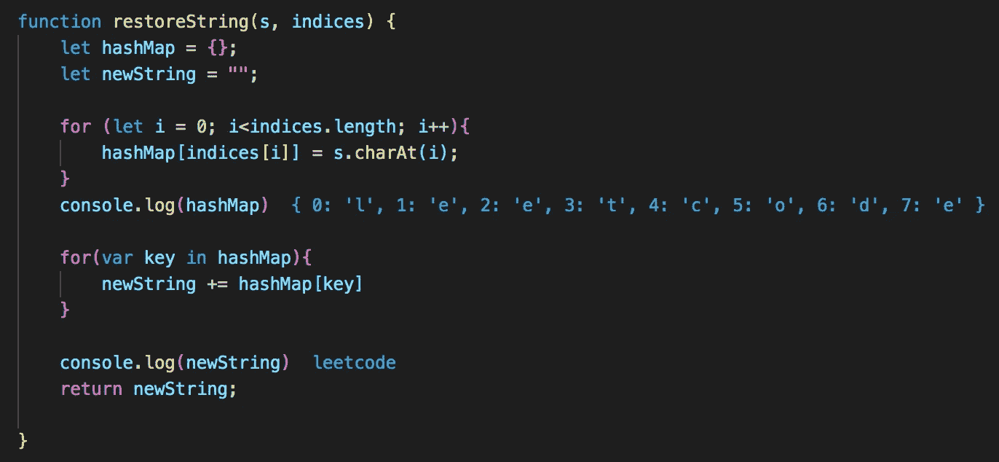

# 混洗字符串:如何使用哈希映射解决

> 原文：<https://javascript.plainenglish.io/shuffle-string-how-to-solve-using-a-hash-map-a1dfc3cdb461?source=collection_archive---------18----------------------->

## 使用哈希映射解决此算法问题的演练。

伙计，我真的开始喜欢哈希图了。

这种感觉很奇怪。就在几个月前，我自己几乎不能解决一个算法问题，更不用说提出一个足够有效的解决方案了。虽然我仍然认识到我需要克服的巨大差距，以达到我作为一名软件开发人员想要达到的目标，但认识到我自我发展中的这些小胜利是很重要的。

这种感觉没有什么不同——反复使用哈希映射迫使我考虑将它作为我最近遇到的大多数算法问题的一个选项，感觉我终于*打开了我大脑的那一侧*真好。

沃伦，祝贺你坚持下去&没有放弃。

足够的积极性——让我们来解决这个洗牌的问题。

Let’s get shuffling

# 问题是

*注意，这个问题在 Leetcode (#1528)上。要直接尝试这个问题，请访问:*[*https://leetcode.com/problems/shuffle-string/*](https://leetcode.com/problems/shuffle-string/)

我们的问题是:

*给定一个字符串 s，和一个长度相同的整数数组下标。字符串 s 将被混洗，使得在第* ***i-*** *位置的字符移动到混洗后的字符串中的索引[i]。返回混洗的字符串。*

嗯，这听起来有点令人困惑——让我们从 Leetcode 中引入一个例子，尝试更好地形象化这个问题。

我们有两个输入，一个字符串和一个整数数组。假设我们的两个输入如下:

输入字符串:" codeleet"
整数数组:[4，5，6，7，0，2，1，3]

那么我们的预期产量是多少呢？让我们重新阅读说明中的下面一行:

*字符串 s 将被混洗，使得在第* ***i-*** *位置的字符移动到混洗后的字符串中的索引[i]。*

这意味着“c”将移至第 4 个索引，“o”将移至第 5 个索引，“d”将移至第 6 个索引，依此类推。

我们的预期输出如下所示:

太好了！既然我们理解了这个问题，我们应该如何处理这个问题呢？

# 方法

所以我们需要以某种方式将我们的字母移动到它们相应的索引中。因为我们已经知道它们应该位于哪个数字和分配的索引，所以我们可以将它们设置为哈希表中的键值对！

1.  实例化一个空散列来存储我们的索引和它们对应的字符
2.  实例化一个新的字符串，在这里我们将按照它们的混合顺序构造新组织的字符串
3.  建立一个 for 循环，它将迭代我们的索引数组的长度，用我们的键值对填充我们的哈希映射——从第零个索引开始
4.  建立第二个 for 循环，通过在 hash 映射中查找键值对来构造我们的字符串
5.  在函数的末尾返回我们新构造的字符串

# 解决方案

我们试一试，一步一步来。

我们的前两步包括实例化一个空散列和新的混洗字符串，我们将在函数结束时返回。很简单！

到目前为止，一切顺利。

我们的下一步是迭代我们的索引输入数组。记住，在这一步中，我们的目标是从第零个索引开始构建散列图。因为我们在字符串输入中有我们的索引和它们对应的字符，所以我们可以将散列的键设置为索引，将它们对应的值设置为字符串输入中的字符。要获取特定索引处的字符串值，我们可以使用 **charAt()** string 方法。

例如，在我们的例子中，s.charAt(0)将返回给我们“c”。

现在让我们构建我们的散列图:

在每次迭代中，我们都将键(索引)设置为输入字符串中相应的值。

正如您在我们的 console.log 中看到的，我们有一个构建得很好的散列映射，它以升序排列我们的键，因此给出了我们想要的结果(“leetcode”)。

我们的最后一步是迭代我们的散列映射，并将我们的值添加到我们的 newString 变量中:

Our final solution

# 结论

现在你知道了！通过使用散列映射，我们可以立即将索引和它们在输入字符串中对应的字符联系在一起。通过对索引数组进行迭代，然后按照索引的顺序构建哈希表&将我们的字母按照它们对应的顺序放置，最终得到我们想要的结果。

虽然散列图是解决这个问题的一种方法，但我很想听听你是如何解决这个问题的！欢迎在下方留言或直接联系我。

下次见。

*更多内容尽在*[plain English . io](http://plainenglish.io/)