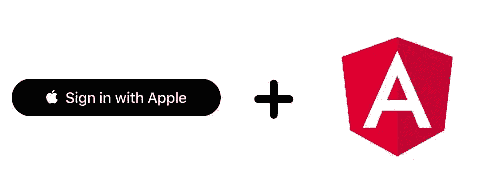
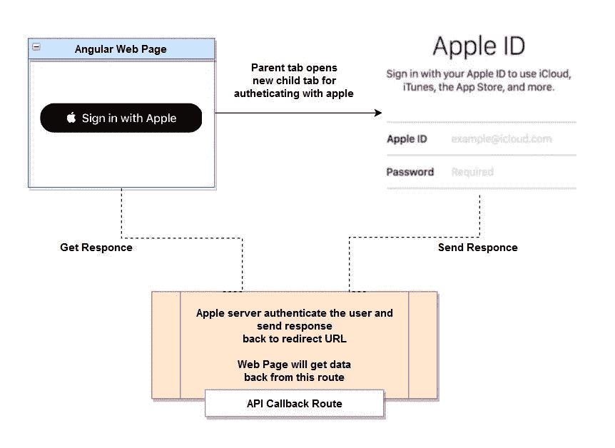

# 在 Angular Web 应用程序中登录 Apple

> 原文：<https://javascript.plainenglish.io/sign-in-with-apple-in-angular-web-app-630a9791e291?source=collection_archive---------1----------------------->



> 如今，大多数网络应用都有社交登录功能。对于最终用户来说，这是一种更方便的向系统进行安全认证的方式。它将把你的网站定义为具有用户友好的和比普通授权更好的。

众所周知，最流行的社交认证是登录谷歌和脸书。而现在，苹果也跳进了这个栈桶，做一个超级酷的第三方授权提供商。

在这篇文章中，我们将介绍使用 Angular/React/Node 或任何 JavaScript 框架登录苹果的集成。

听起来很棒，对吧？让我们开始…

# 登录 Apple 的基本流程是:

1.  [点击“登录苹果”按钮](https://appleid.apple.com/signinwithapple/button)
2.  您的应用程序的当前父选项卡将在新的子选项卡中打开 Apple 的登录页面，浏览器 URL 中的一些元数据将作为查询参数。
3.  用户在使用 Apple 凭证后验证身份，并被重定向回 URL，这是我们导航的父选项卡。
4.  Apple 将发送一个“FORM_POST”请求，其中包含苹果开发者帐户配置中指定的重定向 url 的数据。
5.  用户完成并验证其网站的注册流程。现在，您可以将下一个请求应用到授权用户的流程中。

> **在此，我附上上述步骤的简单流程图说明:**



Basic Diagram of Sign In With Apple

> 在深入研究代码结构之前，首先我们需要在 Apple developer 帐户上配置我们的应用程序，从那里，我们将获得构建 URL 所需的元数据。

**来自苹果开发者账户的必需元数据:**

1.  **客户端 ID:** 我们将从服务 ID 配置中获取它作为标识符值。示例:“com.myapp.bundle.backend”
2.  **重定向 URL:** 这是我们将在 Web 身份验证配置设置→网站 URL→返回/重定向 URL 中添加的 URL。例如:https://www.abc.com/api/auth-apple-signin

# **获取元数据需要执行的步骤:**

*   首先，[登录苹果开发者账户](https://www.google.co.in/url?sa=t&rct=j&q=&esrc=s&source=web&cd=&cad=rja&uact=8&ved=2ahUKEwigkYn26LzwAhXFX3wKHcgUA3EQFjAAegQIAxAE&url=https%3A%2F%2Fdeveloper.apple.com%2F&usg=AOvVaw1qN8yLk7zDjnuzW8OlcbLm)，点击证书、标识符和个人资料。
*   从边栏中，选择标识符，然后单击蓝色加号图标。
*   在第一步中选择**应用 id**。
*   选择 platform 作为“iOS”，在 description 中输入一些描述性的词语，然后选择 Bundle ID:“Explicit”并输入值，如下例所示。“com . myapp . bundle”→用您的 app_name 替换 myapp 文本。
*   现在向下滚动，选中“登录苹果”旁边的框。
*   确认并转到配置下一步，即**服务 id。**
*   输入描述，并在“标识符”字段中输入“com.myapp.bundle.backend ”,同时选中“使用 Apple 登录”复选框，然后单击“配置”。
*   现在，您进入了 Web 身份验证配置屏幕，您必须从主要应用 ID 中选择您的应用(确保您选择的是以您的应用名称开头的应用)。
*   在您将向苹果服务器发送请求的网站 URL 中输入域/子域(您可以添加多个 URL；不要添加本地主机或 IP 地址，因为这是不允许的，例如:https://www.abc.com/)。
*   输入重定向网址，苹果将在认证用户后发送回响应。例如:https://www.abc.com/api/auth-apple-signin

> 我们已经完成了配置并获得了所需的元数据，现在让我们深入研究代码。

*   在第一步中，我们需要构建由 Apple 提供的 URL，并对其进行重定向，以便用户可以在那里输入 Apple 凭据:
*   网址:【https://appleid.apple.com/auth/authorize /QUERY _ PARAMS
*   我们需要附加一些元数据作为查询参数，这样苹果服务器就可以从这些数据中验证我们的请求。

```
Meta Data :client_id -> com.myapp.bundle.backendredirect_uri -> [https://www.abc.com/api/auth-apple-signin](https://www.abc.com/api/auth-apple-signin) 
response_type -> Type of response we want from apple

scope -> Required user’s data back after authenticate with apple

response_mode -> form_post ( Type format of response )
```

*   [点击此处阅读更多查询参数](https://developer.apple.com/documentation/sign_in_with_apple/sign_in_with_apple_js/incorporating_sign_in_with_apple_into_other_platforms#3332113)。
*   [点击这里阅读更多关于苹果文档](https://developer.apple.com/documentation/sign_in_with_apple/sign_in_with_apple_js/incorporating_sign_in_with_apple_into_other_platforms)中描述的登录过程。

JavaScript Code

> 苹果会将数据发送回 redirect_uri，并在后端处理。因此，问题是我们如何将这些数据传递给 Angular，以便我们的应用程序可以进行下一步操作？为了解决这个问题，我们需要应用一些自定义的东西。

*   [**window . open(' URL ')**](https://developer.mozilla.org/en-US/docs/Web/API/Window/open)**:**此方法用于从当前父标签页打开一个新的子标签页。
*   [**window . addevent listener(' message ')**](https://developer.mozilla.org/en-US/docs/Web/API/EventTarget/addEventListener)**:**该方法将激活父选项卡中等待数据的监听器，因此当我们在 redirect_uri 中从 Apple 获取数据时，在此之后，该数据将作为 API 的响应作为消息事件发送回该监听器。
*   **jwthelper . decodetoken(event . data . id _ token):**解码此令牌将提供用户的数据，包括电子邮件、订阅、过期时间。
*   电子邮件可以显示/隐藏，因为苹果为用户提供了隐私选项。因此，为了验证用户的身份，我们使用 **sub** 的值，因为它是恒定的和唯一的。

## **谨记:**

1.  当用户第一次仅以数据形式登录时，Apple 将发送用户的名字和姓氏。因此，我们需要检查这个对象→ event.data.user
2.  从' [@auth0/angular-jwt](http://twitter.com/auth0/angular-jwt) 导入{ JwtHelperService }→使用此 jwt 帮助器解码令牌并从中获取值。

> 现在，让我们创建一个 API 路由来处理来自苹果的请求。

Node API Code

*   API 路由将与我们在 redirect_uri 值中提供的相同。
*   目前，用户在 Apple 登录的子选项卡上，我们的父选项卡正在等待/监听事件以获取数据。
*   我们需要将响应作为脚本标记和 [**window.opener**](https://developer.mozilla.org/en-US/docs/Web/API/Window/opener) 方法进行传递，检查子选项卡是否打开，然后使用[**window . close**](https://developer.mozilla.org/en-US/docs/Web/API/Window/close)**方法关闭它，并导航回父选项卡，为监听事件提供数据。**
*   **[**【window . opener . postmessage(data，parent _ URL)**](https://developer.mozilla.org/en-US/docs/Web/API/Window/postMessage)**:**该方法触发 web-app 上的‘message’事件并提供数据。**
*   **API 将在 req.body 中获取数据，因为我们已经将查询参数 response_mode: form_post 传递给了 Apple。**

**在事件中成功检索数据后，您可以根据请求应用下一个操作。**

**如果你觉得这个教程对于将苹果登录整合到 Angular 应用中很有用，请留下一些掌声来支持它。**

***吃>睡>码>重复***

**谢谢大家！**

***更多内容请看*[*plain English . io*](http://plainenglish.io/)**