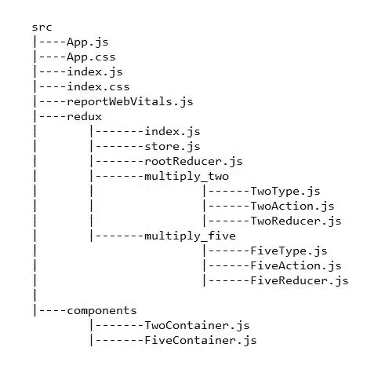

# 如何在 Redux 和 React 中使用 combineReducers()

> 原文：<https://javascript.plainenglish.io/simple-application-of-redux-combinereducers-in-react-6ac3bbeabc4a?source=collection_archive---------0----------------------->


[https://waftengine.org/public/blog/1B5EE4D5D773F8A-RR.jpg](https://waftengine.org/public/blog/1B5EE4D5D773F8A-RR.jpg)

在本文中，我们将创建一个简单的 react 应用程序，其中我们将使用 redux 进行状态管理。该应用程序的最终外观如下所示—

在本练习中，我们将使用`redux`库的`combineReducers()`，它将多个减速器组合成一个减速器。

根据官方的[文档](https://redux.js.org/api/combinereducers)，随着我们的应用程序增长并变得更加复杂，我们可以有多个 reducers，每个管理状态的独立部分。`combineReducers()`辅助函数将一个值为不同减函数的对象转换成一个我们可以传递给`createStore()`的减函数。

# 初始设置

首先，我们已经确保 Node.js 安装在我们的系统中。如果是这样，我们将创建一个名为 **React_Projects** 的目录，然后，我们将打开终端并导航到该目录。在那里，我们将运行以下命令—

```
npx create-react-app myapp
```

然后我们运行下面的命令来安装`redux`和`react-redux`。

```
npm install redux react-redux
```

`redux`是一个状态管理库。

并且，`react-redux`帮助连接 react 与 redux。

# 程序

这个项目的`src`目录如下所示



## **第一步**

首先，我们将为我们的应用程序设置 redux 存储。为此，我们将在`src`中创建一个名为`redux`的目录。

因为，我们将有两个 reducers 来处理这两种状态，这就是为什么我们将在`redux`目录中创建两个目录。

## **第二步**

`redux`目录中的第一个目录将是`multiply_two`。在这个目录中，有三个文件，如下所示

## **第三步**

`redux`目录内的第二个目录将是`multiply_five`。在这个目录中，也有下面给出的三个文件—

## **第四步**

现在，我们将在`rootReducer.js`文件中组合两个减速器。

在上面的代码中，`combineReducers()`方法接受一个对象，它的键可以是我们想要提供的任何名称，值是 reducer 函数。

## **第五步**

现在，我们将在`store.js`文件中创建 redux 存储。

## **第六步**

在这一步，我们将创建一个文件`index.js`，它将导出两个动作创建函数，即。`multiplyTwo`和`multiplyFive`。

## **第七步**

现在，我们将在`src`目录中创建一个`components`目录，其中将包含两个将被渲染的组件。

第一个组件是`TwoContainer.js`，其代码如下—

第二个组件是`FiveContainer.js`，其代码如下—

在上面的代码中，`mapStateToProps`函数有以下语句—

`val_two: state.two.val_two`和`val_five: state.five.val_five`。

以上两个语句都是一个键-值对，值引用状态的键`two`和`five`，在`rootReducer.js`中定义。

## **第 8 步**

最后，我们将修改`App.js`文件，如下所示

现在，我们的练习已经完成，我们可以运行开发服务器并检查结果。

所有的代码也可以在我的 GitHub 库中找到，可以通过下面的链接获得

[](https://github.com/souvik-pl/react_redux_combineReducers) [## sou vik-pl/react _ redux _ combine reducers

### 在 GitHub 上创建一个帐户，为 sou vik-pl/react _ redux _ combineReducers 的开发做出贡献。

github.com](https://github.com/souvik-pl/react_redux_combineReducers) 

## 参考

[https://redux.js.org/api/combinereducers](https://redux.js.org/api/combinereducers)

文件—联合收割机减速器