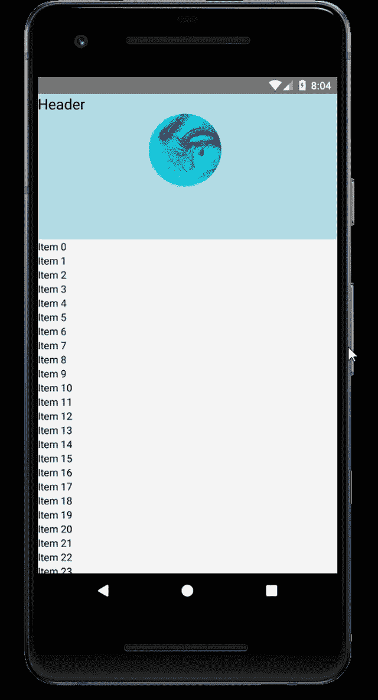
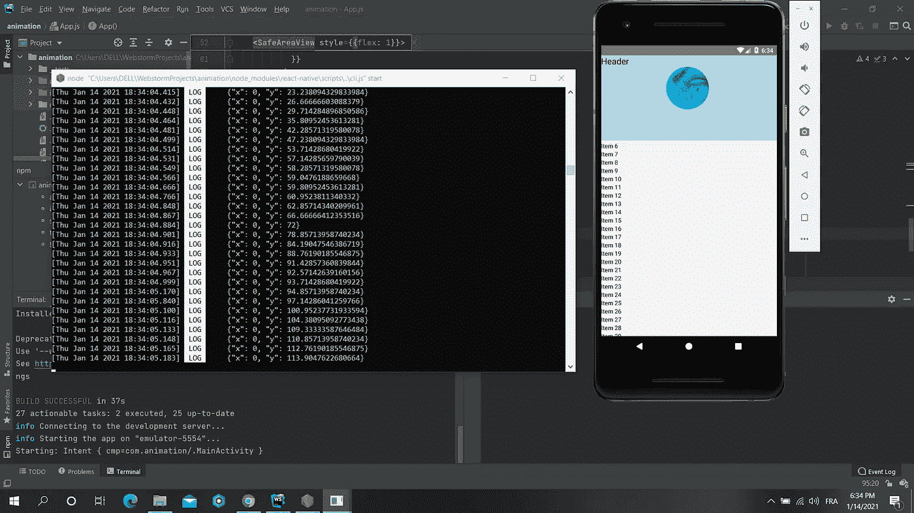
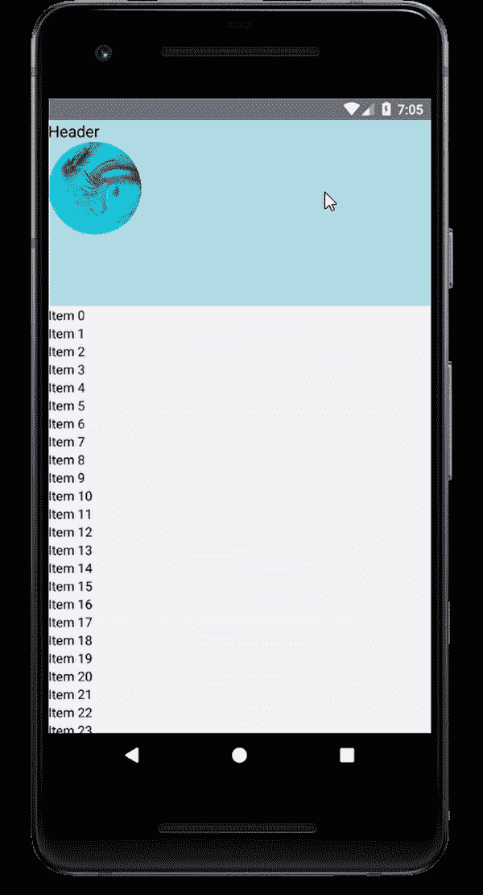

# 使用 React Native 简单折叠标题动画

> 原文：<https://javascript.plainenglish.io/simple-collapsing-header-animation-using-react-native-21f4c26b2222?source=collection_archive---------0----------------------->

动画对于创造良好的用户体验是非常重要的，它们允许你在界面中传达真实可信的动作。

这个库的设计目的是让动画流畅、强大，并且易于构建和维护。`Animated`关注输入和输出之间的声明性关系，它们之间的可配置转换，以及控制基于时间的动画执行的`start` / `stop`方法。

今天，我们把重点放在动画我们的头组件，以最终实现以下结果:



Final result

让我们深入研究一下。首先，我们必须创建我们的项目

```
$ react-native init animation
```

初始化我们的项目后，我们需要使用 React Native 提供的`Animated API`。

首先，我们创建我们的视图:

定义视图后，我们需要从 react-native 导入`Animated`。`Animated`模块为我们提供了动画视图的必要工具:

*   动画。视角
*   动画。滚动视图
*   动画。图像
*   动画。文本
*   …

在我们了解了动画库的基本组件后，我们可以直接开始制作动画了。

首先，我们必须将我们的视图、ScrollView 等转换成一些动画组件。

```
<ScrollView>...</ScrollView> => <Animated.ScrollView>...</Animated.ScrollView>
```

然后，我们需要把我们的滚动位置放在不受组件重新渲染影响的地方，这里我们最好的选择是“ref”。

```
import React, {useRef} from 'react'const scrollPosition = useRef(new ***Animated***.*Value*(0)).current;
```

在设置了“scrollPosition”之后，现在我们应该在滚动时以编程方式更改它。我们应该编写以下代码来访问本机滚动位置:

```
<Animated.ScrollView
  onScroll={***Animated***.event(
    [{nativeEvent: {contentOffset: {y: scrollPosition}}}],
    {useNativeDriver: false},
  )}
  contentInsetAdjustmentBehavior="automatic"
  style={[styles.scrollView]}>
...
</Animated.ScrollView>
```

正如我们看到的滚动，我们将滚动偏移量记录到终端中:



Scroll position output

现在，我们已经完成了基础工作。移动到动画我们的标题的高度。首先，我们必须定义一个最小高度，这样我们的标题视图就不会超过 0 高度而折叠…

```
const minHeaderHeight = 70
const maxHeaderHeight = 200
```

现在我们应该定义我们正在制作动画的标题的高度:

```
const headerHeight = scrollPosition.interpolate({
  inputRange: [0, 500],
  outputRange: [maxHeaderHeight, minHeaderHeight],
  extrapolate: 'clamp',
});
```

这里的输入范围是我们提供的滚动位置，输出范围是我们期望的输出。请注意，输入范围和输出范围数组必须具有相同的长度。

我们应该有这样的输出:



我们可以做同样的事情来制作字体大小、图像高度、文本不透明度和图像位置的动画。

注意，我们可以使用 react-native 中的 Dimensions API 来获取动态大小。

```
const opacity = scrollPosition.interpolate({
  inputRange: [0, 100, 200],
  outputRange: [1, 0.5, 0],
  extrapolate: 'clamp',
});
const size = scrollPosition.interpolate({
  inputRange: [0, 100, 200, 300, 400],
  outputRange: [20, 17, 15, 13, 11],
  extrapolate: 'clamp',
});
const imageHeight = scrollPosition.interpolate({
  inputRange: [0, 400],
  outputRange: [100, 50],
  extrapolateLeft: 'identity',
  extrapolateRight: 'clamp',
});
const imagePosition = scrollPosition.interpolate({
  inputRange: [0, 400],
  outputRange: [(37 * ***Dimensions***.get('window').width) / 100, 0],
  extrapolateLeft: 'identity',
  extrapolateRight: 'clamp',
});
```

最终的代码应该是这样的。这是我们可以使用 react-native 挖掘动画的最基本的例子。

Final code portion

编码快乐！