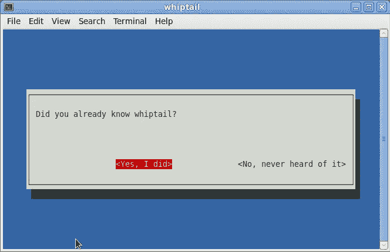

# Linux 中的简单命令会让你感觉像个专家

> 原文：<https://javascript.plainenglish.io/simple-commands-in-linux-that-will-make-you-feel-like-a-pro-1407ed928e6c?source=collection_archive---------6----------------------->

## Linux 操作系统

## 如果您知道在终端中输入的基本命令，那么您在使用 Linux 操作系统时会更加舒适和自信。


Photo by [Arthur Reeder](https://unsplash.com/@arthurreeder?utm_source=unsplash&utm_medium=referral&utm_content=creditCopyText) on [Unsplash](https://unsplash.com/s/photos/linux?utm_source=unsplash&utm_medium=referral&utm_content=creditCopyText)

Linux 是一个非常流行和有趣的操作系统(OS)，尤其是对程序员来说。Linux 终端是 Linux 操作系统的一个非常重要的部分。这意味着，如果您知道在终端中输入的基本命令，您在使用这个操作系统时会更加舒适和自信。

有这么多关于 Linux 的信息和这么多的课程。但是几乎没有人能给你列出最流行和最有用的命令，除了像`ls`和`cd`这样众所周知的命令。我自己也使用其中的一些命令；我无法想象没有他们的程序员的生活。

## 1.触控

[Touch](https://man7.org/linux/man-pages/man1/touch.1.html) 是最简单的命令之一，可以帮助你在当前目录下创建一个新的空文件(你也可以创建一堆文件)。

```
touch file.txt
```


## 2.基拉耳

如果你有一台运行缓慢的电脑，或者只想终止所有干扰你工作的正在运行的进程，使用这个[命令](https://man7.org/linux/man-pages/man1/killall.1.html):

```
killall Notes
```

但是你要记住，它会删除任何数据，不会让任何应用程序保存它。默认情况下，killall 命令区分大小写。但是您可以使用-I 选项来忽略这种情况。

```
killall -I notes
```


## 3.锝

使用[流量控制](https://man7.org/linux/man-pages/man8/tc.8.html)命令，您可以在 Linux 操作系统内部操纵网络流量。使用`tc`的一个常见例子是对网络连接应用一些数据包延迟。有了`tc`，你可以操纵传入和传出的数据包来应用延迟之类的东西，甚至完全丢弃一定数量的数据包。让我们来看一个相对简单的例子，我们对自己的网络连接应用延迟。这是我在谷歌的 ping:

```
pi@raspberry:~ $ ping 8.8.8.8
PING 8.8.8.8 (8.8.8.8) 56(84) bytes of data.
64 bytes from 8.8.8.8: icmp_seq=1 ttl=117 time=13.6 ms
64 bytes from 8.8.8.8: icmp_seq=2 ttl=117 time=10.9 ms
64 bytes from 8.8.8.8: icmp_seq=3 ttl=117 time=15.5 ms
64 bytes from 8.8.8.8: icmp_seq=4 ttl=117 time=13.8 ms
```

让我们用`tc`诱导 100 毫秒的延迟:

```
sudo tc qdisc add dev eth0 root netem delay 100mspi@raspberry:~ $ ping 8.8.8.8
PING 8.8.8.8 (8.8.8.8) 56(84) bytes of data.
64 bytes from 8.8.8.8: icmp_seq=1 ttl=117 time=110 ms
64 bytes from 8.8.8.8: icmp_seq=2 ttl=117 time=116 ms
64 bytes from 8.8.8.8: icmp_seq=3 ttl=117 time=119 ms
64 bytes from 8.8.8.8: icmp_seq=4 ttl=117 time=113 ms
```

## 4.足球俱乐部（Football Club）

假设您想要编辑刚刚发出的一个非常长的命令。使用终端将需要一些努力。`fc` [命令](https://man7.org/linux/man-pages/man1/fc.1p.html)解决了这个问题。

在下面的例子中，我运行了一个有拼写错误的`curl`命令。所以我运行了`fc`命令。前面的命令`curl`，在编辑器中打开；我修复了命令并保存了文件。然后`curl`命令带着结果再次运行。

## 5.长尾蜥

`whiptail`是[命令](https://www.redhat.com/sysadmin/use-whiptail)，创建一个精彩的弹出消息。这是一个方便的单一用途的实用程序，用于在终端内部显示对话框。

```
whiptail --yesno "Did you already know whiptail?" 40 150
```



`whiptail`有多种不同的显示和输入供您选择:

*   **消息框**
*   **文本输入框**
*   **密码输入框**
*   **是或否选择**
*   **清单**

## 6.乌梅

`uname` [获取](https://man7.org/linux/man-pages/man2/oldolduname.2.html)我们当前使用的操作系统的 Linux 版本相关信息。你可以使用`-s`、`-r`、`-v`、`-n`让终端准确显示你要找的东西。

```
uname -s
```


## 7.碎片

你通常如何删除文件？你用`rm`吗？如果该文件中有任何敏感数据，您可能要三思而后行，不要使用`rm`来处理这类事情。这就是`shred`的用武之地。这个小小的[实用程序](https://man7.org/linux/man-pages/man1/shred.1.html)将通过多次在文件顶部写入随机数据来安全地擦除文件*。*

```
*shred -u file.txt*
```

**

## *8.附录(Postscript)*

*`ps` [显示](https://man7.org/linux/man-pages/man1/ps.1.html)关于活动进程选择的信息。*

```
*ps -A*
```

**

## *9.回声*

*`echo` [在终端中显示](https://linux.die.net/man/1/echo)一行文本或你想要的任何内容(就像打印功能一样)。*

```
*echo -e "Geeks \vfor \vGeeks"*
```

**

# *10.海平面*

*是最有趣的命令之一，这也是我把它留到最后的原因。*

```
*brew install sl*
```

*你会得到这样的结果:*

**

*现在输入`sl -F`，看它飞起来。*

## *结论*

*感谢阅读我的文章。Linux 有很多不同的命令。然而，我试图找到十个最好的和最方便的，将使你成为使用操作系统的专家。希望这些命令能让你在使用操作系统时有更愉快的体验。*