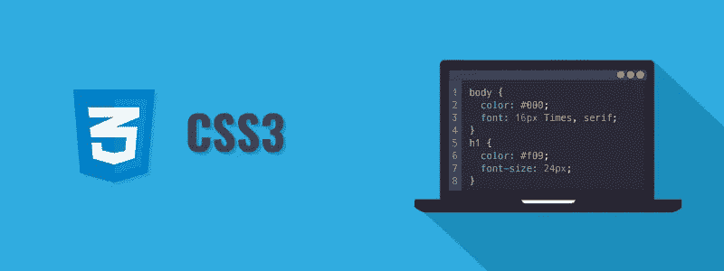

# 简单的 CSS 黑客来减少页面加载时间

> 原文：<https://javascript.plainenglish.io/simple-css-hack-to-reduce-page-load-time-366f7aaaa3be?source=collection_archive---------0----------------------->

## 减少 CSS 对页面加载时间影响的简单方法

[Technofunnel](http://technofunnel.net/) 发表了另一篇文章来帮助指导你**如何通过在 HTML** 中应用一个简单的技巧来减少页面加载时间。

每个人都希望自己的页面加载得更快。这也有助于提供更好的 SEO 性能。让我们看看如何通过**对 CSS** 做一些改变来减少页面加载时间。

Reduce Page Load time with Simple CSS Hack

# CSS 对页面加载时间的影响

CSS 是影响页面加载时间的主要因素之一。每当应用程序遇到 CSS 文件时，它会优先加载 CSS。在 CSS 的基础上，创建了 **CSS 对象模型(CSSOM)** 。一旦创建了 CSSOM，它就会与 DOM 树结合起来创建一个“渲染树”。渲染树是在 DOM 树与 CSSOM 合并时创建的，它为页面上的所有组件提供了正确的样式。

应用程序中的 CSS 数量越多，创建 CSSOM 并将其与 DOM 合并以创建渲染树所需的时间就越长。

一旦 HTML 遇到一个 CSS 文件，它就等待下载该文件并创建 CSSOM。解析器等待这个操作完成。因此，CSS 被称为渲染阻塞。

# 使用非阻塞 CSS

为了解决这个问题，我们可以简单地使用 hack 并提高应用程序的性能。我们希望浏览器不要在初始页面加载期间等待 CSS 下载和 CSSOM 创建。

我们可以**延迟非关键 CSS 资源的 CSSOM 创建**。让我们想象一下，我们有一些 CSS 将被应用到某个项目，该项目将只在初始页面加载后显示。因此，我们不需要让页面加载等待 CSS 被下载和解析。

上面的代码指定 CSS 的**“media”值为“print”**，这意味着 CSS 最初不会被应用，而将在用户试图打印页面时被应用。除了链接之外，我们还添加了“onload”功能，即一旦页面被加载，**将“media”类型更改为“all”，**使其可用于所有媒体类型。

这发生在页面加载时，因此页面不等待 CSS 加载和 CSSOM 创建。这使得页面加载速度更快。

*   ***** 属性“media='print '”应该只应用于那些在页面初始加载期间没有任何影响的 CSS 元素。页面加载到屏幕上时所需的样式不能有“media='print '”。

*更多内容请看*[***plain English . io***](http://plainenglish.io/)