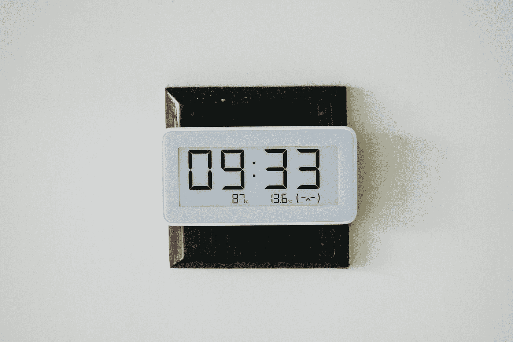
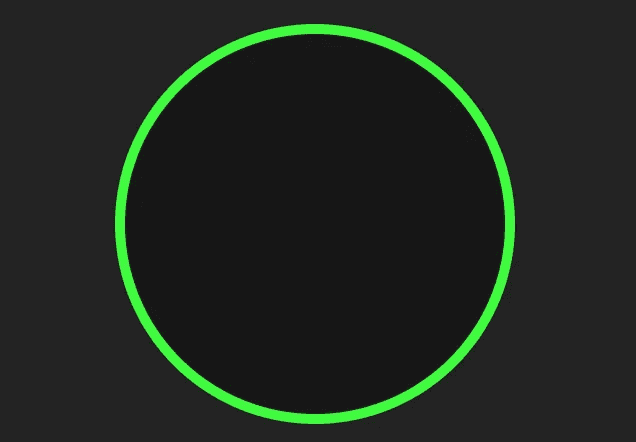

# 使用普通 JavaScript 的简单数字时钟

> 原文：<https://javascript.plainenglish.io/simple-digital-clock-using-vanilla-javascript-7372ecc28bcc?source=collection_archive---------9----------------------->

## 让我们用普通的 JavaScript 构建一个数字时钟。



Photo by [Macro. jr](https://unsplash.com/@macrojr?utm_source=medium&utm_medium=referral) on [Unsplash](https://unsplash.com?utm_source=medium&utm_medium=referral)

# 介绍

如果你是初学者，并且想实践你的知识，数字钟可以是一个很好的尝试。你可以给这个数字钟增加额外的功能，让它变得尽可能复杂。

这是我在 100 天项目挑战中尝试过的日常项目之一，我每天都做一个简单的项目。在尝试这个项目之前，你需要有 HTML，CSS 和 JavaScript 的基本知识。所以让我们开始吧。

# 项目演示

Digital clock.

如您所见，这并不复杂。这只是一个简单的网络数字时钟，以小时、分钟和秒显示时间。它还有一个简单的动画，每秒钟改变时钟边框的颜色。

# 让我们从 HTML 开始

在 HTML 中，我们将在主体中创建一个 div，它有一个类`container`并包含一个元素`h1`，我们将在其中放置时间。

这里有一个例子:

```
<body> <div class="container">
    <h1></h1>
  </div></body>
```

这就是 HTML，现在我们只需要样式化我们的元素。

# 让我们来设计我们的元素

所以现在，我们将使用 CSS 样式化我们的元素。您可以阅读下面的代码来查看我们的样式表。

```
*{
    margin: 0;
    padding: 0;
    box-sizing: border-box;
    font-family: sans-serif;
}
body{
    display: flex;
    align-items: center;
    justify-content: center;
    height: 100vh;
    background: rgb(36, 35, 35);
    color: rgb(63, 252, 63);
}
.container{
    width: 400px;
    height: 400px;
    background: rgb(22, 22, 22);
    display: flex;
    align-items: center;
    justify-content: center;
    border-radius: 50%;
    border:  rgb(63, 252, 63) 10px solid;
}/* Creating the class for our animation which we will add after in JavaScript.
.animate{
    border:  rgb(245, 39, 32) 10px solid;
}/* Styling the time */
.container h1{
    font-weight: 900;
    font-size: 60px;
}
```

*输出:*



The output of HTML and CSS code.

# JavaScript 部分

现在，这是令人兴奋的部分，将使我们的时钟功能。在我们的 JavaScript 逻辑中，我们将首先选择具有类`container`和元素`h1`的 div。

之后，我们将创建一个名为`clock`的函数，在这里我们将使用对象`Date`来获取小时、分钟和秒钟。然后我们将它们添加到属性为`innerHTML`的`h1`中。我们还将切换我们在 CSS 中创建的类`animate`，以便创建一个改变时钟边框颜色的动画。

以下是 JavaScript 代码:

```
// Selecting elements.
const container = document.querySelector('.container');
const h1 = document.querySelector('.container h1');// The clock function.
const clock = () =>**{**
    //   Accessing the date object.
    const date = new **Date()**;
    let hours = date.getHours();
    let minutes = date.getMinutes();
    let secondes = date.getSeconds(); //   Adding a zero to the left of the time if it's less or equal   than 9.
    if(+hours <= 9){
        hours = '0'+ hours;
    }else if(+minutes <= 9){
        minutes = '0'+ minutes;
    }else if(+secondes <= 9){
        secondes = '0'+ secondes;
    }
    // adding the time to the h1 element.
    h1.innerHTML = hours + ':' + minutes + ':' + secondes;

    //Toggling the animate class.
    container.classList.toggle('animate');
**}**// calling the clock function after each second(1000ms).
setInterval(clock, 1000);
```

您还会注意到，我们添加了一个计时函数`setInterval`，它将在每 1 秒(1000 毫秒)后调用时钟函数，以便更新时间并保持切换类`animate`。

现在恭喜你，你已经用普通的 JavaScript 轻松地创建了一个简单的数字时钟。

# 结论

成为一名优秀的开发人员的最好方法是实践你所学到的东西。熟能生巧。构建一个 JavaScript 项目将帮助你练习和提高你的编码技能。

感谢您阅读本文，希望您觉得有用。如果有，通过 [**订阅我们的 YouTube 频道**](https://www.youtube.com/channel/UCtipWUghju290NWcn8jhyAw?sub_confirmation=true) **获取更多类似内容！**

# 更多阅读

[](https://medium.com/javascript-in-plain-english/7-useful-chrome-extensions-for-web-developers-491ed32ea619) [## 7 个对网络开发者有用的 Chrome 扩展

### 令人敬畏的浏览器扩展，以提高您的生产力。

medium.com](https://medium.com/javascript-in-plain-english/7-useful-chrome-extensions-for-web-developers-491ed32ea619)