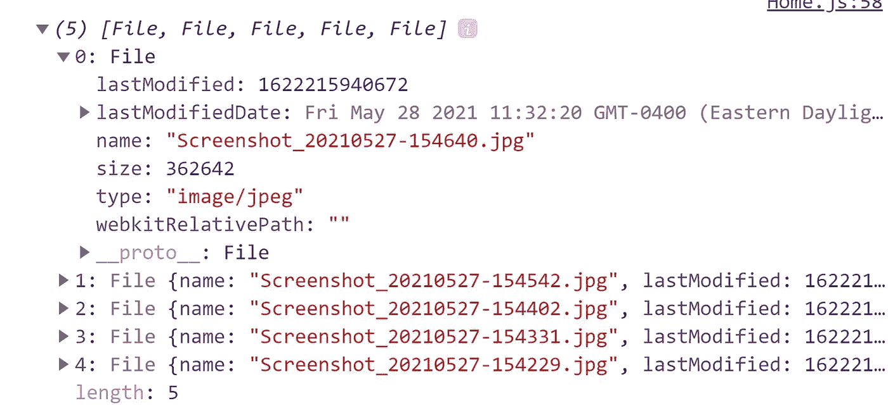

# 在 React 中为我们建立一个上传表单，他们说，这将是有趣的，他们说

> 原文：<https://javascript.plainenglish.io/simple-file-uploading-with-react-hooks-fe89c225db57?source=collection_archive---------10----------------------->

## 如何以简单的方式使用 React 钩子上传文件？

如果你以前用 JavaScript 处理过文件上传，你可能会遇到一些小问题。尽管实现起来并不难，但是处理文件仍然需要你对 Web API 有一些基本的了解，特别是对[文件](https://developer.mozilla.org/en-US/docs/Web/API/File)和[文件列表](https://developer.mozilla.org/en-US/docs/Web/API/FileList)对象。本文旨在通过以一种易于理解的方式解释文件附件过程来缓解您可能有的任何问题。

除了介绍基础知识，我还将介绍一些巧妙的技巧，这些技巧增加了浏览器不提供的额外功能。我将介绍的两个特性如下。

附:如果你喜欢这个故事，可以在 https://danielzuzevich.io/blog[的我自己的网站上查看我的一些文章。](https://danielzuzevich.io/blog)

想找 JavaScript 导师/导师？在 https://danielzuzevich.io/contact[联系我](https://danielzuzevich.io/contact)

## 删除

默认情况下，除了附加新文件或刷新浏览器之外，没有其他方法可以删除已附加的文件。

## 附加

默认情况下，每当您附加文件时，以前附加的文件都会被删除。我们将构建一个选项来保留以前附加的文件，同时添加新的文件。

我们将通过绕过浏览器创建的[文件列表](https://developer.mozilla.org/en-US/docs/Web/API/FileList)对象，并使用我们自己的自定义[数组](https://developer.mozilla.org/en-US/docs/Web/JavaScript/Reference/Global_Objects/Array)来实现这两个特性。但是在我们掉进兔子洞之前，让我们先看看我们正在建造什么。

# 我们正在建造的东西

我们将建立一个表单，允许用户通过按下按钮，或通过拖放附加文件。一旦附加了任何文件，我们将在页面左侧的列表中显示它们。每个文件将显示在它自己的一行，也可以通过一个“x”图标删除。请快速浏览下面的截图，让自己适应一下，然后让我们开始吧。

# 设置骨骼

为了简洁起见，我们将使用已经包含的所有样式来定义组件的框架。这样做可以让我们更关注 React 代码，而不是 CSS，这不是本教程的重点。在下面的代码片段中，你会注意到一些 HTML 元素的样式还没有包含在我们的 JSX 代码中。不要担心，我们将在本教程的过程中添加这些元素。

CSS 相对容易理解，所以请不要让它阻止你阅读教程的其余部分。你会学到很多东西。

希望在看到上面的截图和代码片段后，事情现在开始有意义了。现在我们的框架已经就绪，我们可以开始处理文件附件过程了。

# 通过点击附加文件

为了通过点击接受文件附件，我们必须在代码中包含 HTML 元素`<input type="file" />`。默认情况下，此[输入元素](https://developer.mozilla.org/en-US/docs/Web/HTML/Element/input/file)附带零样式。为了确保这个元素不会干扰我们当前的 UI，我们将使用一些基本的 CSS 来隐藏它。即使元素将被隐藏，**我们仍然必须与它进行交互**。

不幸的是，浏览器没有公开类似于`openFileAttachmentWindow` ( *这将是很棒的*)的神奇功能来处理文件附件，动作仍然需要由`<input type="file" />`元素触发。幸运的是，有一种简单的方法可以通过使用`useRef` React 钩子来控制元素。通过将 ref 附加到隐藏的 input 元素，我们可以从我们自己的**按钮手动触发对它的点击，这将显示文件附件窗口。**

如果这没有意义，检查下面的代码来消除任何困惑。

除了添加一个 ref，您会注意到我们还创建了一个`handleClick`函数，并将其附加到按钮上的一个`onClick`监听器。现在任何时候点击这个按钮，都会触发我们隐藏的输入元素，并打开文件附件窗口。

现在可以通过单击访问附件窗口，让我们为拖放配置表单。

# 拖放

与通过 click 接受文件附件不同，我们不需要依赖`<input type="file" />`元素。我们需要做的就是在我们选择的 div 上设置一些道具(*我们将使用类名为。表格*)，我们应该准备好了。让我们来分解一下我们需要做的事情:

*   创建一个`preventBubbling`函数。我将很快提供更多的细节。
*   将此函数附加到类名为的 div 的`onDragEnter`、`onDragOver`和`onDrop`道具上。形式

首先快速浏览一下代码，然后我们将介绍正在发生的事情。

如果你以前用过`event.preventDefault()`，那么`preventBubbling`功能对你来说应该很熟悉。这里没有什么疯狂的事情发生，我们只是告诉浏览器我们想自己处理拖动事件，让我们单独呆着( *lol* )。

你会看到我们将`preventBubbling`直接连接到`onDragEnter`和`onDragOver`，但是为`onDrop`做的事情略有不同。原因是`onDrop`事件是所有神奇事情发生的地方，也是我们最终访问文件的地方。

尽管我们现在有了点击和拖放设置的基础，*我们的表单仍然不是很有用*。我们仍然需要编写任何可以存储文件并与之交互的逻辑。让我们在下一节继续讨论这个问题。

# 存储文件并与之交互

尽管我们已经成功地配置了两种附加文件的方式，但是我们仍然没有编写能够处理这些文件的逻辑。为此，我们可以利用`useState` React 钩子。我已经分解了我们下一步需要做的事情:

*   创建一个名为`files`的状态，并将其初始状态设置为 null。
*   使用 useState 提供的 setter 函数将文件存储在 State 中。我们将把 setter 函数命名为`setFiles`。

剩下要做的就是在输入元素的`onDrop`监听器和`onChange`监听器中使用`setFiles`函数。

好极了，我们现在可以把我们的文件保存在州政府了。让我们附加一些文件，然后 console.log 它们，看看我们在处理什么。

像你一样，我可能期待一个*数组文件*。然而，事实并非如此。浏览器被设置为返回给我们一个名为[文件列表](https://developer.mozilla.org/en-US/docs/Web/API/FileList)的**只读**数据结构。只读部分应该马上跳出来，因为它与我们希望包含在表单中的删除和附加特性直接冲突。因此，文件列表对我们来说不是一个合适的数据结构。

# 处理文件列表对象

为了能够执行添加和删除，更合适的解决方案是将我们的文件列表转换为数组。为此，我们可以使用方便的`Array.from`方法来转换它。检查下面的代码，看看我们在调用`setFiles`的地方做了什么改变。

有了这些，我们就成功地绕过了文件列表问题，可以开始开发我们提到的特性了。在我们开始删除和追加之前，让我们先显示列表中的文件名。

# 显示文件名

每个文件对象都有几个属性，但是我们现在只关心一个。我已经附加了一些文件，并将它们记录到控制台，这样您就可以看到一个完整的文件对象是什么样子。

对我来说，`name`地产看起来是我们用例的完美候选。为了显示名称，所需要做的就是映射到`ul`元素内部的`files`数组。查看下面的代码，看看它是如何做到的。

请注意，在显示列表之前，我们还检查了`files`是否存在。这是因为我们最初将`files`设置为空。这样一来，我们现在可以开始处理从阵列中删除文件了。

# 删除文件

随着我们的文件列表的显示，我们所需要的只是一些小的添加来支持删除。我们需要做的是:

*   在每个文件名旁边添加一个“x”图标。
*   创建一个处理删除逻辑的函数。我们将这个函数称为`removeFile`。
*   将`removeFile`连接到`<li>`元件中的``。

在`removeFile`内部，删除逻辑很简单。当我们的 x 图标被点击时，它将该文件的名称传递给`removeFile`，并从数组中过滤该文件。从那里开始，我们需要做的就是把新过滤的数组设置为新的状态。

# 附加文件

默认情况下，每当您附加新文件时，浏览器都会删除以前附加的文件。在许多用例中，这并不理想，用户体验也很差。通过重构我们的代码，我们可以纠正这个问题。

为了支持附加文件，我们将为组件添加一个名为`handleFiles`的新函数。该函数将接受两个参数:

*   文件列表对象
*   一串`w`或者`a`。w ( *w 将是默认参数*)将代表“写”，这意味着我们告诉`handleFiles`函数在任何时候附加新文件时覆盖当前文件。相反，a 代表“append ”,它会告诉`handleFiles`保留之前附加的文件。

看一下代码，特别是新的`handleFiles`函数，以及我们在`onDrop`和`onChange`监听器中调用它的地方。

如果你已经密切注意，你会知道' w '参数是默认设置。如果您想重构上面的代码以不支持附加文件，您只需从调用`handleFiles`的地方删除‘a ’,并且只使用 FileList 对象调用它。

# 发送文件

发送文件是拼图的最后一块。要发送我们的文件，我们将使用 axios 库来完成。让我们在页面底部添加一个按钮，并为一个名为`handleSubmit`的函数设置一个 onClick 监听器，这个函数我们还没有创建。

之后，让我们定义`handleSubmit`函数，并添加一些简单的逻辑，允许我们将文件发送到 API。

其中的关键部分是创建一个新的 [FormData](https://developer.mozilla.org/en-US/docs/Web/API/FormData) 对象，并将我们的文件添加到其中。一旦我们的文件被附加到 FormData 对象，我们需要做的就是发出一个 POST 请求，请求中包含标题为`Conten-Type: multipart/form-data`的文件。

# 摘要

万岁，我们的上传表格现在完成了。如果你有任何问题，请在评论区留言，我会尽快回复你。如果你喜欢这篇文章，请关注我的 GitHub！

如果有人真的读了这篇文章，并想继续学习如何在服务器上接收文件，请告诉我。

 [## DZuz14 -概述

### 阻止或报告 7 月 8 月 9 月 10 月 11 月 12 月 1 月 2 月 3 月 4 月 5 月 6 月 7 日周一周三 Fri 在 1 个存储库中创建了 1 个提交您…

github.com](https://github.com/DZuz14) 

*更多内容请看*[***plain English . io***](http://plainenglish.io/)