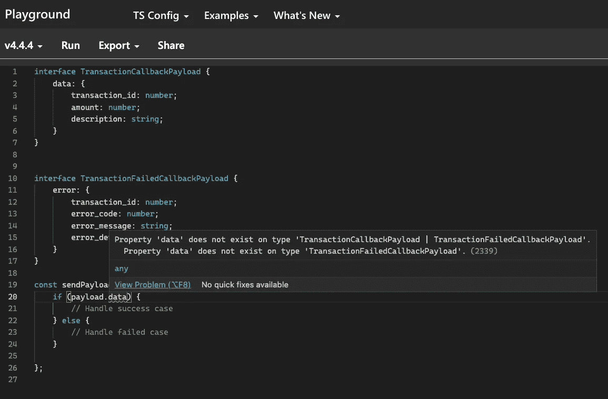

# 编写用户自定义类型保护的简单指南

> 原文：<https://javascript.plainenglish.io/simple-guide-to-write-user-defined-type-guards-9c3becdca321?source=collection_archive---------12----------------------->

## 什么、何时以及如何编写用户定义的类型保护

Photo by [David Martin](https://unsplash.com/@davidmartinjr?utm_source=medium&utm_medium=referral) on [Unsplash](https://unsplash.com?utm_source=medium&utm_medium=referral)

在这篇文章中，我将分享我编写用户自定义类型守卫的经验。该员额分为:

*   **什么**是用户自定义类型的防护？
*   **什么时候**写一个用户自定义类型的守卫？
*   **如何**编写一个自定义类型的守卫？

事不宜迟，我们开始吧。

# **什么**是用户自定义类型的防护？

当你听到一个新事物时，第一反应通常是**什么？**我们先来解释一下守卫型。

类型保护基本上是 TypeScript 中提供的保护变量类型的东西。例如，如果我说`isCoolToday: boolean`，除了`true`或`false`之外的任何东西都会给你错误。

类型保护检查代码，并告诉您您给变量分配了错误的数据类型。

现在，我们知道什么是类型保护。那么**用户自定义的**部分呢？

可能会出现 TypeScript 无法为我们进行类型保护和检查的情况，这就是我们开发人员必须自己编写类型保护的情况。这就是所谓的**用户自定义类型保护**。

# **什么时候**写一个自定义类型的守护？

所以现在我明白是什么了，下一个问题是

> 我什么时候需要这个？我在什么样的情况下写这个？

要知道“什么时候”，让我举一个场景和代码的例子，以便有一个更清晰的画面。

Check this out in [TypeScript Playground](https://www.typescriptlang.org/play?#code/JYOwLgpgTgZghgYwgAgCpTiAzoswD2IAwnADakBGiA1gApwCep+cAJsgN4BQyvyrcMHABcnHnwlgM2XARAB9YK1EgArgFsK0ANziJvOOvyrwKjVqi79fVhCwIowAA55CorFNABzK3wC+XAFcXKCQsIgo6Jg4CK4gAGJwwKQQrCTkVAh0jMxsYhLQUPhQotzWvFLRsoSKyshqmjp6+oXF8gj4tmaNls0FUEVQ8up2OF4Q7p4gPn18rUO2QslYk47TvrwBQR3YYMhYECCs9Ews7AC8yAAUTjlnolEysXLplDQnuewAPmjSMXGJZKpV6ZbKnNgASmQ5wAfPk+MAYNdbuDWAA6ARCKFlcoAelxyAAEphWCl9qoEEgsFhkAg4Admn5kBBSAd4dZ8USSWT4ED2HSGRIgn5dEA)

这通常发生在上述情况下，其中:

*   首先，你有一个**参数，它可以是两种不同的类型**，比如`TransactionCallbnackPayload`和`TransactionFailedCallbackPayload`
*   其次，对参数有一个**条件验证，比如验证`payload.data`，如上面第 20 行所示。**

在这种情况下，TypeScript 不知道哪种类型的有效载荷将被传递到函数中，因为它可能是`TransactionCallbnackPayload`和`TransactionFailedCallbackPayload`之间的任何一个。也正因为如此，TypeScript 向您报告了一个错误，即`data`字段可能未定义，因为`TransactionFailedCallbackPayload`不包含`data`。

当你遇到上述情况时，就是那个时刻——你需要写一个**自定义类型守护**的时刻。

# **如何**编写一个自定义类型的守卫？

对于这一部分，TypeScript 提供了非常棒的文档，教你如何编写。我个人比较喜欢这本[手册](https://www.typescriptlang.org/docs/handbook/advanced-types.html#user-defined-type-guards)。虽然它被弃用，但仍然非常有用，我喜欢它的写作方式。

然而，我仍将通过两种方式来编写我在代码中探索和使用的用户定义的类型保护:

*   使用`in`运算符—更简单的方法
*   使用类型谓词

## 一种更简单的方法——In 运算符

使用`in`操作符相对简单直接。在代码中应该是这样的。

下面代码的亮点在第 20 行— `if ('data' in payload)`。这一行帮助我们检查有效载荷中是否存在数据，我们用它来区分有效载荷。

## 第二种方法—类型谓词

我可能会说，在你的代码库中使用类型谓词会更具可伸缩性。稍后我将解释更多关于可伸缩性的内容。

首先，什么是类型谓词？返回类型的函数是类型谓词。

让我们看看用**类型谓词**实现时的样子。下面是完整的源代码。但是突出显示的部分是从第 19 行开始的。这是我们定义类型谓词的地方。

现在，我们基本上探索了两种方法来实现这一点。为什么我说类型谓词方法更“可伸缩”。我从这几点思考:

*   **可重用性** —我可以在整个存储库中重用类型谓词，我只需要导入它们。
*   **可维护性** —我可以很容易地维护这个函数，如果我改变了有效载荷的数据结构，我只需要更新类型谓词的实现。如果我要使用`in`操作符，我可能必须找到它并把它们都换掉。

# 结论

在这篇文章中，我们探讨了用户定义类型保护的内容、时间和方式。除此之外，我们还看了使用`in`操作符和类型谓词的用户定义类型保护的实现。

我希望你喜欢这篇文章，并在下一篇文章中看到你。

# 参考

*   Mike North 的打字培训——他在 Frontendmasters 上有一门非常好的打字课程。如果你感兴趣，一定要去看看。

*更多内容请看*[***plain English . io***](http://plainenglish.io/)