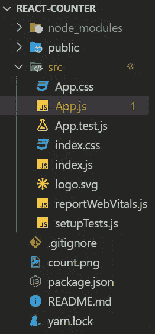

# 简单的反作用计数器应用程序，适合初学者使用“使用状态”和“使用效果”挂钩

> 原文：<https://javascript.plainenglish.io/simple-react-counter-app-for-beginners-using-usestate-and-useeffect-hooks-2dbcc9876003?source=collection_archive---------1----------------------->


Starting with Reactjs

当我开始 React 的学习之旅时，最初我发现很难理解概念。我花了那么多时间去理解组件、状态、道具、useState、useEffect 等等。

所以，我想让我们就这些主题写一篇文章，通过构建一个简单的项目来帮助人们清楚地理解它们。

**目的:**通过搭建一个简单的名为 Counter 的 React app，帮助 React 初学者清晰地理解 useState 和 useEffect。

**关于这个项目:**这是一个简单的项目，我们使用 useState 和 useEffect 来继续计数。

**先决条件:**

1.  确保您已经从[这里](https://nodejs.org/en/)安装了 Node.js。
2.  JavaScript 基础知识。

**创建 React 项目的步骤:**

1.  它将帮助您创建 React 应用程序所需的所有样板文件，并将“counter”作为项目名称。
2.  `cd counter` —创建 React 项目后，通过输入给定命令进入项目文件夹。
3.  `npm start` —它将在本地主机上运行你的实时服务器。

**让我们开始:**

*   我们可以使用类或函数来构建项目。类使用状态和道具，而函数使用像 useState 和 useEffect 这样的反应钩子。我在这个项目中使用了函数。
*   一旦您创建了 React 项目，您会发现一个名为 **App.js** 的文件。



App.js file

*   我们会处理这个文件。
*   删除 return()部分中的所有内容。
*   在 return()中输入以下代码，它将在 localhost 中显示“这是计数器应用程序”文本。

```
function App(){
return (<div><h1>This is Counter App</h1></div>);
}
```

*   **useState:** useState 是一个 React 钩子。在您的应用程序中从`'react’`导入 `{useState}`。我们通过 useState 传递的值将是默认状态，在我们的例子中是 0。
*   useState 总是返回一个有两个值的数组，其中第一个是状态，在我们的例子中是 ***计数、*** ，数组中的第二个是用于更新计数值的 ***setCount*** 函数。
*   您的 App.js 文件应该如下所示:

```
import './App.css';import React,{useState} from 'react';function App() {const [count,setCount] = useState(0);return (<div><h1>This is {count} </h1><button onClick={()=>setCount(count+1)}>Click me</button></div>);}export default App;
```

*   因此，在我们的代码中，当我们单击“ ***click me*** ”按钮时，Count 将从 0 移动到 1，因为我们的 ***setCount*** 调用将 count 增加 1 (count+1)，它将在我们每次单击按钮时更新计数值。
*   我希望你了解使用状态。现在让我们从使用效果开始。
*   **useEffect:** 为了使用这个 useEffect 钩子，首先你需要从‘react’中导入它。这个钩子帮助你告诉 React 你的组件在渲染后需要做些什么。React 会记住这个函数，并在更新 DOM 后调用。
*   默认情况下，useEffect 在第一次渲染和每次更新后都运行。
*   让我们看看如何在应用程序中实现 useEffect 代码。

```
import React,{useState, useEffect} from 'react';function App() {const [count,setCount] = useState(0);useEffect(() => console.log(count));return (<div><h1>This is {count} </h1><button onClick={()=>setCount(count+1)}>Click me</button></div>);}export default App;
```

*   在我们的应用程序中，我们使用 useEffect 在每次更新后打印计数。
*   我希望看完这篇文章后，你对使用状态和使用效果有一个清晰的概念。

万岁！您已经使用 React 创建了一个简单的计数器应用程序，您还可以尝试在 setCount 中构建 decrementCount，即 count-1。

感谢阅读📖！我希望你喜欢😀读这篇文章。

可以在 [***LinkedIn***](https://www.linkedin.com/in/hemanth-raju-aba388176/) 上联系我😇你可以在这里订阅[](https://rajuhemanth456.medium.com/subscribe)*的常规文章*

*保持微笑！*

*请跟随我，通过构建简单的项目来理解其他 React 概念。*

**更多内容看* [***说白了. io***](http://plainenglish.io/)*