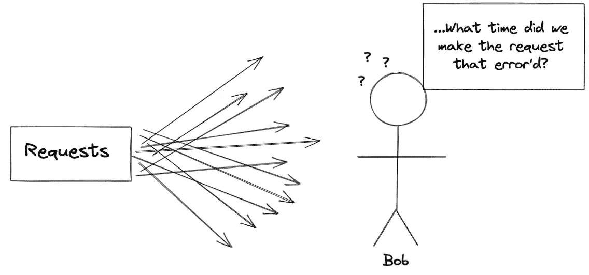

# 跟踪 Node.js 中唯一请求的简单日志记录

> 原文：<https://javascript.plainenglish.io/simple-request-specific-logging-for-node-js-212bb2c0e887?source=collection_archive---------5----------------------->



Don’t be like Bob. Add request ids to your logs.

我们都有过这样的经历，试图通过疯狂地过滤成千上万的日志来调查问题，猜测请求的大致时间，并通过目测毫秒来找到日志。

要启用跟踪 id，您需要一种方法来存储与每个请求相关的信息。Node.js 是单线程的，不像其他语言那么简单。如果您想直接进入代码，您可以滚动到文章的底部，复制/粘贴动作中的**记录器。**

*注意:请求中发送的唯一标识符有不同的名称，这取决于您使用它们的上下文。请求 ID /跟踪 ID /跟踪 ID 等。在本文中，我将把它们称为请求 id。定义为****‘传递给所有依赖项的请求的唯一标识符。’***

# 请求 id 和跟踪 API 请求

> 在开发一个 API 时，一个好的做法是让 requestId 在整个服务和任何依赖关系中保持不变。这样就有了一个唯一的标识符，将每个独特的旅程联系在一起。

为了获得`requestId`的全部好处，您希望将它添加到应用程序输出的每个日志中。在多线程语言中，这是微不足道的，因为您可以利用[线程本地存储(TLS)](https://docs.microsoft.com/en-us/cpp/parallel/thread-local-storage-tls?view=msvc-160#:~:text=Thread%20Local%20Storage%20(TLS)%20is,the%20TLS%20API%20(TlsAlloc)) 。当一个请求进入您的应用程序时，您可以在 TLS 中设置`requestId`,无论何时您想要记录日志，您都可以再次检索它。不幸的是，我们在 Node 没有这种奢侈。

## 方案

假设您有一个简单的日志实现，带有函数`setRequestId`和`loginfo`。

**1)** `requestOne`进入你的应用程序并调用`setRequestId`

**2)**然后开始执行异步数据库操作。

**3)** `requestTwo`进入您的应用程序并调用`setRequestId`

**4)** `requestOne`完成其 db 操作并调用`logInfo(‘db.done’)`

看到问题了吗？当`requestOne`记录它已经完成数据库操作时，`requestTwo`已经开始并覆盖了`requestId`值。请求一现在用错误的 requestId 记录了一条消息，我们失去了开始时提到的`requestId`的主要好处之一*有一个唯一的标识符将每个独特的旅程联系在一起。*

那么，我们如何确保当我们登录时，我们为该请求检索到正确的`requestId`？由于 Node.js 的性质，问题从:

> 我们如何针对特定请求全局访问属性？

到

> 我们如何跟踪请求的异步操作？

# 异步挂钩和 cls 挂钩

## 异步挂钩

[异步钩子](https://nodejs.org/api/async_hooks.html)在 Node.js v8 中引入，提供了一个简单的 API 来访问异步资源的生命周期事件。

异步资源有 5 个主要的生命周期事件:

**1)** **init -** *异步资源初始化时调用*

**2)******-***在资源执行前调用***

****3)** **后-** *资源执行后调用***

****4)** **销毁-** *当资源的执行已经完成时调用***

****5)****promiseResolve-***当 promise 得到其* `*resolve*` *时调用函数***

**为了保持这篇文章的简单，我将解释 cls-hooked 如何在一个非常高的层次上利用异步钩子。但是如果你想了解更多，这里有一些关于异步钩子和 cls 钩子的极好的资源:**

**[异步钩子:通往持久执行环境的旅程](https://www.youtube.com/watch?v=Sakn7GV6EOw&t=1037s&ab_channel=monday.Engineering)**

**[探索 Node.js 异步挂钩](https://blog.appsignal.com/2020/09/30/exploring-nodejs-async-hooks.html)**

**[详细的 cls-hooked 解释](https://habr.com/en/post/442392/)**

## **cls-挂钩**

**[cls-hooked](https://www.npmjs.com/package/cls-hooked) 通过创建`asyncId:context`的映射来跟踪异步操作，其中`asyncId`总是唯一的，`context`包含关于请求的细节，这是您可以存储请求级别数据的地方。**

***注意:当我提到* `*context*` *时，我指的是 cls 挂钩的上下文。ctx 是上下文映射的一种表示。***

**以本文开头的相同场景为例，其中`requestOne`进入应用程序，执行一个异步数据库操作，然后`requestTwo`启动。**

****1)** `requestOne`开始，我们将`requestId`添加到`context`，为请求分配一个 id 并存储上下文。(为了清楚起见，我在表中添加了请求名称)**

```
| request    | asyncId |  context |
|------------|---------|----------|
| requestOne |   22    |   ctx1   |
```

****2)** `requestOne`现在启动异步数据库操作。用`init(asyncId, type, triggerAsyncId)`调用异步钩子`init`。**

*   **`triggerAsyncId`是调用它的操作的`asyncId`(在本例中是 22)**
*   **`asyncId`是新资源的 id**

**它检查地图中是否存在`triggerAsyncId`，如果存在，它将添加一个带有新`asyncId`和相同上下文的新条目。**

```
| request    | asyncId |  context |
|------------|---------|----------|
| requestOne |   22    |   ctx1   |
| requestOne |   49    |   ctx1   |
```

****3)** `requestTwo`进入您的应用程序，`requestId`被添加到一个新的上下文对象，一个`asyncId`被分配给请求，上下文被存储。**

```
| request    | asyncId |  context |
|------------|---------|----------|
| requestOne |   22    |   ctx1   |
| requestOne |   49    |   ctx1   |
| requestTwo |   72    |   ctx2   |
```

****4)** `requestOne`完成其 db 操作。异步钩子将调用`destroy(asyncId)`作为`destroy(49)`，并且`49`将被移除。它现在知道它的`asyncId`是`22`。它将检索`22`的上下文，其中包含`requestOne`的`requestId`，而不是`requestTwo`。**

# ****让我们开始编码****

**现在我们对 cls-hooked 有了一个了解，我们可以开始将我们新发现的知识集成到一个日志记录器中。**

**首先，我们创建一个名称空间，用于跟踪应用程序的异步操作。**

**调用`clsNamespace.run`开始跟踪请求。这将创建新的`context`。在这里，您可以设置您需要的请求级别数据，然后启动一个`next`回调，以便它可以挂钩到请求。**

**既然我们已经设置了特定于请求的值，我们希望在记录时检索它们。**

**我知道上面的内容看起来需要处理很多信息，但是日志记录器的实际实现是相当容易理解的。**

# **运行中的记录器**

**对于我的用例，我选择了一个非常简单的 javascript 原生记录器包装器。但是，`cls-hooked`也可以插入流行的日志库。这里有一个使用 winston 的[替代方案。](https://danoctavian.com/2019/04/13/thinking-coroutines-nodejs-part2/)**

# **结论**

**异步钩子提供了强大的工具来跟踪异步操作的生命周期。`cls-hooked`以一种为 Node.js 提供请求级存储的方式来利用它们，node . js 不仅仅可以用于日志记录。您可以使用这个持久存储来存储您在应用程序中偶尔访问的信息，就像一个`accountId`一样，而不是将它传递给每个函数。**

**然而，有两个缺点必须注意。**

****1)** 截至 Node.js v16.5，异步钩子还在实验的保护伞下。这意味着可以在任何版本中进行非向后兼容的更改或删除，使用它需要您自担风险。**

****2)** 使用这个可以对性能产生影响，正如`bmeurer`用他的[异步钩子显示的性能影响](https://github.com/bmeurer/async-hooks-performance-impact)。性能影响的程度将取决于您的应用程序、框架和用例。**

# ****奖金代码****

## **海军校生**

**对于我使用 AWS Lambda 的大多数个人项目，我使用 Middy 来处理中间件。以下示例在动作中利用了*记录器中的记录器。它检查入站请求是否有一个`requestId`报头，如果有，它将`requestId`设置为该值，否则，它将生成一个 UUID。***

***更多内容尽在* [***说白了***](http://plainenglish.io)**