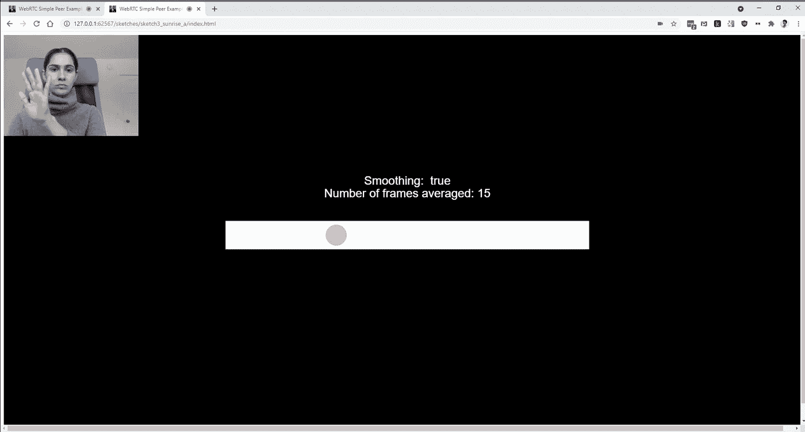

# PoseNet 关键点的简单平滑

> 原文：<https://javascript.plainenglish.io/simple-smoothing-for-posenet-keypoints-cd1bc57f5872?source=collection_archive---------7----------------------->

## *如何使用帧平均作为一种简单的方法来平滑来自* [*p5.js*](https://p5js.org/) *中 PoseNet 的关键点数据。*



谷歌的 Tensorflow.js [PoseNet](https://github.com/tensorflow/tfjs-models/tree/master/posenet) 模型极其有用。它从一个网络摄像头返回浏览器中的实时姿势估计数据，这允许在浏览器中进行各种可访问的具体化交互(如[新颖的导航模式](https://experiments.withgoogle.com/move-mirror)和[在线舞会](https://danielkorssen.com/project/digital-dance-party))。使用 [ml5.js 库](https://learn.ml5js.org/#/reference/posenet)，也很容易[启动并运行](https://www.youtube.com/watch?v=OIo-DIOkNVg)。

从 PoseNet 返回的关键点数据非常嘈杂，因此为这些点添加一些平滑处理会有助于获得更好的用户体验。有许多类型的[平滑](https://en.wikipedia.org/wiki/Smoothing)算法，它们可能*非常*奇特，但是我将把重点放在一个简单的方法上，这个方法做得相当好并且容易实现:帧平均。

这个概念很简单:不是为每一帧显示新的输入关键点值，而是取最近几帧的平均值来帮助减少数据中的噪声。

下面的视频显示了仅在右手腕关键点上平均多个帧的效果。视频从无平滑开始，经过 100 个平均帧进行平滑。

The effect of averaging keypoint values for the right hand over multiple frames.

在第五帧和第十帧时，关键点非常平滑，几乎没有明显的滞后。随着平均帧数的增加，运动变得更加平滑，滞后增加。到 50 帧时，滞后非常明显。根据你所建立的互动类型，这种滞后可能是破坏性的，但也可能是有用的。(滞后通常会鼓励人们缓慢而谨慎地行动。)

它是这样工作的。

首先为过去的右手腕位置创建一个全局数组。在我们的例子中，我们将只是平均 X 坐标，所以我们称它为 *recentXs* 。

```
// an array for past x positions positions
let recentXs = [];
```

当您从 PoseNet 收到第一个姿势估计时，获取单个关键点数据，然后使用如下函数对其进行平均:

```
// get the keypoint data from posenet results
const myRightWrist = poses[0].pose.rightWrist;
const myAveragedRightXPos = averageXPos(myRightWrist.x);// set the number of frames to average
const numXs = 5; function averageXPos(x) {// the first time this runs add the current x to the array n    number of times. this only runs once
   if (recentXs.length < 1) {
     for (let i = 0; i < numXs; i++) {
       recentXs.push(x);
    }// otherwise update only the most recent number
} else {
  recentXs.shift(); // removes first item from array
  recentXs.push(x); // adds new x to end of array
}// add up all the values in the array
let sum = 0;
for (let i = 0; i < recentXs.length; i++) {
  sum += recentXs[i];
}// return the average x value
return sum / recentXs.length;
}
```

该函数第一次运行时，我们将当前的 X 值添加到数组中的每个位置。然后，当我们接收到一个新值时，我们将它添加到数组的末尾，并删除第一项。在所有情况下，我们将数组中的所有值相加，并返回这些值的平均值。

这里是完整的 p5 草图,这样你就可以在上下文中看到它，并自己尝试一下！这里是[一张 p5 草图，所有 17 个关节都进行了平滑处理](https://editor.p5js.org/lisajamhoury/sketches/zbsptgaQw)。代码也在 [github](https://github.com/lisajamhoury/PoseNet-Smoothing) 上。

感谢[扎克·利伯曼](https://medium.com/u/f8b5df9b82a0?source=post_page-----cd1bc57f5872--------------------------------)在他的[重现过去的](https://medium.com/@lisajamhoury/debrief-recreating-the-past-8ed91eabeab)课程中向我介绍了 [openFrameworks](https://openframeworks.cc/) 中姿势数据的帧平均。

*更多内容请看*[***plain English . io***](https://plainenglish.io/)