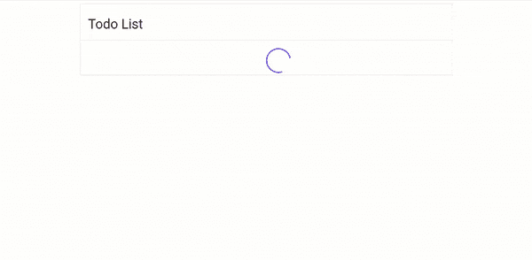

# 通过与用户互动简化状态管理

> 原文：<https://javascript.plainenglish.io/simplify-state-management-in-react-with-usereducer-hook-bea33fc17018?source=collection_archive---------15----------------------->

## 如何使用 refactor 中的“useReducer”钩子重构 useState 并简化状态管理。

Photo by [Yan Ots](https://unsplash.com/@yanots?utm_source=medium&utm_medium=referral) on [Unsplash](https://unsplash.com?utm_source=medium&utm_medium=referral)

当我们有简单的状态管理问题时`useState`是合适的钩子。但是，如果我们有多个状态变量在同一个事件中发生变化，管理状态有时会很复杂。在这种情况下，首选`useReducer`挂钩。

在本文中，我们将看到一个简单的 Todo 应用程序，它使用了`useState`并重构它来使用`useReducer`钩子。

Todo list application

我们的应用程序的主要组件目前如下所示:

我们必须在应用程序中管理三种状态；`todos`、`status`和`error`。`status`状态跟踪我们的网络请求是加载成功还是返回错误响应。因此，在发出请求时，我们会同时更新`error`和`status`或`todos`和`status`。与其进行多次状态更新，不如将状态逻辑封装在一个缩减器中。

**减速器**基本上是一种随着动作进入旧状态并返回新状态的功能。我们的减速器将管理四个动作的状态更新。我们将使用 switch 语句有条件地处理我们的操作。我们通过`action`参数传递所有的响应有效载荷和动作类型。

每次我们返回一个新的状态时，我们使用扩展运算符将它与先前的状态连接起来，并且只更改我们希望修改的值。我们的最终减速器功能如下所示:

现在我们已经定义了我们的 reducer 函数，我们可以重构我们的主要组件来使用`useReducer`钩子。

首先要改变的是我们状态的初始化。`useReducer`钩取我们的`reducer`功能和初始状态。我们还破坏了状态变量和`dispatch`函数的输出，用来触发状态变化。

当进行状态改变时，我们通过传入动作类型和一些附加数据来使用`dispatch`功能。

当 todos 成功从服务器中取出时，我们就是这样触发状态更新的:

用`useReducer`替换所有`useState`调用后，我们重构的`App.js`文件将如下所示:

本文到此为止。希望你喜欢读它。你可以在这里找到完整的源代码。

*更多内容尽在*[***plain English . io***](http://plainenglish.io/)