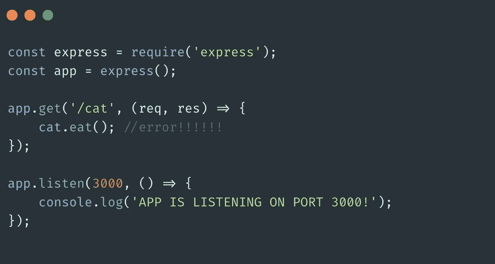
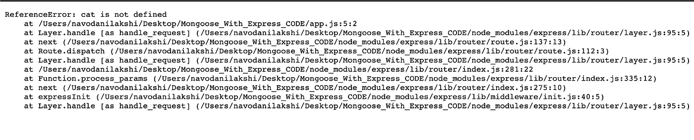
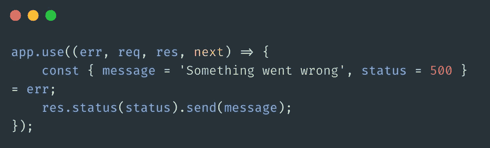
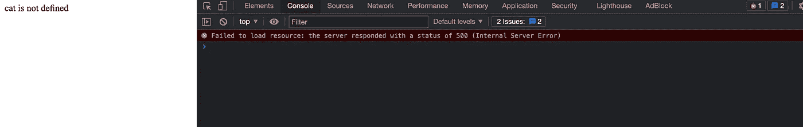
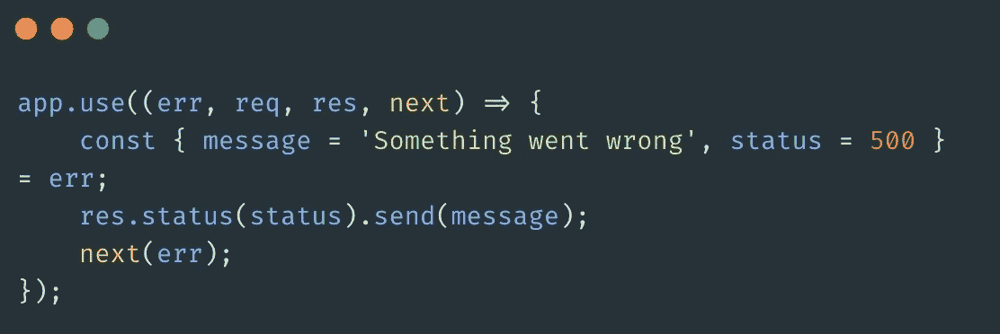
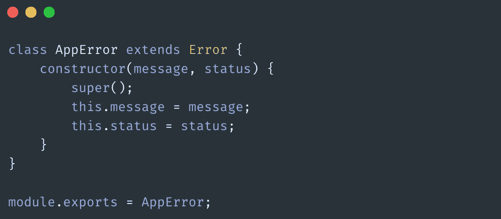
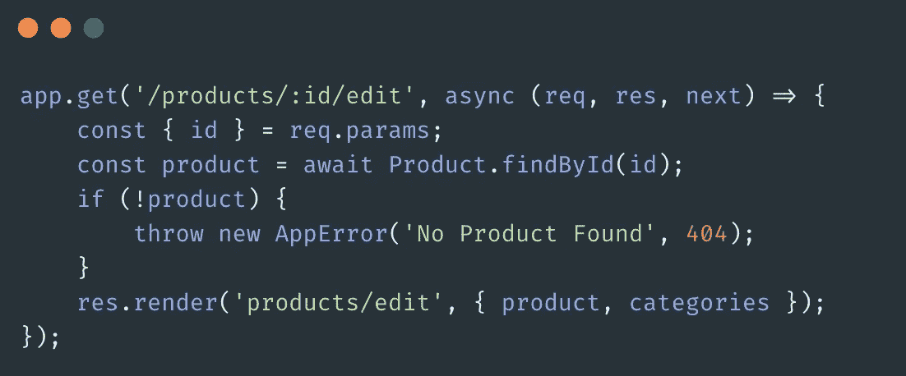
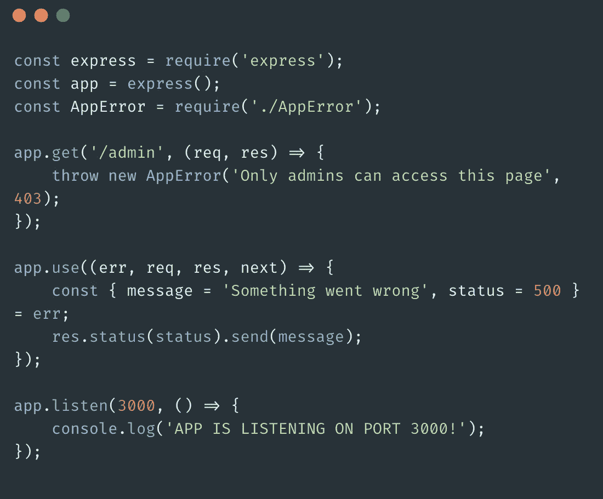
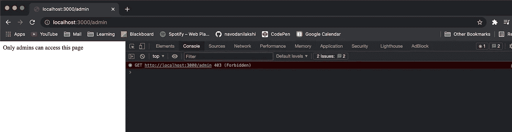

# 简化 Express 应用程序中的错误处理

> 原文：<https://javascript.plainenglish.io/simplifying-error-handling-in-express-apps-82e052bd9c31?source=collection_archive---------5----------------------->

Photo by Alex Chambers [@alexchambers](https://unsplash.com/@alexchambers) on [Unsplash](https://unsplash.com/)

你好世界！本文讨论了 Express 中的错误处理。你知道错误的障碍，以及它们如何化解我们想要实现的目标。但幸运的是，我将用最简单的术语解释如何在运行路线处理器和中间件时处理 express 应用程序中的潜在错误。那么，让我们开始吧。

错误处理到底是什么，我们为什么要关心它？嗯，我们应该注意可能的错误，因为我们想优雅地终止我们的程序，而不是在用户面前出现一个 T2 的红色大错误。如果事情没有按照我们预期的方式发生，我们希望有一个*计划* *B、*。出错是我们的程序中最常见的事情，因为相信我，最终使用你的程序的用户会找到 1000+1 种方法使它崩溃(不是故意的，但你知道)。因此，作为优秀的程序员，我们应该在部署代码之前预先考虑并处理它们。

通过错误处理，express 捕获*同步*和*异步*错误，并通过在每种情况下执行我们告诉它的操作来优雅地终止我们的程序。

Luckily Express 附带了一个*默认错误处理程序*，所以您可以马上开始！

# 快速默认错误处理程序。

考虑以下情况:

在上面的例子中，我定义了一个愚蠢的 *'/cat'* 路由，但是一旦用户转到[http://localhost:3000/cat](http://localhost:3000/cat)，用户将面临一个错误，因为“cat”未定义，而我*没有处理这个错误。由于错误未被捕获，express 将在*内置错误处理程序*的帮助下处理它，并将发送错误对象作为响应。*

# Express 中的自定义错误处理程序。

我们*不希望*向用户显示令人讨厌的堆栈跟踪，对吗？我们通常会提供一个 404 页面或一些像样的页面，将隐藏一个错误发生的事实。那么我们应该如何着手呢？嗯，我们可以定义自己的错误处理程序，以我们想要的方式处理错误。

这个*定制错误处理中间件*看起来像任何其他典型的中间件，除了我们必须传入 4 个参数*而不是 3 个参数的*。

在这里，我已经对传入的错误对象进行了分解，提取出了 T2 的错误消息和 T4 的错误状态，我还为它们提供了默认值，以防它们没有值。然后，作为响应，发送状态为的消息。这是一个自定义错误处理程序的简单示例。注意回调中额外的' *err* '参数。当错误从我们代码的任何地方抛出时，它捕捉传递的错误对象，我们可以用任何我们想要的方式来处理错误。

此外，值得一提的是，您应该在所有其他的 *app.use()* 之后，在*末端定义自定义错误处理程序，因为在 Express 中您放置它们的顺序非常重要。*

现在已经定义了一个错误处理程序，如果我们再次点击 *'/cat'* route，下面是我们将得到的结果。

如你所见，我们已经成功处理了覆盖默认行为的错误*。当然，除了发送错误信息之外，你还可以做更多的事情。但是你说的没错。*

如果您想在处理完错误后点击默认的错误处理程序，您需要做的就是将 error 对象传递给 next()，它将跳过链中所有剩余的处理程序并调用默认的处理程序。

# 定义我们自己的错误类。

我们也可以定义自己的错误类。考虑下面的例子。

现在我们可以这样做，

这是一个简单的 RESTful 路径，使用产品的' *id* '来获取产品细节，并显示在编辑表单中。如果你不太明白这段代码在做什么，不要担心。我想到这个是因为前面的例子太蹩脚了。底线是，如果没有找到 id 为 *id 为*的产品，您可以使用上面的类来抛出错误。你可以像我一样传递一个定制的信息，并附上你想要的状态码，在这种情况下 *404* 是非常明智的。

现在，这个错误将被我们定义的错误处理程序捕获，并将发送 error . message((*No Product Found*’)和 error.status( *404* )作为响应。

让我们看另一个例子:

这里我们有一个基本上无用的路由' */admin* '，它会拒绝任何带有消息的访问。但它很好地说明了这一点。如果向[http://localhost:3000/admin](http://localhost:3000/admin)发出 GET 请求，它将向错误处理程序传递一个带有消息和 403 禁止状态的错误对象。并且错误处理程序将从那里接收作业以发送适当的响应，在这种情况下，

我知道这有点拗口，但正如人们所说，熟能生巧。所以尝试用 Express 将错误处理添加到基本的 CRUD 应用程序中，我相信它最终会变得很有意义。编码快乐！

*更多内容看*[***plain English . io***](http://plainenglish.io/)