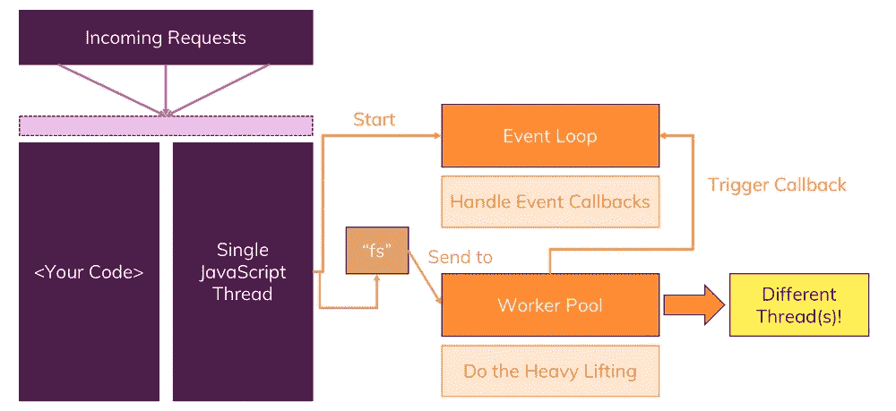
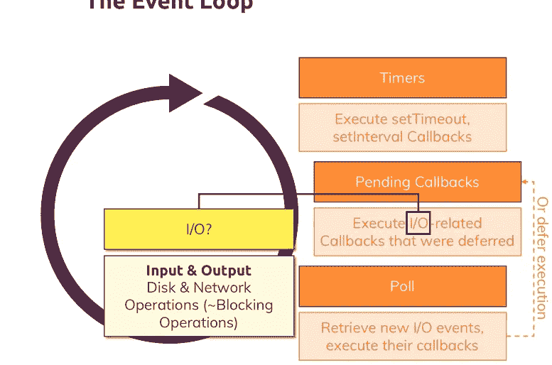
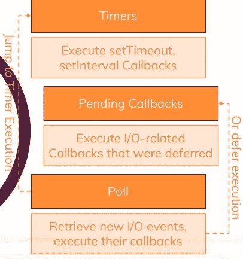

# 多个请求如何与单线程、事件循环和阻塞代码一起工作

> 原文：<https://javascript.plainenglish.io/single-thread-event-loop-blocking-code-e023f9bc7ce5?source=collection_archive---------8----------------------->

必须记住 Node.js 只使用一个 JavaScript 线程。

这里的问题是，我们如何提出多个请求？

**事件** **循环**—***事件循环*** 不处理传入的文件，但它处理回调，这样当我们的代码被发送到*工作池*，在那里我们的应用程序被重载，它将在*工作池*完成后触发回调(就像当我们写一个文件时)，然后由 ***事件循环*** 处理。

**工人池:**工人池独立于**事件循环**和**请求**中的**工作。这将在独立于事件循环的线程上运行。**

**关于事件循环的更多信息**

事件循环由 Node.js 运行。它保持 Node.js 运行，并处理所有工作池回调。它通过删减 Node.js 代码来实现这一点。记住事件循环有一个顺序，它通过回调的顺序。

**事件循环顺序**

在每个循环的开始，事件循环:

*   **首先**检查是否有任何**定时器**比如 SetTimeout，setInterval 这些都是回调()
*   **然后**，事件循环将检查是否有可能已经被推迟的**未决**回调()。如果这些 callback()操作完成，事件循环将依次执行所述 callback()。
*   **轮询:**上述循环完成后，**轮询阶段**将开始。这基本上意味着事件循环将检索任何新的 I/o event 并执行它们的回调。如果回调不能完成，那么它将推迟回调，并在下一次迭代中返回，检查回调是否准备好执行。轮询阶段还将检查是否有任何要执行的计时器回调，如果有，将跳转到计时器执行。
*   **检查**将执行**立即回调()**，并且仅在所有其他打开的回调被执行或延迟后执行。
*   **Close:** 现在，在事件循环迭代结束时，Node.js 将执行任何快速事件回调()。
*   **最后**我们可能会退出进程，但前提是有任何打开的事件监听器。

*   *投票阶段审美范例*

*投票阶段美学示例(检查计时器回调时)*

## Node.js 服务器上的事件侦听器

当我们用 Node.js createServer()打开事件监听器时，这是一个永远不会关闭的无限引用，所以我们的事件循环永远不会退出。

换句话说，默认情况下，createServer()方法从不存在。

就是这样。希望这篇文章对你有所帮助。谢谢你。

*更多内容尽在*[*plain English . io*](http://plainenglish.io/)