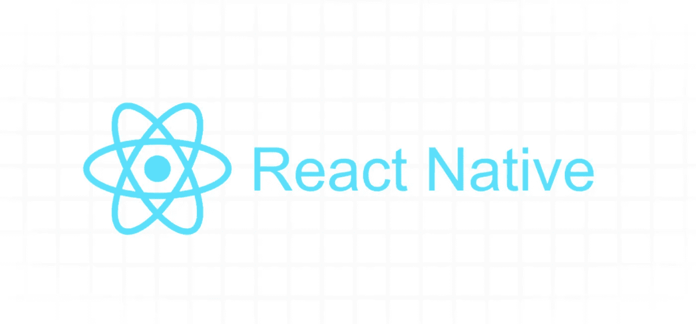

# 世博会发展一年的七个教训(2021)

> 原文：<https://javascript.plainenglish.io/six-lessons-from-a-year-of-expo-development-2021-88b4c29437d4?source=collection_archive---------11----------------------->

在 Expo 开发一年后，我可以自信地说，该平台已经实现了它的承诺，即在 iOS、Android 和 web 上构建和部署应用程序的通用框架。

但是对于所有闪亮的新工具，它有一个轻微的学习曲线，伴随着一些成长的烦恼。当来自 React 生态系统中的纯 web 开发时尤其如此。这是我希望在我第一次踏上世博和 React-Native 之旅时就能看到的文章。

为了帮助你避免调试和建筑遗憾的不眠之夜，我想与你分享我的团队和我自己从一年的世博会发展中学到的七个关键教训。

# **1。每季度更新你的应用程序的依赖关系**

世博会发展迅速。拥有“三个平台一个代码库”的代价是必须通过频繁的 Expo SDK 更新来满足所有这些平台的需求。Expo 承诺保持约 6 个月的向后兼容性，因此一旦 SDK 版本被否决，您将无法再使用 Expo Go 应用程序进行开发或构建新的二进制文件。

但是，好消息是 Expo 用他们的`expo upgrade` CLI 命令和详细的 changelog [博客帖子](https://docs.expo.io/workflow/upgrading-expo-sdk-walkthrough/)让这个过程尽可能顺利。对于世博会的人们来说，谢谢你们。让他们继续！

# **2。尽量限制第三方库的使用**

如上所述，您将需要能够忍受对您的整个应用程序执行相当定期的依赖性更新的行为。将会有突破性的变化。会有眼泪。但是，至少你会跟上时代。

为了避免未来不可预见的挫折，真的问问你自己是否需要第三方库来实现你的目标。你知道我在说的那个——它是某种 AirBnB 日期选择器的克隆，它的维护者神秘失踪了，它在你受雇于该公司之前就被引入了你心爱的项目。在这样一个**快速发展的生态系统**中，运用良好的判断力来判断你可以相信什么。

如果可能的话，我建议您自己编写这些组件。使用 React Native，您会惊讶于开箱即用的效果。例如，我们最近编写了自己的 card carousel 组件来帮助简化面向未来的开发。更多信息请见我的文章[这里](https://chanonroy.medium.com/building-a-netflix-style-card-carousel-in-react-native-649afcd8d78e)。

# **3。拥抱通用测试和反应测试呈现器**

和 **Jest** 一起去当试车员。它得到了脸书生态系统的大力支持，您还可以利用 T2 世博会的优势。有了这个插件，你可以在 jest 中运行 iOS、Android 和 web 测试。埃文·培根有一篇关于它的很棒的文章[在这里](https://blog.expo.io/testing-universal-react-native-apps-with-jest-and-expo-113b4bf9cc44)。

就测试呈现器而言，与在 web 开发社区广受欢迎的**react-test-library**相比，我们更喜欢 **react-test-renderer** 带来的简单性。React-test-renderer 因其与 expo universal testing 的兼容性以及在组件测试中处理异步操作的清晰性而脱颖而出。

对于 **e2e 测试**解决方案，不幸的是还没有一个健壮的解决方案。我们研究了排毒，甚至在 AWS 中建立了我们自己的设备农场，但成效有限。Cypress 也是 e2e 测试的一个选项，但不幸的是它只在 web 上有价值。看看 Expo 团队围绕这一工具需求做了什么将会很有趣。目前，重点最好放在用 Jest 和 react-test-renderer 编写健壮的集成和单元测试上。

# **4。给自己喘息的空间来调整自己的反应——天生的细微差别**

来自网络世界，我对自己准确估计简单特性的时间的能力充满信心。然后我开始 React 原生开发。起初，事情进展缓慢。有时，当网络世界的基本概念被颠倒过来时，情况会变得非常戏剧性。当开始使用 React Native 时，**将您的初始估计值增加一倍**,给自己留有调整细微差别的余地，例如:

*   默认情况下，React Native 中的所有内容都是 flex 组件。此外，默认的伸缩方向是“列”,而不是 web 上常见的“行”。
*   在 iOS 和 Android 中，使用 z-index 进行排序的行为与您预期的不同。相反，应该关注组件呈现顺序，以此来加强 z 索引位置。
*   忘掉和

    ，在<view>和<text>中思考。除非你喜欢看到红色的错误消息，否则不要尝试在<text>之外渲染文本。</text></text></view>

*   习惯将内容包装在 ScrollView 中，用 SafeAreaView 处理讨厌的手机插件。

# 5.尽早使用 TypeScript 并打开严格模式

考虑到平台之间的细微差别，尽可能多地提供类型支持至关重要。尽早使用 TypeScript，并确保在严格模式下运行它。你会惊讶于哪些常见的网络相关技术会导致本地生态系统中的**应用崩溃**。拥有 expo 模块类型声明文件的安全机制意味着更少的应用崩溃，这意味着更快乐的用户。

# **6。React Native 的内联样式非常好用，不需要样式组件**

不要急于用第三方 **CSS-in-JS** 解决方案来抽象 React Native 的默认内联风格系统。我们最初将样式化组件作为一个选项，但很快发现增加的抽象层是不必要的，而且有些分散注意力。还有性能上的权衡，比如放弃 react-native-web 的树摇动，如这里的[所解释的](https://docs.expo.io/guides/using-styled-components/#tree-shaking)。

有了 React Native 的内联风格道具，你仍然可以使用高级 css 特性，比如伪选择器来操纵网页上的悬停和活动状态。Evan Bacon 在这里有另一篇关于使用钩子实现这一点的文章。

对于动画，React Native 公开了一个很棒的动画 API，我们发现它性能很好，使用起来也很简单。你可以用动画插值的力量创造出一些真正美丽的东西。

# **7。分析解决方案可用，但还不成熟**

在野外使用 Expo 制作应用程序，您很快就会发现自己会问以下问题:

*   我的用户在做什么？(*用户跟踪*)
*   我的用户在哪里被卡住了？(*崩溃日志*)

对于**用户跟踪**，我们发现 Expo 的官方振幅和细分市场整合取得了一定的成功。就开发人员设置和功能丰富性而言，这两个工具都很棒。Firebase Analytics 也是一个选择，但是我们发现这个平台本身非常有限。感觉这个平台不能理解你可以是除了电子商务网站或联盟营销博客之外的任何东西，它会自动为你的活动分配标签。

对于**错误日志**，Sentry 是生态系统中最成熟的选择。话虽如此，我最期待的还是 Datadog 的真实用户监控(RUM)解决方案的发布，其 React Native SDK 目前处于封闭测试阶段。这里的真正价值是能够在一个平台中将客户端崩溃报告与后端 APM 日志联系起来。

# **结论**

随着一年的 Expo 和 React-Native 开发的完成，看到这些平台带给您的开箱即用是一个令人愉快的惊喜。来自纯 web 开发，您很快开始克服每个平台的微小语法差异，并感受到开发人员速度的提高。独立的 web 和移动团队之间不再有官僚主义——所有这些都在一个代码库中。

这是一个快速变化的环境，需要频繁维护才能跟上。鉴于此，尽可能保持应用程序的轻量级非常重要。了解 React Native 给你的东西，让事情变得简单。

*更多内容看*[***plain English . io***](https://plainenglish.io/)