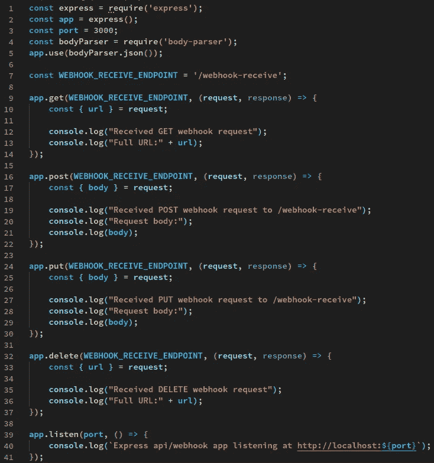
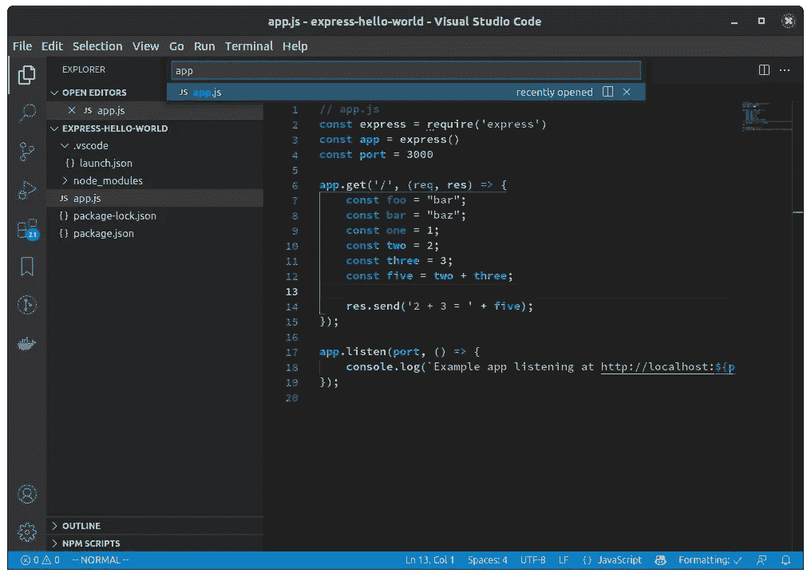

# 作为 Node.js 开发人员，大幅提高工作效率的 6 种方法

> 原文：<https://javascript.plainenglish.io/six-ways-to-drastically-boost-your-productivity-as-a-node-developer-b43387cc5e46?source=collection_archive---------2----------------------->



## 介绍

作为 Node.js 开发人员，这六个生产率技巧将大大提高您的生产率。你可以节省几个小时的时间，然后投资于其他活动。

这并不是你应该做的所有事情的完整列表，但是如果你还没有做这些事情的话，这些事情会极大地提高你的工作效率。

## 使用模糊查找器

我们中的许多人仍然在使用大型的单片代码库，有时有数千个文件。

你应该如何在你的项目中的数千个`.js`文件和数百个文件夹中找到隐藏在`/src/authentication/userTypes/employee.js`中的`employee.js`？手动通过目录树查找文件？再问一个更熟悉代码库的开发者？

不，只要使用模糊查找器并输入`employee.js`，你将在几秒钟内找到你的文件。

它是这样工作的。在 VS 代码中，按下`Alt+P`，然后输入你要找的文件名。结果会立即出现。

*VS 代码中的模糊查找器:*



如果你用的是 IntelliJ 或者 WebStorm，快速按两次`shift`(又名双 shift)而不是按`Alt+P`。

## 使用真正的调试器而不是`console.log()`

当我还是一名中级工程师的时候，学习如何使用调试器本身就大大提高了我的工作效率。我可以在几个小时内完成可能需要一天才能完成的工作。修复 bug 和增加功能要容易得多。

我发现在探索不是我写的不熟悉的代码库时，调试特别有用。你可以很容易地看到用奇怪的方式编写的最复杂的逻辑的结果。当您可以一行一行地运行它并观察事情如何变化时，推理出复杂、令人费解的逻辑会容易得多。

如果你曾经使用过`console.log()`来打印一个值到控制台，你可能知道如果你试图调试一些复杂的东西，它会变得多么乏味。它一次打印一个值，你需要为你想看到的每个值写一个新的`console.log()`语句。如果您正在查看的值发生变化，您需要再次`console.log()`它。有点像蒙着眼睛或者在黑暗中瞎逛。

人类的工作记忆是有限的，所以一旦你手动打印了足够多的变量，这些值将开始从你的脑海中消失，然后你必须再次打印它们或把它们写在某个地方。试图把它们都保存在工作记忆中需要宝贵的大脑资源，你可以把这些资源重新导向让你的代码按照你想要的方式工作。

进入调试器—在代码中设置断点，然后运行应用程序。当您的应用程序到达您设置断点的那一行时，您将能够在 debug 选项卡中看到范围内的所有变量。

没有必要在你的工作记忆中处理大量的数值。只需一个操作，您现在就可以看到所有内容，而不是一次只看到一个值。

我开始只是调试我自己的应用程序代码，但随着时间的推移，我变得更资深，我发现我可以通过调试框架代码(如`express`的代码)获得很大的洞察力。我能够找到文档中没有列出的问题的答案。

如果你想学习如何设置你的调试器，请看我的另一篇文章[通过调试提高你的节点生产力](https://dev.to/ciphercode/debug-a-nodejs-express-app-with-vscode-2bh2)。

## 使用`async/await`并避免“回调地狱”

考虑以下有和没有`async/await`的例子。

不带`async/await`:

```
function addFavoriteProduct(favoriteProduct) {
	const user = userRepository.get(userId).then((user) => {
		const userProfile = profileRepository.get(user.profileId).then((userProfile)) => {
			const favoriteProducts = productsRepository.getFavoriteProducts(userProfile.favoriteProductsId).then((favoriteProducts) => {
				favoriteProducts.add(favoriteProduct);
			}).catch((error) => {
				// Handle error
			})
		}).catch((error) => {
			//Handle error
		});
	}).catch((error) => {
		// Handle error
	});
}
```

这就是“回调地狱”的例子。它包含许多嵌套操作，很难维护。如果你有更多的嵌套操作，你将走向[末日金字塔](https://www.dottedsquirrel.com/pyramid-of-doom-javascript/)反模式。

如果有我没有注意到的错误，我不会感到惊讶，因为代码比它需要的要复杂得多！。我甚至不想让它工作，因为有更好的方法。

直到最近，这一直是 Node.js 中执行这类操作的标准方式。正因为如此，网上很多比较老的例子和教程还是教这种风格的，所以在 Stackoverflow 这样的地方，要小心你在网上读到的东西。如果你看到这种风格的代码，你应该意识到它不再是最佳实践。在别处找一个不同的例子，或者尝试重构它，使之更好，如下例所示。

同`async/await`:

```
async function addFavoriteProduct(favoriteProduct) {
	try {
		const user = await userProfile.get(userId);
		const userProfile = await profileRepository.get(user.profileId);
		const favoriteProducts = await  productsRepository.getFavoriteProducts(userProfile.favoriteProductsId);
		await favoriteProducts.add(favoriteProduct);
	} catch (error) {
		// Handle error
	}
}
```

正如您所看到的，这个例子更加清晰易懂。它不太可能隐藏错误，因为它更简单。

要使用`async/await`，你需要在 Node 8 或更高版本上，所以 Node 的最新版本将支持它。你需要在一个`async function`里面使用它。通过添加`async`来声明一个，例如`async function get()`。

## 通过公共网址尽早分享您的作品

您知道吗，您可以从本地机器上的`localhost`或`127.0.0.1`获取节点应用程序的公共 URL，即使它位于防火墙或公司网络之后。它不需要任何网络配置，你可以用`expose`在一个命令中完成，例如`expose 80 as myapi.expose.sh`。

这使您能够尽早与合作者(如其他工程师、客户或产品经理)分享您的工作，并获得快速反馈，而无需建立完整的部署渠道。

您可以编写一个后端 API，共享一个公共 URL，然后在与您合作的 React 前端开发人员从他们的应用程序向您的 API 发送请求时进行实时调试。

为什么不在 webhook 提供商向您发送 webhook 请求时进行实时调试，而不是花几个小时阅读他们的(通常不是很好的)文档？

如果你在 Linux 上，运行这个来安装`expose`

```
curl -s https://expose.sh/sh/install-linux.sh | sudo bash`
```

如果您使用的是 Mac，运行

```
curl -s https://expose.sh/sh/install-mac.sh --output install-mac.sh && sudo bash install-mac.sh`
```

对于 Windows，请转到[安装页面](https://expose.sh/install/)并下载`exe`文件。

然后你可以运行`expose <port>`，其中`<port>`是你的应用程序运行的端口号。更多说明见[文档](https://expose.sh/docs/)。

## 使用`npm`脚本来自动化重复性任务

需要编译您的 JavaScript、运行 linter 或您的单元测试吗？您可以将 NPM 脚本添加到您的`package.json`文件中来运行它们，而不是记住运行它们的命令。

```
"name": "myapp",
  "main": "app.js",
  "scripts": {
    "build": "tsc -p ./",
    "watch": "tsc -p ./ -w",
	"test": "jest",
	"lint": "eslint",
	"start": "nodemon app.js"
  },
  "dependencies": {
	.....
  }
}
```

此示例使用 TypeScript，它是增加类型安全的 JavaScript 的超集。我运行我的应用程序，首先需要将我的代码编译成节点可以运行的普通 JavaScript。

要运行该脚本，请运行`npm run <script_name>`。在这里，我可以运行`npm run build`来编译我的代码，运行`npm run watch`来在监视模式下编译，为每次更改自动重新编译。

`test`和`start`是特殊的脚本，你可以像`npm test`和`npm start`一样运行它们。

## 用`nodemon`启动你的应用程序，获得快速反馈

如果您在使用 Node(例如`node app.js`)启动应用程序后对代码进行了更改，您需要按`ctrl+c`停止应用程序，然后再次启动应用程序以获得新的更改。虽然这听起来不多，而且只需要几秒钟的时间，但随着时间的推移重复这样做将会积少成多。假设你花了 5 秒钟，平均一周做 1000 次。这相当于 5000 秒，或者说你每周不需要做的额外 1.3 小时的工作。

与`nodemon`的不同之处在于，当你更新代码时，你的应用程序会自动重启。

在你使用`nodemon`之前，你需要安装它，所以运行`npm install -g nodemon`。

用`nodemon`启动你的 app 几乎和用 Node 一样。把`node`换成`nodemon`就行了，比如你可能会运行`nodemon app.js`而不是`node app.js`。

它看起来是这样的:

```
$ nodemon app.js
[nodemon] 1.18.9
[nodemon] to restart at any time, enter `rs`
[nodemon] watching: *.*
[nodemon] starting `node app.js`
Example app listening at http://localhost:3000 # My app has started up#####
# Here, I make a change to app.js
#####[nodemon] restarting due to changes...
[nodemon] starting `node app.js`
Example app listening at http://localhost:3000 # Now, my app automatically restarts and picks up the change
```

现在，当我做出更改时，应用程序会自动重启，为我节省了大量时间，我可以将这些时间投入到其他事情中。

*专业提示:将此与一个* `*start*` *npm 脚本结合起来，就像上一节*中的例子一样。

## 结论

这并不是一个完整的列表，列出了作为节点开发人员可以做的提高生产力的事情，但是这是一个很好的起点。

这些简单的事情可以为你节省很多不必要的工作时间。

如果你觉得这篇文章有用，请考虑分享给其他人。

编码快乐！

*更多内容看* [***说白了就是***](http://plainenglish.io/) ***。*** *报名参加我们的* [***免费每周简讯这里***](http://newsletter.plainenglish.io/) ***。***