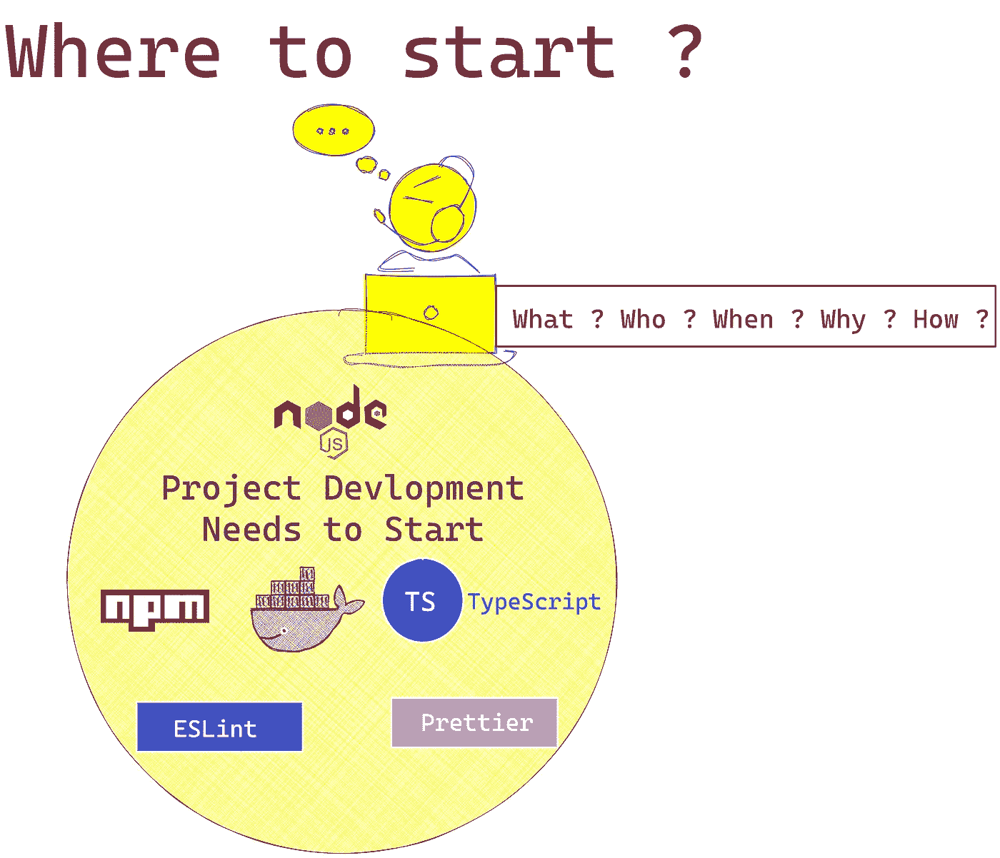
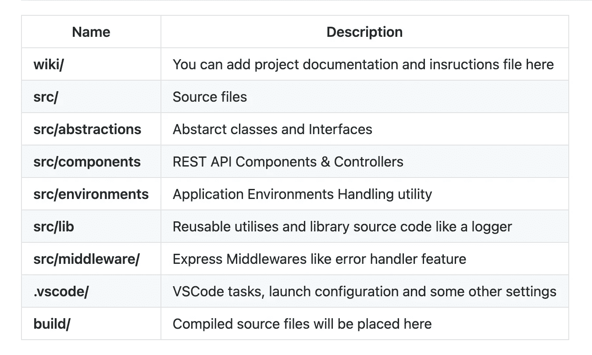
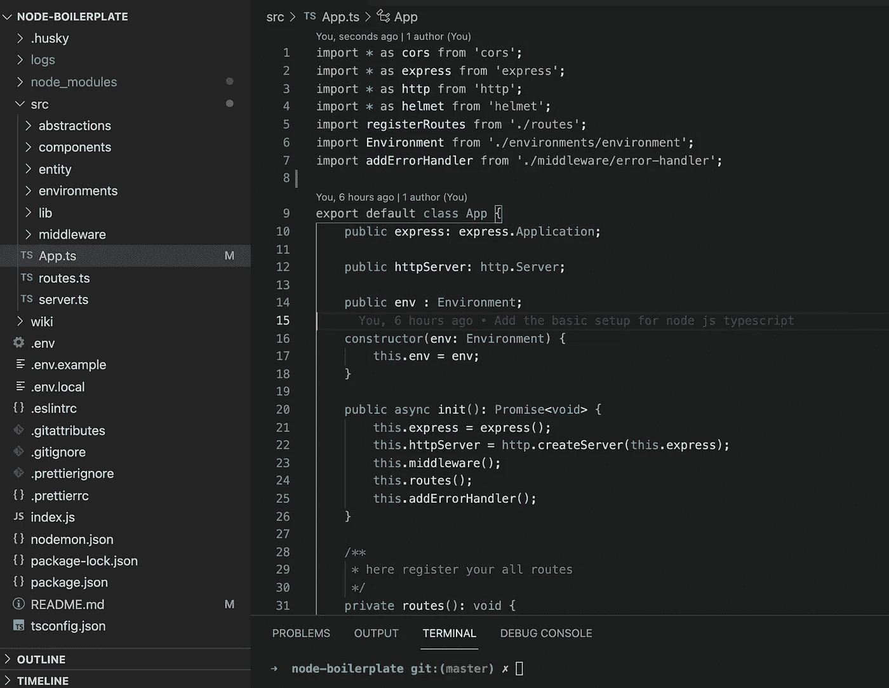
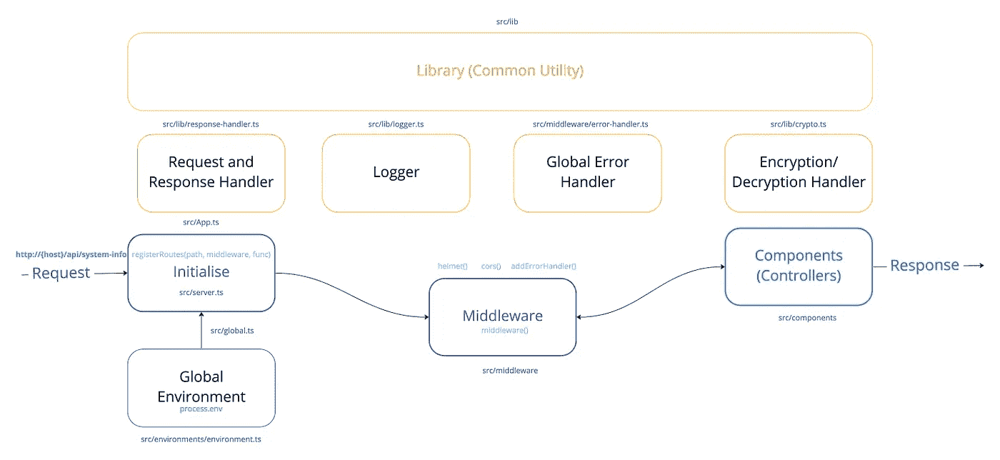
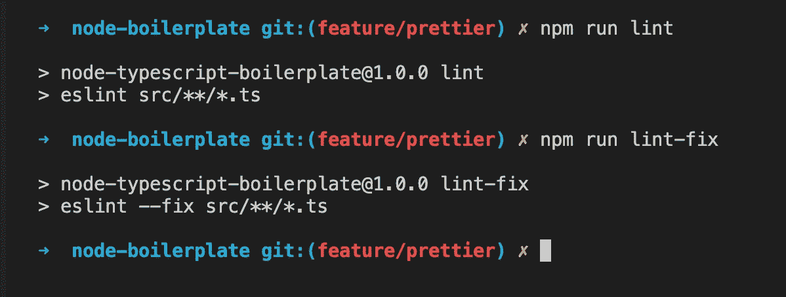
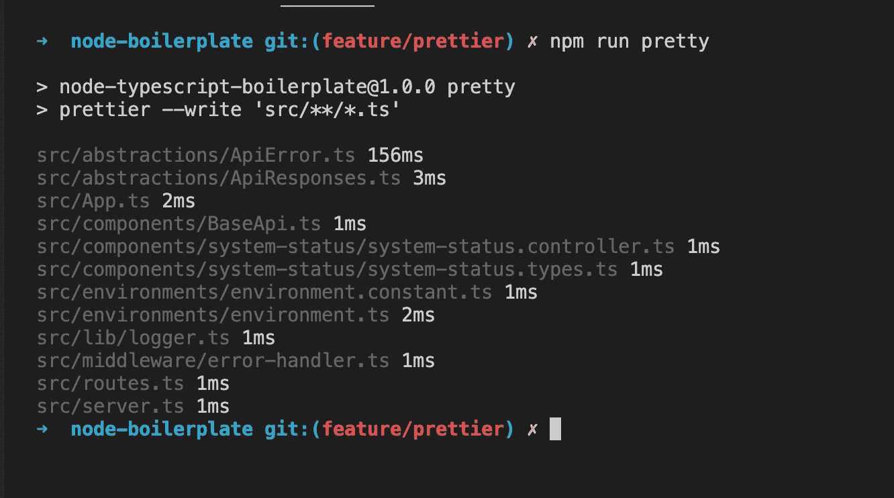
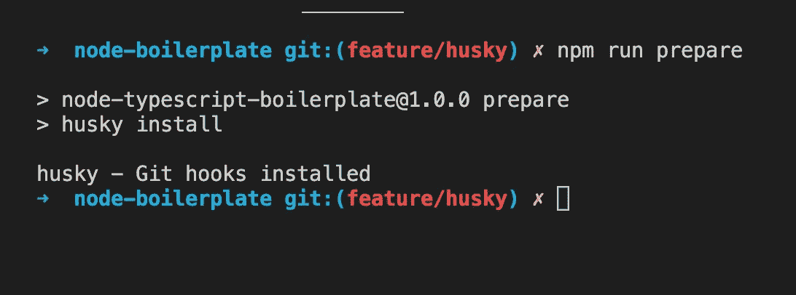
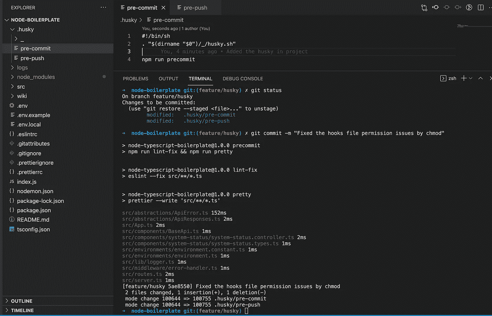
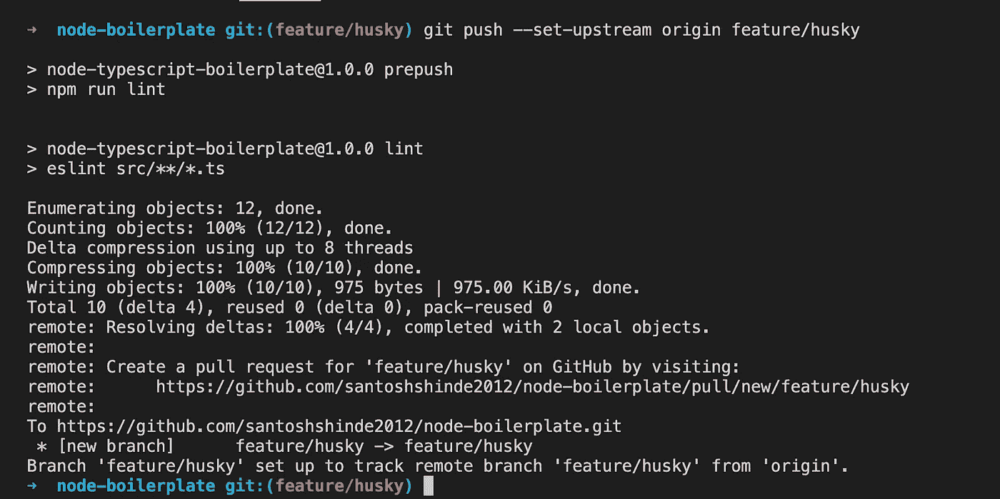

# 用 TypeScript 编写的 Node.js 应用程序的框架(带有 ESLint、appellister 和 Husky 的设置说明)

> 原文：<https://javascript.plainenglish.io/skeleton-for-node-js-apps-written-in-typescript-444fa1695b30?source=collection_archive---------0----------------------->



Skeleton for Node.js applications

# 为什么我们真的需要样板代码？

**维基** [定义](https://en.wikipedia.org/wiki/Boilerplate_code#:~:text=In%20computer%20programming%2C%20boilerplate%20code,Such%20code%20is%20called%20boilerplate.)的样板代码是:

> 在计算机编程中，**样板代码**或者仅仅是**样板代码**是在多个地方重复的代码段，几乎没有变化。当使用被认为冗长的语言时，程序员必须写很多代码来完成次要的功能。这样的代码被称为*样板文件*。

样板代码是需要包含在应用程序中的重复代码，程序/框架很少或没有改变，对应用程序的逻辑没有任何贡献。

此外，我们可以说它是我们可以开始开发并遵循样板代码中已经定义的结构或方法的代码。

软件开发中的样板文件对不同的人来说有不同的含义，但通常是指反复使用的代码块。

# 目的

我们使用这个框架的主要目的是用 Node.js 和 TypeScript 启动服务器应用程序。除此之外，还要开始整合 ESLint、Prettier 和 Husky。

试试看。我很高兴听到你的反馈或者任何你想告诉我的新特性。

# 共同特征

1.  快速启动
2.  集成的 ESLint，更漂亮、更沙哑
3.  常见错误处理程序
4.  简单标准的脚手架
5.  遵循坚实的原则
6.  基于 TypeScript 语法
7.  简单的环境配置
8.  轻松添加新功能
9.  集成温斯顿测井仪
10.  生产就绪的框架
11.  遵循生产就绪最佳实践:安全性

# 项目结构



Project Folder Structure



Project Source code Structure

**请在下面找到用 TypeScript 编写的 Node.js 应用程序的样板源代码。**

[](https://github.com/santoshshinde2012/node-boilerplate) [## Santosh shinde 2012/node-样板文件

### 用 TypeScript 编写的 Node.js 应用程序的框架我们用这个框架的主要目的是启动一个服务器…

github.com](https://github.com/santoshshinde2012/node-boilerplate) 

# 样板工作流



Boilerplate Workflow

# **什么是生产就绪最佳实践:安全性？**

*   不要使用过时或易受攻击的 Express 版本
*   使用 TLS
*   使用头盔
*   安全使用 cookies
*   防止针对授权的暴力攻击
*   确保您的依赖关系是安全的
*   避免其他已知的漏洞
*   其他注意事项

[](https://expressjs.com/en/advanced/best-practice-security.html) [## 生产环境下 Express 的安全最佳实践

### 术语“生产”是指软件生命周期中应用程序或 API 普遍可用的阶段…

expressjs.com](https://expressjs.com/en/advanced/best-practice-security.html) 

# 在 Node.js TypeScript 项目中设置 ESLint、appeller 和 Husky

## 埃斯林特

ESLint 是一种用于识别和报告 ECMAScript/JavaScript 代码中发现的模式的工具，其目标是使代码更加一致并避免错误。

```
npm install --save-dev eslint typescript-eslint/parser eslint-config-airbnb @typescript-eslint/eslin-plugin
```

去年，t lint 被 ESLint 取代([t lint 在 2019 年](https://medium.com/palantir/tslint-in-2019-1a144c2317a9))。

`eslint`eslit 是一个工具，用于识别和报告在 ECMAScript/JavaScript 代码中发现的模式。

`typescript-eslint/parser`一个 eslit 解析器，利用 TypeScript ESTree 允许 eslit 解析 TypeScript 源代码。

`eslint-config-airbnb`该软件包提供 Airbnb 的`.eslintrc`作为可扩展的共享配置。

`@typescript-eslint/eslin-plugin`一个 ESLint 插件，为 TypeScript 代码库提供 Lint 规则。

在根目录下创建`.eslintrc`文件，并添加下面的配置。

```
{
        "parser": "@typescript-eslint/parser",
        "extends": [
            "airbnb/base",
            "plugin:@typescript-eslint/recommended",
            "plugin:import/errors",
            "plugin:import/warnings",
            "plugin:import/typescript"
        ],
        "parserOptions": {
            "ecmaVersion": 2018,
            "project": "./tsconfig.json"
        },
        "rules": {
            "semi": ["error", "always"],
            "object-curly-spacing": ["error", "always"],
            "camelcase": "off",
            "@typescript-eslint/explicit-function-return-type": "off",
            "@typescript-eslint/no-explicit-any": 1,
            "@typescript-eslint/no-inferrable-types": [
                "warn",
                {
                "ignoreParameters": true
                }
            ],
            "no-underscore-dangle": "off",
            "no-shadow": "off",
            "no-new": 0,
            "@typescript-eslint/no-shadow": ["error"],
            "@typescript-eslint/no-unused-vars": "warn",
            "quotes": [2, "single", { "avoidEscape": true }],
            "class-methods-use-this": "off",
            "import/extensions": [
                "error",
                "ignorePackages",
                {
                "js": "never",
                "jsx": "never",
                "ts": "never",
                "tsx": "never"
                }
            ]
        }
    }
```

添加`.eslintignore`文件，它可以帮助告诉 ESLint 在您的配置文件中使用`ignorePatterns`忽略特定的文件和目录。`ignorePatterns`图案遵循与`.eslintignore`相同的规则。

```
# /node_modules/* in the project root is ignored by default /node_modules/*

    # build artefacts
    dist/*
    build/*
    coverage/*

    # data definition files
    **/*.d.ts

    # 3rd party libs
    /src/public/

    # custom definition files
    /src/types/
```

在`package.json`中增加动作脚本。

```
"lint": "eslint src/**/*.ts"
"lint-fix": "eslint --fix src/**/*.ts"
```



eslint

## 较美丽

到目前为止，采用“更漂亮的 T21”的最大原因是为了停止所有正在进行的关于风格的争论。人们普遍认为，拥有一个通用的风格指南对于一个项目和团队来说是有价值的，但是要做到这一点是一个非常痛苦和没有回报的过程。因为**更漂亮**是唯一全自动的“风格指南”。

```
npm install --save-dev prettier eslint-config-prettier eslint-plugin-prettier
```

`prttier` 漂亮是一个固执己见的代码格式化程序。它通过解析您的代码并按照自己的规则重新打印来强制执行一致的样式，这些规则考虑了最大的行长度，并在必要时包装代码。

`eslint-config-prettier` 关闭所有不必要或可能与“更漂亮”冲突的规则。这让您可以使用您最喜欢的可共享配置，而不会让它的风格选择妨碍您使用更漂亮的配置。

`eslint-plugin-prettier` 作为 eslit 规则运行更漂亮，并将差异报告为单个 eslit 问题。

在根目录下创建`.prettierrc`文件，并添加下面的配置。

```
{
        "bracketSpacing": true,
        "printWidth": 80,
        "proseWrap": "preserve",
        "semi": true,
        "singleQuote": true,
        "trailingComma": "all",
        "tabWidth": 4,
        "useTabs": true,
        "parser": "typescript",
        "arrowParens": "always",
        "requirePragma": true,
        "insertPragma": true,
        "endOfLine": "lf",
        "overrides": [
            {
                "files": "*.json",
                "options": {
                    "singleQuote": false
                }
            },
            {
                "files": ".*rc",
                "options": {
                    "singleQuote": false,
                    "parser": "json"
                }
            }
        ]
    }
```

将`"prettier"`添加到您的`.eslintrc.*`文件的`"extends"`数组中。请确保将其放在最后，这样它就有机会覆盖其他配置。

在您的`.eslintrc.*`文件的`"plugins"`数组中添加`"prettier"`条目。

另外，在您的`.eslintrc.*`文件的`"rules"`对象中添加网络`"prettier/prettier": ["error"]`条目。

请检查下面更新的`.eslintrc`配置。

```
{
        "parser": "@typescript-eslint/parser",
        "extends": [
            "airbnb/base",
            "plugin:@typescript-eslint/recommended",
            "plugin:import/errors",
            "plugin:import/warnings",
            "plugin:import/typescript",
            "prettier"
        ],
        "parserOptions": {
            "ecmaVersion": 2018,
            "project": "./tsconfig.json"
        },
        "plugins": ["prettier"],
        "rules": {
            "prettier/prettier": ["error"],
            "semi": ["error", "always"],
            "object-curly-spacing": ["error", "always"],
            "camelcase": "off",
            "@typescript-eslint/explicit-function-return-type": "off",
            "@typescript-eslint/no-explicit-any": 1,
            "@typescript-eslint/no-inferrable-types": [
                "warn",
                {
                "ignoreParameters": true
                }
            ],
            "no-underscore-dangle": "off",
            "no-shadow": "off",
            "no-new": 0,
            "@typescript-eslint/no-shadow": ["error"],
            "@typescript-eslint/no-unused-vars": "warn",
            "quotes": [2, "single", { "avoidEscape": true }],
            "class-methods-use-this": "off",
            "import/extensions": [
                "error",
                "ignorePackages",
                {
                "js": "never",
                "jsx": "never",
                "ts": "never",
                "tsx": "never"
                }
            ]
        }
    }
```

添加`.prettierignore`文件。要从格式化中排除文件，请在项目的根目录下创建一个`.prettierignore`文件。`.prettierignore`使用 gitignore 语法。

```
# Ignore artifacts: build
    dist
    coverage

    # Ignore all HTML files:
    *.html

    .gitignore
    .prettierignore
```

在`package.json`中添加动作脚本。

```
"pretty": "prettier --write 'src/**/*.ts'"
```



prettier — npm run pretty

## 强壮的

**哈士奇**提高你的提交和更多—🐶汪汪！当您提交或推送时，您可以使用它来 lint 您的提交消息、运行测试、lint 代码等。**支架**支撑所有挂钩**挂钩**。

```
npm install --save-dev husky
```

在`package.json`中添加动作脚本。

```
"prepare": "husky install""precommit": "npm run lint-fix && npm run pretty""prepush": "npm run lint"
```



husky — `npm run prepare`

在`pre-commit`和`pre-push`文件中添加 git 钩子动作，在`.husky folder`中创建`pre-commit`和`pre-push`文件，该文件夹是在终端上运行`npm run prepare`后创建的。

在`pre-commit file`中添加以下脚本

```
#!/bin/sh
    . "$(dirname "$0")/_/husky.sh"

    npm run precommit
```



husky — `npm run precommit`

在`pre-push file`中添加以下脚本

```
#!/bin/sh
    . "$(dirname "$0")/_/husky.sh"

    npm run prepush
```



husky — `npm run prepush`

请在终端上执行下面的命令，使钩子默认可执行。因为默认情况下文件是不可执行的；它们必须被设置为可执行的

```
chmod ug+x .husky/*
chmod ug+x .git/hooks/*
```

Getting started with Node JS & Typescript

# 参考

[](https://code.visualstudio.com/api/advanced-topics/tslint-eslint-migration) [## 从 TSLint 迁移到 ESLint

### TSLint 在过去是推荐的 linter，但是现在 TSLint 被弃用，ESLint 接管了它的职责…

code.visualstudio.com](https://code.visualstudio.com/api/advanced-topics/tslint-eslint-migration) [](https://code.visualstudio.com/api/advanced-topics/tslint-eslint-migration) [## 从 TSLint 迁移到 ESLint

### TSLint 在过去是推荐的 linter，但是现在 TSLint 被弃用，ESLint 接管了它的职责…

code.visualstudio.com](https://code.visualstudio.com/api/advanced-topics/tslint-eslint-migration) [](https://nodesource.com/blog/the-Node.js-application-maintainer-guide) [## Node.js 应用程序维护者指南

### TLWR:维护 Node.js 代码库对于确保其长期成功至关重要。主要有三种…

nodesource.com](https://nodesource.com/blog/the-Node.js-application-maintainer-guide) [](https://github.com/santoshshinde2012/node-boilerplate) [## Santosh shinde 2012/node-样板文件

### 用 TypeScript 编写的 Node.js 应用程序的框架我们用这个框架的主要目的是启动一个服务器…

github.com](https://github.com/santoshshinde2012/node-boilerplate) 

*更多内容请看*[***plain English . io***](http://plainenglish.io/)