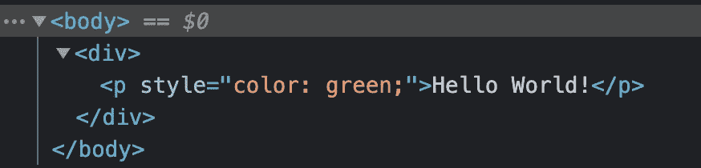

# 认识 Snabbdom:一个用于构建虚拟 dom 的低级库

> 原文：<https://javascript.plainenglish.io/snabbdom-8a1fa7f9105d?source=collection_archive---------3----------------------->

## Snabbdom 入门:渲染、更新、钩子等等


Image Credits: [Snabbdom on GitHub](https://github.com/snabbdom/snabbdom)

Snabbdom 是一个非常小但功能强大的虚拟 dom。另一个虚拟 DOM？React 和其他的还不够吗？

虽然像 React 这样的库的方法是提供一种随时可用的体验，但这并不是 Snabbdom 的初衷。你马上就会在语法中看到它。

Snabbdom 更像一个虚拟 dom，提供了在其上构建的选项。比如 Vue.js，就是建立在 Snabbdom 之上的。在官方的 GitHub repo 中，列出了许多其他使用 Snabbdom 的库和框架。

在 Snabbdom 之上进行构建是可能的，因为它具有非终结化、简单和可扩展的代码编写方式。准备好学习这个迷人的底层虚拟 DOM 的基础知识了吗？

# 入门指南

由于 Snabbdom 是一个库，而不是一个像 React 或 Vue 那样具有 CLI 的完整生态系统，我们将构建一个普通的 JS 设置。我会用 Vite，因为它超级快而且容易使用。之前不需要安装任何东西。

以下是如何开始:

```
yarn create vite virtual-dom --template vanilla// or: // NPM 6.x: npm init vite@latest my-vue-app --template vue// NPM 7.x: npm init vite@latest virtual-dom -- --template vue
```

NPM 的双破折号并不是一个错误。创建的目录将被称为“虚拟 dom”。一旦 Vite 完成了设置，你就可以进入并安装需要的东西了。

在 index.html，我们只有最简单的设置:

与`npm run dev`或`yarn run dev` Vite 的开发服务器默认应该是链接的。所以，一定要运行它。

现在，让我们编写一个最小的组件并将其呈现给 DOM。
我先给你看代码，然后给你解释:

现在，我们忽略补丁函数的导入和初始化。这只是默认的东西。

第一个有趣的部分是容器变量。几乎在所有使用虚拟 DOM 的库中，我们都需要 DOM 中的根元素。这是我们的组件安装的地方。变量`container`正是这个根。

Snabbdom 中 DOM 中的所有元素都是使用一个名为“h”的函数创建的。你可能从 Preact 中知道这个函数。我们的组件实际上由两个 DOM 元素组成。对于每一个，我们称之为“h”函数。该函数采用以下参数:

*   HTML 标签或与 CSS 选择器结合的标签(为元素提供类或 id)
*   可选项:包含对象的对象，例如事件或内联样式。
*   可选:更多 DOM 元素的数组，每个元素作为一个“h”函数调用。

如您所见，我们的 div 有一个子元素——段落。

为了挂载 DOM 中的每个组件，我们需要将它放入 patch 函数中(仍然在上面的代码示例中)。

然后，您应该在 DOM 中看到呈现的组件:



现在，我们已经涵盖了绝对的基础知识。让我们更详细地讨论一下

# 处理事件

提供应该触发的事件很容易。如前所述，事件属于 Snabbdom 组件的 options 对象。在这个对象中，我们可以定义一个新的对象，作为“on”的子对象，也就是说，我们希望监听这个元素上的动作:

因此，每当单击这个按钮时，就会执行函数“clickHandler”。

有时，我们希望在事件处理函数中传递参数。然而，`click: clickHandler(argument)`将立即执行该功能。您可能从 React 中知道这个“问题”。

我们需要做的是传递一个函数:

当您单击按钮时，传递参数并记录下来就可以了。

# 更新 DOM

现在，我们刚刚学习了处理事件，我们可以用它来更新我们的 DOM。正如你从 Vue、React 或 Angular 中所知，有一种东西我们称之为状态。每当这种状态改变时(例如，计数器变量)，依赖于它的 UI 组件会自动更新。这也是我们想要实现的目标。

更新一些 DOM 元素很容易——我们使用“补丁”功能。
我们以前用过这个功能。是时候了解它是如何工作的了。

`patch`需要两个参数:

*   第一个是 VDOM 节点，代表当前视图
*   第二个是代表更新视图的 VDOM 节点

还记得我们通过 Snabbdom 在 DOM 中呈现一个 div 并检查它在浏览器中的外观吗？

在我们的 HTML 文件中硬编码的原始 div 容器不见了:

```
<div id="container"></div>
```

因为我们在它上面使用了补丁，VDOM 节点没有被附加，而是替换了容器。

所以，如果我们想要更新一个值已经改变的 DOM 元素，我们用 patch 替换当前的元素。为了生成刷新的组件，我们可以使用一个函数——它返回我们的 VDOM 节点。代码如下:

我们的函数“component”生成一个 div，包装一个按钮和一个 p 标签，显示“counter”变量。当我们点击按钮时，计数器增加。然后，新视图生成并存储在变量`newVnode`中。为了更新可见的 DOM，我们覆盖了现有的容器并用新的组件视图修补它。

## 使用事件值更新

现在，我们刚刚学习了处理事件，我们可以用它来更新我们的 DOM——使用事件目标值。这对于更新文本很有效。
除了对 DOM 节点中的点击事件做出反应，我们还可以处理用户输入——至少在像`<input />`这样的元素中。

在调用事件处理函数时，默认情况下，事件对象作为参数传递。例如，它包含输入字段的当前状态。您可能从 React 中了解到它，我们也可以在这里使用它:

当您在浏览器中打开它时，应该可以正常工作。如果您在浏览器开发工具中打开 elements-inspector，您可以看到一些有趣的东西。每当您在输入字段中输入内容时，整个组件都不会重新呈现。只有必要的部分，在我们的情况下，段落，是。

# 从 DOM 中移除我们的元素

与挂载一样，卸载也使用补丁功能。
让我们将它应用于 DOM 中现有的组件。

为了查看从 DOM 中删除它的操作，我将卸载代码设置为超时，耗时 3 秒:

就是这样。我们用“！”来修补 DOM 中现有的组件这使得 Snabbdom 明白我们想要卸载我们的元素。

# 钩住

就像在 React 中一样，从你可能知道的地方，钩子正在钩入一些组件进程。例如安装、更新或卸载。

到目前为止，Snabbdom 中有 10 个钩子可用。因为它们都以几乎相同的方式工作，所以我们现在关注其中的一个:更新钩子。

每当我们的组件更新时，就会触发更新挂钩。我们知道，更新是通过补丁函数提交的。为了实现钩子，我们重用了输入字段的例子。我们需要添加的只是组件选项中的`hook`对象:

每当您在文本字段中键入内容时，我们之前编写的输入处理程序都会通过重新运行组件函数来更新 DOM。因为 Snabbdom 很聪明，所以它只更新必要的内容——段落。

因为我们已经进入了更新过程，所以每当文本字段中的输入发生变化时，就会运行 console.log。

感谢您的阅读！