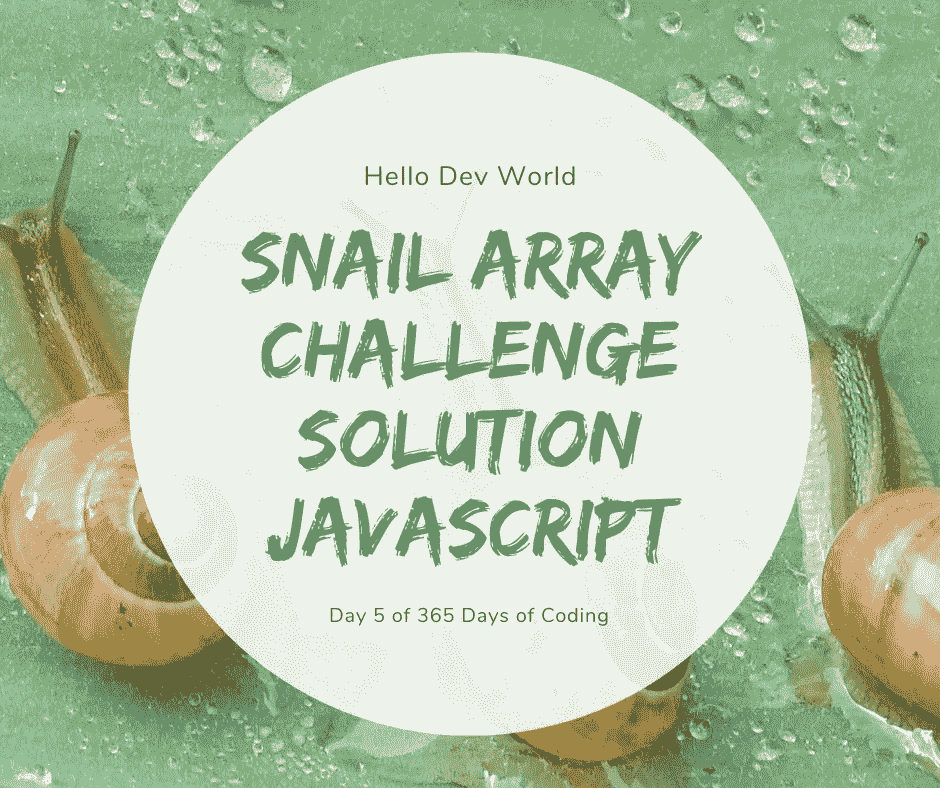

# 蜗牛数组挑战解决方案 JavaScript

> 原文：<https://javascript.plainenglish.io/snail-array-challenge-solution-javascript-336bbc35e36c?source=collection_archive---------16----------------------->



今天我们向《代码大战》借一个挑战！

**免责声明:**这不是我的挑战，原挑战是有关联的。还有，解决这个问题的方法有很多。这些是我写的或者我觉得聪明的一些答案，解释了它们为什么/如何工作

**TLDR:** 在帖子底部解释最佳解决方案，在每个部分底部解释实际解决方案

# 问题是

创建一个接受和数组的函数。给定一个`n x n`数组，返回从最外层元素到中间元素排列的数组元素，顺时针方向移动。

示例:

```
snail( [[1,2,3], [4,5,6],[7,8,9]]) // [1,2,3,6,9,8,7,4,5] 
        snail([[1,2,3], [8,9,4], [7,6,5]]) // [1,2,3,4,5,6,7,8,9]
        snail([[1,2,3,1], [4,5,6,4], [7,8,9,7], [7,8,9,7]]) // [1,2,3,1,4,7,7,9,8,7,7,4,5,6,8,9]
```

下图可能会有所帮助。你也可以去 [Codewars](https://www.codewars.com/kata/521c2db8ddc89b9b7a0000c1/javascript) 页面获取更多信息并测试你的解决方案


# 解决方法

所以让我们分解一些可能的解决方案

*   可能性 1
*   为最终数组创建一个变量
*   在父数组中循环——当数组中仍有项目时
*   获取第一行(数组中的第一个数组)
*   获取每个数组末尾的项目(右侧)
*   从末端到前面得到底部行(底部行反转)
*   获取数组开头的项目(左侧)
*   可能性 2
*   为最终数组创建一个变量
*   在父数组中循环——当数组中仍有项目时
*   坐第一排
*   获取每个数组中的最后一项
*   反转父数组和父数组中的每个数组

# 解决方案 1 —可读性和性能

首先，我们需要创建一个接受数组的函数

```
const snail = (arr) => {
  //create a variable for the final array
  //loop through the parent array - while array still has items in it
    //get the first row (first array in the array)
    //get the items at the end of each array (right side) 
    //get the bottom row from end to front (bottom row reversed)
    //get the items at the beginning of the arrays (left side)
}
```

我们必须创建变量来将所有内容放入其中，以获得最终的数组。我们将把它实例化为一个空数组，所有的内容都将被添加到这个数组中，如果没有任何内容要添加，我们将按预期在最后返回[]

```
const snail = (arr) => {
  let finalArray = []
  //loop through the parent array - while array still has items in it
    //get the first row (first array in the array)
    //get the items at the end of each array (right side) 
    //get the bottom row from end to front (bottom row reversed)
    //get the items at the beginning of the arrays (left side)
}
```

现在我们需要添加一个 while 循环。如果您不熟悉它们，请查看本 MDN 页面[。我们需要在这里做一个 while 循环，因为我们不知道这个循环要经历多少次才能得到最终答案。我们将在数组有长度的情况下进行循环，因为我们将在循环时从每个数组中移除元素。最后数组里什么都没有了，所以长度为 0，这就是我们结束循环执行的时候。](https://developer.mozilla.org/en-US/docs/Web/JavaScript/Reference/Statements/while)

```
const snail = (arr) => {
  let finalArray = []
  while (arr.length){
    //get the first row (first array in the array)
    //get the items at the end of each array (right side) 
    //get the bottom row from end to front (bottom row reversed)
    //get the items at the beginning of the arrays (left side)
  }
}
```

我们想得到数组的数组中的第一个数组(第一行)如果你不知道如何[。移位()](https://developer.mozilla.org/en-US/docs/Web/JavaScript/Reference/Global_Objects/Array/shift)，[。push()](https://developer.mozilla.org/en-US/docs/Web/JavaScript/Reference/Global_Objects/Array/push) 或 [spread 操作符](https://developer.mozilla.org/en-US/docs/Web/JavaScript/Reference/Operators/Spread_syntax)可以检查这个 MDN 页面，但基本上它接受数组中的第一项。

```
const snail = (arr) => {
  let finalArray = []
  while (arr.length){
    finalArray.push(...arr.shift())
    //get the items at the end of each array (right side) 
    //get the bottom row from end to front (bottom row reversed)
    //get the items at the beginning of the arrays (left side)
  }
}
```

如果你不熟悉循环或[的](https://developer.mozilla.org/en-US/docs/Web/JavaScript/Reference/Global_Objects/Array/pop)[，我们需要得到每个数组末尾(右侧)的所有项目。在继续之前，请查看每个网站上的链接。](https://www.w3schools.com/js/js_loop_for.asp)

```
const snail = (arr) => {
  let finalArray = []
  while (arr.length){
    finalArray.push(...array.shift())
    for (var i = 0; i < arr.length; i++) {
        finalArray.push(arr[i].pop());
    }
    //get the bottom row from end to front (bottom row reversed)
    //get the items at the beginning of the arrays (left side)
  }
}
```

现在我们需要得到最后一个数组，如果你不熟悉的话，把它反转(底线)。reverse()在继续之前，检查此 MDN 页面的[。你会注意到我给了它一个空数组，以防没有最后一个数组，或者什么都没有。如果没有空数组，reverse 就会出错，所以如果数组没有要弹出的内容，我们就给它一个空数组。](https://developer.mozilla.org/en-US/docs/Web/JavaScript/Reference/Global_Objects/Array/reverse)

```
const snail = (array) =>{
  let finalArray = []
  while(array.length){
    finalArray.push(...array.shift())
    for (var i = 0; i < array.length; i++){
      finalArray.push(array[i].pop())
    }
    finalArray.push(...(array.pop() || []).reverse())
    //get the items at the beginning of the arrays (left side)
  }
}
```

我们剩下的就是获取左侧，所以我们需要从每个数组中获取所有的第一项。你会注意到 I 将是数组-1 的长度，因为我们不想抓取第一个数组。我们将在下一个循环中获取它，所以我们只需要第一个数组之前的第一个数字。

```
const snail = (array) =>{
  let finalArray = []
  while(array.length){
    finalArray.push(...array.shift())
    for (var i = 0; i < array.length; i++){
      finalArray.push(array[i].pop())
    }
    finalArray.push(...(array.pop() || []).reverse())
    for (var i = array.length -1; i >= 0; i--){
      finalArray.push(array[i].shift())
    }
  }
}
```

最后但同样重要的是，我们返回我们已经构建的最终数组

```
const snail = (array) =>{
  let finalArray = []
  while(array.length){
    finalArray.push(...array.shift())
    for (var i = 0; i < array.length; i++){
      finalArray.push(array[i].pop())
    }
    finalArray.push(...(array.pop() || []).reverse())
    for (var i = array.length -1; i >= 0; i--){
      finalArray.push(array[i].shift())
    }
  }
  return finalArray
}
```

# 解决方案 2——聪明且更少的代码行

这个解决方案是 Codewars[上每个人都喜欢的解决方案](https://www.codewars.com/kata/521c2db8ddc89b9b7a0000c1/javascript)它的性能较差，我不喜欢它的可读性，但它的代码行较少，非常聪明，所以我想我会与你分享它。

前几行与第一个解决方案相同

```
const snail = (arr) => {
  var finalArray = [];
  while (arr.length) {
    finalArray.push(...arr.shift());
    //get the last item in each array
    //reverse the parent array and each array in the parent array
  }
}
```

下一部分与第一个解决方案非常相似，实际上您可以为此切换第一个 for 循环，但我们将使用[。map()](https://developer.mozilla.org/en-US/docs/Web/JavaScript/Reference/Global_Objects/Array/map) 从每个数组(行)中获取最后一个数字，并将其推入 finalArray

```
const snail = (arr) => {
  var finalArray = [];
  while (arr.length) {
    finalArray.push(...arr.shift());
    arr.map(row => finalArray.push(row.pop()))
    //reverse the parent array and each array in the parent array
  }
}
```

这才是真正有趣的地方。现在，我们将反转整个数组和父数组中的每一项，并执行所有相同的逻辑，而不是反转底部的行。这将翻转一切，所以我们得到的不是顶行，而是底行，不是右侧，而是左侧。然后循环继续

```
const snail = (arr) => {
  var finalArray = [];
  while (arr.length) {
    finalArray.push(...arr.shift());
    arr.map(row => finalArray.push(row.pop()))
    arr.reverse().map(row => row.reverse());
  }
}
```

最后，我们返回 finalArray 和 TA DA！你有你的解决方案

```
const snail = (arr) => {
  var finalArray = [];
  while (arr.length) {
    finalArray.push(...arr.shift());
    arr.map(row => finalArray.push(row.pop()))
    arr.reverse().map(row => row.reverse());
  }
  return finalArray
}
```

相当酷！

# 结论

第二种解决方案很聪明，行数更少，但是更难阅读，性能也不好。下面是使用上面例子的 [jsbench](https://jsbench.me/) 性能结果，供感兴趣的人参考。


我希望你玩得开心！请在评论区留下你的解决方案。如果你有任何你希望看到完成的挑战，也请在下面的评论中留下，你可能会看到它出现！如果你想在每天早上通过电子邮件收到挑战，并在发布解决方案时收到通知，请订阅下面的

【hellodevworld.com】原载于[](https://hellodevworld.com/365-days-of-coding/snail-array-challenge-solution-javascript)