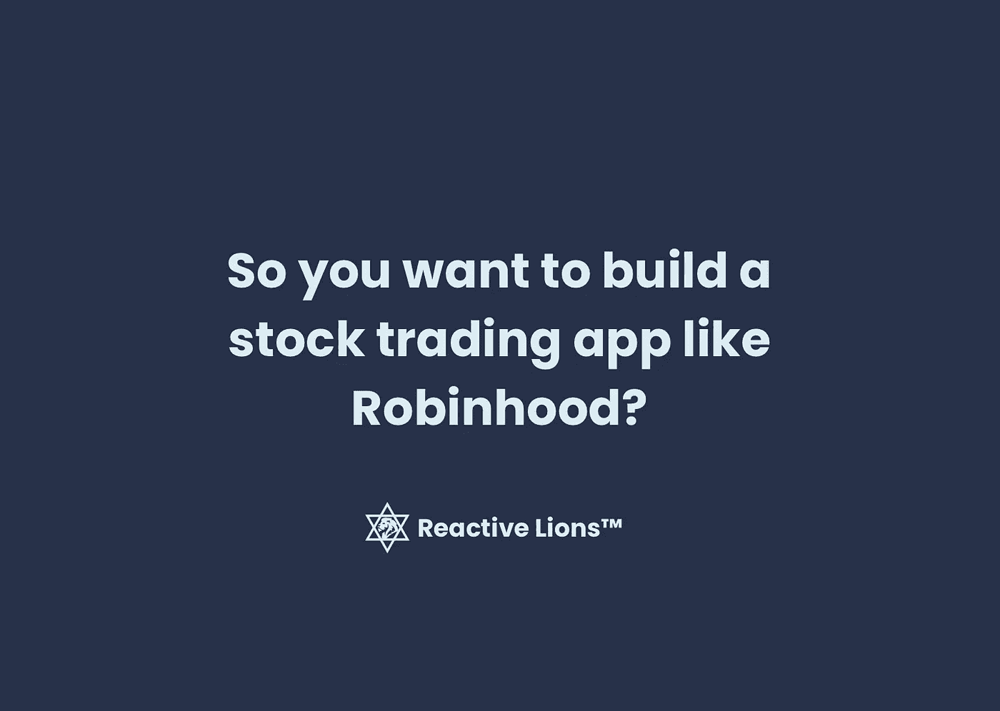
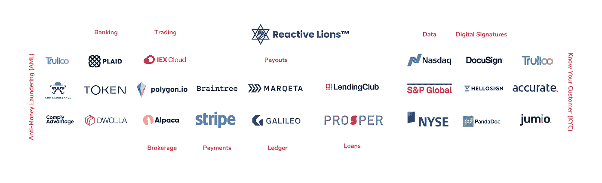
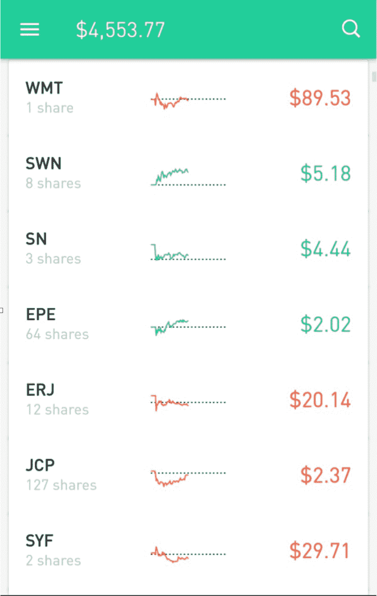

# 所以你想建一个像 Robinhood 一样的炒股 App？

> 原文：<https://javascript.plainenglish.io/so-you-want-to-build-a-stock-trading-app-like-robinhood-bd6903fc9ae7?source=collection_archive---------13----------------------->

企业家如何从技术角度接触金融科技产品的心智模型。

## 概述

*   **动机**——为什么我决定写一篇关于打造金融科技产品的文章。
*   **市场概述** —现有公司以及它们之间的差异。
*   **现有 API**—顶级 API 厂商概述。
*   **股票交易数据** —如何以及在哪里获取数据以显示给用户。
*   **实时与按需** —关于它如何影响您的技术架构和业务模式。
*   **商业模式**——如何用你的金融科技产品赚钱。
*   **存款和支出** —支票和储蓄账户的法规和保险方面。
*   **桌面 vs 移动** —我对应该如何做的看法。
*   **加密** —非常短的加密供应商列表
*   **国际国内市场** —国外市场概述
*   **何去何从** —总结金融科技思维和 API first 业务。
*   **接下来的步骤**

## 谁应该阅读这篇文章

*   希望打入美国或海外金融科技市场的创始人。
*   负责推出新服务或产品的银行家。
*   准备推出自己经纪业务的经纪人。
*   希望让客户在其平台上实现交易自动化的基金经理。

## 动机

我的软件公司的许多客户都从事金融科技业务。每周我都会收到一个关于在股票交易领域创业或在现有产品中增加功能以拓展金融科技的问题。本文的目的是回答一些常见的问题，并就如何围绕金融科技产品理念构建科技和商业的决策过程提供指导。

在过去的十年里，我与不同的金融科技公司合作，帮助他们围绕金融产品建立技术团队、技术和业务。银行、保险公司、基金、信托、区块链公司、风投……我都看过了。

那么，如何开始打造一款金融科技产品呢？

这个过程应该从研究开始，找到你的企业能够控制的利基。你的最低可行产品(MVP)的目标应该是找到并验证你的产品市场适合度(PMF)。

在本文中，我将描述成功的股票交易 MVP 的主要支柱，特别是面向消费者的股票交易，移动优先产品:

*   股票交易 API
*   经纪 API
*   银行 API
*   分类帐 API
*   交易基础设施

## 市场概述

今天的市场已经被那些准备拿走你的钱并为你投资于不同的证券的初创公司和老牌公司饱和了。每家金融科技公司都专注于不同的领域，为你的投资组合提供独特的优势。

以下是现有消费金融科技公司的主要细分市场:

*   股票交易
*   贵金属交易
*   交易基金、商品、期权策略、私募股权
*   具有储蓄和支票账户的传统银行业务
*   全面的银行服务
*   交易加密货币
*   贷款
*   保险
*   外汇
*   交换

还有一个现有的和成熟的 B2B 金融科技市场，在中小企业和大公司之间运作，还有一层金融科技公司，为大型银行和 Visa 或 Mastercard 等处理系统服务。

以下是我认为的前 10 条，按字母顺序排列:

*   acorn——让你每月投资农达。
*   查尔斯·施瓦布——经典的交易平台。
*   e * TRADE——摩根士丹利的贸易子公司。
*   富达——像嘉信理财一样，让你在交易所交易基金的基础上交易期权。
*   robin hood——移动优先交易公司，第一个提供自由交易的公司。
*   SoFi —提供从贷款到保险服务的金融公司。
*   stash——成立于 2015 年的金融科技公司，允许用户进行小额增量投资，类似于 Acorn。
*   储备——第一家将股票作为礼券出售的公司。
*   TD Ameritrade——嘉信理财集团的子公司。
*   we bull——成立于 2017 年的金融科技交易平台。

## 现有 API

首先，你需要定义谁是你的目标受众的假设。接下来，您需要定义至少一项您需要提供的服务，以便为他们提供价值。这个决定应该得到用户和市场研究的支持。

有几大类供应商你会想考虑你的企业取得成功。这里有一个可用 API 的地图，你将需要建立你的金融科技产品。

Major FinTech APIs

为建立信任并简化公司产品和安全的维护，您需要考虑的其他事项，包括技术和财务方面:

*   合规性(CCPA、GDPR、ISO 27001、ISO 9001、ISO 31000 的 PCI DSS)
*   安全性
*   监视
*   审计处理
*   联邦储蓄保险公司
*   SIPC
*   FATCA

## 证券交易数据

API 服务的发展使得今天的金融科技公司如此强大，并使它们能够扰乱银行业。不需要通过漫长的官僚流程等待流程完成，您可以直接调用一个 API 来实现自动化。你不用依赖人类的偏见，你有一个算法和大数据来支持你的银行提供商所做的每一个决定。每个交易应用程序的核心都是获取和传输股票数据的功能。

大多数库存 API 提供者以实时或按需模式运行。

除了股票，大多数应用程序还会为您提供其他订阅源，如:

*   选择
*   货币(外汇)
*   秘密党员
*   收益
*   红利
*   新闻
*   统计数字
*   关键指标
*   公司信息

美国有两大交易所——纳斯达克(NASDAQ)和 T2(NYSE)，你可以直接从它们那里查询数据，但大多数公司会选择与聚合商合作，使用相同的数据格式和协议来获得更好的交易和性能。

一些著名的股票数据聚合器有:

*   [IEX 云](https://iexcloud.io/)
*   [羊驼](https://alpaca.markets/broker)
*   [多边形](https://polygon.io/stocks)

一旦你在 MVP 阶段后成长，你将需要使数据来源多样化，并通过你的内部平台提供关于不同证券的信息。现在是实现数据湖的时候了，它将从多个来源获取数据，并使您能够实时查询大量数据。

## 实时与按需

从财务的角度来看，你需要弄清楚你是想提供实时交易(不到一秒钟)还是按需交易(超过一秒钟)的能力。谁先下单，谁就能更快地进入市场，谁就能在执行对自己有利的交易时占据技术优势。

考虑一下你是否想要提供高频交易(由机器在纳秒内执行的交易)，这通常不在消费者的关注范围内，并且是精通技术的客户想要在日常交易中安装他们的自动化算法的东西。

从技术角度来看，您最有可能最终使用 REST API 或 WebSockets API，因为它们涵盖了流式数据和执行交易订单的按需和实时用例。几乎没有理由使用花哨的 gRPC 或 GraphQL，但使用后者进行更高级的数据发现(如公司信息、新闻、统计数据、收益等)可能是有意义的。

REST API 为您提供了一种按需查询每个特定股票代码的方式，而 WebSockets 将提供以您选择的聚合器的速度实时传输变化的方法。在你的客户和证券交易所之间总会有延迟。

*注意*:有一部很棒的电影，讲述的是试图解决使用光纤更快执行交易的最后一英里问题——[蜂鸟项目(2018)](https://www.imdb.com/title/tt6866224/)

在您弄清楚了您想要流式传输什么数据以及如何将它呈现给最终用户之后，您将会看到一些数据聚合器为您提供了 API 来简化您呈现数据的方式。例如，IEX 云和羊驼允许你将多个 tickers 批处理到一个请求中，使你的移动客户端通过执行一个查询而不是几十个查询来呈现结果。

这将节省您的时间，提高您的 UX，并让您生成如下漂亮的屏幕:

Mobile interface with stock tickers and balance amount

## 商业模式

罗宾汉起飞是因为他们开始提供自由贸易。你的用户进行的每笔交易都会产生一点交易费，你需要通过向客户收费或其他方式从你的收入中支付。就 Robinhood 而言，他们通过获取短期现金存款的利率、收取额外功能(黄金)的溢价，以及通过提供保证金着陆、回扣和其他方式获得保证金利息来支付费用

此外，Robinhood 涵盖不同类型的交易，向对冲基金等不同的数据消费者出售交易数据。

一旦你弄清楚你的产品市场适合度(PMF)是什么，以及你计划如何将你的产品货币化，你就需要为你的数据和交易选择合适的提供商。

例如，IEX 云向你收取交易费用，而羊驼等提供商向你收取数据费用，而不是每次交易的费用。

## 存款和支出

只有 Alpaca 提供了一种叫做 Broker API 的东西来解决管理客户账户和资金的特定需求，包括转账、日志、分类账、资产等等。这项功能是大多数金融科技公司共同核心的一部分。碰巧的是，羊驼首先提供股票交易产品，并且通过同时提供交易 API 和经纪人 API，它做得足够好，可以建立一个可持续的商业模式。

随着您业务的增长，您很可能最终会在内部实现这一功能，因为您的客户会希望在进行 ACH 付款时有更大的灵活性，或者在不同的时间窗口从现有帐户中提款，或者当您决定在现有帐户上放置借记卡时。当你决定这样做时，你需要建立一个内部分类账系统，以确保你符合联邦存款保险公司和 SIPC 进行的财务审计。

联邦存款保险公司会让你向你的客户保证，现金存款在联邦存款保险公司投保，通常高达 250，000 美元。这是客户期望从处理现金业务的传统银行或机构得到的东西。

像 FDIC 一样，SIPC 为你的客户购买的证券提供担保，通常除了受 FDIC 保护的现金价值之外，还包括另外 25 万美元的证券，最终担保金额为 50 万美元。

Galileo Financial Technologies 为金融科技公司和中小企业提供了自己的总账解决方案，将简化您的首次审计，以符合现有的法规。这也将简化你的会计，税收，并给你的最终客户清晰。您可以选择在内部建立分类账，但这会大幅增加您团队的规模。

以下是我的一位金融科技客户对委托记账的看法:

> 这就像雇佣一个 CFO 和 CPAs 的团队，而不是使用 Xero。

## 桌面与移动

现在是 2021 年，所以这应该是显而易见的。在过去的几十年里，公司一直在使用桌面版的软件。我记得小时候玩过沙盒外汇交易账户，只有下载一些桌面软件后才能进入。

**今天，你需要进入移动时代。**

如果你足够幸运，能快速获得 PMF，你就有足够的资源将你的产品推广到网络上，迎合更广泛的受众。除非你的目标是执行机器人交易的高频交易者，否则你不需要发布桌面版。

## 秘密党员

> 区块链，区块链，区块，链…

这是一个值得单独出版的大话题。

事实是，从每个交易所获取每种加密货币的交易信息的技术实现有点像股票交易所做的事情。幸运的是，加密交易所不需要像传统的银行和证券交易所那样支持大量旧的遗留基础设施。

一些现有的市场领导者包括:

*   CoinBase Pro API
*   币安 API
*   HitBTC API

如果你想了解更多，请在下面的评论区告诉我哪个方面最让你的公司兴奋。

## 国际和国内市场

我主要负责美国和欧盟市场的金融科技项目，但在过去几年里，越来越多的参与者出现在拉美和亚洲市场，非洲和亚洲的发展中市场看起来也非常有趣和有前景。

其中大多数都有非常相似的技术执行，但有不同的法规。欧盟一项引人注目的举措是[开放银行业](https://www.thebalance.com/what-is-open-banking-and-how-will-it-affect-you-4173727)。这是一项法规，强制所有银行在某种程度上通过 API 提供服务，最终用户可以享受更便宜的价格和更多样化的产品和服务

当你分析欧盟的市场机会时，我总是会想起一个创始故事，即 Wise(前 TransferWise)是如何启动和扩大规模的故事。

## 从这里去哪里

> “软件正在吞噬世界”——马克·安德森，2011 年

金融科技也不例外，因为这个阶段是马克·安德森在 2011 年引入的。过去十年，我们推出的金融科技服务比以往任何时候都多。当你创办一家新的银行、保险公司、对冲基金、信托公司时，你最有可能最终拥有一个主要的技术组件，这将使你的新企业在大多数情况下成为一家金融科技公司。

要成功创办一家金融科技公司，你需要能够快速创新，并实时向客户提供服务。今天各种各样的 API 可以帮助你在合理的时间和预算内实现这一目标。

尽管打造你的金融科技产品很重要，但打造你的团队也同样重要。

一旦你有了第一个概念验证(PoC)运行，专注于创建一个用户研究小组，并建立一个财务专家团队(首席财务官、合规官、CISO、安全和风险分析)，这样你就能够巩固你的地位，一旦你抓住了一个过饱和的市场。

## 后续步骤

我正在编写下一个出版物，它将向您展示构建一个简单的股票交易移动应用程序是多么容易，以及创建一个 PoC 需要多么少的资源。

如果您希望我在下一篇文章中介绍您的用例，请在评论中联系我们。

## 关于作者

Eugene Hauptmann, CEO of [Reactive Lions](https://www.reactivelions.com/)™

尤金是一个以信仰为中心的技术专家，连续企业家，天使投资人，顾问和导师。

他是 REACTIVE LIONS INC. 的创始人兼首席执行官，在这里，他正在实现自己的愿景，即在科技世界中以信念驱动创业。他目前在美国管理着一个由 40 多名才华横溢的工程师组成的团队。

*更多内容尽在*[plain English . io](http://plainenglish.io/)