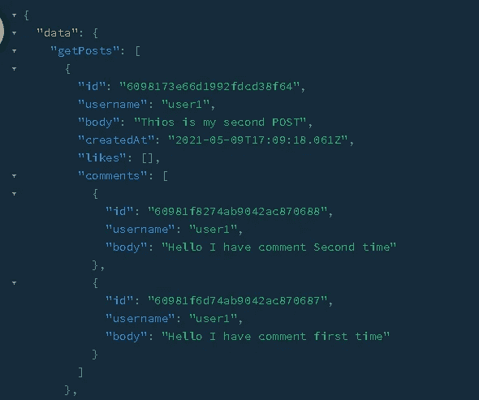

# SOAP vs . REST vs . graph QL:Web API 服务之间的区别

> 原文：<https://javascript.plainenglish.io/soap-vs-rest-vs-graphql-difference-between-web-api-services-461eee5d1ad7?source=collection_archive---------6----------------------->

Source: Google

API 是一组编程代码/指令，能够在一个软件和另一个软件之间进行数据传输。

# API 是如何工作的？

众所周知，数据通常存储在服务器上。要检索这些数据，我们应该知道 API 如何与数据库对话(这就是 API 所做的),以获得我们想要的特定数据。它通过接收我们的请求并返回特定服务或客户端所需的数据来提供帮助。

例如:假设您在浏览器中键入一个 URL 来访问一个网页，您实际上是在向服务器发送一个请求，请求显示该网站所需的所有数据。也就是说，你在网址中输入 youtube.com，点击一个特定的视频，然后你向服务器发送一个访问视频的请求，并开始播放它的内容。

现在很清楚什么是 API 了，所以在接下来的讨论中，我们将讨论不同类型的 Web API。

Source: Google

## 什么是肥皂？

SOAP 是简单对象访问协议的缩写。SOAP 是一种在 REST 之前就存在的协议。SOAP 出现的主要原因是为了确保内置于不同平台或编程语言的程序能够以一种简单的方式交换数据。

## 使用 SOAP 的好处:

SOAP 的标准 HTTP 协议使得跨防火墙操作更加容易，而无需修改 SOAP 协议本身。但是因为它使用了复杂的 XML 格式，所以速度很慢。

## 肥皂的风险:

*   SOAP 只允许 XML 格式在网络上传输数据。
*   SOAP 需要更多的带宽。
*   最后但并非最不重要的是，从客户端传输到服务器的消息大小很大。

## 什么是休息？

与 SOAP 是一种协议不同，REST 是一种 API 设计架构。它代表代表性的状态转移。SOAP 和 REST 的关键区别在于，SOAP 使用服务接口来公开功能，而 REST 使用统一服务定位器来访问组件。

## 使用 REST 的好处:

*   REST 允许更多的格式，而 SOAP 只支持 XML。
*   休息是无状态的。
*   因为 SOAP 消息的大小更大，所以它们需要更大的带宽，这与 REST 的情况相反。

**注:**

**有状态 VS 无状态**

在讨论 Web 服务 API 时，需要了解有状态和无状态，其中 SOAP 是有状态的，而 REST 是无状态的。

假设您想要访问一个网站，并且您的数据托管在服务器上，因此要访问您的数据，您需要向服务器发送包含您的电子邮件和密码的请求，这样，如果您的凭据有效，服务器就会对您进行身份验证，并将名为会话变量的特定变量设置为 true。

这表明用户已经过身份验证，能够访问他们的资源，就像访问他们的配置文件一样，但是现在让这个例子在一个真实的情况下进行，在这个情况下有多个服务器，假设有 2 个，我们知道一个服务器创建了一个会话变量来对他们端的用户进行身份验证，但是在某些情况下，由于负载平衡，请求被发送到另一个服务器，而给定用户的会话变量没有被设置，这表明未经身份验证，这不是一个很好的方法。

因此，为了处理这种情况，一种新的无状态方法应运而生，在这种方法中，服务器使用用户的电子邮件/用户名和密码对用户进行身份验证后，它会为用户分配一个令牌。

因此，每当用户发送访问资源的请求时，它需要在报头中发送令牌，以便服务器可以识别用户，在这种情况下，身份验证不依赖于服务器，因此不存在上述情况。

## 休息时的风险:

*   REST 不会像 SOAP 一样强加任何种类的安全。这就是 REST 非常适合公共可用 URL 的主要原因。
*   当我们谈到客户端和服务器之间的机密数据传输时，REST 是最糟糕的机制。
*   REST 是无状态的例如，如果您有一个购买站点，它有一个购物车机制，那么在购买发生之前，它需要知道购物车中的商品数量。不幸的是，维护这种状态的负担落在了客户端，这使得客户端应用程序变得更加沉重和难以维护。

## 肥皂和 REST 的区别:

SOAP 不能使用 REST，因为 SOAP 是一种协议，其中 REST 是一种架构模式，而 REST 可以利用 SOAP 作为 web 服务的底层协议，因为最终 REST 只是一种架构模式。

SOAP 的使用需要更多的带宽。由于 SOAP 消息体里面包含了很多信息，所以通常使用 SOAP 传输的数据量一般都很多。而 REST 在向服务器发送请求时不需要太多带宽。REST 消息主要由 JSON 消息组成。

## GraphQL 是什么？

和 REST 一样，GraphQL 也是 API 的一种架构设计模式。REST 和 GraphQL 的主要区别之一是 GraphQL 不处理专用资源。

相反，一切都被认为是一个图形，因此是相连的。

这意味着您可以根据自己的确切需求来更改请求/查询。

我们举个例子来理解 GraphQL 的概念，假设我们要创建一个写博客的网站，那么在这个网站中用户想要创建一个帖子，查看帖子，还想要删除帖子。

这里我不是解释如何在 GraphQL 中创建 API，而是试图帮助您理解 API 的结构:

从上面的图片中我们看到，在本地主机上的项目服务器之后，它显示了一个名为 GraphQL Playground 的 GraphQL 终端，在左侧我们看到了查询，即我们需要像 getALLPost 一样访问哪个路由，获取特定的帖子，或者甚至想要删除帖子。

您可以在屏幕中间看到“play”按钮，单击它可以运行您可以使用的特定 API，在右侧，您可以看到输出。

**注:**

您会注意到所有的 API 都在一个端点上工作，我们只需要通过在查询中传递 API 来指定我们想要运行哪个 API，我们还可以在输出中决定我们需要哪个特定的字段。

## 使用 GraphQL 的好处:

从上面的讨论中，很明显 GraphQL 比 REST 有一些优势，如下所示

*   通过单个 API 调用获取数据:GraphQL 和 REST 的最大区别在于，后者以单个端点为中心，因此要收集所有需要的数据，开发人员必须组合多个端点。尽管 GraphQL 关注的是任务本身，但在这种情况下，开发人员只需调用一次 API 就可以请求所需的数据。
*   **不存在取多取少的问题。**众所周知，REST 响应要么包含过量的数据，要么包含的数据不足，这就产生了额外请求的必要性。GraphQL 通过在单个请求中获取精确的数据来解决这个效率问题。

## GraphQL 的风险:

*   **对小型应用程序来说是大材小用。虽然 GraphQL 是多种微服务的正确解决方案，但如果是简单的应用程序，您最好选择 REST 架构。REST 也是连接资源驱动的应用程序的一种有价值的方法，这些应用程序不需要 GraphQL 提供的灵活查询。**
*   **复杂查询的性能问题**

# 结论:

REST 和 GraphQL 都是创建 API 的架构设计。REST 方法总是局限于处理单一资源。如果您需要来自 2 个不同资源的数据，您需要从服务器进行多次往返。

而 GraphQL 方法更灵活，克服了 REST 的缺点。

在 GraphQL 查询语言的帮助下，您可以准确地描述您的响应，就像我们在上面的 GraphQL 图片中看到的那样。

所以最后我们得出结论，创建 web 服务 API 所需的方法类型取决于项目的需求。

## 进一步阅读

 [## 如何从头开始构建一个 GraphQL 电子商务应用程序

### 这就是你要建造的东西！埃森哲的一项调查(19 个国家的 20，000 多名消费者)发现，47%的人…

简明英语. io](https://plainenglish.io/blog/how-to-build-a-graphql-ecommerce-app-from-scratch) 

*更多内容请看*[***plain English . io***](https://plainenglish.io/)*。报名参加我们的* [***免费周报***](http://newsletter.plainenglish.io/) *。关注我们关于*[***Twitter***](https://twitter.com/inPlainEngHQ)[***LinkedIn***](https://www.linkedin.com/company/inplainenglish/)*[***YouTube***](https://www.youtube.com/channel/UCtipWUghju290NWcn8jhyAw)*[***不和***](https://discord.gg/GtDtUAvyhW) *。对增长黑客感兴趣？检查* [***电路***](https://circuit.ooo/) *。***