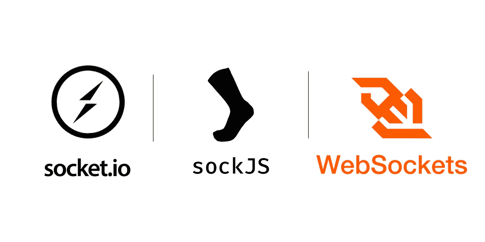

# 用于发布/订阅架构的套接字库

> 原文：<https://javascript.plainenglish.io/socket-libraries-for-your-pub-sub-architecture-abdf3ec5f06d?source=collection_archive---------6----------------------->

The biggest socket libraries on npm, compared surgically

因此，你正在寻求实现一个发布/订阅架构，很明显， [Redis](https://redis.io/topics/pubsub) 和 [Kafka](https://kafka.apache.org/) 正好穿过你的用例，因为如果他们没有，你为什么还在这里？

因此，您现在正在寻找使用套接字为您的项目原生实现这种架构，并且您对选择哪个库感到困惑。嗯，你来对地方了！我只是不得不为一个项目做出同样的选择，并最终研究了 Node.js 生态系统中最流行的套接字库，即[*socket . io*](https://www.npmjs.com/package/socket.io)[*ws*](https://www.npmjs.com/package/ws)[*sockJS*](https://www.npmjs.com/package/sockjs)和 [*primus*](https://www.npmjs.com/package/primus) ，希望能帮到你！

但是在我们深入研究之前，让我们首先确保我们在我们所说的发布/订阅架构的含义上是一致的。

# 发布/订阅架构🔃

用最基本的术语来说，每个这样的架构都由三个主要参与者组成，发布者、订阅者和代理。

发布者是发布关于某些“主题”的消息的人。然后，订阅者可以“订阅”这些主题中的任何一个，并接收发布者为该主题发布的消息。代理是负责维护和管理消息流、主题和数据抽象的中心机构。

我们还必须确保数据流是即时的，即消息发布和接收之间的时间间隔应该尽可能短。因此，我们谈论的是一种通信协议，在这种协议中，我们需要接近即时的双向通信，这就是为什么套接字是一种选择！

The Pub/Sub architecture: [https://aws.amazon.com/pub-sub-messaging/](https://aws.amazon.com/pub-sub-messaging/)

# ✨发布/订阅架构中的套接字

因此，如果我们要将套接字用于我们的发布/订阅架构，我们应该对它们有什么样的期望呢？我们应该如何实现它们来为我们的用例工作？

最重要的任务应该是实现一个隔离和干净的架构，即除了它订阅的主题和消息之外，任何发布者/订阅者都不应该知道任何其他主题和消息。

现在，我们应该对我们可能想要使用的套接字库有什么期望:

1.  它们应该是轻量级的，易于实现，有良好的文档支持。
2.  它们应该是可测试的，也就是说，单元测试应该可以使用一些常见的单元测试框架，比如 Jest、Mocha 等。
3.  他们应该有很好的社区支持，如果在我们之前有很多用户在使用它，那就太好了。

在所有这些事情的基础上，我们现在比较这些库。

# 让战斗开始吧！💥

我们将根据上面提到的所有因素来比较这些库。我们首先要看的是库本身，而不是它们的实现。

**包装尺寸**

根据*b*[T5【无恐惧】T6](https://bundlephobia.com/)，这些库的缩小尺寸为:

*   *ws@7.4.6* : 216B +无依赖关系
*   *sockjs@0.3.21* : 23.5kB +多个依赖项
*   *socket . io @ 4 . 1 . 2*:46.1 kb+多个依赖项
*   *primus@8.0.3* : 98kB +多个依赖项

**测试支架**

除了 *primus* 之外的所有库都有特定的客户端库，可以让你测试你的代码和连接。由于 primus 是建立在这样的套接字库之上的覆盖层，它也可以用类似的方式进行测试。

请记住，在使用 *primus* 时，如果您更改了代理/服务器上的父套接字库，您也必须在您的客户机上进行相同的更改。

套接字服务器和客户端库应该保持相同。大多数库在与服务器握手并建立连接时会传输一些特定于库的数据。 *Socket.io* 服务器只能与 *socket.io* 客户端连接，标准浏览器 *WebSocket* 实例将无法保持这样的连接。

**社区支持**

权衡社区支持是一项非常艰难的工作。我曾试图根据 GitHub 存储库上的 stars 和 forks、npm 上的每周下载量、堆栈溢出答案以及许多其他超出本博客范围的因素进行比较。但是 TLDR； *socket.io* 正式和非正式地提供了最好的社区支持，而 *ws* 在社区测试方面是我们的领导者，即它开箱后就经过了非常繁重的负载测试，并且其存储库中的开放问题最少。

# 实现架构🧮

发布/订阅架构基于两个重要属性:

1.  监听和发出自定义事件的能力。
2.  不关心与特定套接字不相关的数据

基于以上两个事实对比库，我们发现 *ws* 和 *sockJS* 对自定义事件没有支持。尽管可以在开发人员端对它们进行处理和添加，但这将导致您的代码的一部分被彻底测试和实现，这不是您的业务逻辑的一部分。

关于第二点，我们看一下 ***房间*** 的概念，这意味着每一个连接上的套接字都被扔在一个特定的房间里，并且只能发出/监听那个房间的事件。这是为我们提供数据隔离和抽象的架构，我们的架构需要它。

不幸的是 *ws* 和 *sockJS* 缺乏对房间的内置支持，它们可以被添加，但会导致与上面相同的问题。

# 获胜者🎇

所以，我想你知道接下来会发生什么， *socket.io* 应该是实现你的发布/订阅架构的首选套接字库。Primus 紧随其后，因为它有更大的尺寸和依赖结构，同时它还是一个覆盖库。你必须安装另一个包 [*primus-rooms*](https://www.npmjs.com/package/primus-rooms) ，使用 *primus* 实现这个架构。

但是如果你想更好地控制你的架构，并且不怕弄脏你的手，你应该看看 ws。最易于战斗且经过严格测试的库。它可以优雅地扩展，甚至在非常高的负载下也能完美地工作。你会喜欢用它工作的！

# 所有闪光的不都是金子，🛑

所以你认为 *socket.io* 是你的完美选择？也许是这样，但是有些事情你必须记住。

**比赛条件**

*Socket.io* 使用回调语法，这意味着当发出客户端正在监听的事件时，客户端的反应在回调函数中完成。

如果回调中的代码碰巧是异步的，NodeJS 会让这种情况发生，并切换回主线程，等待新的发出。此时，如果发出另一个类似的事件，并且之前的异步任务没有完成，我们就有了一个 ***竞争条件*** 。

但是如果你只在回调中使用同步代码。你会很棒的。

解决上述问题的唯一方法是实现一种信号机制，通过回调确认请求的完成并将其发送给服务器，同时在此之前保持背压。

**致谢**

处理上述问题的一种可能方式是通过确认，即客户端可以向发送方发送请求已被接受和执行的确认。

但是在高负载系统上，确认的顺序不能保证，这会导致数据流的复杂化。

# 结论🚀

总而言之， *socket.io* 对于你的 pub/sub 架构来说是一个非常好的资源，因为它提供了关于自定义事件和加入房间能力的内置架构范例。

但是，如果您正在处理大量需要原子性的异步代码的高负载系统，那么这可能不是您的最佳选择，您应该考虑使用 *ws* 实现一个原生架构。

*更多内容尽在*[plain English . io](http://plainenglish.io/)