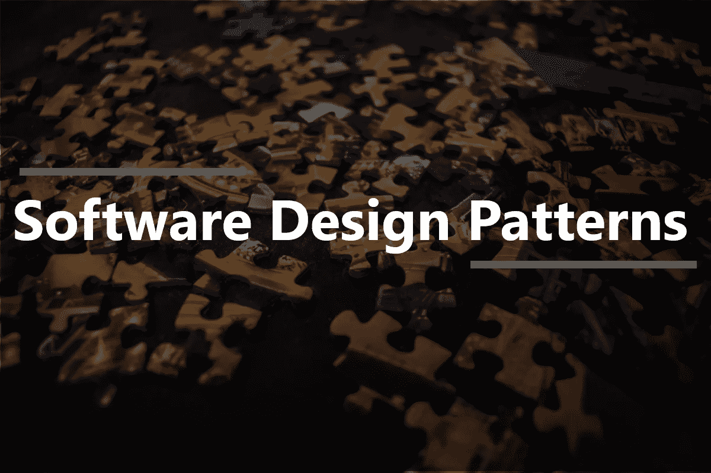
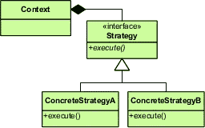
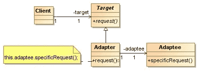
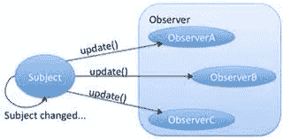
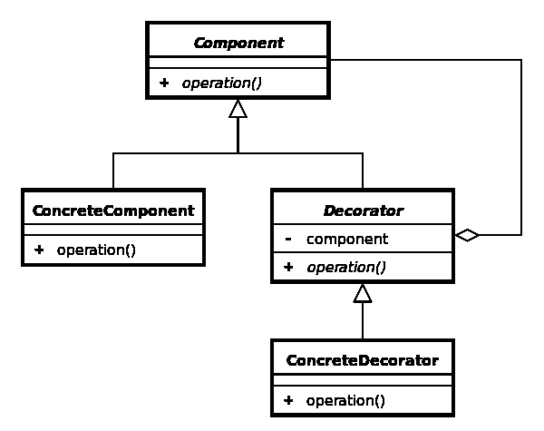
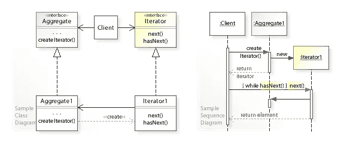
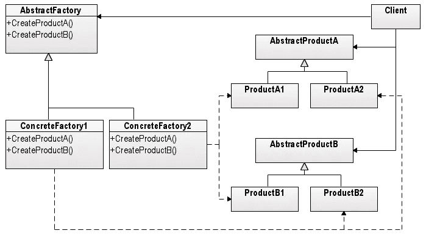

# 什么是软件设计模式？

> 原文：<https://javascript.plainenglish.io/software-design-patterns-4f16b2b43f20?source=collection_archive---------13----------------------->

## 设计模式是常见软件设计问题的可重用且高效的解决方案。

Photo by Fabian Kühne on Unsplash, Edited by Ruchika Mourya

一些最常见的面向对象设计难题可以使用设计模式来解决。它们是经过长时间反复试验而开发出来的有据可查的解决方案，可以应用于特定的设计问题。

> 设计模式最初是在《设计模式:可重用面向对象软件设计的元素》一书中描述的。这本书是由四位软件工程师写的。并且他们**介绍了 23 种设计模式，**这些设计模式被分为 3 类。

[创造 ](https://en.wikipedia.org/wiki/Creational_pattern)

*   [*抽象工厂*](https://en.wikipedia.org/wiki/Abstract_factory_pattern)
*   [*构建器*](https://en.wikipedia.org/wiki/Builder_pattern)
*   [*工厂法*](https://en.wikipedia.org/wiki/Factory_method_pattern)
*   [*原型*](https://en.wikipedia.org/wiki/Prototype_pattern)
*   [*单胎*](https://en.wikipedia.org/wiki/Singleton_pattern)

[**结构上的**](https://en.wikipedia.org/wiki/Structural_pattern)

*   [*适配器*](https://en.wikipedia.org/wiki/Adapter_pattern)
*   [*桥梁*](https://en.wikipedia.org/wiki/Bridge_pattern)
*   [*复合*](https://en.wikipedia.org/wiki/Composite_pattern)
*   [*装潢师*](https://en.wikipedia.org/wiki/Decorator_pattern)
*   [*立面*](https://en.wikipedia.org/wiki/Facade_pattern)
*   [*飞锤*](https://en.wikipedia.org/wiki/Flyweight_pattern)
*   [*代理*](https://en.wikipedia.org/wiki/Proxy_pattern)

[**行为**](https://en.wikipedia.org/wiki/Behavioral_pattern)

*   [*责任链*](https://en.wikipedia.org/wiki/Chain-of-responsibility_pattern)
*   [命令*命令*命令](https://en.wikipedia.org/wiki/Command_pattern)
*   [*解释器*](https://en.wikipedia.org/wiki/Interpreter_pattern)
*   [*迭代器*](https://en.wikipedia.org/wiki/Iterator_pattern)
*   [*调解员*](https://en.wikipedia.org/wiki/Mediator_pattern)
*   [*纪念物*](https://en.wikipedia.org/wiki/Memento_pattern)
*   [*观察者*](https://en.wikipedia.org/wiki/Observer_pattern)
*   [*状态*](https://en.wikipedia.org/wiki/State_pattern)
*   [*策略*](https://en.wikipedia.org/wiki/Strategy_pattern)
*   [*模板方法*](https://en.wikipedia.org/wiki/Template_method_pattern)
*   [*来访者*](https://en.wikipedia.org/wiki/Visitor_pattern)

设计模式通常会帮助你创建能够适应变化的软件。

**设计模式不是算法或代码**。设计模式是一种思考软件设计的方法，它结合了有类似问题的开发人员的经验，以及指导我们如何构建软件设计的基本设计原则。

**一个设计模式通常用一个定义、一个类图来表达，并收集到一个模式目录中。**

设计原则和设计模式是一样的吗？

不知道，

> 设计原则(封装、继承等)和设计模式是不同的。原则是一般的指导方针，而模式是特定的设计解决方案，通常旨在解决常见的面向对象的问题。设计模式由面向对象的基础组成。

让我们讨论几个设计模式

# 战略模式

策略模式定义了一系列算法，封装了每一个算法，并使它们可以互换。策略让算法独立于使用它的客户端而变化。现在，这个定义没有告诉我们如何实现模式，但是它给了我们一个关于模式意图的好主意。

根据维基百科，

> 策略模式(也称为策略模式)是一种行为软件设计模式，支持在运行时选择算法。代码不是直接实现单个算法，而是接收运行时指令，以决定使用哪种算法

例如，对传入数据执行验证的类可以使用策略模式来选择验证算法，这取决于数据类型、数据源、用户选择或其他判别因素。这些因素直到运行时才知道，可能需要进行完全不同的验证。

wiki/Strategy_pattern

这种使用组合(HAS-A)而不是继承(IS-A)的思想是另一个重要的设计原则。这个原则说，**如果你有选择，使用组合而不是继承**，因为通常情况下，组合会带来更灵活的设计。

# 适配器模式

适配器模式用于将一个类的接口转换成客户端期望的另一个接口。**适配器让由于不兼容接口而无法协同工作的类协同工作**。所以，这种模式给了我们一种方法，当两个类有不兼容的接口时，它们可以一起工作。

source: Wikipedia

> 适配器位于客户端和适配者之间，将客户端的调用委托给适配者。

适配器模式的优点是，您可以轻松地添加适配器，而根本不需要修改适配器，只需修改客户端就可以添加适配器。假设您有一个无法修改的 vendor 类，它使用了与您期望的不同的接口，但是您确实需要让 vendor 类与您的系统一起工作。适配器模式使这变得很容易。

# 观察者模式

**观察者设计模式基本上是发布者-订阅者关系**。任何对象都可以发送订阅发布者对象的请求。当发布者收到请求时，请求对象立即成为订阅者。

> 观察者模式定义了对象之间一对多的依赖关系，这样当一个对象改变状态时，它所有的依赖对象都会得到通知并自动更新。

观察者可以在任何时候自由地将自己添加到列表中，也可以删除自己，甚至在任何时候被另一个观察者取代。主体就是不在乎。它所做的只是维护一个列表，并在必要时通知列表上的对象。

> 开闭式设计原则认为，类/代码应该对扩展开放，但对修改关闭。

这个原理和构图为另一个设计开辟了道路，我们来讨论一下。

# 装饰图案

装饰模式动态地给对象附加额外的责任。

> **为了扩展功能，装饰者提供了子类化的灵活选择。**

source: [Wikipedia](https://en.wikipedia.org/wiki/Decorator_pattern)

# 迭代器模式

我们有很多方法将对象集合存储在数据结构中。例如，大多数现代编程语言都提供数组。如果您使用 Java，您可以将菜单的菜单项存储在一个数组中。

大多数语言提供了额外的结构来存储对象集合，如列表、字典和集合。例如，Java 提供了一个数组列表，它很像一个数组，但是也有一些类似列表的功能。这里，我们将菜单项存储在一个数组列表中。很简单，但是如果我们需要编写对其中几种集合类型进行操作的代码呢？

如果我们改变集合类型，有没有办法避免重写迭代代码？

> **迭代器模式提供了一种在不暴露底层表示的情况下顺序访问聚合对象元素的方法。**

简单地说， ***迭代器模式，允许你在迭代器中拉出迭代逻辑，并且该迭代器可以被不同的集合*** (Array，Arraylist..).

source: [Wikipedia](https://en.wikipedia.org/wiki/Iterator_pattern)

# 工厂模式

> **工厂允许我们将创建对象的过程与使用这些对象的客户端分离开来。**

这种模式定义了一个创建对象的接口，但是让子类决定实例化哪些类。

Kostyantyn Kolesnichenko, Public domain, via Wikimedia Commons

> **工厂模式封装了实现细节，底层实现**可以在不影响主实现的情况下进行更改。

当您需要创建复杂的产品并且希望提高封装级别时，最好创建一个工厂。工厂模式使我们的代码更加健壮、耦合更少并且易于扩展。

在本文中，我分享了一些关于设计模式的基本概念以及它通常是如何工作的。在接下来的文章中，我们将详细讨论这些问题。最后，我想告诉你一件非常重要的事情:

> **你不必在不需要的地方使用设计模式。试着让解决方案尽可能简单。**这里简单是关键，在不需要的地方添加设计模式会增加复杂性，并且会使您的系统效率低下。

我希望本文能帮助您了解一些设计模式及其优缺点。

请评论和分享，如果你喜欢的话，请告诉我，你的小小努力鼓励我写更多。

*更多内容请看*[***plain English . io***](https://plainenglish.io/)*。报名参加我们的* [***免费周报***](http://newsletter.plainenglish.io/) *。关注我们关于*[***Twitter***](https://twitter.com/inPlainEngHQ)*和*[***LinkedIn***](https://www.linkedin.com/company/inplainenglish/)*。加入我们的* [***社区不和谐***](https://discord.gg/GtDtUAvyhW) *。*