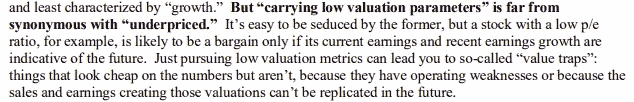

# 软件开发价值陷阱

> 原文：<https://javascript.plainenglish.io/software-development-value-traps-2289256fd452?source=collection_archive---------3----------------------->

## 价格是你付出的，软件的质量是你得到的

Dinovember in Hosk Towers

> “傻瓜忽视复杂性。实用主义者深受其害。有些可以避免。天才们会移除它。”—艾伦·珀利斯

在霍华德·马克的备忘录— [有价值的东西](https://www.oaktreecapital.com/docs/default-source/memos/something-of-value.pdf)中，他谈到了如何对谷歌的公司和股票进行估值。在软件开发中，我们考虑时间、质量和复杂性的价值来做出决策。

*   **时间** =金钱
*   **复杂** =复杂是技术债。当代码和解决方案不简单时，它们需要更长的时间来理解、维护和更新。
*   **质量** =质量代码简单。质量不太复杂，技术负担也较少。

马克斯谈论价值陷阱。价格便宜的东西可能看起来物有所值，但在某些情况下，这可能是一个陷阱。

[something of value](https://www.oaktreecapital.com/docs/default-source/memos/something-of-value.pdf)

在软件开发中，存在价值陷阱，开发看起来很便宜，或者捷径看起来是创建软件的更快方式。大多数捷径在短期内节省时间，但从长期来看花费更多的时间。

[为什么在项目中增加更多的人并不能使项目进展得更快](https://blog.devgenius.io/why-adding-more-people-to-a-project-doesnt-make-it-go-faster-703f9f56eea5) —现实=加入、增加的交流、相互冲突。会导致复杂性增加和更多的技术债务。

[为什么软件开发中的廉价选项成本更高？](https://blog.devgenius.io/why-the-cheap-option-in-software-development-cost-more-dfce7f32c728) =如果质量越低，生产成本就越高

不要编写单元测试——你会发现更少的 bug，并且当你改变代码时必须重新测试

ALM(devo PS)需要时间来设置，但可以节省时间并保持环境同步。

# **复杂性和价值**

在软件开发中有许多缩写词，开发人员被告知要遵守

*   接吻=保持简单愚蠢
*   YAGNI——你不会需要它的
*   固体——单一责任、开闭原则、利斯科夫替代原则、界面分离原则、依赖倒置原则
*   不要重复自己的话
*   SOC——关注点分离

[这里](https://blog.bitsrc.io/kiss-solid-yagni-and-other-fun-acronyms-b5d207530335)是一篇很好的帖子，解释了上面的概念。

所有的概念都鼓励开发人员创建松散耦合的简单解决方案，例如，不是所有的都依赖和交织在一起，所以当你做出一个微小的改变时，你可以打破许多东西。

这些首字母缩略词告诉了开发人员，但他们背后的目的并没有解释，这让开发人员不明白为什么首字母缩略词是有用的或好处。

当开发人员不理解某件事时，他们不会去做，因为他们看不到好处。

让这些概念更难理解的是，好处是长期的，而且看起来像是更多的努力却没有回报(就像为你已经手动测试过的东西编写单元测试一样，短期内需要更多的工作)。

好处是质量高，代码更简单，耦合更松，依赖性更低。高质量/简单的代码减少了变化的影响，为你将来节省了时间。

# **软件开发价值陷阱**

> 价格是你付出的，价值是你得到的——沃伦·巴菲特

价格是你为发展付出的代价。你得到的是软件的质量。

在文章[中，为什么软件开发中的廉价选择成本更高？我解释了为什么看起来廉价的软件开发通常成本更高。如果规模很小，软件质量不重要，廉价的软件开发是可行的。](https://blog.devgenius.io/why-the-cheap-option-in-software-development-cost-more-dfce7f32c728)

软件的质量很重要，这也是便宜的选择变得更贵的地方。廉价的开发者价格是在创造软件，但有两件事要考虑。

*   功能很少是独立的，它通常与其他功能交互，并且需要更改/更新
*   软件在投入生产并被用户/系统使用之前没有价值

软件的投资回报是在它被企业使用的时候。根据软件投入生产所需的时间对其进行评估和跟踪。

我这样说是因为仪表板和报告跟踪创建，然后假设没有更多的时间成本，它将毫无问题地愉快地投入生产。

软件开发是迭代的。当软件退出开发时，测试会发现软件没有按照需求中指定的那样工作的错误。

测试发现逻辑问题和可怕的遗漏需求。

当用户意识到需求没有按照他们需要的方式运行或者没有按照他们喜欢的方式运行时，用户测试会发现很大的用户需求缺失和需求变更。

每次你改变代码，你都冒着破坏一切的风险。

遵循首字母缩写词的高质量代码通过松散耦合和减少依赖性来减少变更的影响。

质量可以节省时间，而低质量的开发会让你在开发和日常维护上花费更多的时间。

一旦软件被创建，它就是你必须维护的责任。质量越低，维护费用越高。

# 显影剂陷阱

捷径看起来很有价值，但只是短期的。软件开发是一个长期的游戏，质量是捷径。

开发中的陷阱正在推动开发团队快速开发，并降低质量以满足最后期限。

*更内容于* [*简单明了的*](http://plainenglish.io/) *。在这里注册我们的* [*免费周报*](http://newsletter.plainenglish.io/) *。*