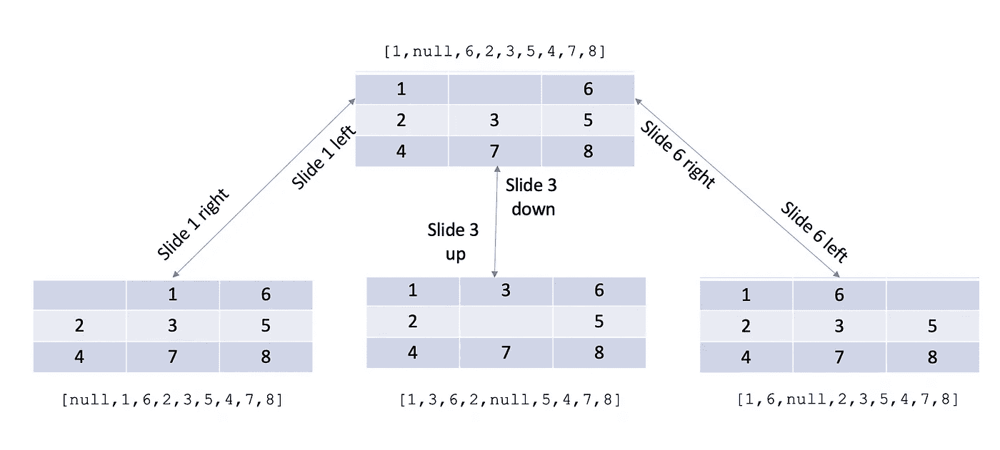

# 解决 8 个难题:探索搜索选项

> 原文：<https://javascript.plainenglish.io/solving-8-puzzle-exploring-search-options-2e446e29d21?source=collection_archive---------2----------------------->

在我之前的文章中，我提出了八个难题的问题。

[](https://medium.com/nerd-for-tech/solving-8-puzzle-with-search-e17c71000780) [## 用搜索解决 8 个难题

### 我开始了我的人工智能之旅，似乎对搜索的研究是这个领域的首要条件。最初的…

medium.com](https://medium.com/nerd-for-tech/solving-8-puzzle-with-search-e17c71000780) 

在这篇文章中，我想从利用搜索技术的起点来研究如何找到一个解决方案。提醒一下，解决方案空间是难题状态的图表，并移动到后续状态，例如:



每种状态都是一对 ID(或键)和它的值，它们是一个数组，表示哪个拼图块在哪个拼图块上。该图包含 362，880 个节点和 967，680 条边。强力搜索是可行的，但并不是最佳技术。更明智的方法是更有效的选择，但需要更多的工作。

# 广度优先

广度优先搜索(BFS)从检查第一个节点开始，一次扩展一层，例如，所有节点从第一个节点“一跳”；一旦用尽，它就从第一个节点“两跳”前进到所有节点，依此类推。


BFS pattern of stepping through the graph one layer at a time.

为了完成这一壮举，BFS 实现了一个队列(先进先出)。“一级之外”的节点列表通常称为边界:

```
const BFS = function (startNode, isGoal) {     const frontier = [startNode] while(startNode.length > 0) { const currentNode = frontier.shift() if(isGoal(currentNode)) {
          return Solution(currentNode)
       } for(child of currentNode.children) {
          frontier.push(child)
       }
    }return NotFound()
}
```

该算法将开始节点推到边界上，然后继续从边界上取下一个节点，看它是否解决了目标，如果它没有将它的子节点添加到边界上。如果边界到达一个空的状态，那么目标和搜索空间就不匹配了。

BFS 是一个完整的解决方案(如果存在，将找到符合目标的节点)，并且在空间很小或解决方案/目标很浅(接近 startNode)时做得很好。它也面临着记忆和时间的挑战。

这就是在解决八个难题时遇到的问题。我当然可以重写图表以提高效率，但总的来说，这不会对性能产生有意义的改变。

# 深度优先

深度优先搜索(DFS)从一个节点开始，沿着最左边的节点向下搜索，直到到达一个叶子。然后，它备份到叶子的父节点，并检查它的下一个最左边的节点，依此类推。


DFS 也是一个完整的解决方案，如果目标存在，它将最终找到目标，但它是递归实现的。

```
const DFS = function (node, isGoal) { if (isGoal(node)) {
        return Solution(node)
      }

      for (child of node.children.reverse) { if (notVisited(child)) { const resultOfRecursion = BFS(child, isGoal) if (resultOfRecursion instanceof Solution) {
                return resultOfRecursion
            } }
      } return NotFound()
}
```

应该注意的是，搜索图形与搜索树是不同的挑战。有了树，你可以确定你的搜索不会进入任何循环(loops)，但是在图中，节点可以循环回到自身，这是一个问题。为了防止这种情况，您只需跟踪一个节点是否被访问过(这非常简单)。

如果目标位于图中最左边的一个分支中，则 DFS 表现出色。然而，如果目标位于最右边的一个分支，可能需要一些时间才能到达那里。所以对这个算法做了一个修改，增加了一些运行时间，但是相对来说数量不大。这就是所谓的迭代深化 DFS。

```
const DFS = function (node, isGoal, depth) { if (depth == 0) {      
       return SearchLimitExhausted()
    } /* same as above */ const resultOfRecursion = BFS(child, isGoal, depth -1) /* same as above */}
```

每一次递归调用都将深度减一，当你到达零时，你已经穷尽了你的搜索。用尽你的搜索不同于一个不存在的解决方案，所以用这种方式标记它是有用的。

深度受限并不保证完整(目标可能比阈值更深)，但您可以通过重复加深您正在搜索的图形量来恢复完整性:

```
const dfs_deepening = function (node, isGoal, limit) {
    for (let i = 1; i <= limit; i++) {

        const resultOfDFS = DFS(node, isGoal, i) if (resultOfDFS instanceof Solution) {
            return resultOfDFS
        } else if (resultOfDFS instanceof NotFound) {
            return resultOfDFS
        }
    }

    return SearchLimitExhausted()
}
```

缺点是您总是在开始节点重新开始，并且您在重复工作。

> 由于迭代深化多次访问状态，这看起来很浪费，但事实证明成本并不高，因为树中的大多数节点都在底层，所以如果上层被多次访问也没什么关系[1]

# 启发式搜索

BFS 和 DFS 按照预先确定的顺序推进图表。它们是简单的算法，用于小搜索空间。然而，它们可以通过提供一些洞察力来改进，我们称之为启发式函数。启发式函数估计任何给定节点达到目标状态的剩余工作量。该算法的工作原理是计算每个节点子节点的启发式算法，然后选择最接近解决方案的子节点。我将描述的搜索，**递归最佳优先搜索**，有一点复杂。在讨论算法之前，我们应该讨论一下启发式函数。

我们如何开发一个启发式函数？给定 BFS/DFS 示例中的图表，可以创建一个达到某个字母的目标。启发式函数的一个例子可能是:当前字母和目标字母之间的 ASCII 值的差异。为了直观显示这一点，我们可以使用图表，查看 ASCII 值，然后查看与目标的差异，遵循最小启发法(绿色表示遍历的路径):


当然，这是可行的，因为“I”节点是“d”的子节点，最小的启发式算法是可行的。但是，如果“I”节点碰巧位于其他地方，我们要么必须定义一个更好的启发式算法，接受一个不完整的搜索算法(没有找到“I”)，要么构建一个更好的搜索算法(这就是我们将要做的)。但是在开始搜索之前，让我们先来看看八个谜题的一些启发。

选择:

*   正确位置的牌的总和
*   每个图块在正确位置之间的欧几里德距离之和
*   每个图块在正确位置之间的曼哈顿距离之和
*   曼哈顿距离加反转惩罚搜索[2]

右槽中的瓷砖数量有点误导，因为它没有考虑剩余的工作量。欧几里德距离公式考虑了对角线移动(一个点之外)的值为 1.4，其中至少需要移动 2 次才能到达那里。曼哈顿距离是根据到达所需位置的水平和垂直步数计算的。有机会观察更复杂的情况，如两个并排的瓷砖在相反的位置(但如果它们被颠倒，将是正确的):

> 通过为直接反转的瓦片添加惩罚，在信息量方面进行了额外的改进。这是由于这样一个事实，即颠倒的瓷砖更难处理，因为一个必须“绕过”另一个。当处理非平凡的情况时，这种启发式方法仅在曼哈顿距离上就提供了大约 16%的信息增益。在提出的最困难的问题中(输出总结中每个问题的最后一种情况)，为找到最佳解决方案而检查的状态数量从 10804 减少到 9176，增加了约 18% [2]

为了简单起见，让我们看看曼哈顿距离:

```
const equals = x => y => *x* == y// destination: is the goal state
// current: is the current state
const manhattanDistance = (destination) => (current) => { // for each tile in the current
    return current.reduce((totalDistance, cVal, cIdx) => { // find where it should be in the destination
        const dIdx = destination.findIndex(equals(cVal)) // determine row/col in destination
        const dRow = *Math*.ceil((dIdx + 1) * 3 / 9)
        const dCol = (dIdx % 3) + 1 // determine row/col in current
        const cRow = *Math*.ceil((cIdx + 1) * 3 / 9)
        const cCol = (cIdx % 3) + 1 // calculate the distance and add to to
        const cellDistance = 
              *Math*.abs(dRow - cRow) + 
              *Math*.abs(dCol - cCol) return totalDistance + cellDistance }, 0)
}
```

## 递归最佳优先搜索

还记得如果“我”不在最短的预期路径上会发生什么吗？如果不进行修改，我们将无法实现目标——递归最佳优先搜索(RBFS)所做的是确定到达目标的前两条路径。它沿着最佳路径前进，同时跟踪下一个最佳路径。如果最佳路径找不到解决方案，或者看起来比下一个最佳路径更远，那么它会原路返回，在那个空间中穿行…这样 RBFS 就变成了一个完整的算法(如果存在的话，会找到解决方案):

```
**const** rbfs_recursive = (node, heuristic, isGoal, hLimit) => { if (isGoal(node)) {
        return Solution(node)
      } if (node.children.length == 0) {
         return *SearchLimitExhausted*(*Number*.POSITIVE_INFINITY)
      } for (child of node.children) {
         child.h = heuristic(child)
      } while (true) {          // out of all children, pick the two with the lowest "h"
          const best = node.children[
             indexOfSmallest(node.children)] const alt = node.children[
             indexOfSmallest(node.children, best)]// if the heuristic on the current node is higher than
          //   previous best (from the parent), we need to backtrackif (best.h > hLimit) {
             return *SearchLimitExhausted*(best.h)
          } // best alternate h is either the 2nd best sibling or
          //  2nd best sibling of the parent
const bestAlternateH = min(hLimit, alt.h) // recurse down best path, knowing what the best Alt is
          const result = rbfs_recursive(
             best, heuristic, isGoal, bestAlternateH)

          if (result instanceof *Solution*) {
             return result
          } else if (result instanceof *SearchLimitExhausted*) { // if we hit a limit (heuristic increases down the path)
            //  then extract that value and update the h value of 
            //  this node (best) with the new information
            best.h = result[extract]()
          }
     }
}
```

有几件事，当我们达到一个极限(超过上限启发式得分)时，我们需要向上传递，以便我们认为(或预期)具有最便宜路径的节点用已知信息更新其值。如果我们到达一片叶子，而这不是一个答案，我们需要用一个值(无穷大)来告诉上游节点这不是一个解决方案的路径。

找到最好和第二好的兄弟姐妹并不太复杂:

```
const indexOfSmallest = (array, notThisNode) => { // essentially reduce the array looking for the min,
    //  the one gotcha is ignoring the "notThisNode"
    return array.reduce(function (lowest, next, index) { if (notThisNode && next != notThisNode) {
            return lowest
        }
        else {
            return next.h < array[lowest].h ? index : lowest;
        } }, {"h": *Number*.POSITIVE_INFINITY});
}
```

提供的代码示例“足够接近”，以使解释尽可能简单。你将需要制定一些细节(例如，`next != notThisNode`可能会或可能不会为你工作)，并添加一些支持功能。或者你可以在 GitHub 上挖掘我的代码，但那是我的沙箱。

## 参考

1.  [https://en . Wikipedia . org/wiki/Iterative _ deeping _ depth-first _ search](https://en.wikipedia.org/wiki/Iterative_deepening_depth-first_search)
2.  [https://web.mit.edu/6.034/wwwbob/EightPuzzle.pdf](https://web.mit.edu/6.034/wwwbob/EightPuzzle.pdf)

## 密码

*   [https://github . com/TB 01923/艾玛-js/blob/main/search/eight-puzzle/eight-puzzle . js](https://github.com/tb01923/aima-js/blob/main/search/eight-puzzle/eight-puzzle.js)
*   [https://github . com/TB 01923/艾玛-js/blob/main/search/known-deterministic-observable/informed/recursive-best-first-search . js](https://github.com/tb01923/aima-js/blob/main/search/known-deterministic-observable/informed/recursive-best-first-search.js)

## 关于我

[](https://www.linkedin.com/in/tb02118/) [## Todd Brown——副总裁&创新和敏捷工程高级总监——Liberty…

### Todd 在软件行业有 20 多年的经验，专注于架构、安全和…

www.linkedin.com](https://www.linkedin.com/in/tb02118/) 

[*更多内容尽在 plainenglish.io*](https://javascript.plainenglish.io/)