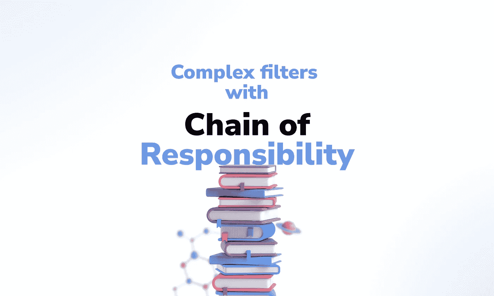
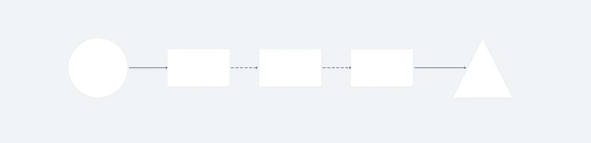

# 用 JavaScript 中的责任链设计模式解决复杂过滤器

> 原文：<https://javascript.plainenglish.io/solving-complex-filters-with-the-chain-of-responsibility-design-pattern-in-javascript-698907e06556?source=collection_archive---------1----------------------->

我将使用功能性更强的责任链设计模式，为基础对象上的重要过滤器创建干净、可维护和清晰的设计。

# 摘要

*   ***什么是责任链？***
*   ***理解问题***
*   ***动手***
*   ***结论***

# 责任链是什么？

正如在《设计模式:可重用面向对象软件的元素》一书中所描述的，它是一种行为模式，允许你将一个请求(可以是一个原始参数、一个 HTTP 请求、一个对象等)传递给一系列操作器(隔离的函数或方法)。

收到请求后，处理程序决定是处理还是继续处理链中的下一个处理程序。

1.0 — Representation of the Chain of Responsibility Design Pattern.

如上图所示，我们将左边的圆圈作为**请求**。中间三个方块是**处理者**，决定是否处理**请求**。最后，三角形说明了调用的**结果。**

重要的是要记住:操作者需要尊重相同的界面。

# 理解问题

假设我们正在为餐馆开发软件，并且有一个 **customerOrder** 对象，包含客户购买的详细信息。

我们需要过滤一个包含这些对象的列表，过滤器将基于精确的业务规则，这些规则是:

*   通过外部链接访问系统的用户下的订单。
*   交给收银员但尚未付款的订单。
*   在收银台确认的订单—收银员关闭订单，确定客户以现金、借记卡或信用卡支付的金额。

除了上面列出的这些首要要求，它们可能会根据**利益相关方的反馈**而增加或改变。

# 亲自动手

2.0 — Data structure that will be used in the example.

在第一个 **protocols.js** 文件中，我们将拥有将要被过滤的数据结构。

**byAccess** 属性引用发出请求的位置——由**本机应用**或由**外部链接访问**。

随后， **closeLocal** 引用客户下订单的地点——**收银台**或由 **app** 自己付款。

最后， **justifications** 是一个包含对象的属性，其中包含支付信息。**如果是一个对象**，你会有现金、借记卡或信用卡支付的金额。如果订单尚未支付，**将为空**。

下面我们有另一个**字典文件**，包含一些数字的规范——只是为了使实现代码更具解释性。

2.1 — Numeric property specifications.

最后，我们有实现本身。我将根据代码行解释每一点。

注:当时如果要保存三个文件运行代码，在一个支持 **ES6 模块**的 **Node.js** 环境下运行。

2.2 — Implementation of the Chain of Responsibility pattern.

**处理对象【第 4 行】**包含过滤规则。**每个规则都是一个在模式**的解释中描述的处理程序。

请注意，我们可以将规则视为规范，清楚地了解在该函数中要过滤的对象需要什么。

在官方阅读中，示例倾向于使用尊重单个接口的方法(来自面向对象的偏见)。在这种情况下，最好是将一种方法与另一种方法联系起来，以实现目标。

在我们的上下文中，函数之间的手动传递由过滤器总结。

在函数**handleCustomerOrders[line 21]**中，我们有一个实现，用于整个*【sick】*的工作。

当我们执行 **Object.values** 方法时，我们将**句柄**对象的值转换为一个函数数组。之后，只要击中目标。使用 **some** 方法，我们检查参数中的任何对象是否满足任何要求。

# 结论

想象一下，这些规则位于一个超级复杂的对象之上，其中嵌套了许多子对象。

或者甚至在一个更大的环境中，我们可以接收一个服务请求，必须触发几个复杂的不同的规则，这些规则可以由业务团队不断发展？

有了责任链，我们能够将这些规则从较低层次的实现中分离出来，具有可维护性、单元可测试性和可扩展性。

# 参考

*   设计模式:可重用面向对象软件的元素。

*更多内容请看*[*plain English . io*](http://plainenglish.io/)