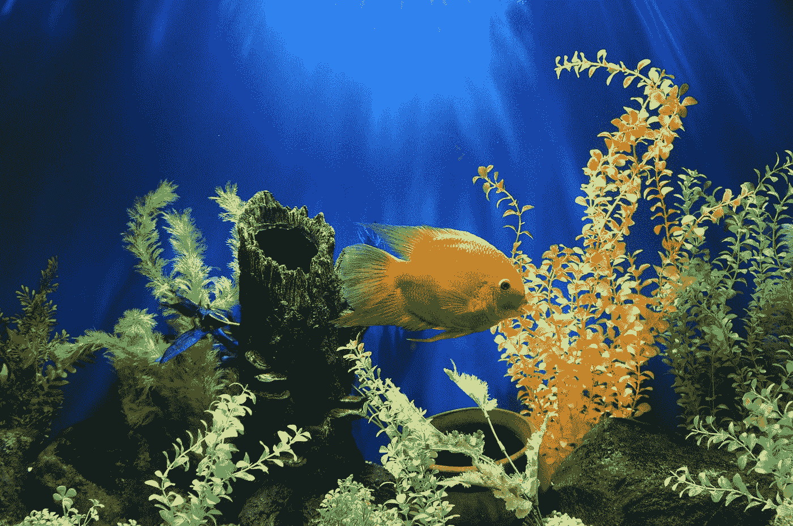
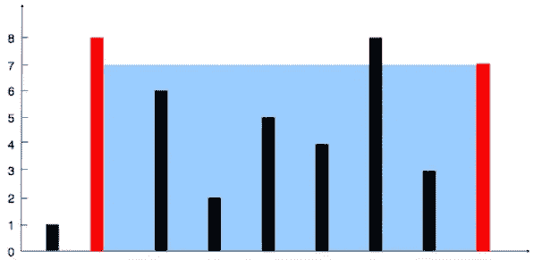

# 用 JavaScript 解决 LeetCode 的“盛水最多的容器”问题

> 原文：<https://javascript.plainenglish.io/solving-container-with-most-water-in-javascript-b0860020f6d2?source=collection_archive---------6----------------------->



Photo by [Delbert Pagayona](https://unsplash.com/@dpagayona?utm_source=medium&utm_medium=referral) on [Unsplash](https://unsplash.com?utm_source=medium&utm_medium=referral)

在这篇文章中，我们将用 JavaScript 解决 LeetCode 的“盛水最多的容器”问题。这个问题使用两点法。双指针方法通常用于跟踪数组或字符串索引来解决问题。一个指针从起点开始，而另一个指针从终点开始。指针相向移动，直到它们相遇。

# 问题

给定`n`个非负整数`a1, a2, ..., an`，其中每个代表坐标`(i, ai)`上的一个点。`n`画垂直线，使线`i`的两个端点在`(i, ai)`和`(i, 0)`。找出两条线，它们和 x 轴一起形成一个容器，这样容器中的水最多。

# 例子



```
**Input:** height = [1,8,6,2,5,4,8,3,7]**Output:** 49**Explanation:** The above vertical lines are represented by array [1,8,6,2,5,4,8,3,7]. In this case, the max area of water (blue section) the container can contain is 49.
```

# 解决办法

# 说明

我们希望最大化两个指针之间的宽度和具有较短高度的指针。该区域由两个指针中较短的高度决定，否则容器会溢出。

我们从高度数组开头的一个指针和高度数组结尾的另一个指针开始。我们还有一个变量`maxWater`来存储获得的水的最大面积。在我们的 while 循环中，我们通过找到两个指针的宽度和最小高度来计算两个指针的值之间形成的区域。然后我们更新`maxWater`，将高度较短的指针向另一端移动一个索引。我们移动较短的指针，因为我们区域的高度取决于较短指针的高度。如果我们决定移动较高的指针，我们将减少我们的宽度，但仍然停留在较低指针的高度。这将是容纳水的较小区域。

在我们的例子中，我们的左指针从第 0 个索引的高度 1 开始，右指针从第 8 个索引的高度 7 开始。我们的宽度是我们的右指数——左指数是 8。我们从最大宽度开始，随着循环的进行，宽度会逐渐减小。我们用较短的指针来表示我们的身高，所以得出`maxWater` = 1 * 8 也就是 8。为了下一个循环，我们将左指针移动到右一个索引。左边的指针现在等于 8，我们的宽度已经减少到 7。我们较短的指针的高度是 7，所以新的区域是 7*7 = 49。我们将`maxWater`更新为 49，因为它大于之前的值 8。我们将右指针向左移动一个索引，因为它是较短的指针。我们继续这个模式，直到我们的指针相交。

# 大 O

时间复杂度— O(n)

空间复杂性— O(1)

# 资源

LeetCode 问题:[https://leetcode.com/problems/container-with-most-water/](https://leetcode.com/problems/container-with-most-water/)

[](https://algodaily.com/lessons/using-the-two-pointer-technique) [## 算法日报-使用两个指针技术-简介

### 双指针技术在任何软件开发人员的工具包中都是必不可少的，尤其是当它涉及到…

algodaily.com](https://algodaily.com/lessons/using-the-two-pointer-technique) 

*更多内容尽在*[plain English . io](http://plainenglish.io/)