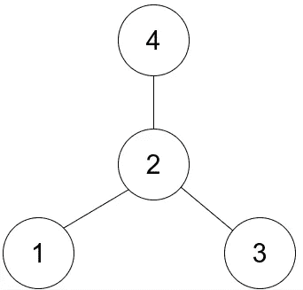

# 如何在 JavaScript 中解决“寻找星形图的中心”

> 原文：<https://javascript.plainenglish.io/solving-leetcodes-find-center-of-star-graph-in-javascript-b65c4f8c3619?source=collection_archive---------16----------------------->


Photo by [Michael Kilcoyne](https://unsplash.com/@mikekilcoyne?utm_source=medium&utm_medium=referral) on [Unsplash](https://unsplash.com?utm_source=medium&utm_medium=referral)

在本文中，我们将使用 JavaScript 求解 LeetCode 的[求星图中心](https://leetcode.com/problems/find-center-of-star-graph/)。本文将使用我们从我的“图形简介”系列中学到的知识。

[第一部分](https://medium.com/mlearning-ai/intro-to-graphs-part-1-af14f5901a67)是对什么是图形的一般性介绍。总之，图形数据结构是一组有限的顶点(节点)和一组连接一对节点的边。在图形中，没有规定节点之间连接的规则。无论节点的位置如何，边都可以连接节点。

[第 2 部分](https://medium.com/mlearning-ai/intro-to-graphs-part-2-954f6f8af70f)学习了表示图的两种标准方法，邻接矩阵和邻接列表。

[第 3 部分](https://medium.com/nerd-for-tech/intro-to-graphs-part-3-6e4e5615642b)是对图的遍历。有三种不同类型的图遍历:深度优先搜索递归、深度优先搜索迭代和宽度优先搜索。现在，让我们开始吧。

## 问题

有一个无向星形图，由从 1 到 n 标记的 **n 个节点**组成。星形图是有**一个中心节点**和将中心节点与其他节点连接起来的 n-1 条边的图。

给你一个 2D 整数数组边，其中每个边[i] = [ui，vi]表示在节点 ui 和 vi 之间有一条边。**返回给定星图的中心。**

## 例子



Example Graph

```
Input: edges = [[1,2],[2,3],[4,2]]Output: 2Explanation: As shown in the figure above, node 2 is connected to every other node, so 2 is the center.
```

## 解决办法

## 说明

需要注意的是，每条边都包含中心。`2`在每条边上，所以在中间。中心将是两条边之间的公共节点，所以我们只需要比较两条边。

例如，第一条边的`a` = 1 和`b` = 2。第二条边的`c` = 2、`d` = 3。我们知道其中一个节点将在两条边之间共享，即中心。如果`a`等于`c`或`d`，我们知道`a`就是中心。如果不是，`b`是共享边，是中心。`a`不等于`c`或`d`，所以`b`必须等于其中之一。`b`确实等于`c`，所以`2`一定是中心。

## 资源

LeetCode 问题:

[](https://leetcode.com/problems/find-center-of-star-graph/) [## 查找星图中心- LeetCode

### 有一个由从 1 到 n 标记的 n 个节点组成的无向星图。一个星图是这样一个图，其中有一个…

leetcode.com](https://leetcode.com/problems/find-center-of-star-graph/) 

第一部分:

[](https://medium.com/mlearning-ai/intro-to-graphs-part-1-af14f5901a67) [## 图表介绍(第 1 部分)

### 图形数据结构是顶点(节点)的有限集合和连接一对节点的边的集合。

medium.com](https://medium.com/mlearning-ai/intro-to-graphs-part-1-af14f5901a67) 

第二部分:

[](https://medium.com/mlearning-ai/intro-to-graphs-part-2-954f6f8af70f) [## 图表介绍(第二部分)

### 这是图表介绍系列的第 2 部分。我们回顾了表示图形的不同方法，以及它们的优缺点

medium.com](https://medium.com/mlearning-ai/intro-to-graphs-part-2-954f6f8af70f) 

第三部分:

[](https://medium.com/nerd-for-tech/intro-to-graphs-part-3-6e4e5615642b) [## 图表介绍(第三部分)

### 这是图表介绍系列的第 3 部分。这篇文章介绍了图的遍历

medium.com](https://medium.com/nerd-for-tech/intro-to-graphs-part-3-6e4e5615642b) 

*更多内容请看*[*plain English . io*](http://plainenglish.io/)