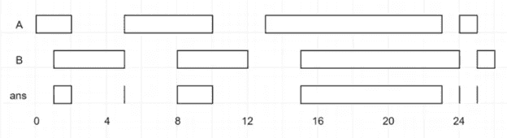

# 求解 LeetCode 的区间表交集

> 原文：<https://javascript.plainenglish.io/solving-leetcodes-interval-list-intersections-5b82695ba5c1?source=collection_archive---------13----------------------->


Photo by [Tim Gouw](https://unsplash.com/@punttim?utm_source=medium&utm_medium=referral) on [Unsplash](https://unsplash.com?utm_source=medium&utm_medium=referral)

在本文中，我们将在 JavaScript 中解决 LeetCode 的[区间列表交集](https://leetcode.com/problems/interval-list-intersections/)。这个问题使用两点法。双指针方法通常用于跟踪数组或字符串索引来解决问题。一种变化是一个指针慢，另一个指针快，这意味着在遍历数组/字符串时，快指针在慢指针的前面。这方面的一个经典例子是从排序后的数组中删除重复项。另一种变化是一个指针从起点开始，而另一个指针从终点开始。指针相向移动，直到它们相遇。在我们解决这个问题的方法中，我们将为每个数组使用一个指针，从开始处开始，并根据满足的条件分别移动它们。

# 问题

给你两个封闭区间列表，`firstList`和`secondList`，其中`firstList[i] = [starti, endi]`和`secondList[j] = [startj, endj]`。每个区间列表成对**分开**并按**排序**。

*返回这两个区间列表的交集。*

一个**闭区间** `[a, b]`(带`a < b`)表示一组带`a <= x <= b`的实数`x`。

两个闭区间的**交集**是一组实数，要么为空，要么表示为闭区间。比如`[1, 3]`和`[2, 4]`的交集是`[2, 3]`。

# 例子



Intersecting Intervals

```
**Input:** firstList = [[0,2],[5,10],[13,23],[24,25]], 
secondList = [[1,5],[8,12],[15,24],[25,26]]**Output:** [[1,2],[5,5],[8,10],[15,23],[24,24],[25,25]]
```

# 解决办法

# 说明

这可能非常令人困惑，所以我会尽可能地分解它。我们有一个数组指针`firstList`和一个数组指针`secondList`。在我们的 while 循环中，我们第一次抓取第一个区间`[0,2]`和`[1,5]`的最大起点。最大的起点来自于作为`1`的`secondList`。然后，我们从相同的间隔中抓取最小的端点，即`2`。我们想要区间的最大起点和最小终点，因为那是重叠部分。如果只有一个存在于该点，则它们不能相交。例如，如果我们选择了最小的开始点，只有`firstList`中的间隔存在，`secondList`直到`1`才开始。

然后我们检查这些间隔是否重叠。我们可以看到最大的起点(`1`)小于最小的终点(`2`)。`[1,2]`是`[0,2]`和`[1,5]`的重叠部分，我们将其添加到我们的结果数组中。

我们希望将具有**最低端点值**的当前区间推进到其下一个区间。由于`secondList`间隔(`[1,5]`)比`firstList`间隔(`[0,2]`)延伸得更远，我们在下次比较时保持`secondList`间隔不变，以防它与下一个`firstList`间隔(`[5,10]`)重叠。

`firstList`区间现在是`[5,10]`而`secondList`区间是`[1,5]`。因为`secondList`区间的终点是`5`，而`firstList`区间的起点是`5`，所以我们将从`[5, 5]`开始的交集放入结果数组。`secondList`端点较小，因此我们将其移至下一个区间`[8,12]`。

我们一直这样做，直到遍历完两个数组，然后返回结果数组。我们的结果数组如下所示:

```
[[1,2],[5,5],[8,10],[15,23],[24,24],[25,25]]
```

## 资源

LeetCode 问题:[https://leetcode.com/problems/interval-list-intersections/](https://leetcode.com/problems/interval-list-intersections/)

[](https://medium.com/swlh/two-pointer-technique-solving-array-problems-at-light-speed-56a77ee83d16) [## 双指针技术:以光速解决数组问题

### 通过例子直观地解释

medium.com](https://medium.com/swlh/two-pointer-technique-solving-array-problems-at-light-speed-56a77ee83d16) 

[https://algo daily . com/lessons/using-the-two-pointer-technique](https://algodaily.com/lessons/using-the-two-pointer-technique)

[](https://medium.com/@shanesfast/teaching-to-learn-interval-list-intersections-49319949c599) [## 教与学:区间列表交集

### 这篇文章是我将分解我已经解决的编码问题并分享我的经验的系列文章的一部分

medium.com](https://medium.com/@shanesfast/teaching-to-learn-interval-list-intersections-49319949c599) 

*更多内容尽在*[***plain English . io***](http://plainenglish.io)