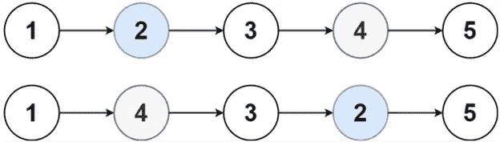

# 解决 LeetCode 的“交换链表中的节点”

> 原文：<https://javascript.plainenglish.io/solving-leetcodes-swapping-nodes-in-a-linked-list-ab69b6e6054?source=collection_archive---------10----------------------->

在本文中，我们将在 JavaScript 中解决 LeetCode 在链表中交换节点的问题。

[这里](/removing-duplicates-from-a-sorted-linked-list-c9e0e62d2c96)是我写的一篇关于链表的文章，经历了一个 LeetCode 问题。

概括地说，链表是节点的线性集合，其中每个节点指向下一个节点。每个节点都有一个值属性和一个引用列表中下一个节点的下一个属性。

这就是链表成为线性数据结构的原因。列表是有顺序和次序的。要到达列表的末尾，我们必须从第一个节点(head)开始，按顺序遍历所有节点。最后一个节点(尾部)将指向 null，表明这是列表的结尾。

# 问题

给你一个链表的头，和一个整数 k。

在**交换**从开始的第 k 个节点的值和从结束的第 k 个节点的值之后，返回链表的头(**链表是 1 索引的**)。

# 例子



Swapping Nodes

```
Input: head = [1,2,3,4,5], k = 2Output: [1,4,3,2,5]
```

# 解决办法

# 说明

我们首先想从列表的末尾找到第 k 个节点的位置。我们可以通过遍历列表，设置一个`pointer`变量，并使用变量`num`来计算节点的数量。列表末尾的第 k 个节点，`endK = num — k + 1`。列表从索引 1 开始，这就是为什么我们给`endK`加 1。

我们重置了我们的`pointer`,因为我们想要再次遍历列表。如果从开始的第 k 个节点和从结束的第 k 个节点是同一个节点，那就没什么好改变的，我们只是返回列表。我们想设置另一个计数器变量，看看我们是否在正确的节点上。

我们设置`count = 1`是因为列表从索引 1 开始。我们再次遍历列表来找到节点。我们将`count`与`k`进行比较，看看我们是否找到了想要交换的第一个节点。如果它们相同，我们将变量`swap1`设置为该节点。我们用`endK`做同样的事情，找到我们想要交换的第二个节点。迭代结束后，我们在一个`temp`变量的帮助下交换两个节点的值并返回列表。

# 资源

关于链表的更多资源，我建议看看这些有用的链接。

[](/removing-duplicates-from-a-sorted-linked-list-c9e0e62d2c96) [## 从排序的链表中移除重复项

### 链表的解释和解决 LeetCode 从排序列表中删除重复项的演练

javascript.plainenglish.io](/removing-duplicates-from-a-sorted-linked-list-c9e0e62d2c96) [](https://medium.com/basecs/whats-a-linked-list-anyway-part-1-d8b7e6508b9d) [## 到底什么是链表？[第一部分]

### 信息无处不在。

medium.com](https://medium.com/basecs/whats-a-linked-list-anyway-part-1-d8b7e6508b9d) 

[https://www.youtube.com/watch?v=njTh_OwMljA](https://www.youtube.com/watch?v=njTh_OwMljA)

LeetCode 问题:[https://leet code . com/problems/swapping-nodes-in-a-linked-list/](https://leetcode.com/problems/swapping-nodes-in-a-linked-list/)

*更多内容尽在*[***plain English . io***](http://plainenglish.io)