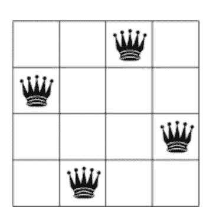

# 求解 N 皇后(…算是吧)

> 原文：<https://javascript.plainenglish.io/solving-n-queens-sort-of-1eab8ffcec07?source=collection_archive---------9----------------------->

当给定一个`n by n`矩阵时，n 皇后问题的目标是将`n`个皇后放置在棋盘上，使得它们都不会互相攻击(根据皇后移动的国际象棋规则)。规则是一个皇后可以在 8 个方向之一移动任意数量的细胞，只要它不跳另一个棋子。很简单——对吗？



an n-queens solution

给定我解决 [8-puzzle](https://akaphenom.medium.com/solving-8-puzzle-with-search-e17c71000780) 的解决方案，我最初倾向于将整个搜索空间构建成一个移动的图形，为每个潜在的移动附加边。8-puzzle 有 9 个 pick 9 排列:大约 360，000 个棋盘状态。n 皇后的不同之处在于，重要的是组合，而不是排列。理论上，搜索空间更小；例如，一个 3x3 的棋盘(9 选 3 通过组合)将有 84 种状态。但是一个典型的 n 皇后棋盘是 8×8 棋盘，它将有(64 个选择 8 个通过组合)4，426，165，368 个棋盘状态(谢谢 [stat-trek](https://stattrek.com/online-calculator/combinations-permutations.aspx) )。这还不算边数…

我没有提前生成所有可能的状态，而是选择在解开始评估移动时生成边界。我还选择将**棋盘表示为矩阵**，用`0`表示没有皇后的空间，用`1`表示有皇后的空间(回想起来**可能不是正确的选择**)。我还决定能够以两种可能的方式建立董事会——1 .在棋盘上任意未被占据的格子中随机放置皇后，或者 2。每列放置一个皇后(这是该问题的常见限定符。电路板构造相对容易:

```
**const** *placeQueens* = (n, onePerCol=**true**) => {
    // pick a random number
    **const** *randomN* = n => ***Math***.round(***Math***.random() * (n))
    // define an empty row as anarray of N 0's
    **const** emptyRow = ***Array***(n).fill(0)
    // a function that picks a random number, proxy for a column
    **const** *randomCol* = () => *randomN*(n - 1) // build an array of which columns queens should be in
    **const** queenCols = (onePerCol) ?
        // if 1 per col, create an array of 1..n and shuffle
        *shuffle*(*range*(0, n-1)) :
        // otherwise, create an array of N and randomly pick cols      
        ***Array***(n).fill(**null**).map((_) => *randomCol*()) // given a column place it on a row
    **const** *placeQueen* = i => {
        **const** row = emptyRow.slice()
        row[i] = 1
        **return** row
    } // to build the board start with an array of N (rows),
   //      and for each row generate an array of N (cols)
   **const** board = (***Array***(n)).fill(**null**).map((_) => {
        **const** at = queenCols.pop()
        **const** row = *placeQueen*(at)
        **return** row
    })
    **return** board
}
```

在写这篇文章时，这里有许多改进，但是把皇后放在棋盘上并不是真正的练习:)。

该解决方案要求在给定当前状态的情况下，生成下一个可能状态的所有组合。该代码包含一个启发法`h`，我将很快介绍它，但现在让我们忽略它:

```
**const** *getAlternateBoardsWithHeuristic* = board =>
    board
        *// each row has alternatives 
        //     (moving queen to any other spot)* .map(
          (row, rowIdx) => [rowIdx, *alternativeRows*(board[rowIdx])])
        *// for each of these 8*7=56 alternative rows, 
        //     generate a new board with board in its existing
        //     state but swapping out those alternative* .map(([rowIdx, alternativeRows]) => 
          alternativeRows.map(*boardWithRow*(board, rowIdx)))
        *// flatten so we get an array of the 56 possible boards* .flat()
        .map(board => {
            **const** h = *getAttacks*(board)
            // return a board and its heuristic 
            **return** {h, board}
        })
```

通过移动蚁后来构建交替行:

```
**const** *alternativeRows* = row => {
    *// find where the queen is at* **const** queenAt = row.findIndex(c => c == 1)

    *// move queen to a new col* **const** *moveQueen* = to => {
        **const** copy = row.slice()
        copy[to] = 1
        copy[queenAt] = 0
        **return** copy
    }

    *// generate all alternative rows* **const** alternatives = row
        .map((col, colIdx) => {
            **if** (colIdx != queenAt) {
                **return** *moveQueen*(colIdx)
            }
            **return null** })
        .filter(*isNotNull*)

    **return** alternatives
}
```

启发式算法是棋盘状态的一个函数，它允许我们选择最佳的后续棋盘状态。为此，我们可以选择“处于危险中”的蚁后数量:

```
**const** *getAttacks* = (board) => {
    **const** *incrementer* = (a, b) => a + 1
    *// get row/col coordinates* **const** coordinates = *getQueenCoordinates*(board)

    *// build all combinations of coordinate pairs* **const** combos = *makeCombinations*(2, coordinates)
    *// convert each pair into a slope* **const** slopes = combos.map(*slope*)

    **const** *is* = x => o => x == o
    **const** *isEither* = (x1, x2) => o => x1 == o || x2 == o **const** isPosOrNegInfinity = *isEither*(
           ***Number***.POSITIVE_INFINITY, ***Number***.NEGATIVE_INFINITY)

    *// diagonal attacks happen when pairs have a slope of 1 | -1* **const** cntDiag = slopes
        .map(***Math***.abs)
        .filter(*is*(1))
        .reduce(*incrementer*, 0) *// vertical attacks happen when pairs have infinite slope* **const** cntVert = slopes
        .filter(isPosOrNegInfinity)
        .reduce(*incrementer*, 0)

    *// horizontal attacks happen with 0 slope* **const** cntHor = slopes
        .filter(*is*(0))
        .reduce(*incrementer*, 0)

    **return** cntDiag + cntHor + cntVert
}
```

我们的目标是遍历棋盘排列，选择下一步棋，减少可能的危险皇后，因此对于棋盘，我们需要生成备选方案，并筛选出最佳可能性:

```
**const** *bestFromAlternatives* = boards => { // sort based on Heuristic
    **const** sorted = boards
        .slice()
        .sort((a, b) => a.**h** - b.**h**) // find best score
    **const** bestScore = sorted[0].**h** **//** all of the best are possibilities 
    **return** sorted
        .filter(({h, _}) => h == bestScore)
        .map(({_, board}) => *K*({**nextState**: board}))

}

**const** *getBestAlternatives* = board => {
    **const** alts = *getAlternateBoardsWithHeuristic*(board)
    **const** bestAlts = *bestFromAlternatives*(alts)
    **return** bestAlts
}
```

搜索技术被称为“爬山”(在这种情况下是下降)，只是沿着一条路径来降低启发式。在无法再降低的情况下，但存在相等的价值，它将试图横向移动，希望这些板可能会导致解决方案:

```
**const** *hillClimbingSeach* = (direction, problem, limit = 10) => {
    **let** candidate = problem.getInitialSearchNode()
    candidate.**h** = problem.**heuristic**(candidate.state)

    **let** bestCandidate = candidate // keep track of sideways moves at a level, don't want to 
    //  travel sideways forever
    **let** tries = 0 **while** (candidate && candidate.**h** <= bestCandidate.**h** && 
      tries < limit) {

        **if** (candidate.**meetsGoal**()) {
            **return** *Solution*(candidate)
        }

        *// track and limit sideways moves, if they
        // are not equal and there has been sideways moves -> reset* **if** (candidate.**h** == bestCandidate.**h**) {
            tries = tries + 1
            ***console***.log(**"sideways"**)
        } **else if** (tries > 0) {
            tries = 0
            ***console***.log(**"new path"**)
        } **else** {
            ***console***.log(**"on path"**)
        }

        *// update candidates (best, current), and take next
        //  action (if there is more than 1, pick one at random)* bestCandidate = candidate
        **const** actions = candidate.**getActions**();

        **const** action = actions[*randomN*(actions.**length** - 1)]
        candidate = candidate.takeAction(action)

    }

    **if** (tries == limit) {
        **return** *SearchLimitExhausted*(limit, candidate)
    } **else** {
        **return** *ClosestSolution*(candidate)
    }

}
```

嗯，有一个问题…它可能找不到解决方案。它确实有效地找到了局部解:)。

如果你正在解决的问题离得足够近就足够了(比如在呼叫中心转接电话)，爬山可能是你的最佳选择。但是如果你试图找出一系列的移动来得到 n 皇后的解，这并不能保证。抱歉。

你的解决方案是什么？

[](https://www.linkedin.com/in/tb02118/) [## Todd Brown-Liberty Mutual 创新和敏捷工程副总裁兼高级总监…

### Todd 在软件行业有 20 多年的经验，专注于架构、安全和…

www.linkedin.com](https://www.linkedin.com/in/tb02118/) 

*更多内容尽在*[*plain English . io*](http://plainenglish.io/)