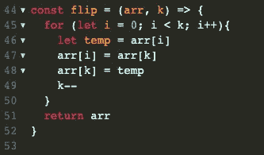
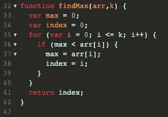
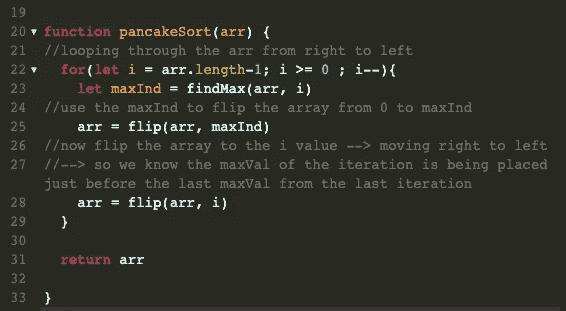

# 在 JavaScript 中解决“pancakeSort”

> 原文：<https://javascript.plainenglish.io/solving-pancakesort-ba8f8c25dadd?source=collection_archive---------12----------------------->

在本文中，我将在 JavaScript 中用几种不同的方法来解决 pancakeSort 问题。然后我将介绍我解决这个问题的过程，并讨论它的重要性。

我们开始吧！

# 问题

## 给定一个整数数组`arr`:

1.  编写一个函数`flip(arr, k)`，它反转数组`arr`中第一个`k`元素的顺序。
2.  写一个函数`pancakeSort(arr)`，排序并返回输入数组。您只允许使用您在第一步中编写的函数`flip`来修改数组。

示例:

*   输入:arr = [1，5，4，3，2]
*   输出:[1，2，3，4，5]

**注意:**它被称为煎饼分类，因为它类似于用抹刀在盘子上分类煎饼，你只能用抹刀翻动盘子上的一些顶层煎饼。要阅读关于这个问题的更多信息，请参见维基百科页面[煎饼分类](https://en.wikipedia.org/wiki/Pancake_sorting)。

我们来分析一下问题。

我们需要创建并使用一个翻转函数来对给我们的数组进行排序——此外，这个翻转函数只能翻转传递给它的数组中的前 k 个值。

知道了这一点，我们如何利用这个助手函数来排序我们的数组呢？

嗯……如果你看了一下纸条，你可能已经猜到了——我们将使用煎饼排序。

我们实现这一点的方法是，确定我们需要翻转数组的哪些部分，以便按照从低到高的顺序放置值。

在循环中:

步骤 1:找到数组中最大值的索引

步骤 2:将数组从索引 0 翻转到最大值的索引

步骤 3:将数组从索引 0 再次翻转到上一个“最大值”之前的索引**如果这是第一次迭代，我们翻转到的索引将是 array.length-1，对于下一次迭代，它将是 array.length-2，依此类推。

这听起来很奇怪。让我们实际看看它是如何工作的:

*   要翻转的数组→[ 1，5，4，3，2 ] → maxInd = 1 →从索引 0 翻转到索引 1 →第一次翻转后返回的数组→ [ 5，1，4，3，2 ] →要翻转到的下一个索引是 arr.length-1 →两次翻转返回的数组→ [ 2，3，4，1，5 ]
*   要翻转的数组→ [ 2，3，4，1，5 ] → maxInd = 2 →从索引 0 翻转到索引 2 →第一次翻转后返回的数组→ [ 4，3，2，1，5 ] →要翻转到的下一个索引是 arr.length-2 →两次翻转后返回的数组[ 1，2，3，4，5 ]
*   等等。等等。直到我们从右到左接触到每个值

数组变化对等迭代:

*   [ 1, 5, 4, 3, 2 ] → [ 5, 1, 4, 3, 2 ] → [ 2, 3, 4, 1, 5 ]
*   [ 2, 3, 4, 1, 5 ] → [ 4, 3, 2, 1, 5 ] → [ 1, 2, 3, 4, 5 ]
*   [ 1, 2, 3, 4, 5 ] → [ 3, 2, 1, 4, 5 ] → [ 1, 2, 3, 4, 5 ]
*   继续，直到 i == 0

希望上面的插图有助于澄清煎饼排序背后的概念。

如果没有，也许一些代码会有所帮助。

所以我们知道我们需要一个函数来翻转 0-k 的数组。

它可能看起来像这样:

该函数从外向内，交换相反索引处的值，直到它们在中心相遇，此时循环将会中断。

好吧。现在，我们需要一种快速简单的方法来找到数组中最大值的索引——但是只能找到一个特定的索引。请记住，我们想知道最大值，不包括我们已经在数组中订购的最大值。

我们将通过创建另一个助手函数来解决这个问题，我们可以将数组和索引传递给它。该函数将搜索数组的最大值，直到我们提供的索引。

太棒了。现在我们已经得到了这些，我们只需要为我们之前讨论的过程编写代码！

所以我们遍历数组→在每次迭代中，我们首先检查找到第 23 行的 maxInd。然后我们使用 maxInd 并将它和数组一起传递给我们创建的 flip()函数。flip 函数使数组变异，将 maxVal 放在数组的前面。然后，我们将变异后的数组传递回 flip()函数以及我们正在迭代的索引(记住从数组的后面开始，i = array.length-1 ),将 maxVal 从数组的前面翻转到数组的末尾。我们一直这样做，直到检查完数组中的每个值。

## 复杂性

有了这个解，我们的时间复杂度为 O(n)。因为每次迭代需要 2 次翻转，每次翻转最多需要 O(n)次，并且每次迭代必须找到也是 O(n)的 maxVal 导致运行时间为 O(n)。由于该解决方案只启动了几个辅助变量，并且我们改变了提供给我们的原始数组，因此空间复杂度为 O(1)。

## 最后的想法

我花了一分钟才理解这一点，但一旦我看到它的实际应用，我就明白了。如果不清楚 pancake 排序是如何工作的，请尝试运行代码并在每次突变后控制台记录数组。我希望这有助于你的下一个算法。黑客快乐！

*更多内容尽在*[*plain English . io*](http://plainenglish.io/)