# 从 ES2016 到 ES2021 最有用的 JavaScript 特性

> 原文：<https://javascript.plainenglish.io/some-of-useful-javascript-features-from-es2016-to-es2021-4c08a9a80a19?source=collection_archive---------9----------------------->

## 在过去的五年中，该语言引入了一些有用的 JavaScript 特性


从 ES2015 开始，ECMAScript 每年更新一次，并添加了新的语言功能。

这里列出了一些有用的新功能，从 ES2016 开始。ES2015 已经讨论过很多次了，这里就不赘述了。

# ES2016

## Array.prototype.includes()

这个新的数组方法将帮助我们检查数组是否包含特定的元素。

示例:

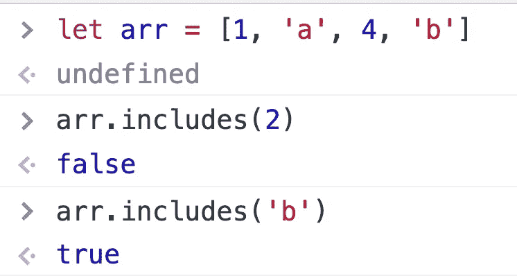

这种方法和`Array.prototype.indexOf`类似，但两者在处理`NaN`时结果不同。

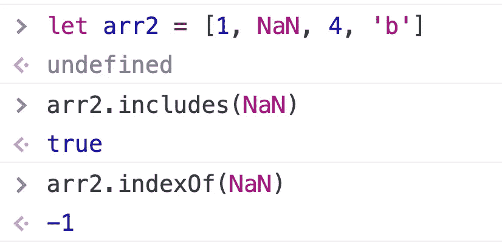

## 指数运算符

在 ES2016 之前，我们必须为指数运算编写以下代码:

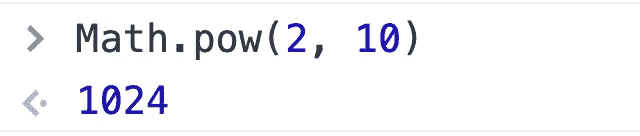

在 ES2016 中，`**`符号用于求幂运算:


# ES2017

## Object.keys()、Object.values()、Object.entries()

有时候，我们需要获取对象上的所有键、值和键值对，这三种新的 ES2017 方法可以轻松地为我们做到这一点。

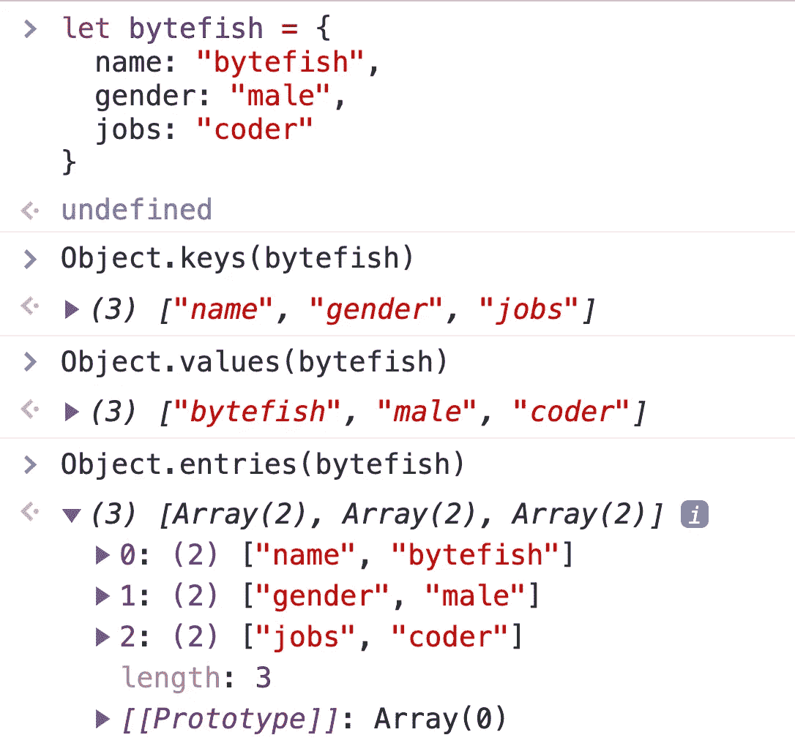

## 等待/异步

# ES2018

## 无极. finally()

只要承诺的状态变为成功或失败，就会执行此方法。

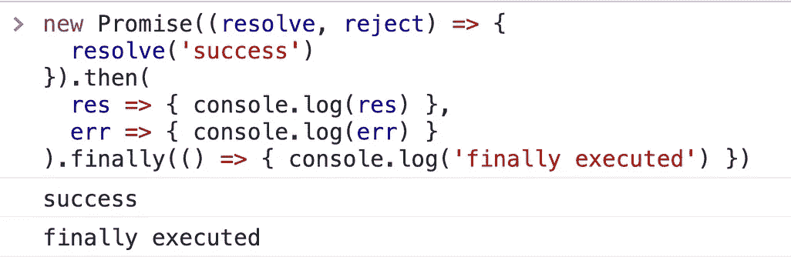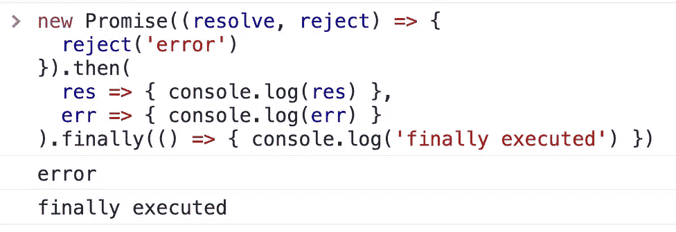

# ES2019

## 数组.原型.平面

数组扁平化是一个常见的需求。以前，我们总是不得不手工编写数组展平方法。在 ES2019 中，该实用程序是内置的。

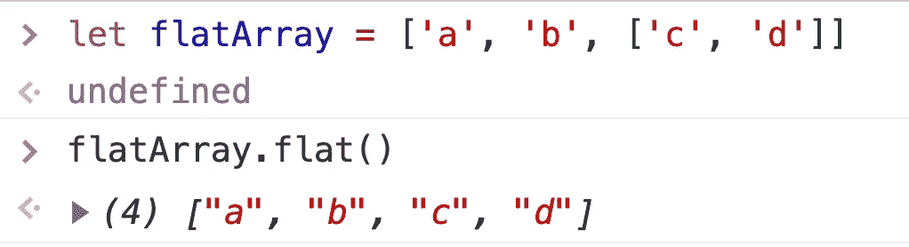

但是，请注意，默认情况下，flat 方法仅在两个维度上展平。

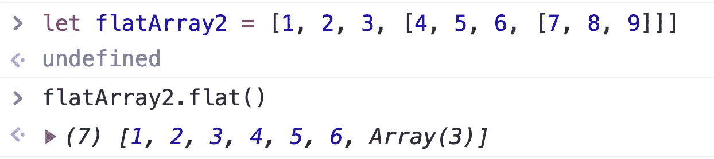

如果要对数组进行三重展平，可以传递一个参数:

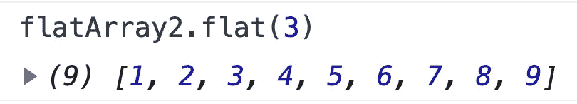

如果您希望数组完全平坦，不管它嵌套了多少层，那么您可以使用`Infinity`作为参数

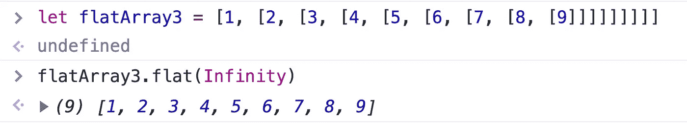

## Array.prototype.flatMap

假设您想要扩展以下数组:

```
["HTML CSS JavaScript", "React Vue Angular", "Webpack Vite"]
```


对此:

```
["HTML", "CSS", "JavaScript", "React", "Vue", "Angular", "Webpack", "Vite"]
```

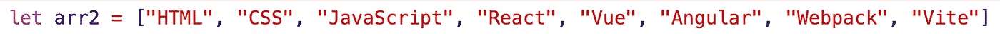

你怎么能写代码？

我们可以这样写:

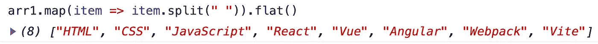

事实上，`Array.prototype.flatMap`是`map`和`flat`方法的结合。

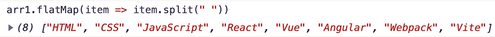

## string . prototype . trim start & & string . prototype . trimend

`trimStart`用于删除字符串开头的空格，`trimEnd`用于删除字符串结尾的空格。

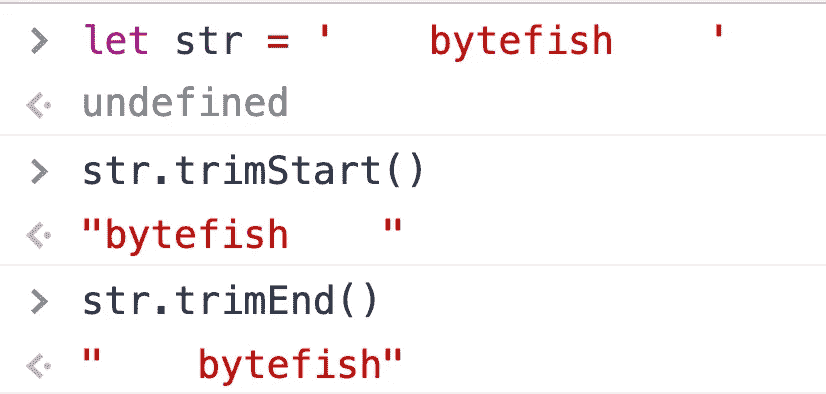

# ES2020

## BigInt

BigInt 是 ES10 中新增的 JavaScript 数据类型，用来表示大于`2^53–1`的整数，这是 ES10 之前 JavaScript 可以表示的最大数。

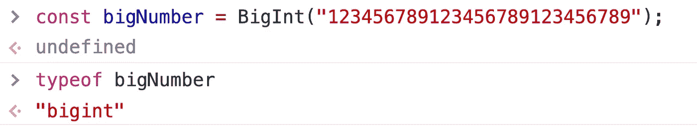

如果你在面试中被问到 JavaScript 中有多少种数据类型，你会怎么回答？

注意，现在是 2021 年，JavaScript 目前有 8 种数据类型:Boolean，Number，String，Null，Undefined，**符号**， **BigInt** ，Object。

## **可选链接**运算符？。

从变量中读取属性是一种常见的操作:

```
let obj = {
  name: 'Jon'
}console.log(obj.name)
```

然而，在实际项目中，`obj`的值可能是动态给定的，因此可能是`null`。此时，上述代码将在运行时失败。

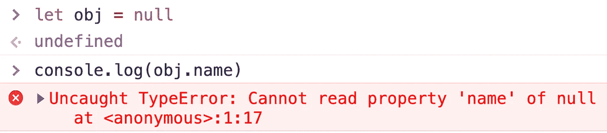

```
if(obj){
  console.log(obj.name)
}
```

然而，这种书写方法会更加繁琐，因此在 ES2020 中提出了`?.`语法:

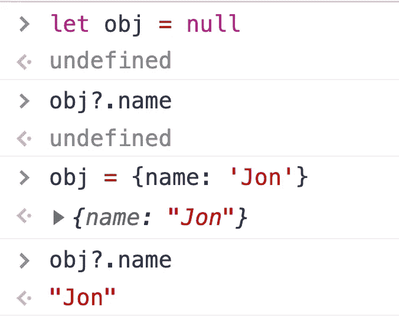

如果`obj`为空，则不读取`name`属性；如果`obj`不为空，将读取`name`属性。这种编写方式使代码更加安全。

# ES2021

## 数字分隔符

我们可以通过使用数字分隔符使大数字更具可读性。

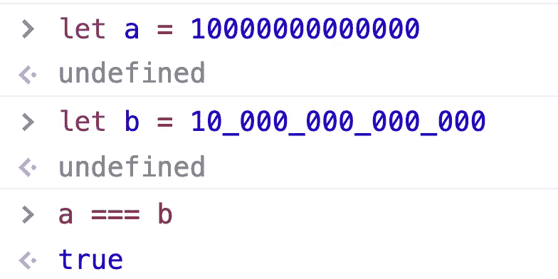

ES2021 允许我们在数字之间添加下划线，这没有实际意义，只是为了提高可读性。

*更多内容请看*[***plain English . io***](http://plainenglish.io)