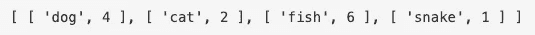

# 如何在 JavaScript 中通过键/值对对象进行排序

> 原文：<https://javascript.plainenglish.io/sorting-objects-39a3cc47f9fe?source=collection_archive---------5----------------------->

**对象**由键值对组成。键可以是字符串或符号，值可以是任何类型。

有些情况下，您可能希望按键或值对对象进行排序。但是，没有内置的 JavaScript 方法来对对象属性进行排序。

这里我们有一个对象，**宠物**。**键**是代表宠物类型的字符串。**值**是一个整数，表示指定宠物的数量。

有 3 种对象方法可用于解析数据。

# Object.entries()

此方法返回给定对象的可枚举属性对的数组。

由于对象被转换为数组，因此可以更容易地操作数据来查找特定的信息。在这种情况下，我们想找出哪个宠物的编号最高，可以使用排序方法。

这将按降序排列数组。 **b[1] - a[1]** 将通过比较值对数组进行排序。

现在我们有了一个排序的数组，我们可以很容易地提取具有最高键值的数组对。

# Object.keys()

此方法将返回给定对象的可枚举属性键的数组。

# **Object.values()**

此方法将返回给定对象的可枚举属性值的数组。

此方法在您只关心值的事件中很有用。例如，寻找最高或最低值或最频繁。

这三个对象方法都将给定的对象转换成一个数组，在使用内置的 Javascript 方法操作数据方面给了我们更多的灵活性。

来源:

[https://developer . Mozilla . org/en-US/docs/Web/JavaScript/Reference/Global _ Objects/Object](https://developer.mozilla.org/en-US/docs/Web/JavaScript/Reference/Global_Objects/Object)