# 用 gatsby-source-filesystem 和 GraphQL 获取 JSON 数据

> 原文：<https://javascript.plainenglish.io/sourcing-json-data-with-gatsby-source-filesystem-and-graphql-6fc7cef2a49e?source=collection_archive---------2----------------------->

学习盖茨比第二步


Make persistent efforts — 再接再厉

在我的[上一篇文章](https://xiaominzhu.medium.com/learn-by-doing-use-gatsby-to-create-your-first-site-af7bfb7a8a6f)中，我从最基本的步骤开始，创建了两个可以相互链接的简单页面。

但盖茨比是在 **React** 和 **GraphQL** 的基础上，结合前端领域最先进的工具如 **webpack** 、 **babel** 、 **react-router** 等。，可以给开发者非常好的开发体验，既然是这样，就不应该仅仅局限于直接在组件中写**硬编码数据**。

*Gatsby 提供数据预读，在浏览器空闲时提前读取链接对应的页面内容。*

数据的来源可以是多样化的:**无头** **CMS** ， **markdown** ，**数据库**，**API**……盖茨比提供了各种类型的**插件**，功能丰富强大。

盖茨比里有**三种**类型的插件:数据源插件(**源**)、数据转换插件(**转换器**)、函数插件(**插件**)。

👉**数据源插件**:负责**从应用程序外部获取**数据，并将数据放入 Gatsby 的数据层。

👉**数据转换插件**:负责**转换**特定类型数据的格式，比如将 markdown 文件中的内容转换成对象形式。

👉**功能插件**:为应用程序提供**功能**，比如通过插件让应用程序少支持或者打字。

在本文中，我想分享我上周学到的东西:用 GraphQL 从文件系统中获取数据。这需要两个插件:

**🎋gatsby-source-filesystem** :用于从文件系统创建文件节点，将本地文件中的数据添加到数据层。

**🌾gatsby-transformer-json** :将原来的 json 格式转换成 JavaScript 对象。

让我们试一试:

1.通过运行以下命令将**Gatsby-source-file system**和**Gatsby-transformer-JSON**添加到您的 gatsby starter 项目中:(*您可以使用我的[上一篇文章](https://xiaominzhu.medium.com/learn-by-doing-use-gatsby-to-create-your-first-site-af7bfb7a8a6f)中的 starter 项目)

*yarn add Gatsby-source-file system Gatsby-transformer-JSON*(也可以使用 **npm**

2.在 **gatsby-config.js** 文件中:

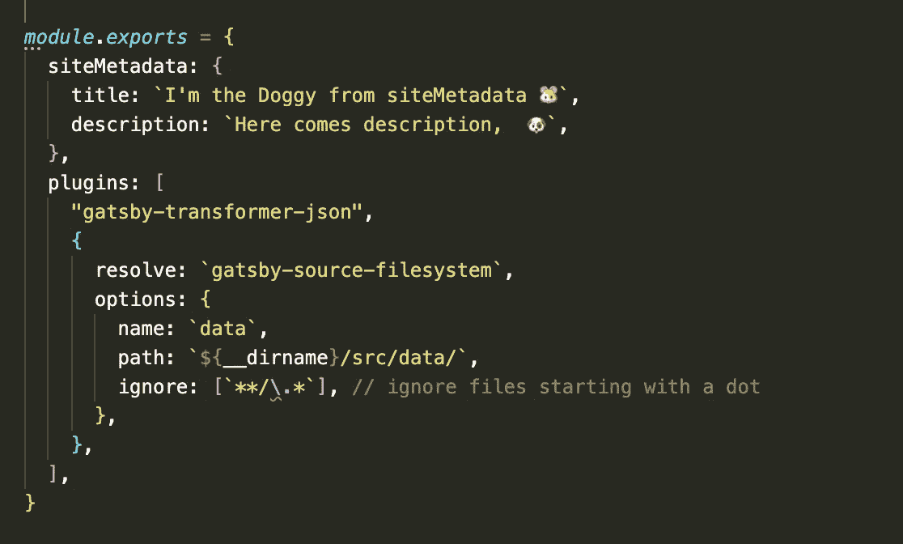

Ignore the **siteMetadata** object for now, we will get there later

*如果有多组数据，可以通过指定 gatsby-config.js 文件中 config 对象的 name 属性来查询具体的数据，* **path** 这里是 JSON 文件的路径，也可以更改。

3.创建包含数据的 JSON 文件，在我的例子中是在 **src/data/dogs.json**

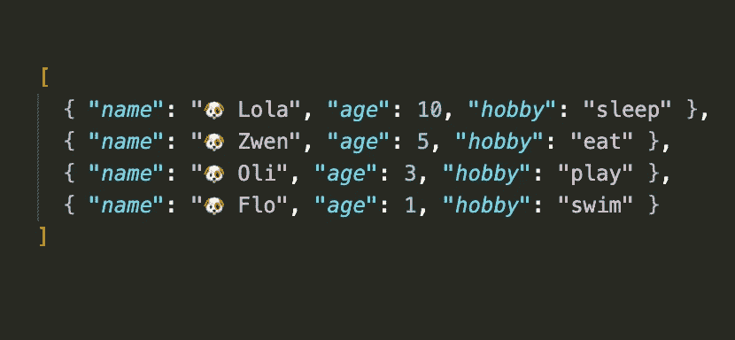

Example dogs.json file

4.创建一个导入组件的页面，在我的例子中 **src/pages/doggy.js，**标题**标题**和**链接**来自我的[上一篇文章](https://xiaominzhu.medium.com/learn-by-doing-use-gatsby-to-create-your-first-site-af7bfb7a8a6f)，如果你不使用它，就删除它们，我们现在将创建 doggy 组件。

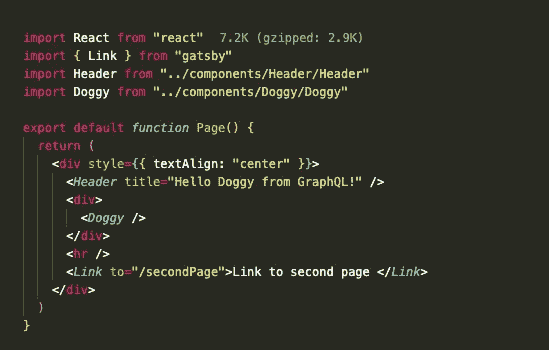

Import Header, Doggy components from doggy page

5.创建 **Doggy.js** 组件，我在 **src/components/Doggy，**project**structer 如下图所示:**

**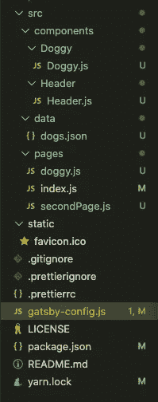**

**You can also create scss module for each file to make some styling**

**在 Gatsby 中，提供了一个统一的存储数据的地方，叫做**数据层**。在构建应用程序时，Gatsby 会从外部获取数据，并将数据放入数据层，组件可以直接从数据层查询数据。**

**🧤数据层是使用 GraphQL 构建的。调试工具:**http://localhost:8000/_ _ _ graph QL**。**

**在 **Gatsby v1** 中，你只能在**页面级**获取数据，并以基本的 React 方式将它们作为道具通过组件树向下传递，但是现在在 **v3** 中，你可以通过 **useStaticQuery** 在**组件级**获取数据，其中是一个 React 钩子，这使得获取数据变得超级简单。**

**6.让我们试一试，更新 **Doggy.js** 组件如下:**

**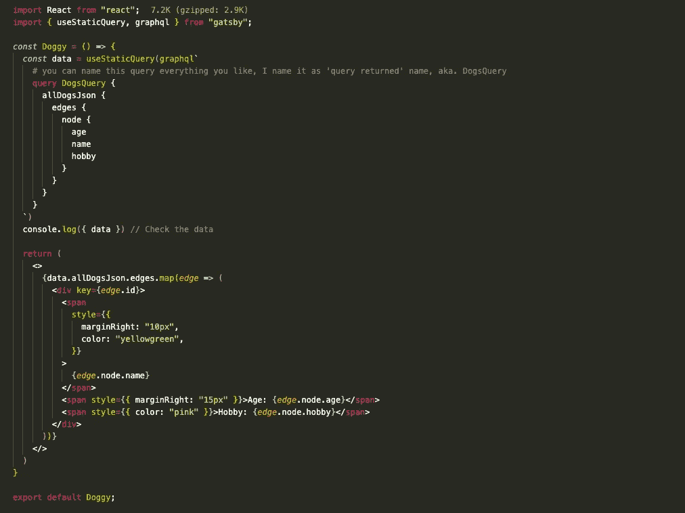**

**src/components/Doggy/Doggy.js**

**这里发生了什么:**

**🌸 1.我们从 gatsby 导入 **useStaticQuery** Hook 和 **graphql** ，获取并渲染来自 **dogs.json** 文件的 JSON 数据。**

**🌸 2.我们正在创建一个名为 **DogsQuery** 的查询，您可以随意命名，我选择将其命名为 **Query** 并返回**数据，**它们是关于狗的，因此查询名称将为 **DogsQuery。****

***还记得我们之前提到的****http://localhost:8000/_ _ _ graph QL****吗？现在打开这个链接，你会看到****GraphiQL****，它是 GraphiQL 集成开发环境(IDE)，你可以点击，摆弄数据。***

***🤲🏻我们要查询的数据基本上都在* ***下 all file****→****edges→node****，****node****是 graphql 中一个* ***对象*** *的专用名称，每个文件节点都包含了你要查询的字段。***

**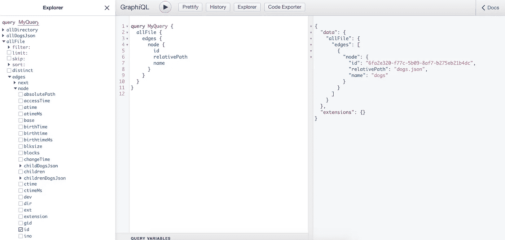**

***Node contains the field you want to query,* in our case: dogs.json**

**现在打开 **allDogsJson** 查询，看起来如下图:👇**

**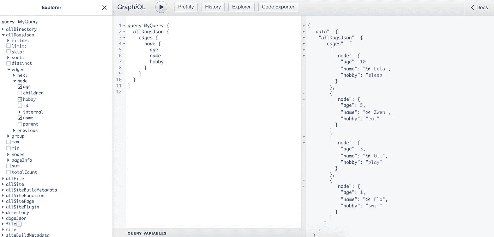**

**Choose the checkboxes on the left side which you would like to query, and click on **run** button in the middle, the results appears on the right side**

**在本例中，右侧的结果数据(**年龄、姓名、爱好**)来自我们之前创建的 JSON 文件。**

**👆*从上面你可以看到，我们查询的 json 的名称(****【allDogsJson】****)是与 Json 文件的名称(****dogs . JSON****)一致的，这是默认的命名约定，不过你也可以在 gatsby-config.js.* 里面修改它**

**🌸 3.在 **allDogsJson** 中，我们有边、节点和我们希望从查询中返回的值，在本例中:**狗的名字、年龄、爱好**。**

***如果我们在控制台中记录数据:***

**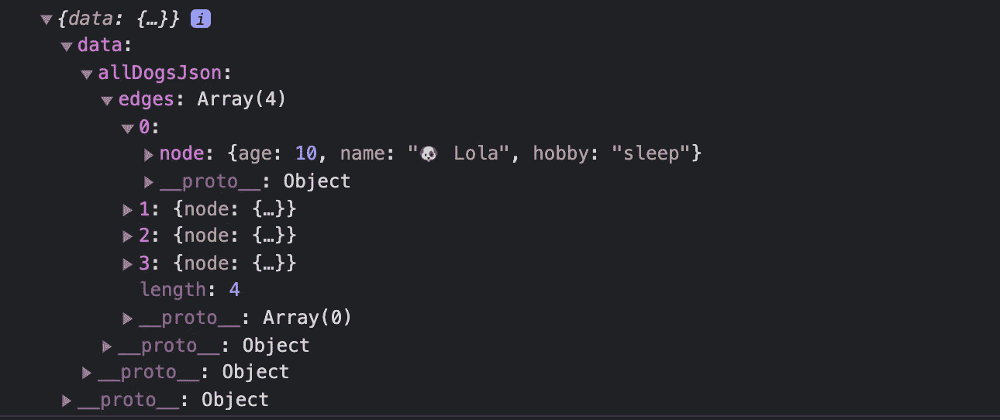**

**console.log({data})**

**7.保存文件，进入**http://localhost:8000/doggy**，没错！**💫****

**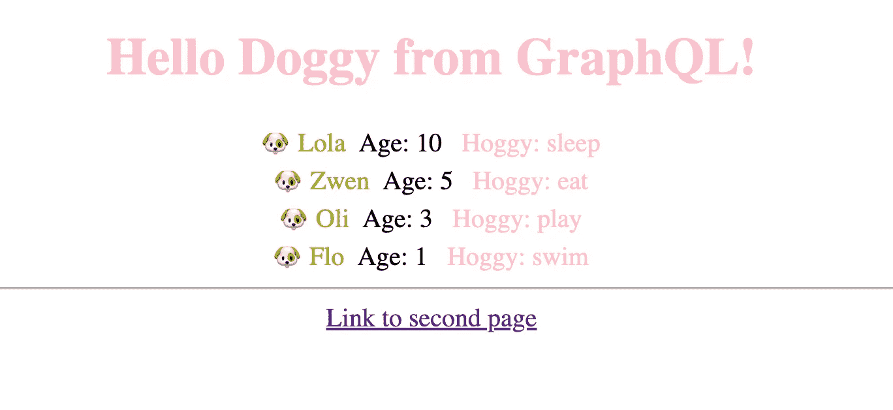**

**The doggy Page which renders our JSON data ( Header and Link are from my last article )**

**📝还记得之前**步骤 2** 中被忽略的 **siteMetadata** 对象吗？让我们快速看一下:**

**在 GraphiQL 编辑器中执行该查询时，您会看到类似如下的输出:**

**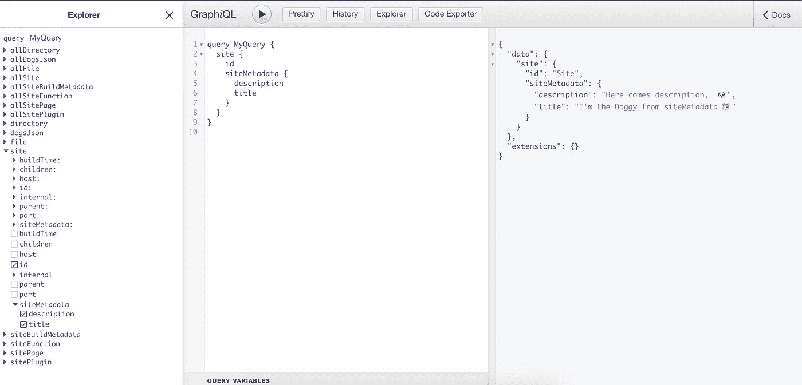**

**这里的**站点**(左侧)是位于我们的 gatsby-config.js 中的站点配置(见步骤 2)，我们可以选择我们想要的数据，在我们的例子中，我们有**标题**和**描述，**例如，现在我们可以获取并呈现**标题**。**

**🍭现在我们可以更新我们的**狗狗页面**，如下图 **:****

**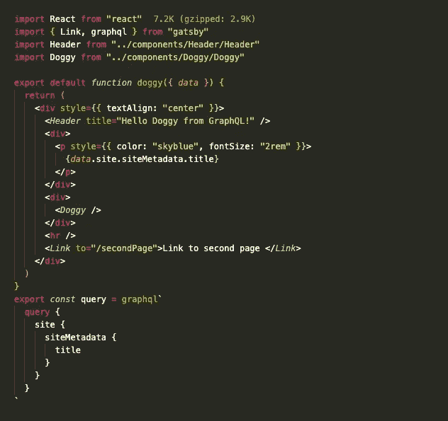**

**src/pages/doggy.js**

***注意这里的行:检查 GraphQL 中可用的类型你会注意到你可以查询* `***site****,*` *这个 GraphQL 类型进一步返回* `***siteMetadata***` *，可以从* ***页面*** *访问和呈现。***

```
export const query = graphql`
  query {
    **site** {
      **siteMetadata** {
        title
      }
    }
  }
`
```

***🧊上例中的查询方法只适用于***页面查询，我们也可以用它来创建动态导航，用例示例:****

***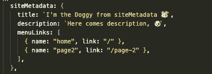***

***Example Navigation links***

***8.现在刷新狗狗页面，我们的**天蓝色**彩色**标题**出现在这些线条的基础上:***

*****{ *数据*. site . site metadata . title }*****

***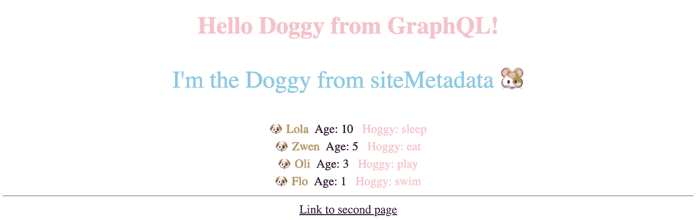***

***Blue Title rendered from siteMetadata***

***👐**就是这样！** **我们用 gatsby-source-filesystem、gatsby-transformer-json 和 GraphQL 从我们的 JSON 文件中获取 JSON 数据，在页面上呈现它，没有太多的样式，但这超出了本文的范围。*****

***但是等等…！🦋还有其他一些情况，通常您需要以编程方式创建页面。例如，你有 markdown 文件，每个文件应该是一个页面。***

***在 Gatsby 中，可以通过三种方式创建页面:***

*   ***通过在`**src/pages**`目录中创建 React 组件。(注意，你必须使组件成为**默认导出**。)***
*   ***通过使用**文件系统路由 API** 以编程方式从 GraphQL 创建页面并创建客户端专用的路由。***
*   ***在你站点的`**gatsby-node.js**` 文件中，通过实现 API `**createPages**`。(插件也可以实现`createPages`和创建页面)***

***这正是我正在继续学习的，我希望我能在不久的将来发表第三篇关于`**gatsby-node.js, onCreateNode …**`的文章。***

***非常感谢您花时间阅读这篇文章！***

***如果有需要改正的地方，请联系我，我将非常乐意改进它们！***

****更多内容请看*[*plain English . io*](http://plainenglish.io/)***